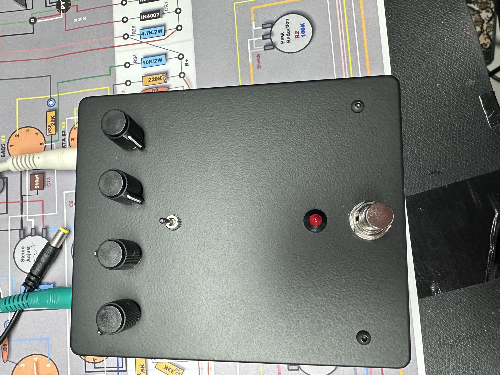
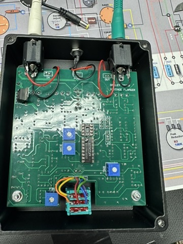

# Oakleysound Vintage Flanger

> **Info**
>
> **Requires a Reticon SAD1024 or SAD512D bucket brigade delay chip.**
>
> The Oakley Vintage Flanger was originally designed as a test circuit for reclaimed and new old stock (NOS) SAD512D and SAD1024 BBD chips. A flanger makes an ideal test circuit for BBDs since it is easy to hear when something is not quite right. Since I had gone to the effort of making a printed circuit board (PCB) design for the unit it made sense to make the PCB available to others if they too had spare Reticon BBD chips.
>
> The basic design is based upon the classic big box BF-1 flanger from Boss. I have made some changes including improvements to the power supply, the ability to take a SAD512D or SAD1024, true bypass when off, and adding a switch to allow to choose between negative or positive feedback. Other than that, the circuit design is a 'warts and all' clone of the original schematic. Unlike the original design the PCB is a four layer design utilising separate 0V and +V power planes. The two remaining layers being for signal tracking.
>
> The original BF-1 used a SAD1024 and this is the preferred part for this project if you intend to use your pedal as a flanger and not just a test circuit for BBDs.
>
> source: oakleysound.com

Pcbs are available by me exclusively!

the license is transferred to me.

#### Buildguide:

[Vintage\_Flanger\_Builder's\_Guide.pdf](assets/Vintage_Flanger_Builder-s_Guide.pdf)

**Build info about the case:**

Info from Tony Allgood :

“The horizontal pot spacing between the four pots is 1.0", 1.1", 1.0". The mode switch centre is exactly half way between the middle two pots and 0.83" below the pot holes.

Each PCB mounting hole is 0.3" nearer the outside of the board from the pot hole above it, and 3.93" below it.

The stomp switch is directly below the mode switch and you should choose the vertical placement of the hole to suit your stomp switch. It's best to drill this hole last and mark its position with the PCB, four pots and mode switch in place.”

**info from me:**

I just made a drawing (drill guide) on a paper and tested the distance of all holes against the pcb, before I  transferred

it to the case and punched markers on the case.

