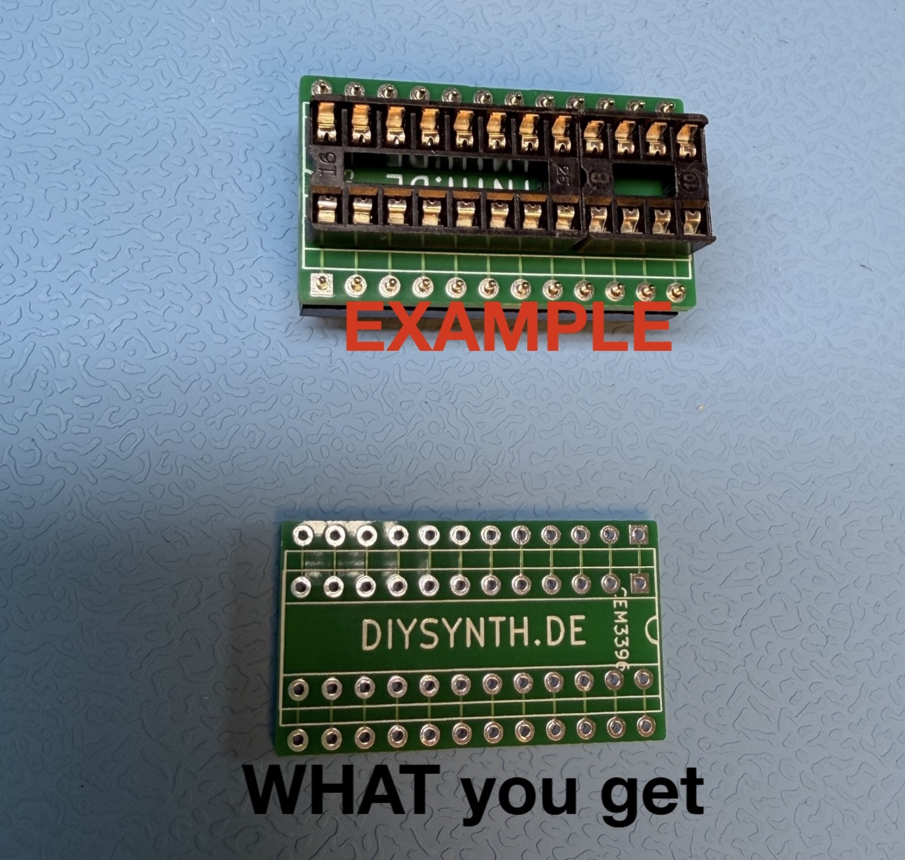
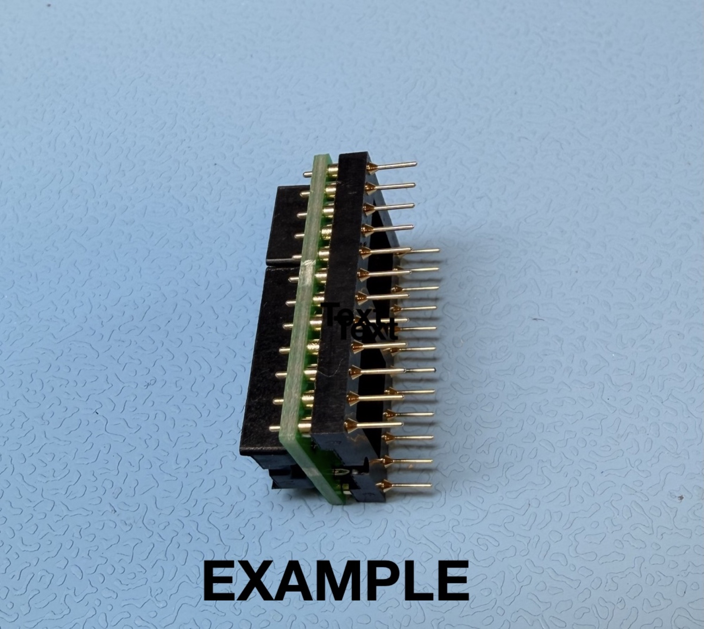
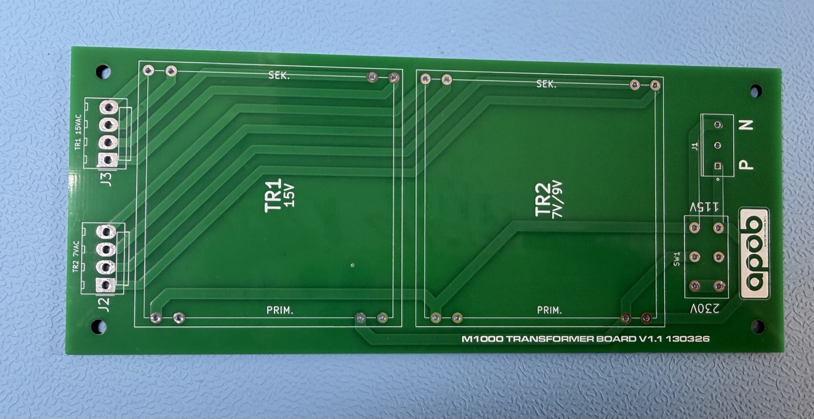
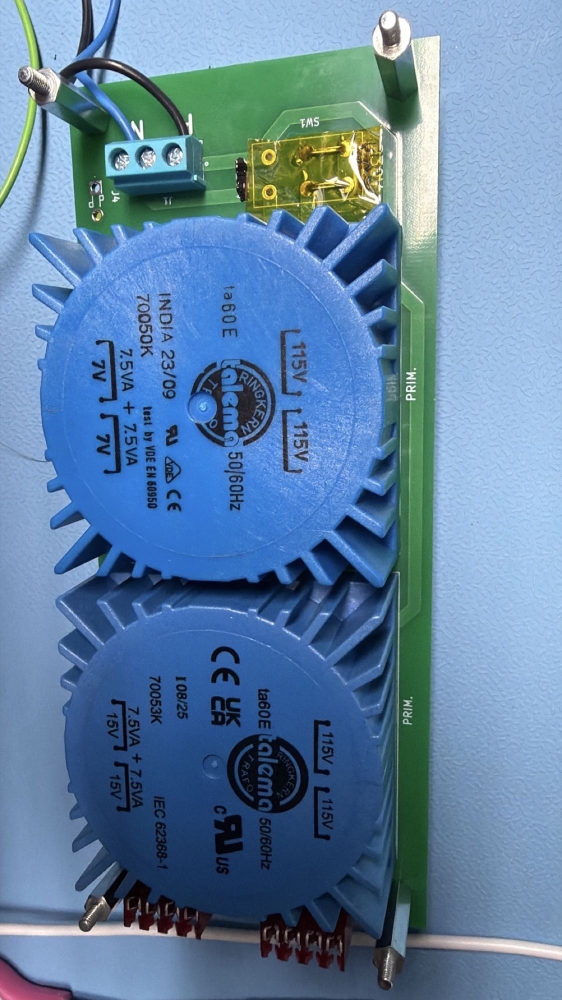
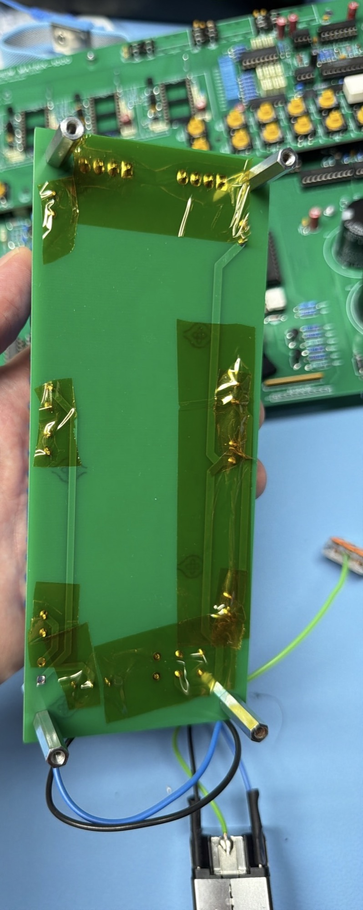
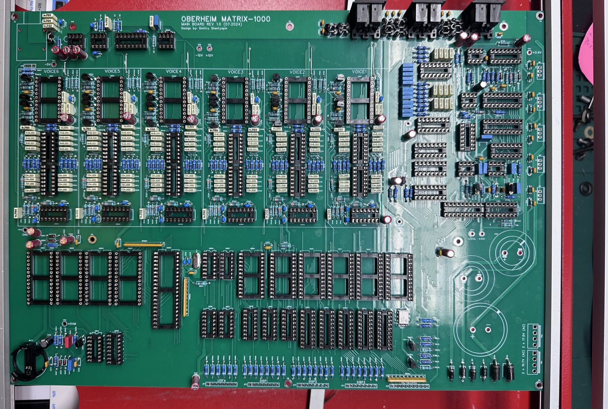
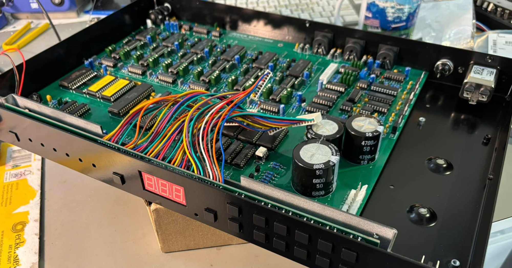
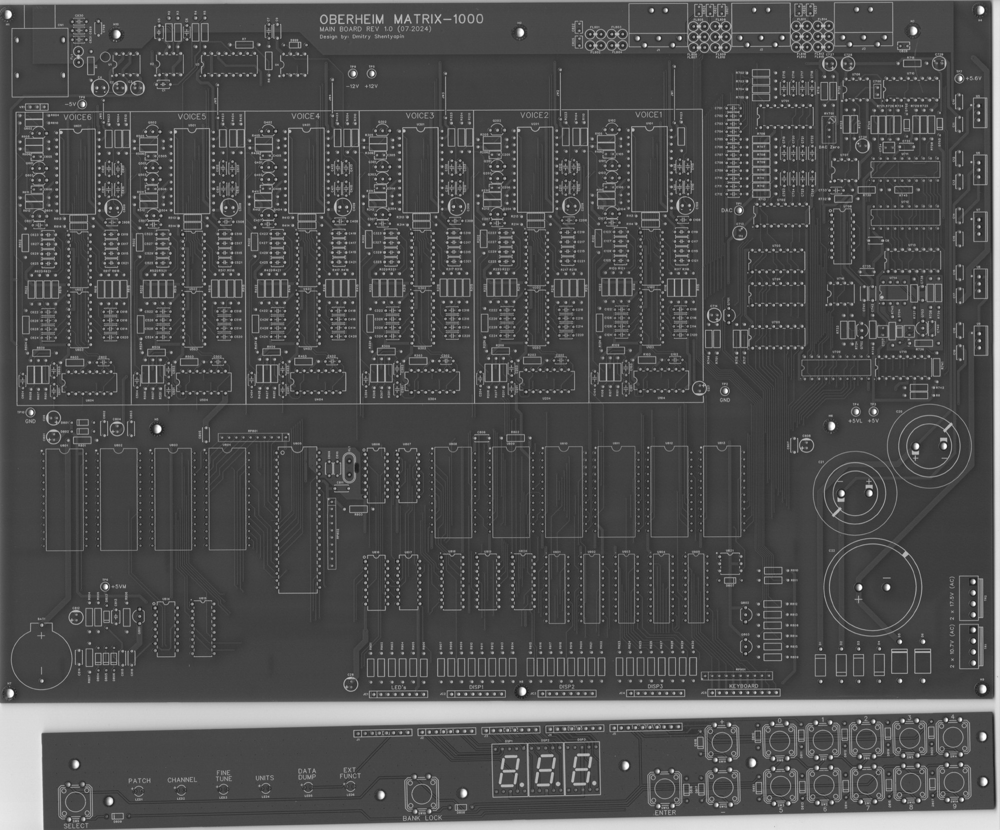
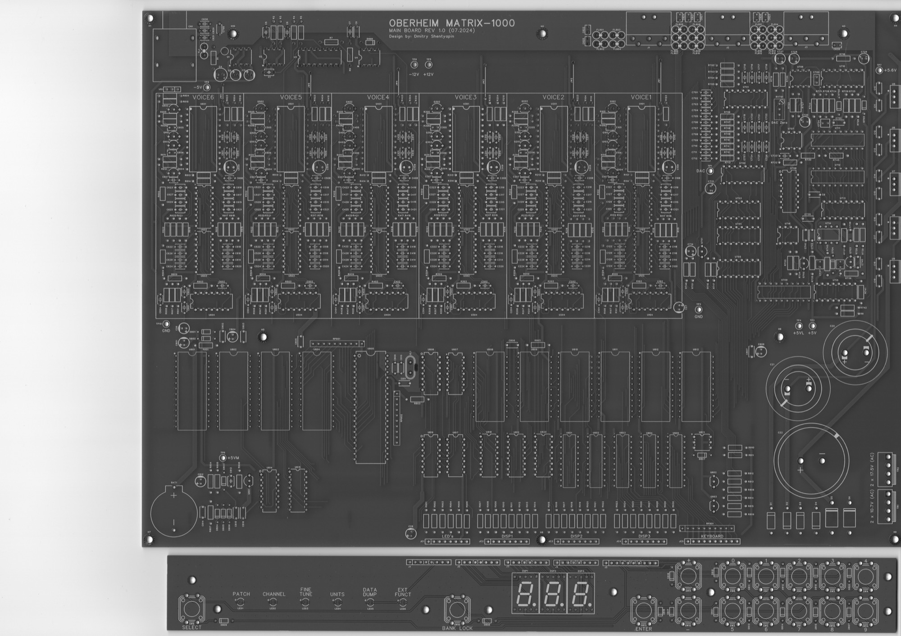

# Oberheim Matrix 1000 clone

> **Project**
>
> ## Projecttitel: Matrix 1000 Clone
>
> ## Status: `in progress`
>
> ## Startdate: 10/2024
>
> ## Duedate: 06/2025
>
> ## **Last Update 01.04.2026 - editor added**
>
> ### Facebook group from me: [https://www.facebook.com/groups/1152475403104272](https://www.facebook.com/groups/1152475403104272)

> **Info**
>
> current status August 2026:
>
> a Professional Case is under review in prototyping - based on IR Ham / APOB Design.

### **my own BOM**: [Matrix1000BOM-PJ-copy.xlsx](assets/Matrix1000BOM-PJ-copy.xlsx)

is based on Dimitry's BOM but with many Partnumbers, notes and in excel format for easier editing

(The Matrix1000 PCB is available from Dimitry)

**please add:**

MIDI JACK CLIFF FM6725 [https://www.tme.eu/de/katalog/?queryPhrase=fm6725](https://www.tme.eu/de/katalog/?queryPhrase=fm6725)

AUDIO JACK Cliff CL1169  [https://www.tme.eu/de/details/cl1169/klinken-steckverbinder/cliff/cl1169-s2-bnb-pc-c/](https://www.tme.eu/de/details/cl1169/klinken-steckverbinder/cliff/cl1169-s2-bnb-pc-c/)

please used milled sockets for the CEM3396 in case you buy the narrow wide CEm3396, this require adapters with milled pins. DS1001-01-24BT1WSF6S

AS3397 doesnt work  - the AS3396 has more pins and the patches are not compatible. A lot of CEM3396 are in stock in USA, for around 35-45€. you find witgh google EU Stores too.

You can use **CEM3396 Narrow** Versions too with my Adapter PCB:

[https://www.diysynth.de/advanced\_search\_result.php?categories\_id=0&keywords=Matrix&inc\_subcat=1](https://www.diysynth.de/advanced_search_result.php?categories_id=0&keywords=Matrix&inc_subcat=1)

**you need:**

5x DS1009-24AT1NS-0A2 (DIL Sockel 24Pin narrow)

5x TMC-624-1-G (Dual Milled sockel 24pin)

The **PSU PCB**is available here in my shop : [https://www.diysynth.de/advanced\_search\_result.php?categories\_id=0&keywords=Matrix&inc\_subcat=1](https://www.diysynth.de/advanced_search_result.php?categories_id=0&keywords=Matrix&inc_subcat=1)

### **Matrix Psu BOM: (from IR HAM)**

- [ ] [M1000\_Transformer.xlsx](assets/M1000_Transformer.xlsx)
- [ ] talema 70053K
- [ ] talema 70050k
- [ ] You don't need the Voltage selector - you can bridge it as shown in my picture .

230VAC handling on your own risk as normal.

V1 = with J1 - not required to use.

v1.1 = without J1

### Build tips:

no bugs known

straight forward build

there are few Ics which should be “F” versions, to get the best performance  the 139 and 138. (U815).. more later

(the device is working with normal versions too)

### **Important info for assembling - adding the ICs**

U801:  HM62256

U802 is empty

U803 Patch Data (comes with the main pcb)

U804: Firmware 1.16 Eprom Chip  (comes with the Main PCB)

**Frontpanel** and **case** is tbd. later

### Editors:

there's a free Max4L version, tested by me - works great

[https://maxforlive.com/library/device/6806/matrix-1000-editor](https://maxforlive.com/library/device/6806/matrix-1000-editor)

**Hardware Controllers:**

[https://www.untergeek.de/2025/10/editors-and-controllers-for-the-matrix-1000/](https://www.untergeek.de/2025/10/editors-and-controllers-for-the-matrix-1000/)

[https://www.alpesmachines.net/index.php/matrix\_ctrlr](https://www.alpesmachines.net/index.php/matrix_ctrlr)

[https://www.stereoping-shop.com/de/Synth-Programmer/](https://www.stereoping-shop.com/de/Synth-Programmer/)

[https://www.stereoping-shop.com/de/Synth-Controller/](https://www.stereoping-shop.com/de/Synth-Controller/)

**Page Attachments**

- [m1k-wiring.pdf](assets/m1k-wiring.pdf)
- [Front panel ATPH 1865-300 final.cdr](assets/Front-panel-ATPH-1865-300-final.cdr)
- [Rear panel ATPH 1865-300 final.cdr](assets/Rear-panel-ATPH-1865-300-final.cdr)
- [BOM_Oberheim Matrix_1000_replica_FP.pdf](assets/BOM_Oberheim-Matrix_1000_replica_FP.pdf)
- [Assembly_Drawing_MB.pdf](assets/Assembly_Drawing_MB.pdf)
- [Matrix1000BOM-PJ-copy.xlsx](assets/Matrix1000BOM-PJ-copy.xlsx)
- [IMG_0852.jpeg](assets/IMG_0852.jpeg)
- [BOM_Oberheim Matrix_1000_replica_MB.pdf](assets/BOM_Oberheim-Matrix_1000_replica_MB.pdf)
- [Assembly_Drawing_FP.pdf](assets/Assembly_Drawing_FP.pdf)
- [OberheimMatrix1000_001.jpg](assets/OberheimMatrix1000_001.jpg)
- [OberheimMatrix1000-2_001.jpg](assets/OberheimMatrix1000-2_001.jpg)
- [M1000_Transformer.xlsx](assets/M1000_Transformer.xlsx)
- [M1000_Enclosure.pdf](assets/M1000_Enclosure.pdf)
- [Bildschirmfoto 2026-03-01 um 16.04.53.png](assets/Bildschirmfoto-2026-03-01-um-16.04.53.png)
- [IMG_1610.JPG](assets/IMG_1610.jpg)
- [IMG_1611.JPG](assets/IMG_1611.jpg)
- [IMG_1988.jpg](assets/IMG_1988.jpg)
- [IMG_1987.jpg](assets/IMG_1987.jpg)
- [M1000PSU.jpg](assets/M1000PSU.jpg)

**Dmitrys original files, except Schematics**

[BOM\_Oberheim Matrix\_1000\_replica\_MB.pdf](assets/BOM_Oberheim-Matrix_1000_replica_MB.pdf)

[BOM\_Oberheim Matrix\_1000\_replica\_FP.pdf](assets/BOM_Oberheim-Matrix_1000_replica_FP.pdf)

[Assembly\_Drawing\_MB.pdf](assets/Assembly_Drawing_MB.pdf)

[Assembly\_Drawing\_FP.pdf](assets/Assembly_Drawing_FP.pdf)

**Own PCB Scans:**

