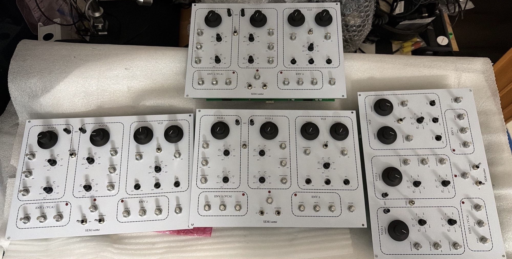
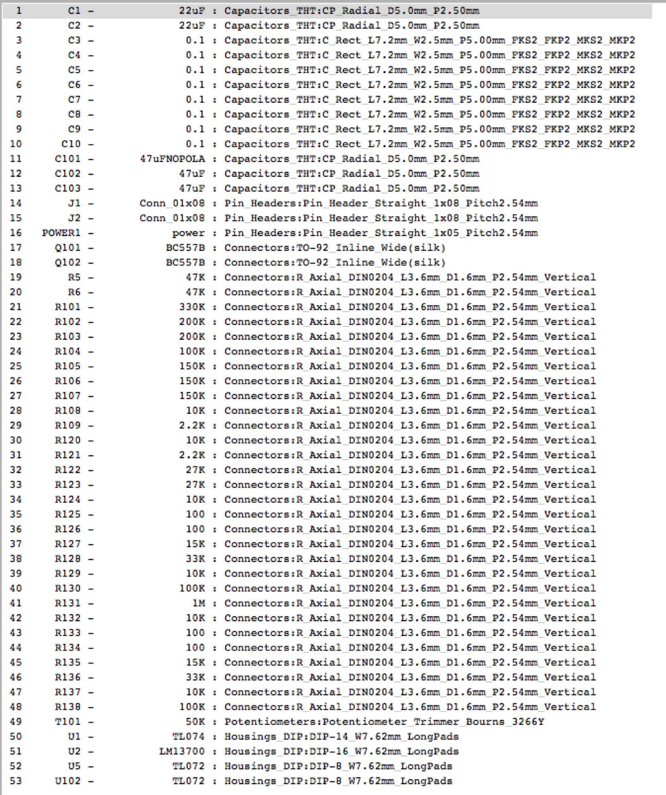
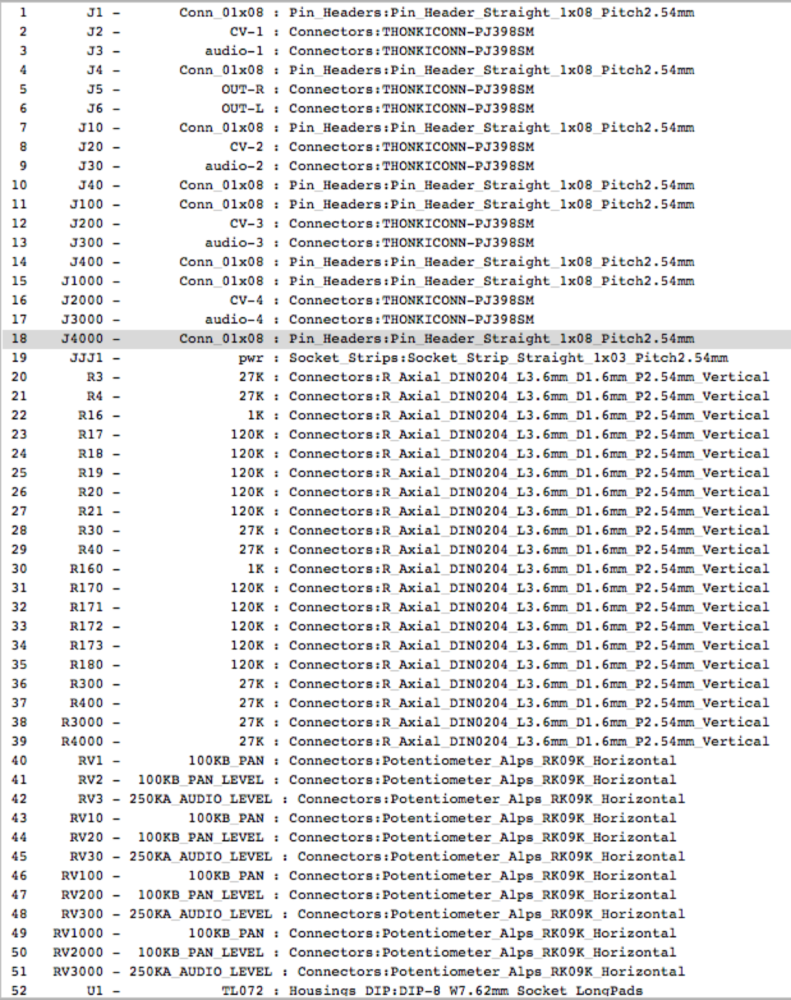
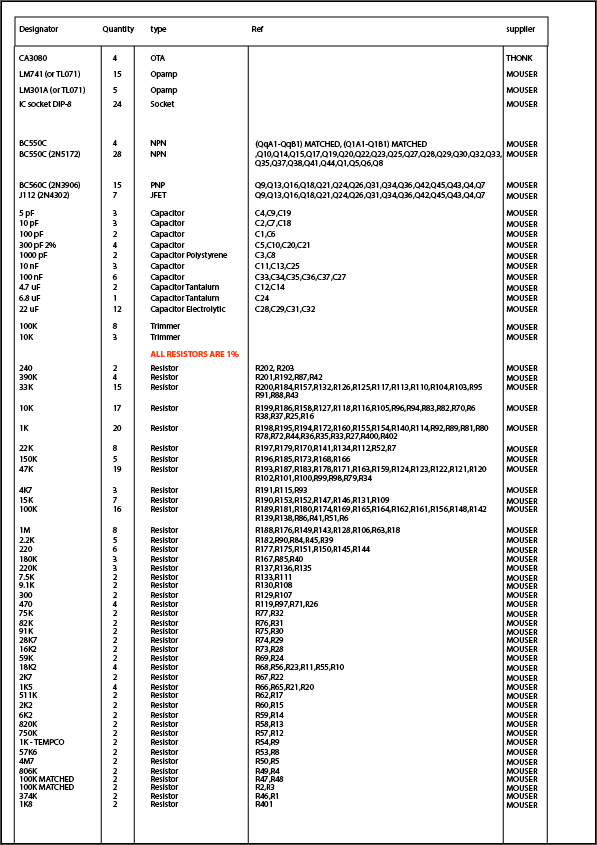
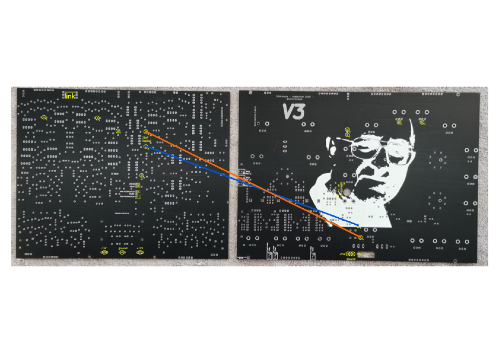
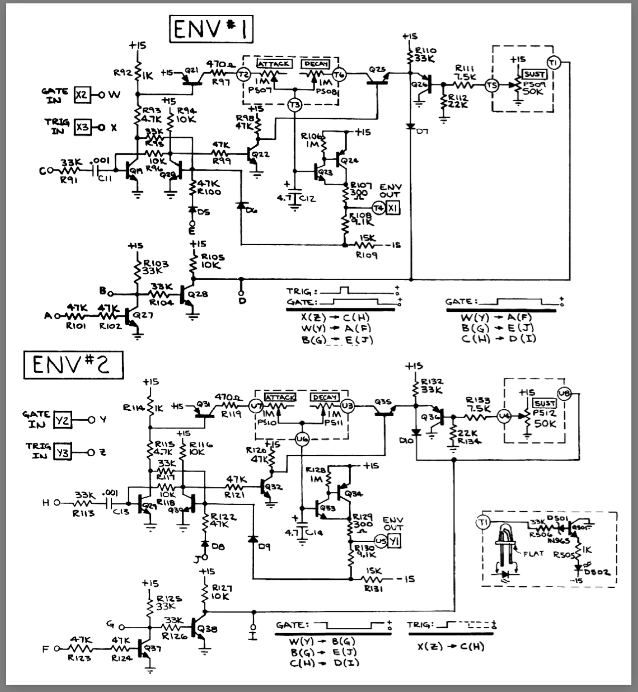

# Oberheim SEM clone

build in 2025

pcb set is bought from synththomas

[SEM\_INT\_WIRING P1.pdf](assets/SEM_INT_WIRING-P1.pdf)

[calibration SEM.pdf](assets/calibration-SEM.pdf)

BOM:

SEM:

[same\_SUB\_board\_BOM.pdf](assets/same_SUB_board_BOM.pdf)

please note: 2N5172 must be flipped 180 degrees against the Silkscreen

**Wiring:**

3pole MTA  on left side (rear view)

left pin = Z  trigger in

middle pin = Y =  Gate

3pole MTA on right side

W GATE in

X Trigger in

Build notes:

15uF on the sub board is original value, different speed is available as mod with 0.15uF

0.15uF = 150nF is correct

BOM notes: 50KC with center detent is correct instead of the 20kb mouser link

the rotary are from banzai

PCb Scan v4

[OBerheim-SEM-PanelPCB.pdf](assets/OBerheim-SEM-PanelPCB.pdf)

[OBerheim-SEM-MainPCB.pdf](assets/OBerheim-SEM-MainPCB.pdf)
