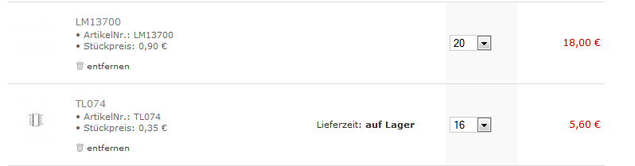
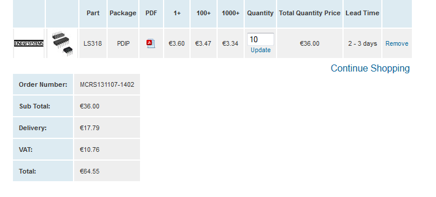

# BOM OBX Clone

### **Todo:**

order parts at reichelt, digikey, mouser

| Part | quantity | dealer | dealer number | price | Summe | open payment-CU | ordered | delivered and approved |
|---|---|---|---|---|---|---|---|---|
| Powersupply HAA15-0.8-A. | 1 | mouser |   |   | in mouser drin |   | x | ✅ |
| Frontpanel | 1 | schaeffer |   |   | 150€ | x |   |   |
| LS318 | 10 | micross compon. |   | 6,50€ | ca. 65€ inkl. versand |   | x | ✅ |
| ic sockel  dip 8 | 40 | reichelt |   |   | in reichelt |   | x | ✅ |
| ic sockel dip 16 | 50 | reichelt |   |   | in reichelt |   | x | ✅ |
| lm13700 x18 | 20 | md |   | 18€ |   |   | x | ✅ |
| 28k7 | 10 | mouser |   | 4 |   | x | x |   |
| 4 LED3MM LED1, LED2, LED3, Digkey# P565-ND (amber)   -&gt;&gt;&gt;**offen** | 5 | homestock |   | 1€ |   | x | x | ✅ |
| 2 pin header (Reichelt PS25/2G WS) | 100(20) | farnell über forum |   | 7,98 |   | x | x-lieferbarkeit |   |
| 6,3mm buchsen | 30\* | german groupbuy | switchcraft 112er | 1,25€/each |   | x | x | ✅ |
| MIDI CV - Marienberg |   | cu order |   |   |   |   | x - december | ➖ |
| seitlich einstellbare 64W x bei reichelt .. |   | [http://www.reichelt.de/Praezisionstrimmer/64Z-10K/3/index.html?&ACTION=3&LA=2&ARTICLE=2733&GROUPID=3129&artnr=64Z-10K](http://www.reichelt.de/Praezisionstrimmer/64Z-10K/3/index.html?&ACTION=3&LA=2&ARTICLE=2733&GROUPID=3129&artnr=64Z-10K) |   |   |   | x |   | ✅ |
| Anstandshalter - spacer - |   |   |   |   |   | x |   | ➖ |
| 1k tempco smd805 | 10 | mouser | [667-ERA-S33J102V](http://de.mouser.com/Search/ProductDetail.aspx?R=ERA-S33J102Vvirtualkey66720000virtualkey667-ERA-S33J102V) | 5 sammelbstellung mikrokontroller.de |   | x | x | ✅ |
| potiknobs max. 15mm lengh x 6mm diameter [http://www.tme.eu/de/details/g4310.6131/drehknopfe-fur-drehpotentiometer/mentor/43106131/#](http://www.tme.eu/de/details/g4310.6131/drehknopfe-fur-drehpotentiometer/mentor/43106131/) | 21 | TME |   |   |   |   |   |   |

**musikding:**

****

**LS318 order:**

****

**Nachorder Mouser: 13122013**

Slotcard - fertig

 AR,  CR GR 538-09-52-3031 - ok  x4 ´=12

 BR   538-09-52-3081   ok x4  =4

 DR ER 538-09-52-3101 ok x4  = 8

 FR  538-09-52-3041  okx 4  =4

stiftleisten MTA 3,96mm  538-26-48-1081  x10

AA/ CC 538-09-52-3032 x2

BB  538-09-52-3082 1x

DD 538-09-52-3102 1x

EE 538-09-52-3102  1x

FF 538-09-52-3042 1x

**reichelt warenkorb:**

**[https://secure.reichelt.de/index.html?&ACTION=20&LA=5010&AWKID=817045&PROVID=2084](https://secure.reichelt.de/index.html?&ACTION=20&LA=5010&AWKID=817045&PROVID=2084)**

**falsch dort drin:**

**SMD805 100N zuwenig wurde verwechselt mit SMD 805 10N (zuviele),**

**SMD 1N fehlt, SMD 1K fehlt**

**10.000UF caps statt 10UF**

**corrected here: ( for 5voice cards)**

**[http://www.reichelt.de/?ACTION=20;AWKID=821472;PROVID=2084](https://secure.reichelt.de/index.html?&ACTION=20&LA=5010&AWKID=821472&PROVID=2084)**

**Partlist**from OBXVox\_**discrete\_egs.sch** on 5/18/2013, BoM rev. 2.0 (09/09/2013)
Qty Value/Type Device/refdes Part desc/number/vendor
----------------------------------------------------------------------------------
3 AA,CC,GG KK-156-3BE Molex bot entry header Mouser# 538-09-52-3032     - mouser 15x   x
**1 FF KK-156-4BE Molex bot entry header Mouser# 538-09-52-3042  -  5x   x**
**1 BB KK-156-8BE Molex bot entry header Mouser# 538-09-52-3082    -5x    x**
2 DD,EE KK-156-10BE Molex bot entry header Mouser# 538-09-52-3102   -10x   x

**Capacitors**
1 6u8 tantalum C15 Digikey# 478-1919-ND    reichelt [TANTAL 6,8/35](http://www.reichelt.de/Tantal-Kondensatoren/TANTAL-6-8-35/3/index.html?&ACTION=3&LA=446&ARTICLE=20358&GROUPID=3147&artnr=TANTAL+6%2C8%2F35) x5   x
3 6u8 Al, use 10u C1, C2, C49 Digikey# P5148-ND    reichelt RAD 10/35  x15  x
4 10n cer X7R C20, C21, C52, C53 Digikey# 399-9865-1-ND  [reichelt X7R-5 10N](http://www.reichelt.de/Vielschicht-bedrahtet-X7R-10-/X7R-5-10N/3/index.html?&ACTION=3&LA=446&ARTICLE=22866&GROUPID=3162&artnr=X7R-5+10N)   x20 x

1 10p cer C0G C9 Digikey# 445-4714-ND   reicehlt kerko  x5  x
2 47p cer C0G C16, C17 Digikey# 445-4722-ND  x10 x
3 100n cer X7R C22, C23, C24 Digikey# 399-4329-ND  x15  x
4 100n poly C12, C13, C18, C19 Digikey# P4525-ND  wima mks2 5mm x20 x

26 100n SMD0805 C25, C26, C27, C28, Digikey# 1276-1003-1-ND    [X7R-G0805 10N](http://www.reichelt.de/Vielschicht-SMD-G0805/X7R-G0805-10N/3/index.html?&ACTION=3&LA=2&ARTICLE=22877&GROUPID=3165&artnr=X7R-G0805+10N)   130x x
C29, C30, C31, C32,
C33, C34, C35, C36,
C37, C38, C39, C40,
C41, C42, C43, C44,
C45, C46, C47, C48,
C50, C51
3 100p cer C0G C5, C6, C14 Digikey# 445-4726-ND   [NPO-2,5 100P](http://www.reichelt.de/Vielschicht-bedrahtet-NPO-5-/NPO-2-5-100P/3/index.html?&ACTION=3&LA=446&ARTICLE=13495&GROUPID=3161&artnr=NPO-2%2C5+100P)   x15 x
2 100u alum. C3, C4 Digikey# P5165-ND   10x
2 330p mica C10, C11 JAMECO #16088  10x  mouser x
2 1000p poly C7, C8 Digikey# 495-2456-ND (=1NF)  10x 5mm mks  x

**Resistors, 1/4W 5% through-hole types except where otherwise noted**
9 x 1K R43, R61, R62, R84, Digikey# 1.0KQBK-ND    x45 x

116, R119, R134, R184,
R197
1 1K 1% R139 Digikey# 1.00KXBK-ND    x5

2 1K TCR **0805** R27, R28 Digikey# P1.0KCDCT-ND   10x [667-ERA-S33J102V](http://de.mouser.com/Search/ProductDetail.aspx?R=ERA-S33J102Vvirtualkey66720000virtualkey667-ERA-S33J102V)    mouser  - nachorder
4 1K5 R49, R50, R51, R52 Digikey# 1.5KQBK-ND   20x METALL 1,5K  x
1 1M R113 Digikey# 1.0MQBK-ND   5x x
2 1M5 1% R5, R6 Digikey# 1.5MGACT-ND   10x x
3 2K2 R37, R38, R66 Digikey# 2.2KQBK-ND   15x x
9 2K7 R45, R46, R117, R128, Digikey# 2.7KQBK-ND 45x x
R145, R167, R171, R191,
R193
2 3K3 R79, R80 Digikey# 3.3KQBK-ND   10x x
3 4K7 R65, R87, R88 Digikey# 4.7KQBK-ND  15 x x
4 4K87 R146, R148, R172, R174 Digikey# 4.87KXBK-ND  20x   --- reichelt
2 4M7 R9, R10 Digikey# 4.7MQBK-ND    10 x x
2 6K2 R35, R36 Digikey# 6.2KQBK-ND   10x x
11 10K R150, R151, R176, R177, Digikey# 3362R-103LF-ND      55x x
R198, R199 T2, T3, T5,
T6, T10
4 10K T1, T4, T7, T8 Digikey# 3296Z-103LF-ND  20x x
17 10K R18, R41, R42, R57, Digikey# 10KQBK-ND 85 xx
R58, R70, R91, R92,
R93, R94, R104, R108,
R109, R110, R162, R188,
R196
14 10R R7, R8, R152, R153, Digikey# 10QBK-ND   70x x
R156,R157, R164, R178,
R179, R182, R183, R190
R200, R201
1 12K R67 Digikey# 12KQBK-ND  5x x
2 16K2 1% R53, R54 Digikey# 16.2KXBK-ND   10x x
2 18K R23, R24 Digikey# 18KQBK-ND 10x x
6 18K2 1% R31, R32, R33, R34, Digikey# 18.2KXBK-ND  30x x
R47, R48
3 22K R77, R78, R114 Digikey# 22KQBK-ND 15x x
1 27K R124 Digikey# 27KQBK-ND    5x x
2 28K7 1% R59, R60 Digikey# 28.7KXBK-ND   10x  --------
19 33K R15, R16, R83, R118, Digikey# 33KQBK-ND  95x x
R120, R123, R124, R125
R154, R155, R159, R161,
R165, R180, R181, R185,
R187, R192, R194, R195
2 39K R122, R127 Digikey# 39KQBK-ND   10 x x
3 44K2 1% R71, R72, R138 Digikey# 44.2KXBK-ND 15x x
7 47K R68, R73, R74, R81, Digikey# 47KXBK-ND 35x  x
R105, R122, R127, R133
R141, R142, R143, R168,
R169
4 56K 1% R142, R143, R168, R169 Digikey# 56.0KXBK-ND   20x x
2 57K6 1% R25, R26 Digikey# 57.6KXBK-ND  10x x
2 59K 1% R55, R56 Digikey# 59.0KXBK-ND  10x x
2 68K R96, R102 Digikey# 68KQBK-ND   10x x
2 68K1 1% R75, R76 Digikey# 68.1KXBK-ND  10x x
1 82K R82 Digikey# 82KQBK-ND   5x x

2 100K T9, T11 Digikey# 3362R-104LF-ND – trimpot !! 10 x mouser x x drin.x
22 100K R19, R20, R44, R69, Digikey# 100KQBK-ND  - 110 x x
R89, R90, R95, R97, R98,
R100, R103, R106, R112,
R115, R121, R135, R136,
R147, R149, R158, R173,
R175
10 100K 1% R1, R2, R3, R4, R21, Digikey# 100KXBK-ND 50x x
R22, R131, R132, R137,
R140
4 120K R85, R86, R163, R189 Digikey# 120KQBK-ND  20x x
1 220K R17 Digikey# 220KQBK-ND   5 x x
4 220R R99, R101, R107, R111 Digikey# 220QBK-ND   20x x
1 270K R130 Digikey# 270KQBK-ND  5 x x
3 330K R129, R160, R186 Digikey# 330KQBK-ND  15 x
2 470R R63, R64 Digikey# 470QBK-ND  10 x x
2 511K 1% R13, R14 Digikey# 511KXBK-ND  10 x x
2 715K 1% R11, R12 Digikey# 715KXBK-ND   10 x x   **mouser** 10xx
2 750K 1% R29, R30 Digikey# 750KXBK-ND  10 xx
2 820K R39, R40 Digikey# 829KQBK-ND  10x x
4 1M 1% R126, R144, R166, R170 Digikey# 1MGACT-ND  20 x x

**Semiconductors**
2 4052N IC2, IC6 Digikey# 296-2058-5-ND, Mouser# 595-CD4052BE  10x x
1 4053N A7 Digikey# 296-2059-5-ND, Mouser# 595-CD4053BE 5 x x
4 J112 Q7, Q8, Q11, Q12 Digikey# J112FS-ND     20x x mouser
3 LM13700N A10, A13, A14 Digikey# LM13700N/NOPB-ND, Mouser# 926-LM13700N/NOPB   -&gt; 15x  oder musikding 0,90€
**2 LS318P A3A, A3B Linear Systems call them 510-490-9160 and**
**order part# LS318 PDIP 8L [www.linearsystems.com](http://www.linearsystems.com)   (Can also use MAT-02, SSM2210, LM394)2 LT1013 A1, A2 Digikey# 296-7045-5-ND**
2 NE555N IC3, IC8 Digikey# 296-1857-5-ND (CMOS version)  ---&gt;reicehlt ic7555
7 TL072P A6, A8, A9, A11, A16, Digikey# 497-2201-5-ND   35 x x
IC4, IC9
2 TL074P IC1, IC5 Digikey# 296-1777-5-ND   10xx -   musikding xx
1 78M15T A20 Digikey# MC78M15CTGOS-ND  5x x
1 79M15T A21 Digikey# MC79M15CTGOS-ND    5x x
18 2N3904 Q1, Q3, Q4, Q13, Q14, Digikey# 2N3904FS-ND  90x x
Q15, Q16, Q17, Q18,
Q19, Q23, Q24, Q28,
Q29, Q30, Q33, Q34,
T12
14 2N3906 Q2, Q5, Q6, Q9, Q10, Digikey# 2N3906FS-ND    70x x
Q20, Q21, Q22, Q25,
Q26, Q27, Q31, Q32,
Q35
11 1N4148 D1, D2, D3, D4, D5,D6 Digikey# 1N4148FS-ND   55x x
D7, D8, D9, D10, D11
1 3mm LED LED1 Digikey# P563-ND (red)
4 (open) X1, X2, X3, X4 not installed
Errata (rev1):
Refdes swaps:
**R10 and R14, printed values are correct**
**R24 and R36 (values correct)**
**R65 and R66 (values correct)**
**R84 and R94 (values correct)**
**R132 and R141 (values correct)**
**C21 and C24 values swap, refdes are correct (C21 is 10n, C24 is 100n)**
**Part value changes (rev1 to rev2 only):**
**Change R126, R144, R166, R170 to 1M**
**Change R142, R143, R168, R169 to 56K 1% (57.6K 1% OK)**
**Change R122, R127 to 47K**
**Optional: for compliance with Oberheim ECO for PW trimming on VCOs, change R3/R74 to 46.4K 1% and**
**R15/R16 to 34.8K 1%**

**\_\_\_\_\_\_\_\_\_\_\_**

**VOX board**

Partlist exported from OBXVox**\_cardframe.sch** at 7/6/2013 9:21:28 AM BoM v2.1

Qty Value Device/Refdes Part desc/number/vendor

**Connectors**

**12 KK-156-3 AR1,AR2,AR3,AR4, Molex #26-48-1031, Mouser# 538-26-48-1031  x mouser x12x**

**CR1,CR2,CR3,CR4,**

**GR1,GR2,GR3,GR4**

3 KK-156-3BE AA, CC, GG Molex bot entry header Mouser# 538-09-52-3032    3x x

**4 KK-156-4 FR1,FR2,FR3,FR4 Molex #26-48-1041, Mouser# 538-26-48-1041   4x x**

1 KK-156-4BE FF Molex bot entry header Mouser# 538-09-52-3042 1 xx

**4 KK-156-8 BR1,BR2,BR3,BR4 Molex #26-48-1081, Mouser# 538-26-48-1081  4 x x**

1 KK-156-8BE BB Molex bot entry header Mouser# 538-09-52-3082   1 x x

8 KK-156-10 DR1,DR2,DR3,DR4, Molex #26-48-1101, Mouser# 538-26-48-1101  8 x

ER1,ER2,ER3,ER4

2 KK-156-10BE DD, EE Molex bot entry header Mouser# 538-09-52-3102  2 x

1 MTA04-156 P1 Molex #26-60-4040, Digikey# WM4622-ND  **home stock**

1 CV/gate hdr JP1 see note 1

3 of the following header

1 LEFT 1x3 JP3 Digikey# A19470-ND x x

1 MONO 1x3 JP4

1 RIGHT 1x3 JP5

Optional: for adding fine tune panel pots, use additional 4 pieces of the follwing header

1 FT1 1x3 JP2 Digikey# A19470-ND  **homestock oder reichelt**

1 FT2 1x3 JP6

1 FT3 1x3 JP7

1 FT4 1x3 JP8

Optional: for connecting two 4-voice carriers only, use 2 of the following header

1 OLEXP 1x2 JP9 Digikey# A19423-ND **homestock**

1 OREXP 1x2 JP10  **homestock**

**Semiconductors**

1 78L15Z VR1 Digikey# MC78L15ABPGOS-ND   x x

1 79L15Z VR2 Digikey# MC79L15ABPGOS-ND    x x

16 1N4148 D1, D2, D3, D4, Digikey# 1N4148FS-ND x x

D5, D6, D7, D8,

D9,D10,D11,D12,

D13,D14,D15,D16

1 2N3906 Q1 Digikey# 2N3906FS-ND  x x

2 TL072P IC1, IC3 Digikey# 296-1775-5-ND   x x

1 LM13700N IC2 Digikey# LM13700N/NOPB, Mouser# 926-LM13700N/NOPB  ---&gt;&gt; musikding xx

**Resistors**

2 1K R32, R55 Digikey# 1.0KQBK-ND  x x

2 10K R33, R56 Digikey# 10KQBK-ND x x

2 15K R34, R158 Digikey# 15KQBK-ND x x

2 22K R28, R51 Digikey# 22KQBK-ND  x x

6 23K7 1% R25,R26,R27,R48, Digikey# 23.7KXBK-ND   x x

R49, R50

3 47K R2, R3, R57 Digikey# 47KQBK-ND x x

2 100K trimpot R29, R52 Digikey# 3362P-104LF-ND -----**&gt; offen  -&gt;&gt; nachprüfen evtl. passen die mouser welche bestellt sind.**

2 100K R30, R53 Digikey# 100KQBK-ND xx

5 100R R1,R4,R5,R31,R54 Digikey# 100QBK-ND (100Q not KQ!)  x x

2 120K R24, R47 Digikey# 120KQBK-ND xx

**Capacitors, Inductors**

2 FB 60@100MHzL1, L2 Mouser# 81-BL01RN1A1F1J, Digikey# P9820BK-ND x x 2 mouser

2 6u8 tant C21, C32 Digikey# 478-1921-ND 2x x

2 10u Al C14, C16 Digikey# P5161-ND  x x

8 100n SMD0805 C1, C2, C3, C4, Digikey# 1276-1003-1-ND x x10xx

C17,C18,C19,C20

2 100u C13, C15 Digikey# P5182-ND x x

Note 1: CV/gate header options. For ribbon cable use Digikey# S2212EC-17

## Partlist exported from OBXVoice/OBXVox\_**hostboard\_rev2**.sch at 09/10/2013 8:52 PM BoM rev 2.1

Device/refdes in italics are omitted for host board builds that use carrier board for 1 to 4 voices.

**Connectors**

Qty Value Device/Refdes Part desc./number/vendor

**3 KK-156-3 Headers AA, CC, GG Molex #26-48-1031. Mouser# 538-26-48-1031  x x**

**1 KK-156-4 Header FF Molex #26-48-1041, Mouser# 538-26-48-1041x x**

**1 KK-156-8 Header BB Molex #26-48-1081, Mouser# 538-26-48-1081  xx**

2 KK-156-10 Header DD, EE Molex #26-48-1101, Mouser# 538-26-48-1101

1 MTA04-156 J1 Molex #26-60-4040, Digikey# WM4622-ND   **homestock**

4 of the following header Digikey# A19423-ND -&gt;  **nach order bei reichelt  samt KABEL dran..**

1 GATE 1x2 JP10

1 OUTPUT 1x2 JP1

1 EXT VOL 1x2 JP13

1 LFO 1x2 JP15

13 of the following header Digikey# A19470-ND  x x reichelt xx

1 1V/OCT 1x3 JP11

1 FTA 1x3 JP7

1 FTB 1x3 JP6

1 EXT BEND 1x3 JP9

1 EXT FMLVL1x3JP8

1 EXT IN 1x3 JP2

1 EXT LFOCV1x3JP14

1 EXT PW1 1x3 JP3

1 EXT PW2 1x3 JP4

1 EXT VCFCV1x3JP5

1 EXTVBDEP 1x3JP12

1 FM OSC1 1x3 JP16

1 FM OSC 2 1x3 JP17

**Capacitors, Beads**

2 FB 60@100MHz L1, L2 Mouser# 81-BL01RN1A1F1J, Digikey# P9820BK-ND x x

23 1nF C5, C6, C7, C8, C9, Digikey# 399-1147-1-ND   x x

C10, C11, C12, C13,

C14, C15, C23, C24,

C25, C26, C27, C28,

C29, C30, C31, C40,

C45, C46

1 6u8 tant C32 Digikey# 478-1921-ND x x

1 10n C41 X7R Digikey# P4513-ND  xx

4 10uF C4, C20, C36, C49 Digikey# P5161-ND (C49 was 6u8)  xx

1 22n C44 poly Digikey# P4717-ND   xx mk2 5mm

1 47n C37 X7R Digikey# 445-5256-ND   x x7r 5mm  reichelt xx

2 100n X7R C22, C43 Digikey# 399-4329-ND   xx

19 100n 0805 SMT C1, C2, C16, C18, C19, Digikey# 1276-1003-1-ND   xx

C21, C34, C35, C47, C48,

C50, C51, C52, C53, C54,

C55, C56, C57, C58

2 100n poly C38, C42 Digikey# P4525-ND     x x

1 100p C39 Digikey# 445-4726-ND xx

3 100uF C3, C17, C33 Digikey# P5182-ND  xx

**Resistors, 1/4W 5%** unless otherwise indicated

7 1K R3, R11, R7, R15, R55, Digikey# 1.0KQBK-ND   xx

R137, R145, R156, R161

R167, R168

1 1K 1% R68 Digikey# 1.00KXBK-ND xx

1 1K15 1% R141 Digikey# 1.15KXBK-ND    xx 1,15k xx

1 1M5 R69 Digikey# 1.5MGACT-ND  xx

3 2K2 R149, R151, R152 Digikey# 2.2KQBK-ND  xx

1 2M2 R78 Digikey# 2.2MQBK-ND xx

2 3K3 R88, R91 Digikey# 3.3KQBK-ND  xx

2 4K7 R23, R155 Digikey# 4.7KQBK-ND xx

6 4K87 1% R5, R6, R8, R13, R14 Digikey# 4.87KXBK-ND  xx

R16

1 5K9 1% R131 Digikey# 5.90KXBK-ND  xx x

1 6K8 1% R142 Digikey# 6.81KXBK-ND xx

10 10K R18, R79, R81, R102 Digikey# 10KQBK-ND  xx

R103, R109, R154, R160

1 10M R130 Digikey# 10MQBK-ND

11 10R R121, R122, R148 Digikey# 10QBK-ND

R169, R170, R171, R172

R173, R174, R175, R176

1 15K\* R158 (optional) Digikey# 15KQBK-ND (not installed by default)  xx

3 20K R56 Digikey# 20KQBK-ND  xx

7 22K R38, R51, R89, R90, Digikey# 22KQBK-ND xx

R92, R123, R144

4 23K7 1% R48, R49, R50, R140 Digikey# 23.7KXBK-ND xx

1 27K R34 Digikey# 27KQBK-ND xx

19 33K R17, R19, R20, R21 Digikey# 33KQBK-ND  xx

R22, R32, R40, R41, R58

R59, R60, R61, R62, R63

R64, R85, R101, R104, R150

1 34K8 1% R67 Digikey# 34.8KXBK-ND  xx

8 47K R33, R36, R45, R46, R57, Digikey# 47KQBK-ND  xx

R80, R82, R110, R146

2 64K9 1% R134, R135 Digikey# 64.9KXBK-ND  xx

1 68K R66 Digikey# 68KQBK-ND  xx

1 75K R77 Digikey# 75KQBK-ND xx

21 100K Alpha 9mm VR1~VR21 Mouser# 317-2090F-100K, Digikey# PTV09A4020U-B104-ND   xx

10 100K R35, R37, R53, R74 Digikey# 100KQBK-ND  xx

R75, R86, R87, R136,

R147

41 100K 1% R1, R2, R4, R9, R10 Digikey# 100KXBK-ND  xx

R11, R12

R26, R27, R28, R29,

R30, R70, R71, R72,

R73, R95, R96, R97,

R99, R107, R108, R111,

R112, R113, R114, R115,

R116, R117, R118, R119,

R120, R124, R125, R126,

R127, R128, R129, R159

R162, R163

9 100R R24, R25, R31, R39, Digikey# 100QBK-ND  xx

R54, R105, R106, R157,

R164 (install for carrier board only)

2 120K R47, R65 Digikey# 120KQBK-ND  xx

3 150K R44, R76, R84 Digikey# 150KABK-ND  xx

2 432K 1% R42, R43 Digikey# 432KXBK-ND **mouser** 2xx

1 470K R138 Digikey# 470KQBK-ND  xx

1 510R R153 Digikey# 510QBK-ND  xx

1 511K 1% R139 Digikey# 511KXBK-ND x

4 820K R93, R94, R98, R100 Digikey# 820KQBK-ND (see rev.2 errata, below) xx

2 10K 25t trimpot R132, R133 Digikey# 3296Z-103LF-ND   seitlich einstellbare  neu ordern   reichelt: **[2 x   64Z-10K](http://www.reichelt.de/Praezisionstrimmer/64Z-10K/3/index.html?&ACTION=3&LA=2&ARTICLE=2733&GROUPID=3129&artnr=64Z-10K)**

3 100K 1t trimpot R52, R83, R143 Digikey# 3362P-104LF-ND  - mouser xx -

**Semiconductors**

4 LED3MM LED1, LED2, LED3, Digkey# P565-ND (amber)   -&gt;&gt;&gt;**offen**

LED4

11 1N4148 D1, D2, D3, D4, D5, D6, Digikey# 1N4148FS-ND   xx

D7, D8, D9, D10, D11

1 J112 Q3 Digikey# J112FS-ND (see note 1)  -&gt;&gt;&gt; mouser

3 2N3904 T1, T2, T3 Digikey# 2N3904FS-ND    xx

8 2N3906 Q1, Q2, Q4, Q5, Digikey# 2N3906FS-ND  xx

Q6, Q7, Q8, Q9

1 4051N IC7 Digikey# 296-2057-5-ND, Mouser# 595-CD4051BE     xx

3 4053N IC14, IC15, IC16 Digikey# 296-2059-5-ND. Mouser# 595-CD4053BE  xx

2 LM13700 IC9, IC12 Digikey# LM13700N/NOPB, Mouser# 926-LM13700N/NOPB     xxmusikding

6 TL072P IC4, IC5, IC8, IC13, Digikey# 296-1775-5-ND  x x

IC17, IC19

5 TL074P IC11, IC18, IC20, IC21 Digikey# 296-1777-5-ND  xx

IC22

1 PIC12C508JN IC6 Digikey# PIC12C508A-04/P-ND (will need programmed)   -&gt;&gt; from usa bei pcbs bei.

1 7805T IC10 Digikey# LM7805CT-ND xx

1 7815T IC1 Digikey# LM7815CTFS-ND xx

1 7915T IC2 Digikey# LM7915CTFS-ND  xx

**Switches**

4 of the following switch Digikey# 432-1169-ND (on/off/on)  mouser 2M1-SP3-T1-B1-M2QE   xx

1 SHAPE SW1

1 OSC 2 (level) SW12

1 NOISE SW13

1 OCT SW16

13 of the following switch Digikey# 432-1168-ND (on/on)  mouser 2M1-SP1-T1-B1-M2QE xx

3 OSC 1 SW2, SW5, SW11

2 OSC 2 SW3, SW6

1 BEND SW17

1 FILTER SW4

1 KBD SW14

1 MUTE SW15

1 SYNC SW9

1 WAVE1 SW7

1 WAVE2 SW10

1 X-MOD SW8

Notes:

1) The J112 is pinned (flat facing view) as D S G whereas the board pads use the 2N3819's D G S order. Placing the J112

is simple enough: the flat side should face the 10 o'clock direction as the leads go into their respective pads as noted on the

silk screen.

Errata for rev1: (rev2 builders can skip these)

Refdes swaps:

R45 and R65, values are correct

R51 and R55 (values correct)

R80 and R160 (values correct)

Value changes:

R154 is 10K, board is marked 1K

R155 is 4K7, board is marked 10K

R33 is 47K, board marked 100K

Swap R34 and R35 values: R34 is now 27K, R35 is 100K

R84 is 150K, board is marked 100K

Additions:

Add 1N4148, anode to IC13 pin 1, cathode to IC15 pin 16 (clamp diode)

Errata for rev 2: (rev 2 builders take note)

When building for 1-4 voices using a carrier board, omit the following parts from the host board:

C32, C43, C44, C45

D1 through D6

R44, R45, R46, R47, R48, R49, R50, R51, R52, R53, R54, R55, R56, R57, R65

R136, R137, R144, R145, R148

IC5, IC9, IC19

J1, JP1, JP2, JP11

L1, L2

Similarly, install these parts on host board when using a carrier board:

R164, R165, R166

OSC1/OSC2 FM fix: resistors R93 and R94 need to be cross-wired to correct a minor oversight where the switches for

OSC1 FM and OSC2 FM were in fact affecting the opposing VCO. (FM1 switch was modulating OSC2, etc). The easiest

fix is to install R93 and R94 as shown here (820K resistor from R93 left pad to R94 right pad, another 820K resistor from

R94 left pad to R93 right pad using wire insulation on the resistor leads):

**FINAL:**

| Dealer | Summe | order placed | payed CU | delivered | arrived by me |
|---|---|---|---|---|---|
| reichelt | 200 | x | x | x | ✅ |
| musikding | ca.25 | x | x | x | ✅ |
| mouser | 275 | x | x | x | ✅ |
| micross u.k | 65€ | x | x | x | ✅ |
| SMD zeugs | 10€ | x |   | x | ✅ |
| mouser rest fehlende teile /tempco | 20€ | x |   | x | ✅ |
| frontpanel | 140€ |   | x | x | ✅ |
| case | 120€ | x | x | x | ✅ |
| 6,3mm buchsen | 50€ | x | x | x | ✅ |
| pcbs USA | 170€ | x | x | x | ✅ |
| spacer, solder thin, screws, cable, IEC,fuse | 50 |   |   |   |   |
| reichelt/MD/ restteile | ca.75 | x |   |   |   |
| mouser Restteile |   |   |   |   |   |
| case gitterpanel | ca.10 | x | x | x | ✅ |
| **SUMME** | **1150€** |   |   |   |   |
