# Obx - Building Tips

If soldering small items is a problem try fixing it while solder the first pin.

There are some slightly different HAA15-0.8-A Power supply out there. Mine is different from this: [http://www.cs80.com/crowbx/psmod.html](http://www.cs80.com/crowbx/psmod.html)

Mine has a slightly different layout. I used two 2k2 Ohm resistors. parallel to R52 and R79.

The Voltage is now adjustable between 8- and 20Volts.

So no Problem to justify for 19Volts.

- Voice Card BOM Typo:
  **correct:** Optional: for compliance with Oberheim ECO for PW trimming on VCOs, change R73/R74 to 46.4K 1% and R15/R16 to 34.8K 1%

- IC3 (CD4011) is lacking in the BOM

You have to solder a diode at the output of the 15V regulators

**Documents:**

[Crowbx\_calibration\_host.pdf](assets/Crowbx_calibration_host.pdf)

[Crowbx\_mount\_calibration\_carrier\_rev1.pdf](assets/Crowbx_mountcal_carrier_rev1.pdf)

**Power issues:**

the Linear PSU´s have on startup some issues to bring both voltages (-15/+15V) at the same time, in result the voltage regulators blows on obx.

in my modular system i have on high load similar issue with this rootcause..

(picture from [http://www.modularsynthesis.com/modules/DJB-power/djbpower.htm](http://www.modularsynthesis.com/modules/DJB-power/djbpower.htm) )

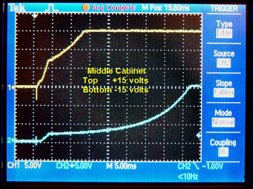

**Calibration Issues:**

Hint for calibrate the Voicecards:

The IC1 and IC4**must not be inserted while doing the calibration**, because the DMM- OHMs measurement injects to much voltage which falsify the measure.

Hopefully the Green Lines shows where the Testpoints are 😉

The both multiturn pots must be adjusted to 61K.

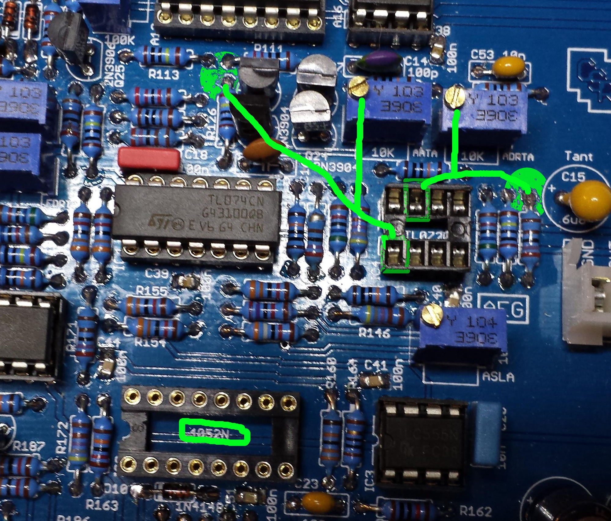

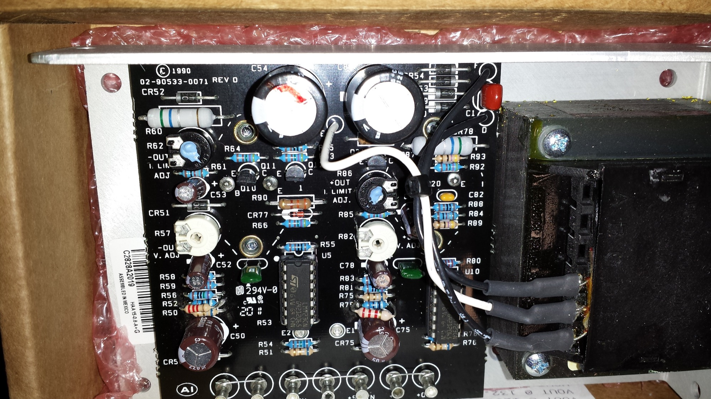

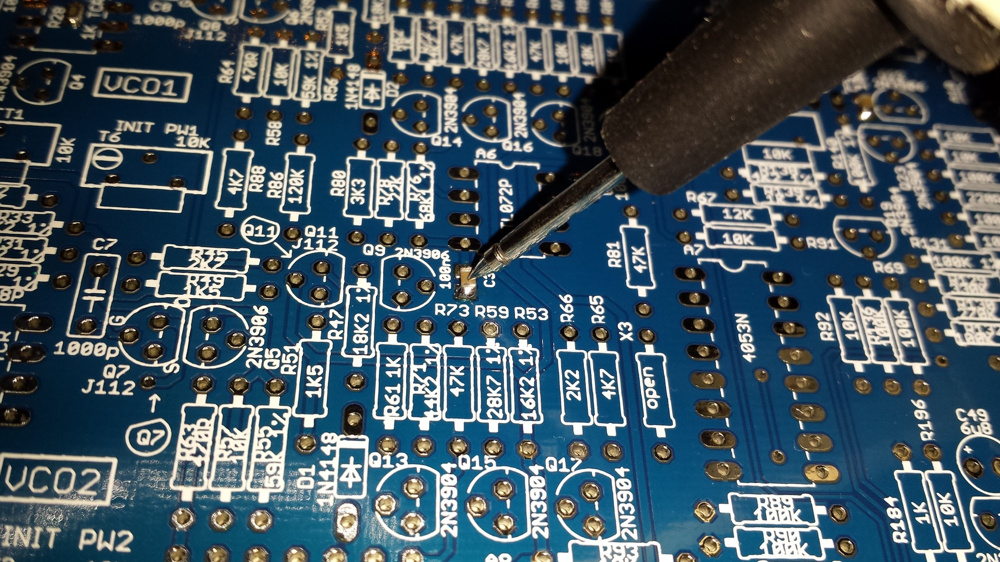

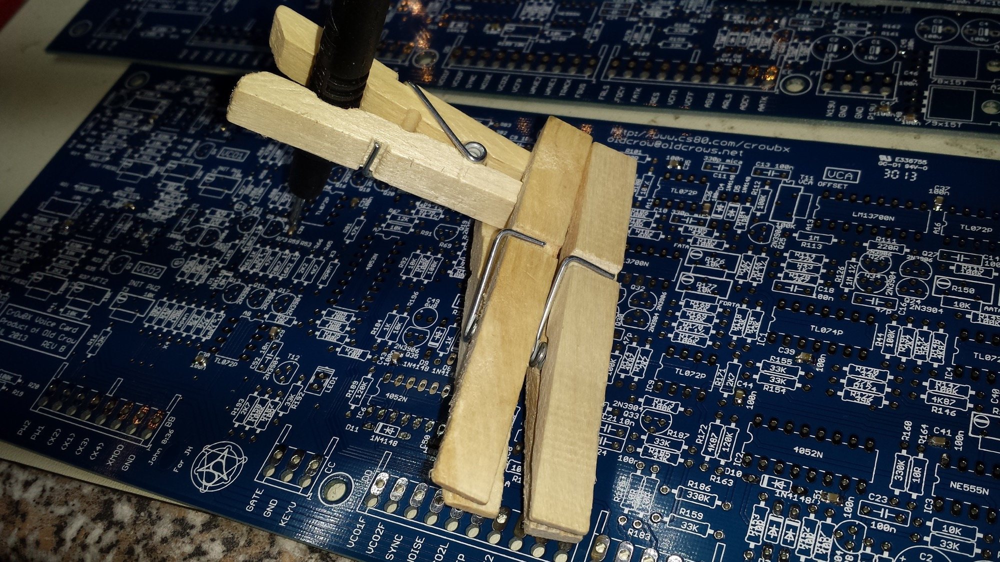

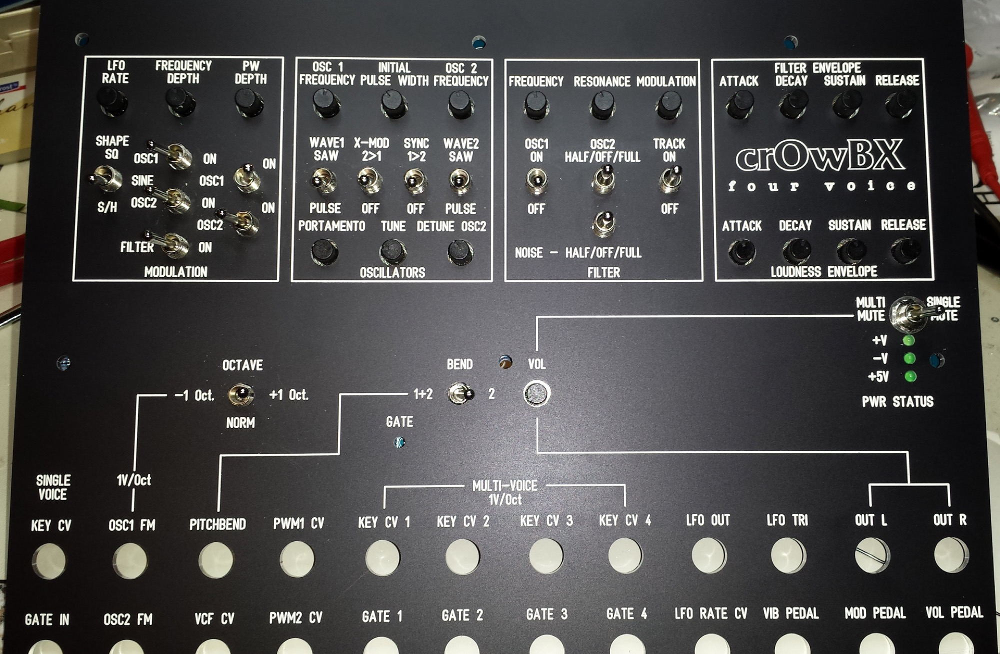

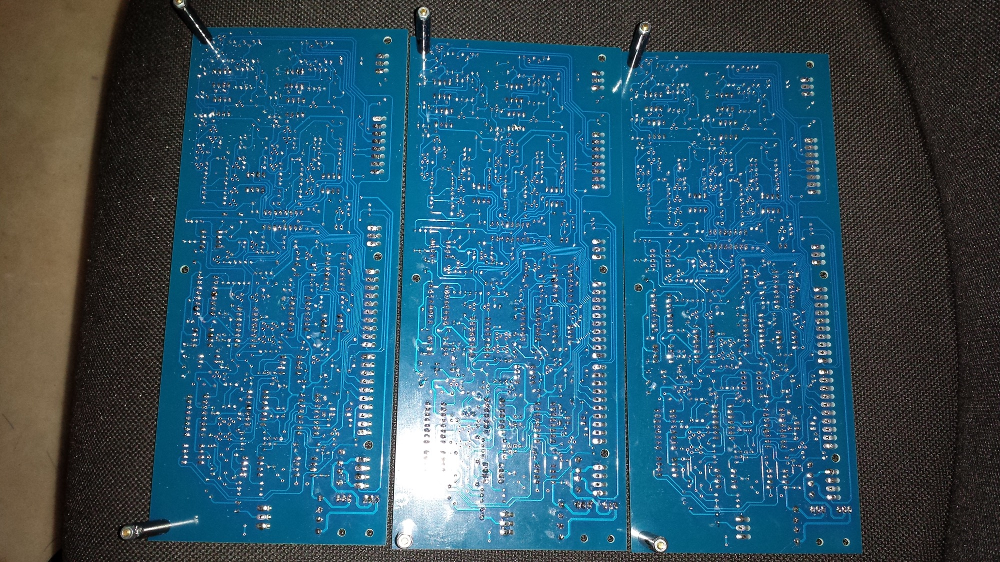

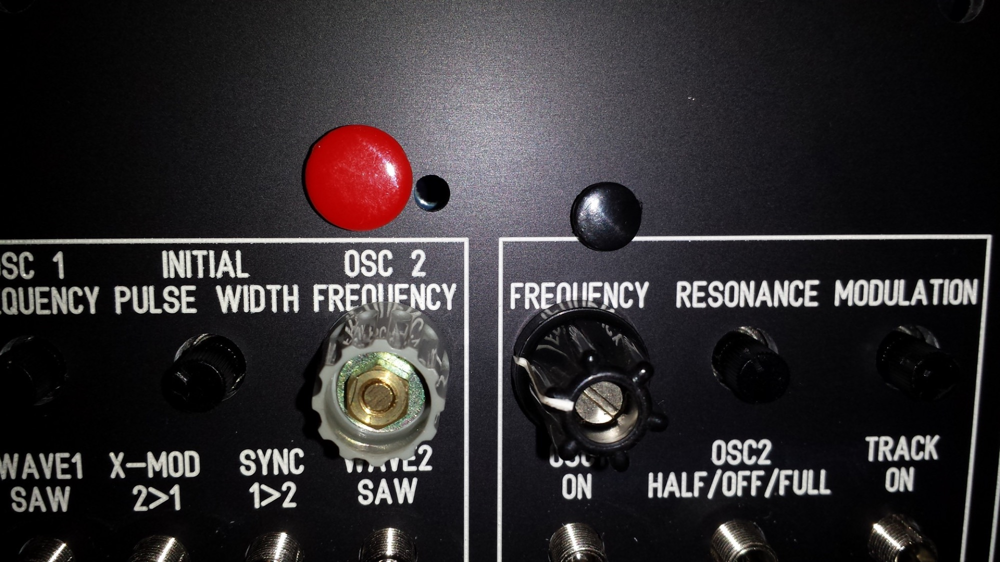

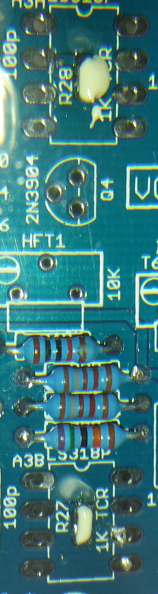

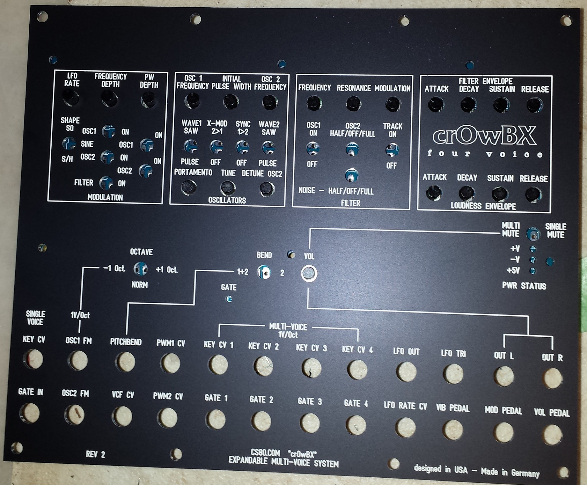

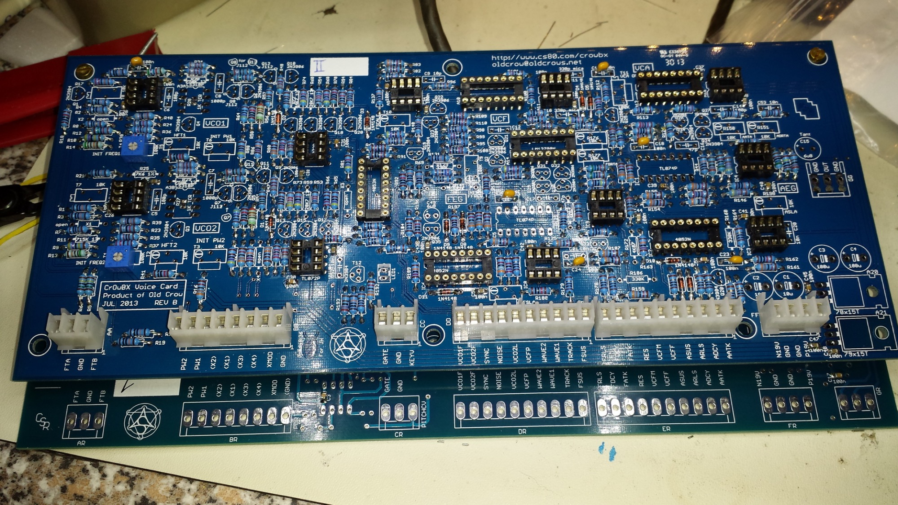

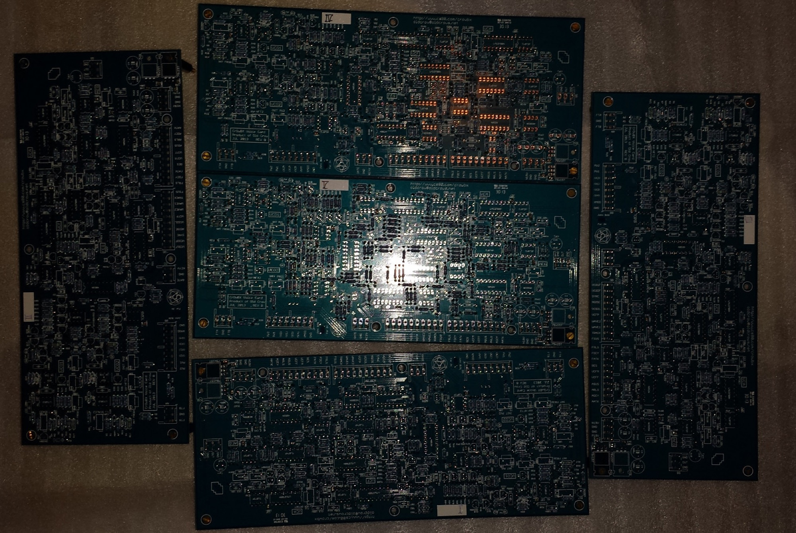

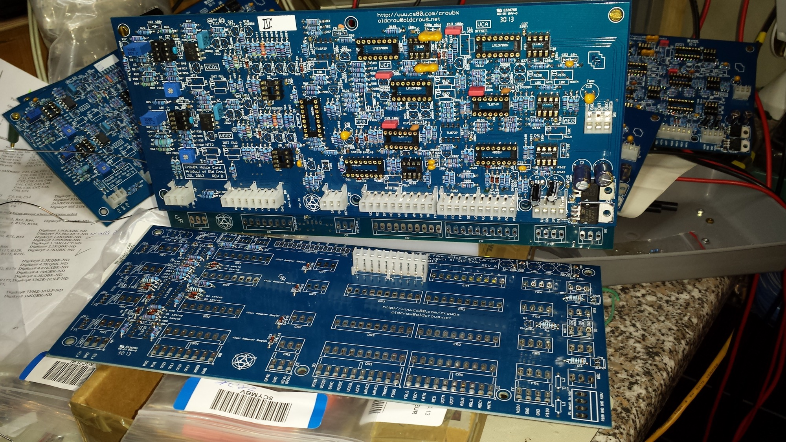

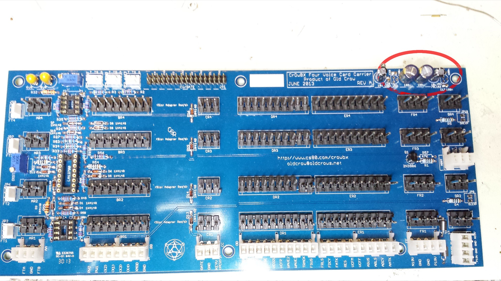

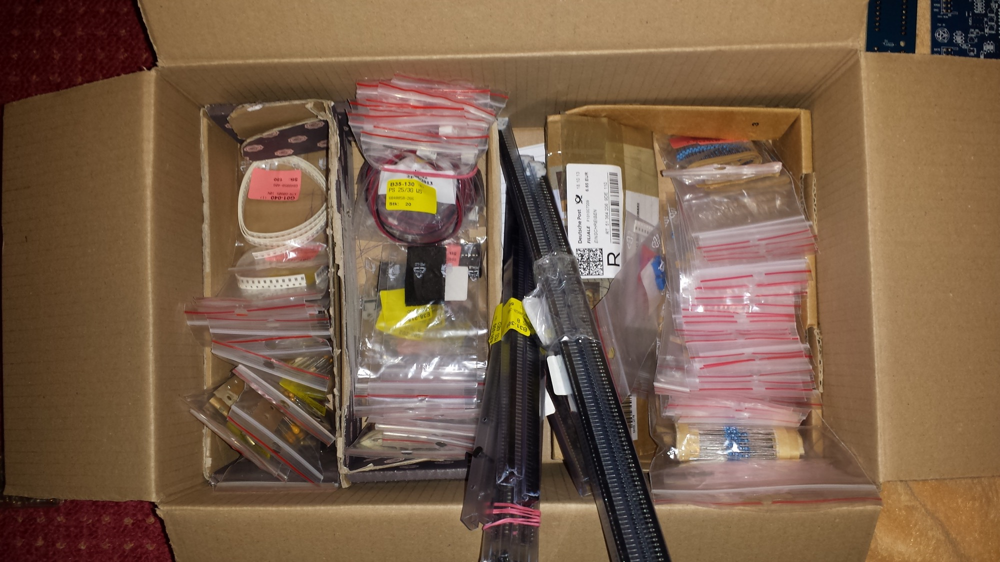

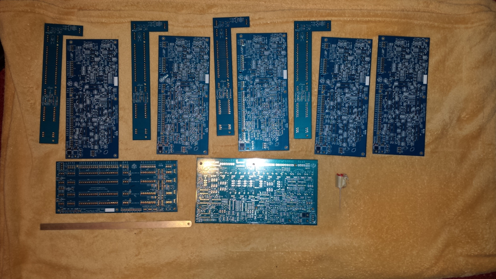

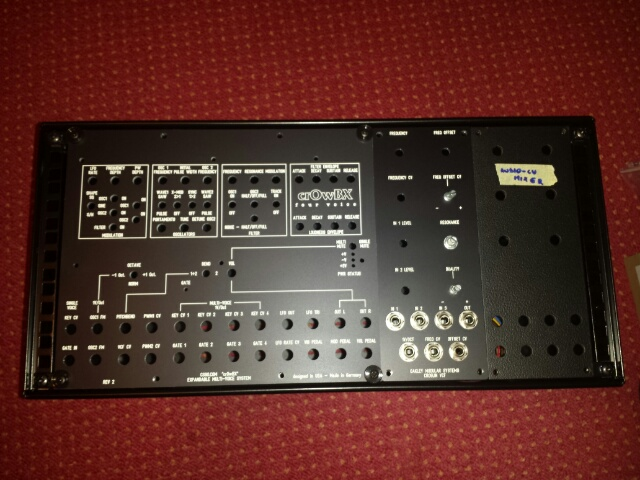

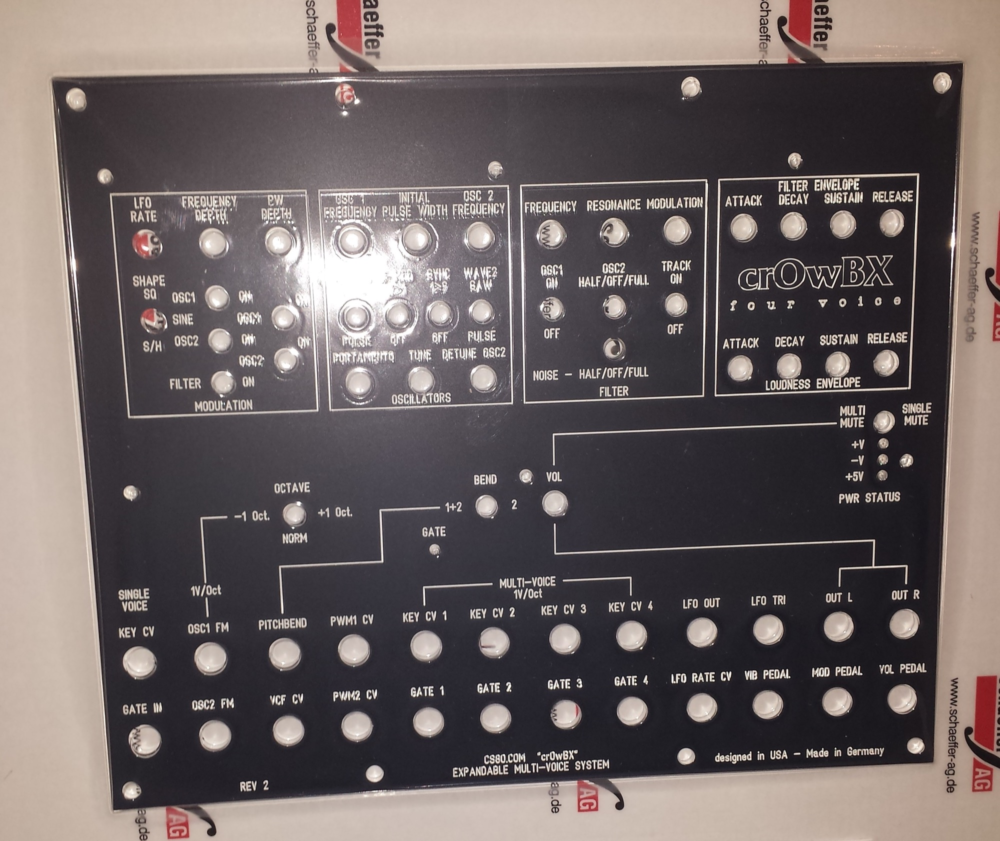
