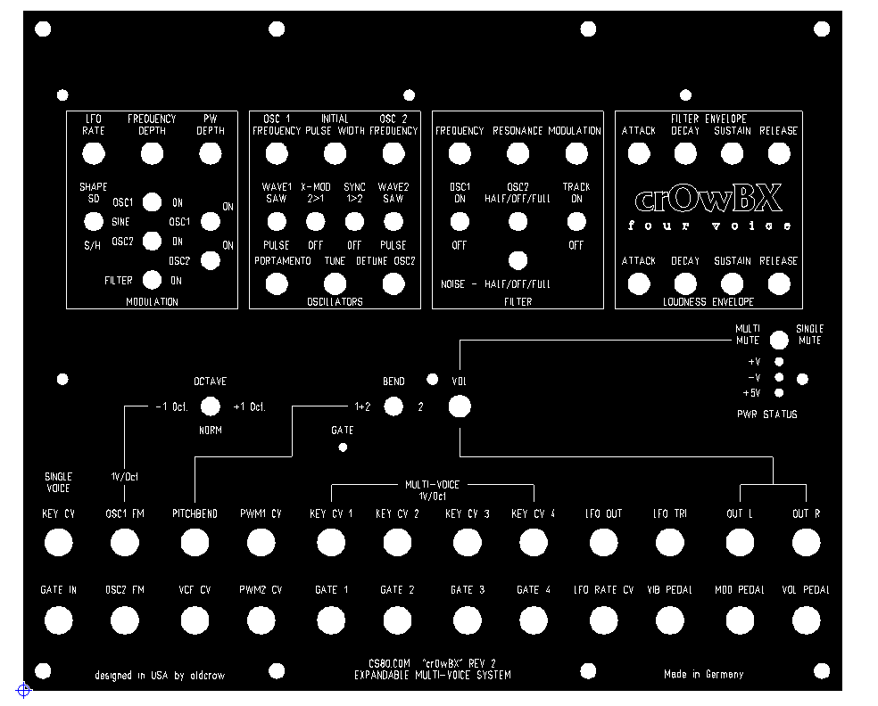
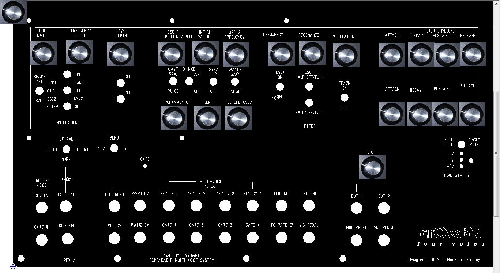
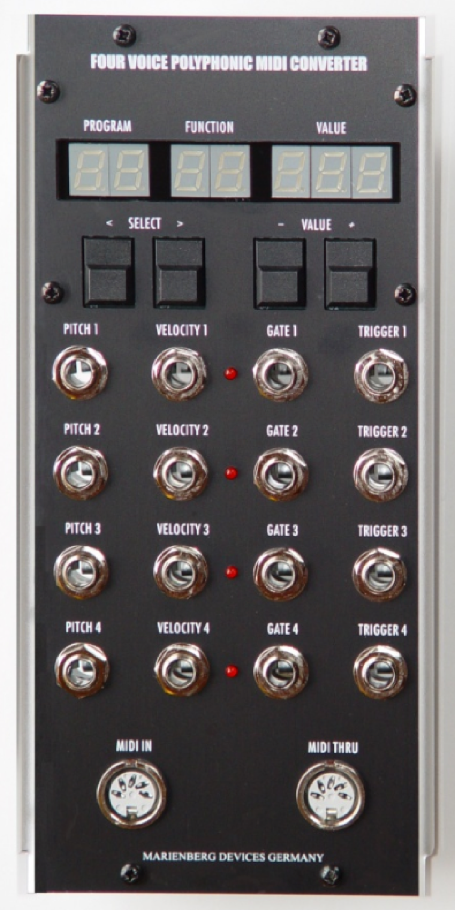
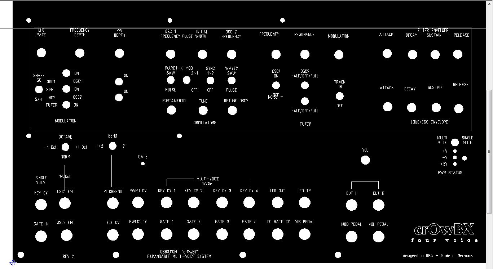

# OBX Frontpanel and Chassis  for OBX and Marienberg 4voice MIDI-CV

### Here is the Frontpanel file from oldcrow:

[crowbx\_hostpanel\_6ux5u\_rev2\_w\_logo\_161\_4cv4gate\_stereo.fpd](assets/crowbx_hostpanel_6ux5u_rev2_w_logo_161_4cv4gate_stereo.fpd) original

[crowbx\_hostpanel\_6ux5u\_rev2\_w\_logo\_161\_4cv4gate\_stereo\_layout.fpd](assets/crowbx_hostpanel_6ux5u_rev2_w_logo_161_4cv4gate_stereo_layout.fpd)    - Made in Germany

**Technical Info Panel:**

3mm Aluminium eloxiert

Höhe: 221,87mm

Breite: 266,70mm

450g

price :135,60€ original

price   136,08€ modified Panel (Made in Germany)

LED hole: 3,17mm

Jacks hole: 9,5mm  ✅



                         -**-&gt;  here modded &lt;--                                                                                                                                 --&gt; here modded &lt;--**



#### MIDI CV Marienberg 4voice polyphonic midi converter :

- Abmessungen (H x B x T): 222,25 x 101,60 x 38,00 mm
- Gewicht: 380 g

picture copy of [http://marienbergdevices.de/modular/uebersicht/midi-conv/](http://marienbergdevices.de/modular/uebersicht/midi-conv/)

```
(all picture rights by marienbergdevices)
```



## Chassis:

**Gehäuse/Chassis**

267mm  obx

102mm  marienberg

= 369mm

=370mm

19" Rack ist 48,26cm breit

**Proof of Concept:**

****
