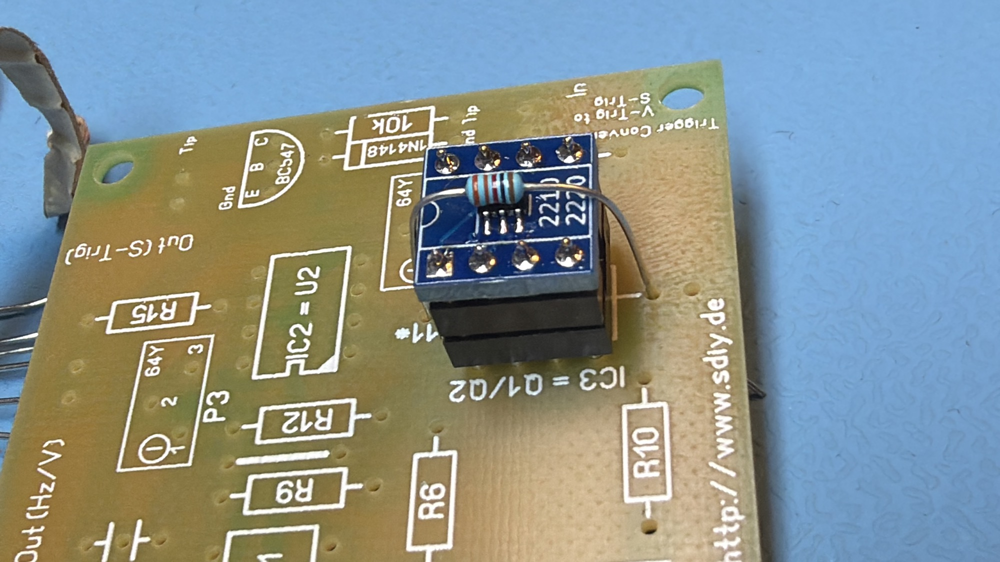
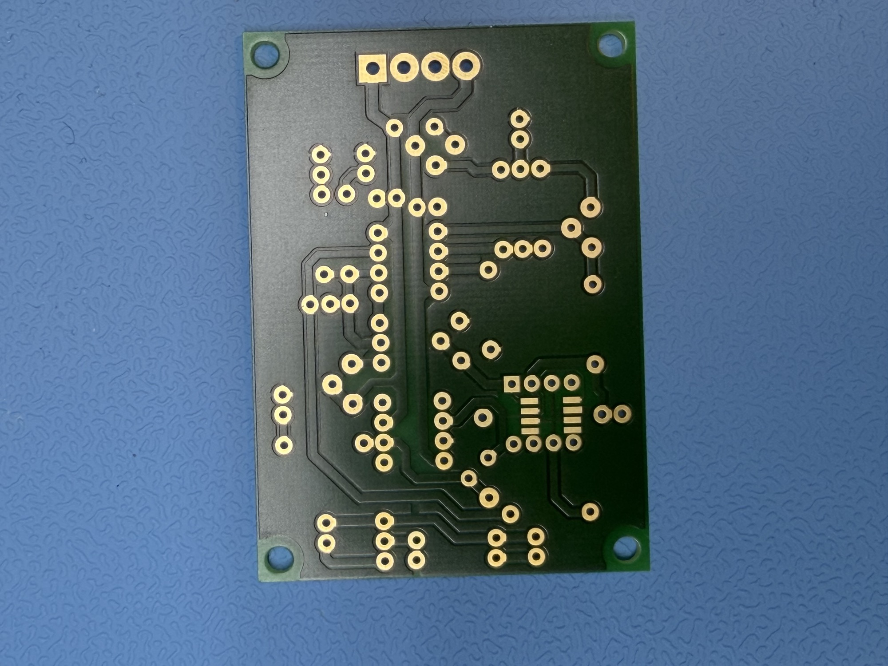
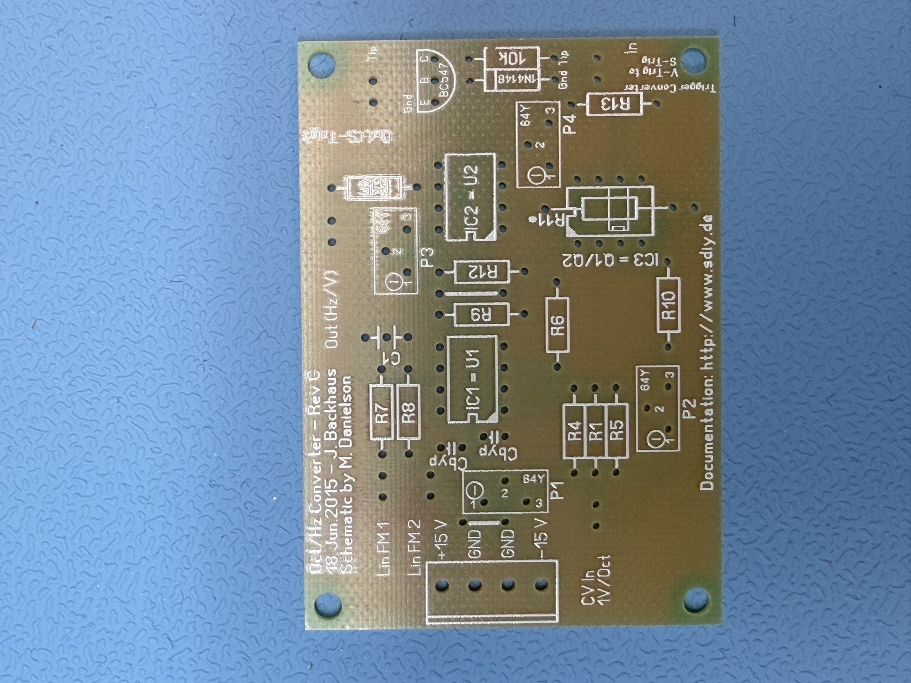

# oct hz converter

**Backup from DSL-man March2026**

**Letzte Änderung:** 17.12.2007
**Projektstatus:** Design-Phase
**Beschreibung:** Konverter von 1V/Oct zu Hz/V (z.B. Korg MS-Serie, Yamaha CS-Serie), inkl. V-Trig zu S-Trig-Converter (wird z.B. für den Korg MS-20 gebraucht).
**PDF-Dokumentation:** Noch nicht vorhanden!

Die Platine basiert auf einer [Schaltung von Magnus Danielson](https://web.archive.org/web/20080501083754/http://rubidium.dyndns.org/~magnus/synths/schematics/oct2hz.pdf). Zusätzlich wurde auf vielfachen Wunsch noch ein Trigger-Converter eingebaut, welcher den üblicheren Voltage-Trigger (bzw. Gate) in S-Trig (Kurzschlusstrigger, z.B. Micromoog oder Korg MS-Serie) umwandelt.

Bei Problemen oder Fragen bitte in einem der u.g. Quell-Threads posten bzw. erst einmal dort nachschauen!

**Aktuelles Layout:**

**Quellen:**

Quellthread im Synthesizerforum:
[http://www.sequencer.de/synthesizer/viewtopic.php?t=18099](https://web.archive.org/web/20080501083754/http://www.sequencer.de/synthesizer/viewtopic.php?t=18099)

(korrigiert: [https://www.sequencer.de/synthesizer/threads/oct-hz-konverter-platine-im-angebot.78188/](https://www.sequencer.de/synthesizer/threads/oct-hz-konverter-platine-im-angebot.78188/)

Seite von Magnus Danielson:
[http://rubidium.dyndns.org/~magnus/synths/schematics](https://web.archive.org/web/20080501083754/http://rubidium.dyndns.org/~magnus/synths/schematics)

**Schematic:**

[oct2hz.pdf](assets/oct2hz.pdf)

|   |
|---|
| The R14 resistor should be adapted to allow for correct Hz/V scale. |

Page export from wayback - from sequencer forum

[Oct2Hz Converter von Magnus Danielson @ Forum.Sequencer.de.pdf](assets/Oct2Hz-Converter-von-Magnus-Danielson-Forum.Sequencer.de.pdf)

info from Magnus Synth website:([https://web.archive.org/web/20081006225006/http://rubidium.dyndns.org/~magnus/synths/schematics/](https://web.archive.org/web/20081006225006/http://rubidium.dyndns.org/~magnus/synths/schematics/) )

## V/oct to Hz/V converter

This is really the ASM-1 VCO expo converter ripped out and put into use for conversion of V/oct CV voltages into Hz/V CV voltages. The R14 resistor should be adapted to allow for correct Hz/V scale.

Schematic is available:

- [ ] [original-magnus-schemataVOCT-HZ.pdf](assets/original-magnus-schemataVOCT-HZ.pdf)

BOM: Patricks best can do:

| **ID** |   |   |   |   |   |
|---|---|---|---|---|---|
| R1 | 100K | CV SUM | in1 |   |   |
| R2 | 100K | CV SUM | in2 |   |   |
| R3 | 100K | CV SUM | in3 |   |   |
| R4 | 100K | CV SUM |   |   |   |
| R5 | ~~100K~~ use 56K as described on bottom |   |   |   |   |
| R6 | 15K | Opamp to gnd |   |   |   |
| R7 | 560K | LIN FM in |   |   |   |
| R8 | 560K | LIN FM in2 |   |   |   |
| R9 | 390K | opamp to GND |   |   |   |
| R10 | 56K |   |   |   |   |
| R11 | 1K tempco | [DIYSYNTH.de](http://DIYSYNTH.de) | available in SMT and THT by DIYSYNTH.de |   |   |
| R12 | 150K |   |   |   |   |
| R13 | 10K |   |   |   |   |
| ~~R14~~ | ~~Trimmer instead of 680R~~ | look at  P4 |   |   |   |
| R15 | 1K | output pull.. |   |   |   |
|   |   |   |   |   |   |
| Q1-Q2 | MAT02 or SSM2210 | or just a matched pair of | BCM847 SMT dual |   |   |
| U1 | TL082 |   |   |   |   |
| U2 | OP07 |   |   |   |   |
| MTA156 | power in bipolar |   |   |   |   |
| P1 | 100k Trimmer | 64Y |   | Schemata = valid here the Source = Schemata |   |
| P2 | 50K trimmer | 64Y |   | Source is forum info from the developer |   |
| P3 | **optional** - **or**  use **jumper** the pins | Dein optionales Poti P3 erleichtert einem das: mit P1 und der Tonhöhen-Eingangspannung 0V am Ausgang von U1A einstellen. | Daher probiere ich hier auch mal einen 50K für P3, den ich beim Prototypen ausgelötet und mit einer Brücke ersetzt habe, weil er beim MS-10 keine Wirkung gezeigt hat |   |   |
| P4 | (was R14) 10K Trimmer | as described here: [https://www.sequencer.de/synthesizer/threads/oct-hz-konverter-platine-im-angebot.78188/](https://www.sequencer.de/synthesizer/threads/oct-hz-konverter-platine-im-angebot.78188/) | in a prototyp was the value 6K resistance |   |   |
| C Typ Cap | 100nF X7R |   |   |   |   |
|   |   |   |   |   |   |
| optional Trigger Converter |   |   |   |   |   |
| 1N4148 |   |   |   |   |   |
| BC547 |   |   |   |   |   |
| 10K resistor |   |   |   |   |   |

Quellen info:

Hatte inzwischen eine Prototypen-Platine geordert und dabei folgende Änderung gemacht, um die Platine mit meinem Korg MS-10 benutzen zu können:

- P3 ausgelötet und stattdessen eine Brücke eingelötet, der hat bei mir keine hörbaren Auswirkungen gehabt
- P4 mit einem 10K Trimmer ersetzt, vorher hatte ich 2K drin
- P2 mit einem 50K Trimmer statt 10K ersetzt, der 10K hatte mir zuwenig Auswirkung
- R5 mit 56K statt 100K ersetzt, sonst kam ich nicht an die Oktave ran (daran wäre ich fast verzweifelt bis ich einfach mal einen 82K rein gelötet hatte und damit schon näher an das gewünschte Ergebnis kam)

**comment from Forum:**

“Ich hab die Platine mittlerweile bestückt und eine Eurorack Frontplatte gebastelt (aus Platinenmaterial) mit Trig und CV Ein- und Ausgängen.
Hab den Abgleich nach Anleitung gemacht und... Es funktioniert! Kann meinen MS-20 oktavrein ansteuern.”

**Calibration:**

Hier noch ein Tipp zum Abgleich: Wenn ihr bei den Einstellungen zwischen P2 und P4 hin und her schraubt, nehmt einen chromatischen Tuner und monitort immer nur C1 und C4 (also genau die MS20 Tastatur). Wenn diese beiden Töne stimmen, stimmen auch die dazwischen. Über 3V wurde es dann haarig, C#4 stimmte noch, danach nix mehr.
Aber das ist eigentlich egal, wenn man in höhere Tonlagen will, kann man ja mit den Oktavwahlschaltern vom MS20 arbeiten.
Wenn man nur C1 und C2 kalibiriert, stimmt oberhalb von C2 auch nix mehr, je nach Stellung der 4 Trimpotis. Vielleicht geht es auch mit C1 und C5/C6, das hab ich aber nicht ausprobiert, weil mir der Bereich von 0-3V ausreicht.

