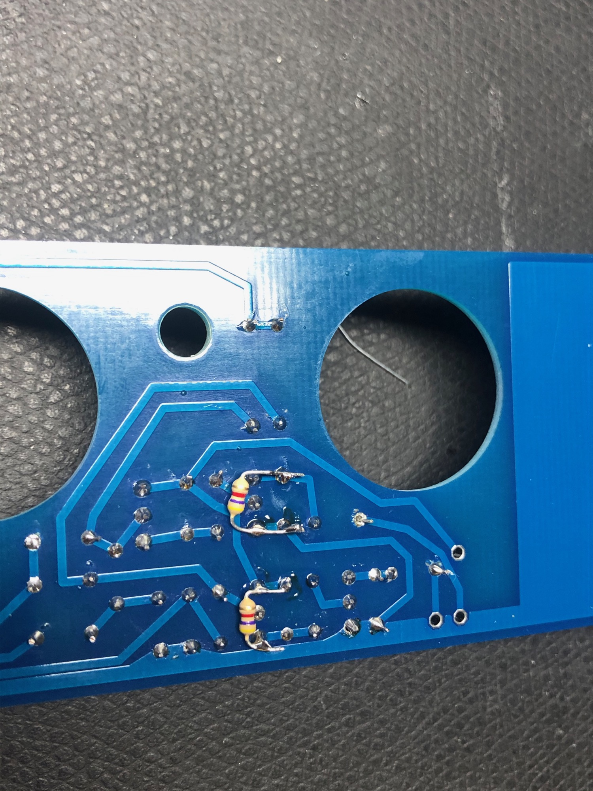

# RE-606

> **Project**
>
> ### Projecttitel: RE-606
>
> ### Status: `done`
>
> ### Startdate: 11/2019
>
> ### Duedate: 01/2020
>
> ### Manufacture link:[https://shop.re-303.com](https://www.google.com/url?sa=t&rct=j&q=&esrc=s&source=web&cd=10&cad=rja&uact=8&ved=2ahUKEwjjw4WVwNrlAhXGbFAKHY7oBtEQFjAJegQIARAB&url=https%3A%2F%2Fshop.re-303.com%2F&usg=AOvVaw1CpfjUym_Nbrh8hrhy4NMD)

**Build Guide:**

[RE-606 Alpha build doc.pdf](assets/RE-606-Alpha-build-doc.pdf)

**BOM:**

[RE606\_BOM\_191022.xlsx](assets/RE606_BOM_191022.xlsx) (First version)

[RE606\_BOM.v1.3.2-RLS.xlsx](assets/RE606_BOM.v1.3.2-RLS.xlsx) (latest version with mouser part numbers)

Cases are bought by kumptronics

CPU was from pixie (included in the RE-606 pcb order) 

### mouser card: (not approved from me)

[https://www.mouser.com/ProjectManager/ProjectDetail.aspx?AccessID=040a0cbc](https://www.mouser.com/ProjectManager/ProjectDetail.aspx?AccessID=040a0cbc17)

add the tactile:  688-SKQEAA 

(wrong here is the 22pF capacitor !!

also the 0.47UF is wrong - its bipolar in the mouser Bom instead of polar ) 

another mouser card is available:

[https://www.mouser.com/ProjectManager/ProjectDetail.aspx?AccessID=d17c935ded](https://www.mouser.com/ProjectManager/ProjectDetail.aspx?AccessID=d17c935ded)

[http://23.235.199.139/~re303c5/forum/topic/1276-some-hints-from-building-my-re-606/](http://23.235.199.139/~re303c5/forum/topic/1276-some-hints-from-building-my-re-606/)

- Mainboard
  - CR97 -&gt; R97(4k7) and use C110 (1NF parallel)
- Tom board:
  - CR305 -&gt;  R305 (4K7) and use C329 (1nf parallel)
  - CR308 -&gt; R308 (4K/) and use C330 (1nF parallel)

- The jumper wire strip from the alpha BOM was slightly too short, looks like it was updated in the latest BOM to 3 inch, but I would recommend maybe even getting the 4inch instead of 3inch :
  - 571-FSN-23A-8 (Mouser)
- The scale switch - while this is by no means correct, this will work - just need to wire it to the board, and its quite small compared to the hole in the cases etc
  - 611-SS-24E06-TG5P (Mouser)

## **BOM help:**

Fuse Resistor 2.7ohm = R237 in PSU:

Mouser:  [PR02FS0202708KR500](https://www.mouser.de/ProductDetail/Vishay-BC-Components/PR02FS0202708KR500?qs=sGAEpiMZZMukHu%252BjC5l7YTsZ6FFV73ccjL0tLC4mSzk%3D)

TME: [NFR1W-2R7](https://www.tme.eu/de/en/details/nfr1w-2r7/fusible-resistors/royal-ohm/frn01wk027ja10/)

## **Tipps:**

in case you dont have the SCALE Switch and want test the RE606 with a Workaround (Bridge Pins instead of a Switch)

, you have to Bridge the switchchassis holes with a cable at the outer mounting holes (same in Re303 ) - otherwise the GND pads/traces of the Instruments  are not connected 

Discussion about the Scale switch:  [http://23.235.199.139/~re303c5/forum/topic/514-unobtainium-re606-pre-scale-switch/?tab=comments#comment-12104](http://23.235.199.139/~re303c5/forum/topic/514-unobtainium-re606-pre-scale-switch/?tab=comments#comment-12104)

Install CR97 (1nF) and R106 from the bottom side otherwise the Mode Switch will not fit.

BU -battery   Wire port 28 (not sure what to expect here but I measured somewhere around 6VDC iirc)
6VDC    Wire port 30
15VDC    Wire port 33
5VDC    Wire port 34

## **Issues:**

**Issue 1: (see service notes from Roland to check the correct layout)**

please respect on the switchboard D404 is in wrong orientation, as described in the BOM

**Issue2:**

On the switchboard are the capacitor designators wrong labeled !!

C1 = C401  1uF/50V Electrolyte polar

C2= C402 10uF/50V Electrolyte polar

C3= C403 100uF/16V electrolyte polar

## **CPU update/firmware/bootloader**

in case you want upgrade the firmware, you have to update the bootloader.

I´dont give support about the update processes since I bricked my CPU while updating it and ended in a installation of an original CPU 

**[https://github.com/sunflowr/recpu/releases](https://github.com/sunflowr/recpu/releases)**

**1.4.3 Version:**

bootloader:  [bootloader.1.4.3.syx](https://github.com/sunflowr/recpu/releases/download/v1.4.3/bootloader.1.4.3.syx)

REEMU [reemu.1.4.3.syx](https://github.com/sunflowr/recpu/releases/download/v1.4.3/reemu.1.4.3.syx)

1.30: don't use it (buggy)

**1.20 Version**

bootloader: [bootloader.syx](https://github.com/sunflowr/recpu/releases/download/v1.2.0/bootloader.syx)

REEMU: [reemu.syx](https://github.com/sunflowr/recpu/releases/download/v1.2.0/reemu.syx)
