# RE-909 TR-909 replica

> **Project**
>
> ### Projecttitel: RE-909
>
> ### Status: `finished`
>
> ### Startdate: 10/2020
>
> ### Duedate: 02/2022
>
> ### Updated: May 2026
>
> ### Manufacture link: [https://shop.re-303.com/build-it-2/](https://shop.re-303.com/build-it-2/)
>
> **Forum:** [http://23.235.199.139/~re303c5/forum/forum/11-re-909/](http://23.235.199.139/~re303c5/forum/forum/11-re-909/)
>
> **Shop:** [https://shop.re-303.com](https://shop.re-303.com)
>
> **Facebook Group:**[**https://www.facebook.com/groups/1657521224406039**](https://www.facebook.com/groups/1657521224406039)

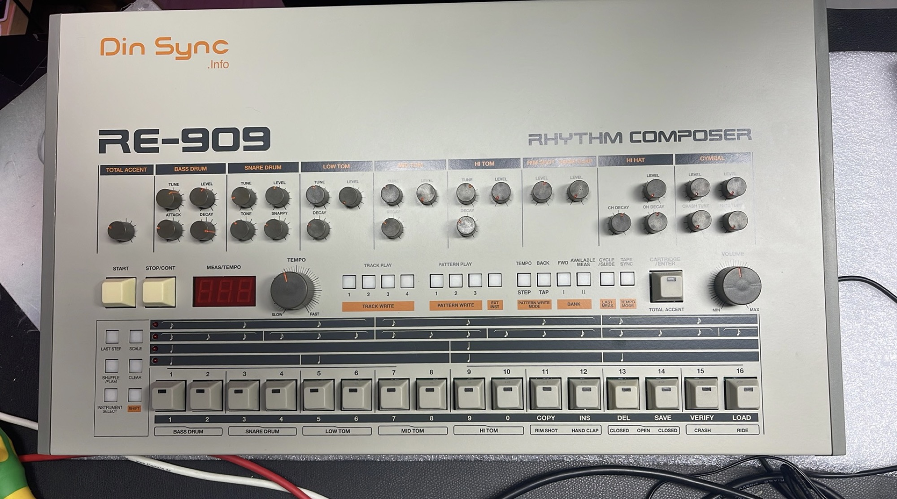

## **It´s a replica - not just another clone**

Tabelle of content:

## **Schematics and Service Notes:**

[Roland-tr-909-service-notes.pdf](assets/Roland-tr-909-service-notes.pdf)

**a great way to save patterns:**

[https://sites.google.com/ddv.com/ddv-909-librarian](https://sites.google.com/ddv.com/ddv-909-librarian)

**RE-909 Rev1 (until 2022)**

**a rev2 PCB was released and fixed some Issues (marked in my list as affected version)**

### **Buildguide and BOM for Rev1**

[RE\_909\_BOM-BUILDGUIDE\_v1.15.xlsx](assets/RE_909_BOM-BUILDGUIDE_v1.15.xlsx)

[RE\_909\_BUILD\_ONLY\_v1.15.pdf](assets/RE_909_BUILD_ONLY_v1.15.pdf)

[https://shop.re-303.com/build-it-2/](https://shop.re-303.com/build-it-2/)

**just a note:** i offer BA662 too with AS662D adapter pcbs, assembled or just the PCB, which is a great solution.

[https://www.diysynth.de/advanced\_search\_result.php?categories\_id=0&keywords=ba662&inc\_subcat=1](https://www.diysynth.de/advanced_search_result.php?categories_id=0&keywords=ba662&inc_subcat=1)

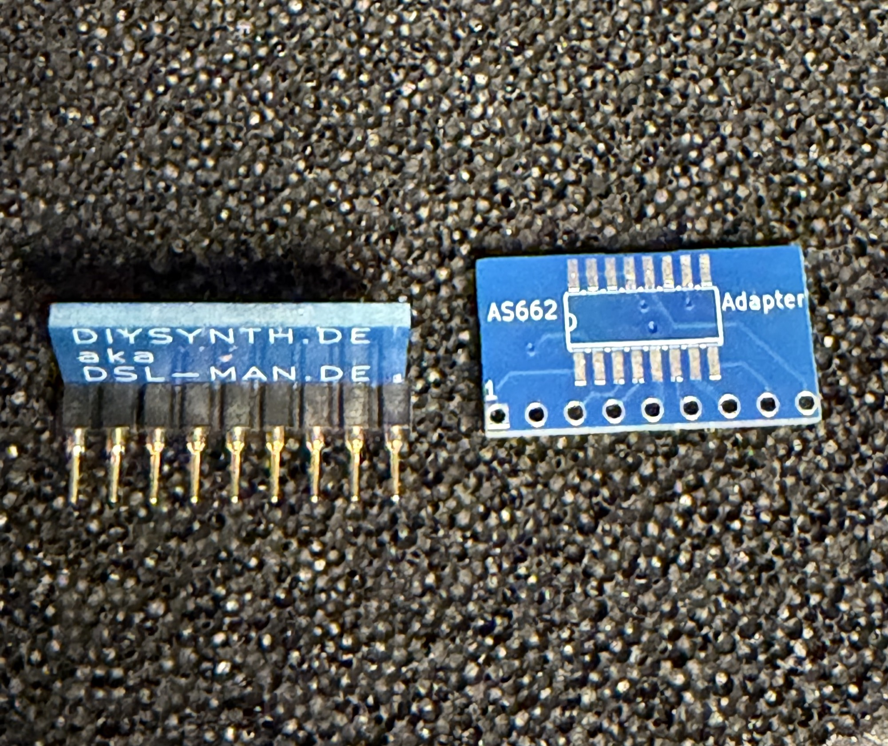

> **Hinweis**
>
> ### Important
>
> **the Powerswitch isn't listed in the BOM**
>
> for the 18V AC to DC PsU you can use a simple Switch.. 
>
> but in case of 110V/230V look for the power rating of the switch and choose a dual switch for the best safety reason and law/regulation of your country.
>
> **Examples:**
>
> this is perfect for all versions, since its a dual switch, which can switch the Neutral (N) and hot phase (P). (there's no power at the transformer, except from loaded capacitors)
>
> TME:   [https://www.tme.eu/de/details/ae-h8550vbaaa/wippschalter/bulgin/h8550vbbb/](https://www.tme.eu/de/details/ae-h8550vbaaa/wippschalter/bulgin/h8550vbbb/)
> AE-H8550VBAAA
> ROCKER;DPST;Pos:2;OFF-ON;10A/250VAC;10A/28VDC;schwarz;Fehlen ROHS Hersteller: BULGIN Herstellersymbol: H8550VBBB
>
> this is fine for the 18VAC PSU version, (since only one "cable" is switched off, there's still a risk of electrical shock while handling inside of the device)
>
> [https://www.jameco.com/webapp/wcs/stores/servlet/ProductDisplay?langId=-1&storeId=10001&catalogId=10001&productId=316014&fbclid=IwAR3eBNWFunWWnC9nXapqT4MFARphM5AuymBAA4ExlHPnNnFjo\_SpSawvCtU](https://www.jameco.com/webapp/wcs/stores/servlet/ProductDisplay?langId=-1&storeId=10001&catalogId=10001&productId=316014&fbclid=IwAR3eBNWFunWWnC9nXapqT4MFARphM5AuymBAA4ExlHPnNnFjo_SpSawvCtU)

## Links to the original files:

[Christians Illustrated build guide part 1 ENGLISH](http://privat.bahnhof.se/wb447909/dinsync/re-303/files/RE-909_build_guide_part1_EN.pdf)   PSU

[Christians Illustrated build guide part 2 ENGLISH](http://privat.bahnhof.se/wb447909/dinsync/re-303/files/RE-909_build_guide_part2_sequencer_EN.pdf) Sequencer

[Christians Illustrated build guide part 3 ENGLISH](http://privat.bahnhof.se/wb447909/dinsync/re-303/files/RE-909_build_guide_part3_voiceboard_EN.pdf) Mainboard

[Christians Illustrated build guide RE-909\_parts\_orientation\_and\_tips\_ENGLISH](http://privat.bahnhof.se/wb447909/dinsync/re-303/files/RE-909_parts_orientation_and_tips_EN.pdf)

[Christians Illustrated build guide part 1 GERMAN](http://privat.bahnhof.se/wb447909/dinsync/re-303/files/RE-909_build_guide_part1_DE.pdf)

[Christians Illustrated build guide part 2 GERMAN](http://privat.bahnhof.se/wb447909/dinsync/re-303/files/RE-909_build_guide_part2_sequenzer_DE.pdf)

[Christians Illustrated build guide part 3 GERMAN](http://privat.bahnhof.se/wb447909/dinsync/re-303/files/RE-909_build_guide_part3_voiceboard_DE.pdf)

[Christians Illustrated build guide RE-909\_parts\_orientation\_and\_tips\_GERMAN](http://privat.bahnhof.se/wb447909/dinsync/re-303/files/RE-909_parts_orientation_and_tips_DE.pdf)

## **Service advisory info for rev1 and 2:**

[RE909AdditionalAdvisory1c.pdf](assets/RE909AdditionalAdvisory1c.pdf)

## **Addional Buildguide and BOM for rev2.**

**also add the power switch as listed above in the "important note"**

[rev2\_service\_advisory\_jan23.pdf](assets/rev2_service_advisory_jan23.pdf)

[How\_to\_build\_the\_RE-909\_Safety\_PSU\_(EN).pdf](assets/How_to_build_the_RE-909_Safety_PSU_-EN.pdf)

[RE-909\_build\_guide\_Rev2\_sequenzer\_EN.pdf](assets/RE-909_build_guide_Rev2_sequenzer_EN.pdf)

[A\_summary\_of\_the\_changes\_to\_the\_RE-909\_PCBs\_(EN).pdf](assets/A_summary_of_the_changes_to_the_RE-909_PCBs_-EN.pdf)

links to the original files:
[How\_to\_build\_the\_RE-909\_Safety\_PSU\_(DE).pdf](https://shop.re-303.com/files/files/How_to_build_the_RE-909_Safety_PSU_(DE).pdf)
[How\_to\_build\_the\_RE-909\_Safety\_PSU\_(EN).pdf](https://shop.re-303.com/files/files/How_to_build_the_RE-909_Safety_PSU_(EN).pdf)
[A\_summary\_of\_the\_changes\_to\_the\_RE-909\_PCBs\_(DE).pdf](https://shop.re-303.com/files/files/A_summary_of_the_changes_to_the_RE-909_PCBs_(DE).pdf)
[A\_summary\_of\_the\_changes\_to\_the\_RE-909\_PCBs\_(EN).pdf](https://shop.re-303.com/files/files/A_summary_of_the_changes_to_the_RE-909_PCBs_(EN).pdf)
[RE-909\_build\_guide\_Rev2\_sequenzer\_DE.pdf](https://shop.re-303.com/files/files/RE-909_build_guide_Rev2_sequenzer_DE.pdf)

[RE-909\_build\_guide\_Rev2\_sequenzer\_EN.pdf](https://shop.re-303.com/files/files/RE-909_build_guide_Rev2_sequenzer_EN.pdf)

## **Case Assembly for Rev1 and 2:**

[RE-909 case assembly guide (DE).pdf](assets/RE-909-case-assembly-guide-DE.pdf)

[RE-909 case assembly guide (EN).pd](assets/RE-909-case-assembly-guide-EN.pdf)f

[Installing the 909 Cartridge Reader.pdf](assets/Installing-the-909-Cartridge-Reader.pdf)

## Transformer PSU BOM Info

**new**: RE909 Transformer psu  (not for DC PSU) :[RE-909\_Transformer\_PSU\_BOM\_MOUSER.pdf](assets/RE-909_Transformer_PSU_BOM_MOUSER.pdf)

R701-R704 =10K

R705 =1K

C701 =4.7uF/25V (better 35V/50V) 

Q701/Q702 = Sc945 - make sure to have HFE of minimum 280 (better more)

Zener Diode: use 1% as in above RE-909 transformer mouser BOM

**FUSE**:  T315mA by 220-230V  and 1A by 100-110V

use a IEC with 3 pins and connect a wire earth to the chassis

for Europe  use the 240V bridge on the PSU- PCB

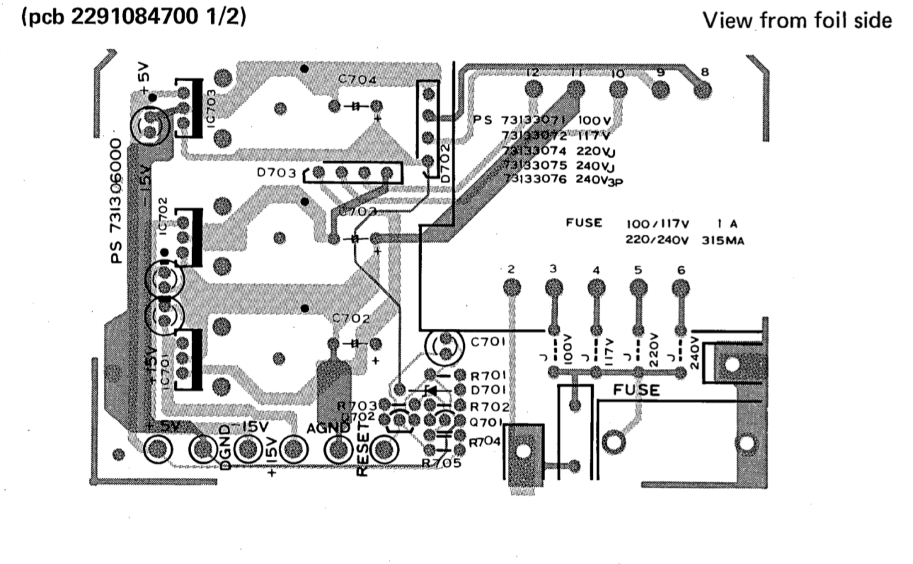

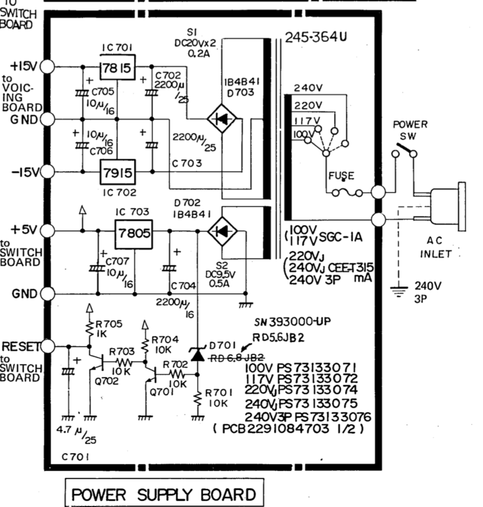

## Known Issues

| **ID** | **Issue** | **AFFECTED Version** | **Fix** | **date** | **fixed version** |
|---|---|---|---|---|---|
| 1 | Snare Drum section - | Revision.1 | please download v.1.7 build documentation for details. Service advisory: after building the snare you must place a jumper as shown in the pic below, this is shown without parts placed for clarify 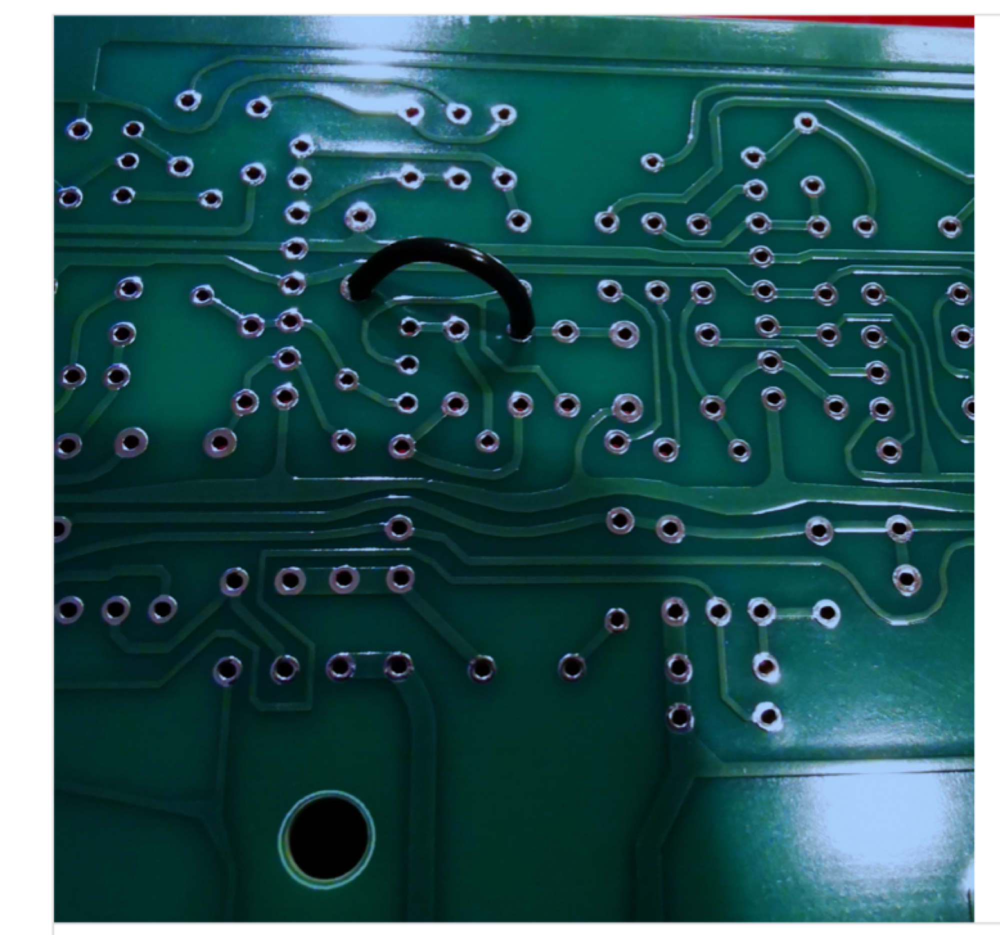 bigger picture from me - easier to find the place.. 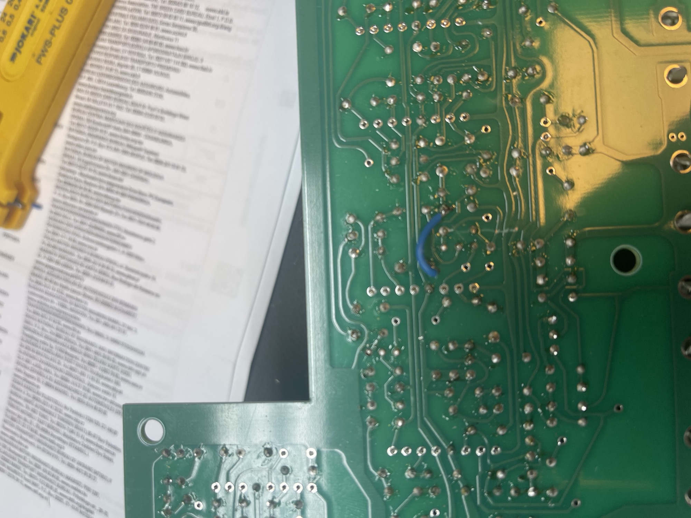 | 17.Dec.2020 | 1.9 build guide |
| 2 | C95/c97 Tom section | Rev.1 | swap both against each other | 17 Dec. 2020 | 1.9 buid guide |
| 3 | Psu | REv.1 | if you‘re using the Safety PSU do not connect pin 27 and pin 28 on the F3 cable, otherwise you‘ll create a ground loop. | 17.dec. 2020 | 1.9 build guide |
| 4 | PSU - wrong routing → affects the memory | Rev1 | change the 5.6V zener as shown here: 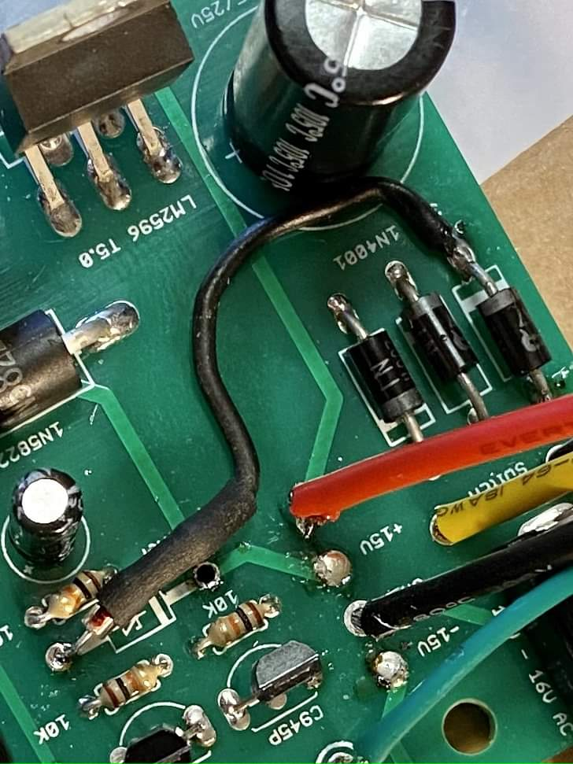 | 17.Dec. 2020 | - - - - - not released - not Confirmed |
| 5 | Noise floor - crosstalk | REV.1 | from FB RE-909 group: "Hello! Just wanted to share some good news about noise and crosstalk issues on RE-909. Pictured below is a Roland TR-909 factory mod with a wire that seems to reinforce grounding between C151 styrofoam cap in the hihat low pass filter and the common analog ground track where R236 is also attached. By doing the same mod in RE-909, pictured below also in the bottom of the board, cymbals crosstalk and digital noise leak into the hihats channel is eliminated, which fixes the last remaining issue in my build. I used a thick grounding wire to connect the lower pin of C151 to the double hole in the common ground track next to R236. This fix works perfectly on traffo PSU but I can’t guarantee it works on safe PSU (and preliminary tests show it doesn’t) because of the difference in ground routing. Otherwise, enjoy your digital noise-free, crosstalk-free RE-909!" 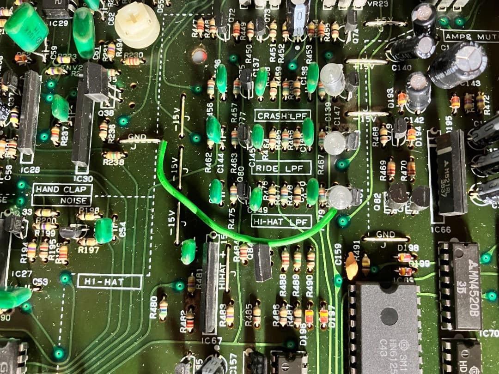 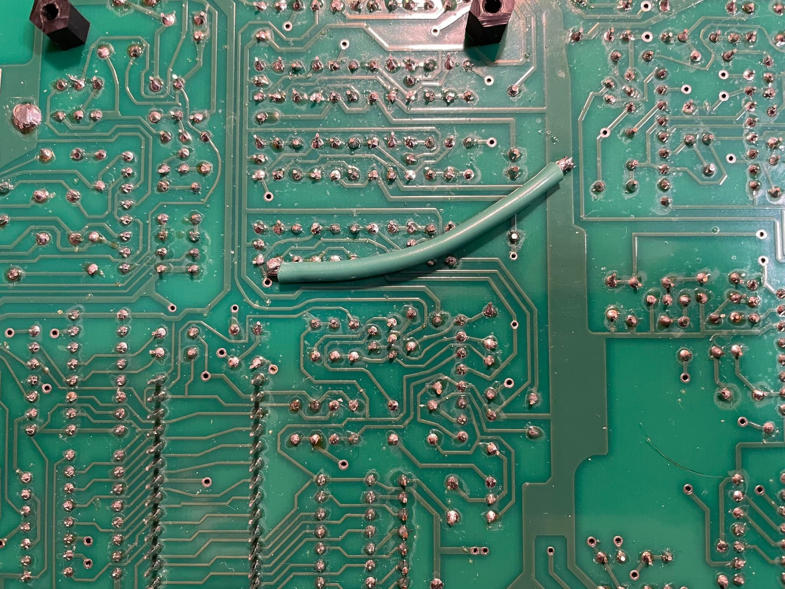 |   |   |
| 6 | Gate | rev1-2 | in case you hear the Gate signal of the SD in BD - you can try to connect a 1uF polar cap\*\*  between GND and Trigger.  Measure with a scope to find the best value - maybe 470/680/820nF is fine too - or less. | 15.may 2022 | was posted in the RE-909 FB group on 10. may 2022 not tested by me, but confirmed by other people |
| 7 | MIDI BUG | rev.1 and 2 | there's a failure in MIDI section [rev2\_service\_advisory\_jan23.pdf](assets/rev2_service_advisory_jan23.pdf) [rev2\_service\_advisory\_jan23.pdf](assets/rev2_service_advisory_jan23.pdf) |   |   |
| 8 | Noise MOD | rev.1 | **only for rev.1 pcbs:** as described in the rev.2 guide, is there a extra trimmer for  the noise, for rev.1 pcbs you should be able to cut a trace between 2 resistors and install a trimmer 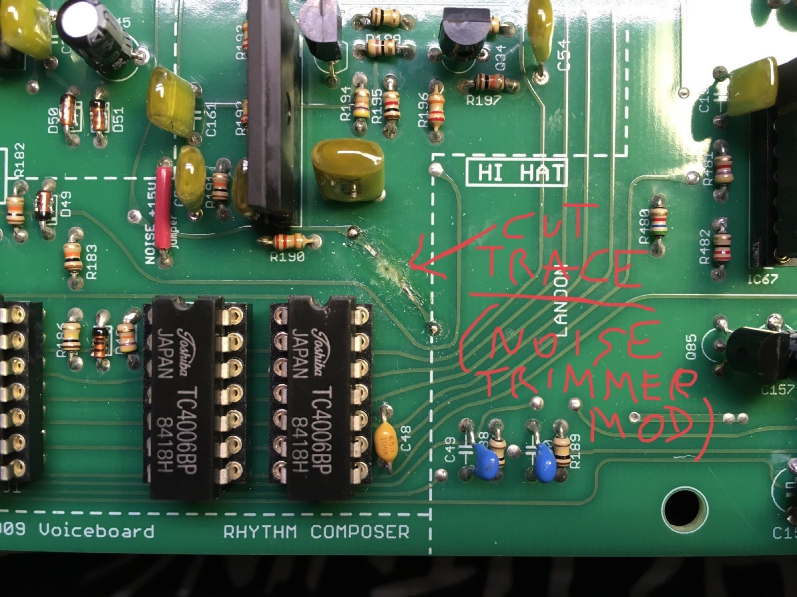 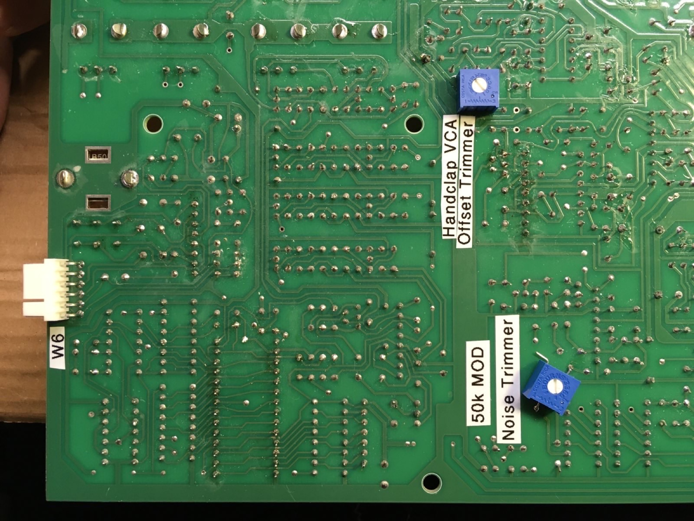 |   |   |
| 9 | jack IO | rev1 | only needed in rev.1 (rev2 still has this fix) 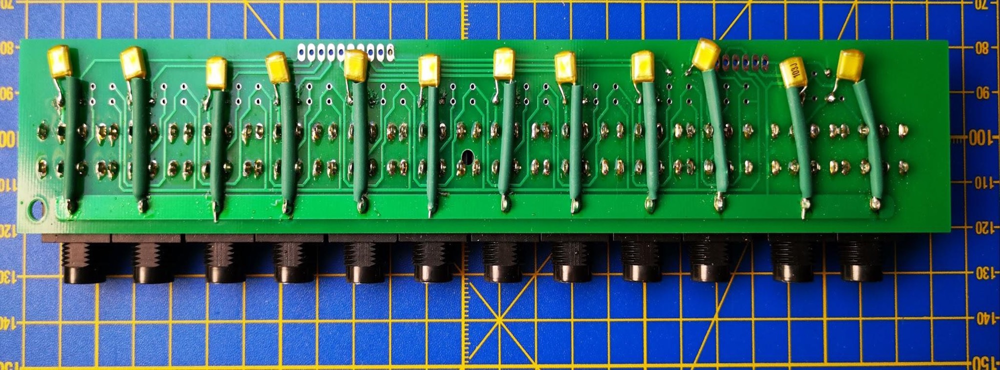 | 2022 | rev.2 |

## **Tips:**

| **ID** | **Focus** | **Info** |
|---|---|---|
| 1 | Wiring | You can use the MTA100 system from TE connectivity for example or Molex Style Connectors with a pitch of 2.54mm |
| 2 | noisy/hiss | make sure to solder the potentiometer at all pins to have the correct ground - (the ground flow thru the outside pins / it act like a trace/bridge) |
| 3 | MIDI OUT | measure the transistor HFE value for the switchboard Q604 - a gain of 350 should be fine. otherwise it can happen that MIDI OUT doesn't work. you can also mod the MIDI Out : [http://www.colinfraser.com/tr909/909mods/909midi.htm](http://www.colinfraser.com/tr909/909mods/909midi.htm) |
| 4 | Transistor matching for gainstaging It´s not important to match this trannys. it was very often discussed in the Facebook RE-909 group. | select the \* S\* Transistors to the same HFE to get a balanced gain on all voices it's a deprecated Info, i leave this info here, because you should not mix reichelt transistors with ols stock.. bevazse the reichelt transistors has a hfe of 430 and the old stock only 280 or 320, which can be give a too different gain of the voice outputs. check the schematics for more details, all are 603/945P Transistors q12 in Bassdrum Q51 in Snaredrum q20 in Low Tom q27 in Mid Tom q58 in High Tom Q71 in Crash Q85 in HH Q65 in Rimshot Q37 in Handclap Q33 Tom Noise - should be ignored or just use the same hfe as above |
| 5.1 | Snare sound | **Q50 must be on a socket** - it´s for the “VCA Mix”, the balance of noise and OSCs, in case your Snare have too much “ringing” you should try a other transistor HFE value here. |
| 6 | DAC assembly | use few millimeters height paper to get a correct alignment: 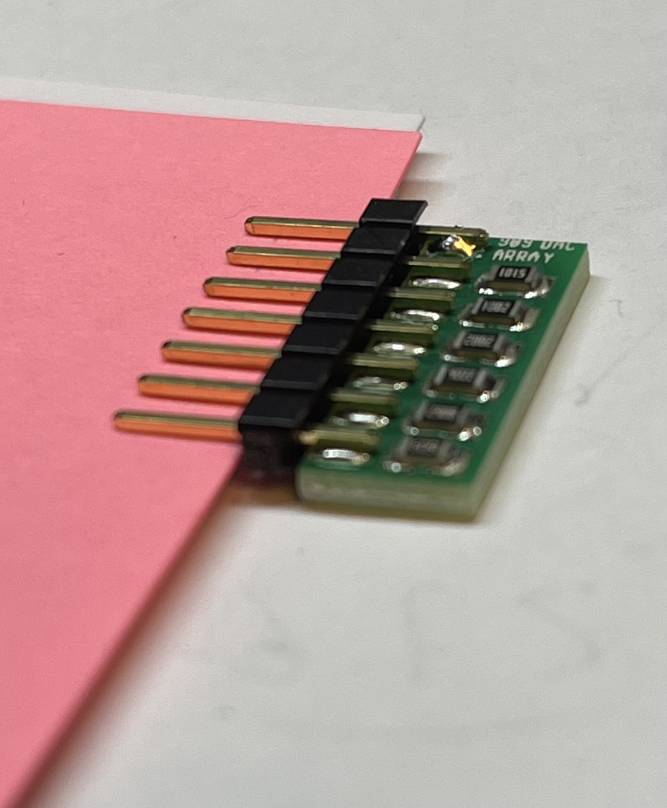 |
| 6 | mod | [https://note.com/re\_303/n/nd37b0d0ab809](https://note.com/re_303/n/nd37b0d0ab809) ["RE-909 MOD KIT" Build Guide｜Jun.pdf](assets/RE-909-MOD-KIT-Build-Guide-Jun.pdf) 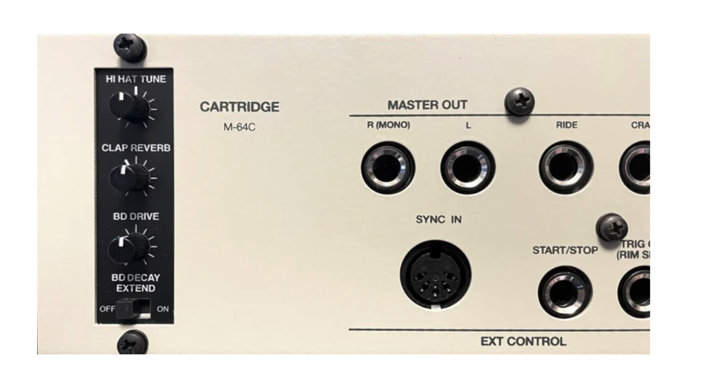 |
| 7 | Tape Interface Section | the Tape Interface Section isn't required to build |
| 8 | Ba662 clone orientation | the ba662clone component side is at C58 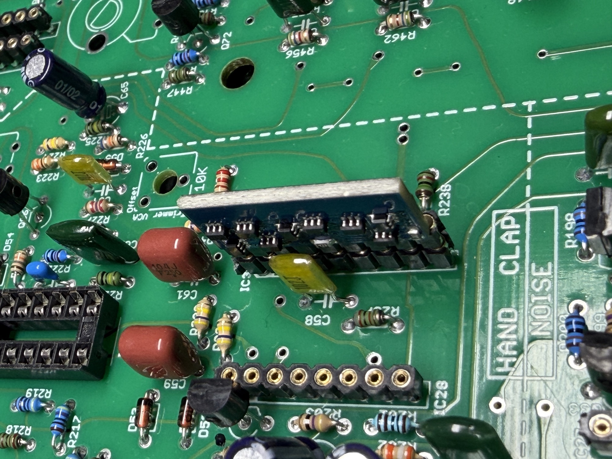 |
| 9 | Q47 Q48 orientation of ZTX1051A | 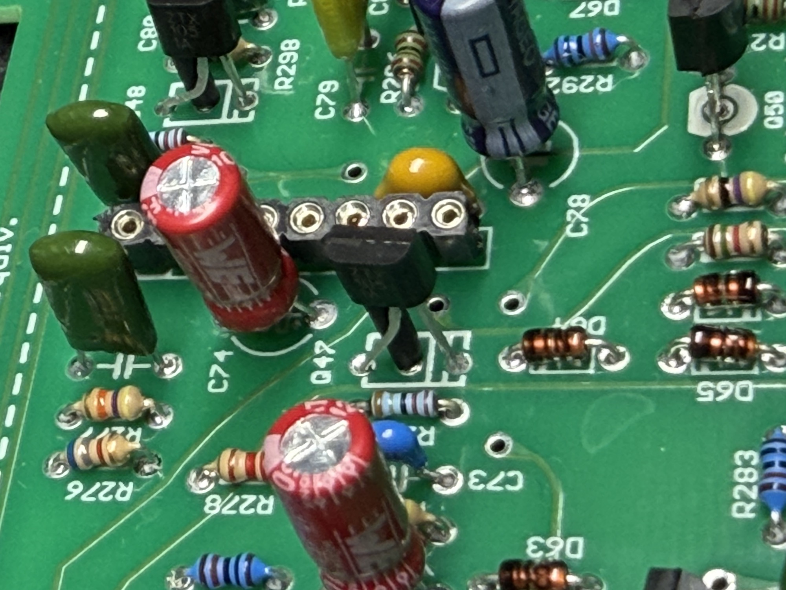 |
| 10 | Q82 Q83 orientation | 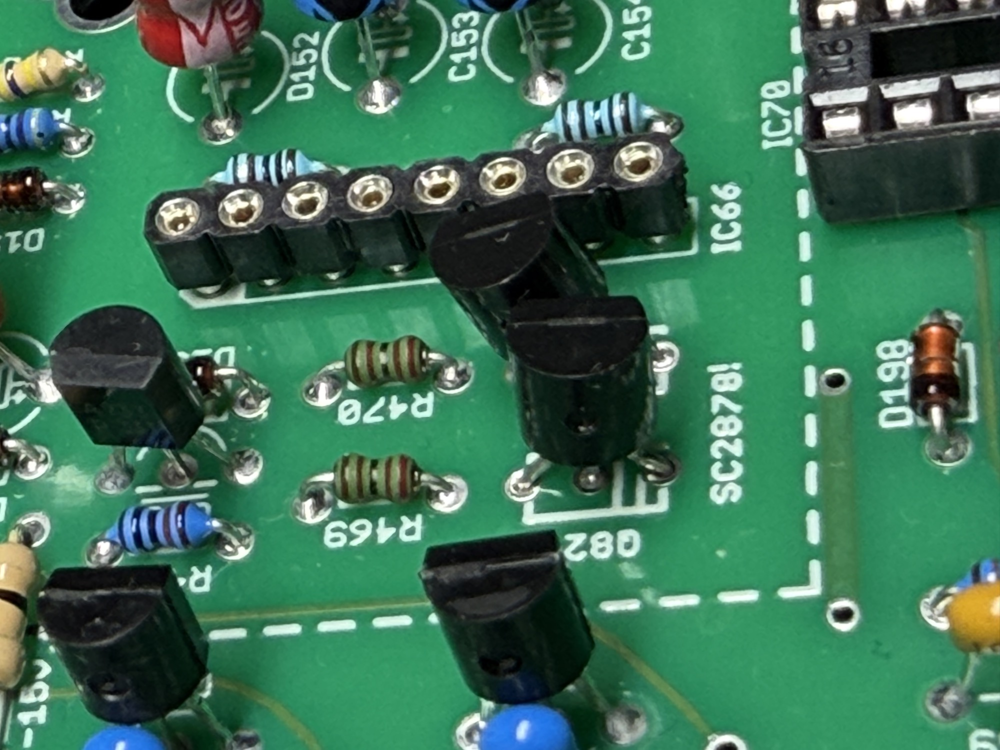 |
| 11 | BA662 technology | MODE B Configuration is used in the 909 Pin 4+7 = GND PIN 5 =  -15V Pin 9 =   +15V |
| 12 | parts | low profile dual pin header for Switchboard and Eproms Crash and Ride (not Hihat) DS1004-1X40F11 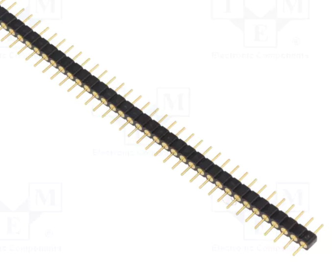 |
| 13 | **green** modding 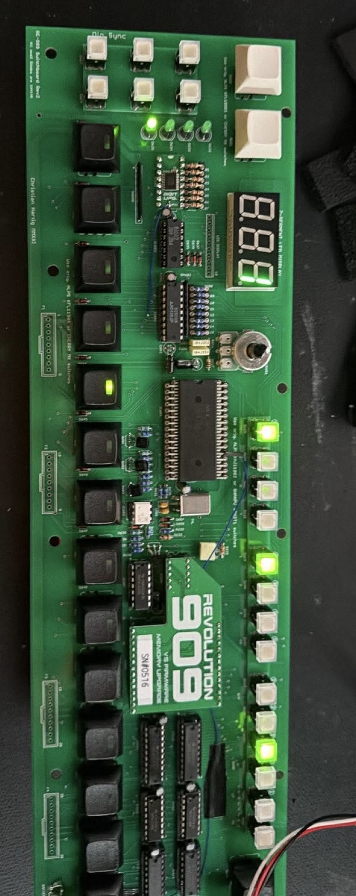 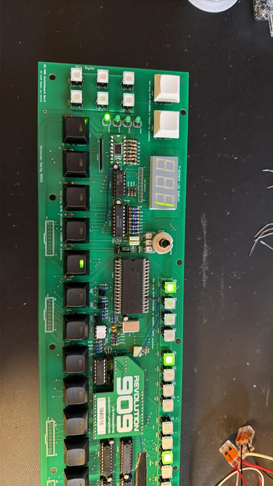 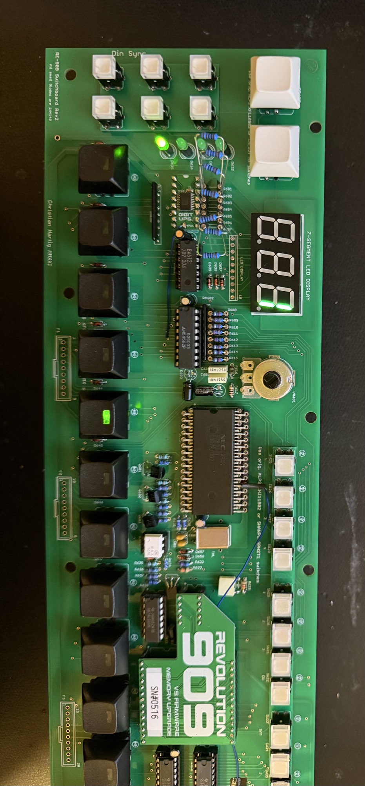 | the LEDs should be with more brightness than the red versions. 17x**N0G64L64** (square 2x3mm) 100mcd 4x **N0G30L85**   it has 70-200mcd for 7x7 segment display you can use the original BOM version but in green = **BC56-12GWA** but its not bright, you can't use this under daylight or bright studio light. in case you want more mcd/brightness: **OPD-T5621UPG-BW** (available by t[me.eu)](http://tme.eu) the Display is much brighter, the green is darkgreen  color/tone compared to the BC56 version. you have to change the Resistors 601 to 607 to 330R or more (680R is a good balance , not to dim , not to bright). You can use milled DIL Socket to test resistor values. the only issue is the select switches - which is in SMT inside of the switches - please ask Andreas Kump - kumpronics.com |
| 14 | LED resistor changes | the 4511 can supply enough current as shown in the data sheets. but you should respect Ohms law and do the math before you simply change resistors. its useless to swap resistors in case the display can't give more brightness as shown in the datasheet of the segment display 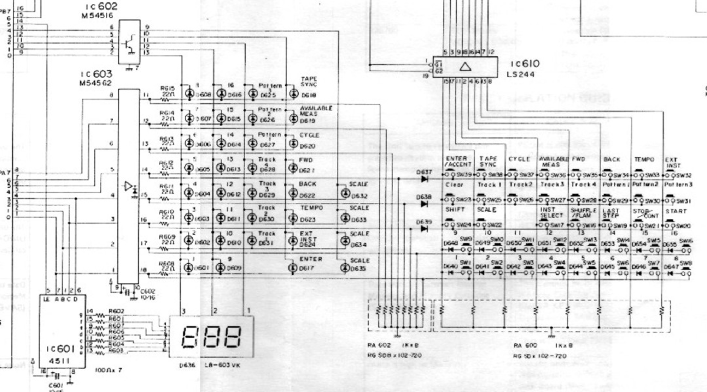 |
| 15 | Usage MIDI OUT | please pay attention to read the REVOLUTION v5 Firmware Manual. MIDI OUT SYNC is by default disabled. |

# Troubleshooting on 909 - known symptoms with fix

or ask me - I offer repairs ..

| **ID** | **Symptom** | **TS - Solution** |
|---|---|---|
| 1 | one or more Step LEDs are off, when you press a switch - a other stepswitch is active too | check orientation of the LEDs (look in the LED and compare it to a other LED) check the diode orientation when you have one LED - which never turns on - it can be a faulty LED - which is very rare - but it was happen on one of my builds and I spend 3hours to figure out a simple LED defect.. |
| 2 | no voice out of one or more voices | check with a scope the trigger input and accent trigger. **option A:** the Voice isn't triggered = no sound check IC1-10 - swap with a other voice IC for easy testing. Use a Scope and look in the schemata where the trigger and ACC trig. must be available. **option B:** output wiring or routing faulty= check with a scope at W5 the Audio signal. nicetoknow: the AUDIO out goes from the VoicePCB to the multi jack board and then back to W6 and return to multi jack PCB. = failure source can be the cable there. use a Frequencygen. and feed a signal to W5  to check the audio path to the Masterout, Indiv.Out., return path. |
| 3 | helpful site | [http://www.network-909.de/circuit.htm](http://www.network-909.de/circuit.htm) of the 909 |
| 4 | Hihat, Crash, Ride sound is wrong | check the IC brands and for buffer or non buffered 4011. I ended with NXP HEF4011 instead of 4011UBE |

## **Changelog (you can ignore this infos)**

|   |   |   |
|---|---|---|
| v.1.0 | release |   |
| v.1.1 | added IC11 and D30, D31, D33 to ORDERING |   |
| v.1.2 | added info from christian about cabling |   |
| v.1.3 | added gnd build notes from Christian, fixed an amount value |   |
| v.1.4 | changed electrolytic capacitor in safety psu from 25V to 35V. | because its standard to have at AC Rectifier a safety range of multiplier 1.5 - 2 (for example an 18VAC is able to give after the rectifier a 28V-29V DC voltage. regards Patrick 😄 |
| v.1.5 | added extra alternative options for 10k trimmers (clap) |   |
| v.1.6 | fixed value in tape section. | new value R311: 820K (old value was 820R) |
|   | " Amp section " | fixed C143 voltage 47uF to 50V. 35V is fine too (comment Patrick) |
| v.1.7 | advisory added for snare drum fix. |   |
| v.1.8 | added info about cabling and errors in TR-909 service docs |   |
| v.1.9 | fixed values in high tom, C95 and C97 were reversed | new value C95: 100nF new value C97: 15nF (just swap both capacitors, old value was C95 15nF & C97 was 100nF) |
