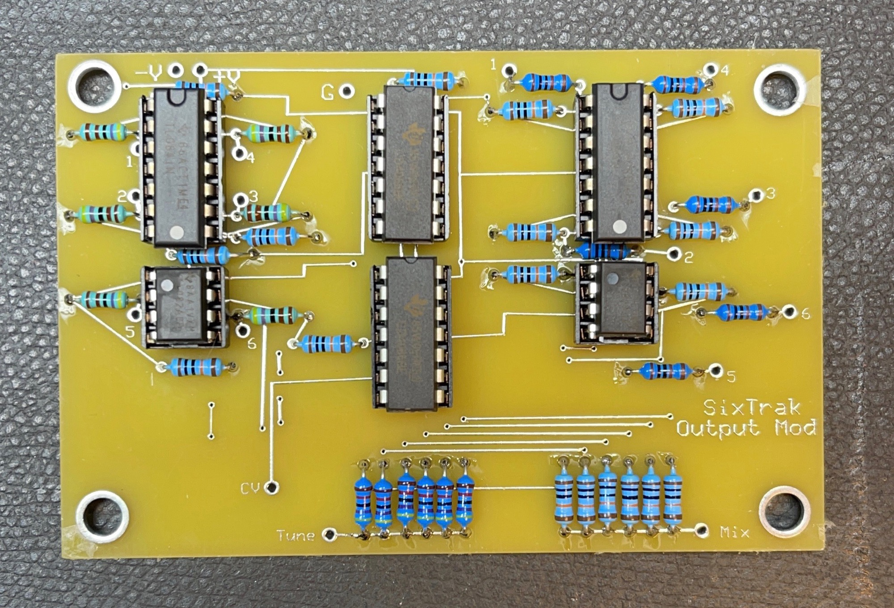
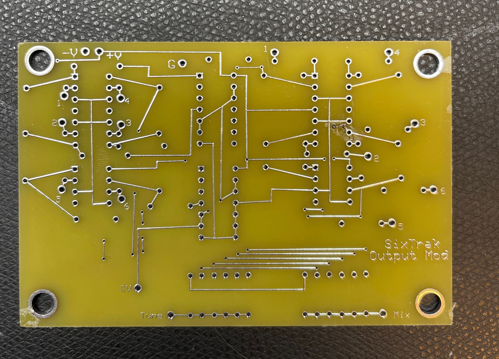
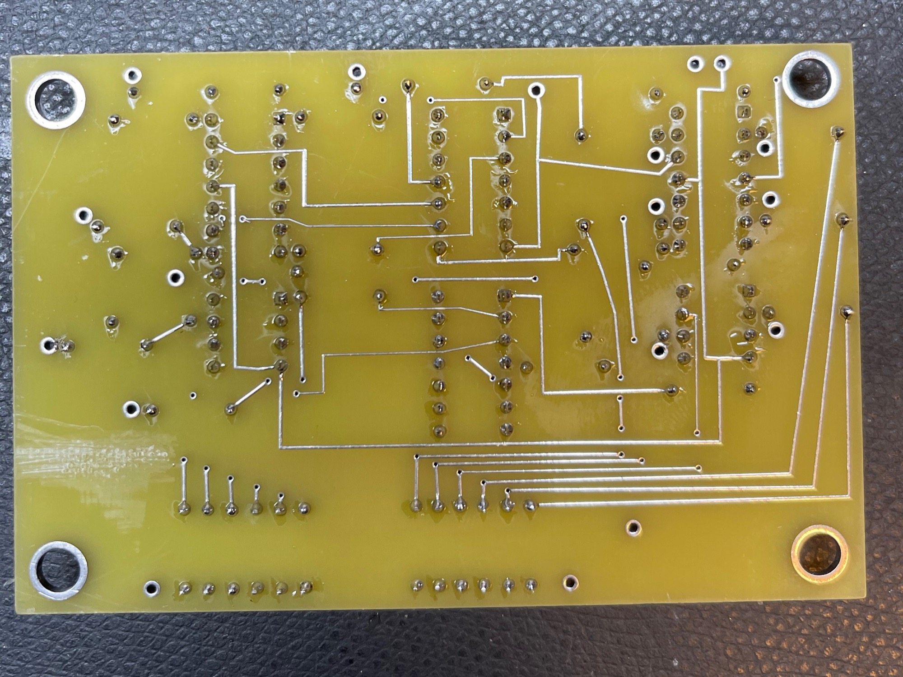
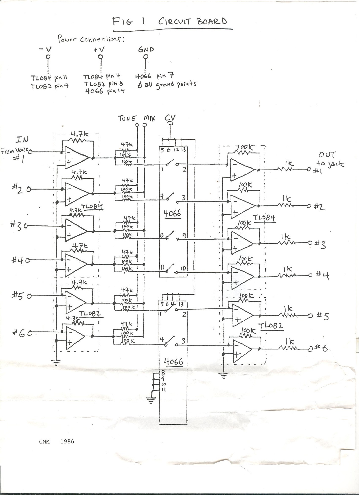
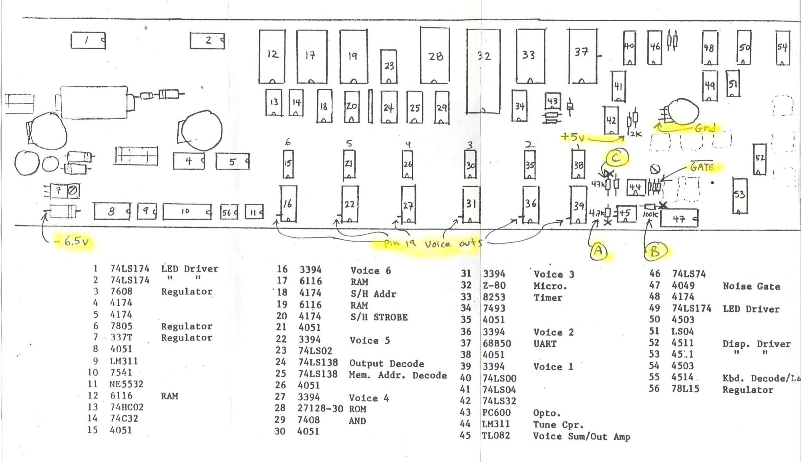

# Sequential Sixtrak Output Mod

> **Project**
>
> ### Projecttitel: Sequential Sixtrak Output Mod
>
> ### Status: `finished`
>
> ### Startdate: 01/2021
>
> ### Duedate: 02/2021
>
> ### Manufacture link: --

I'd like to give a little history about this modification- I've had it posted for several years (including directions and comments). The mod that Plexus nicely added to his Six-Trak was designed by G. Montalbano in 1986.

