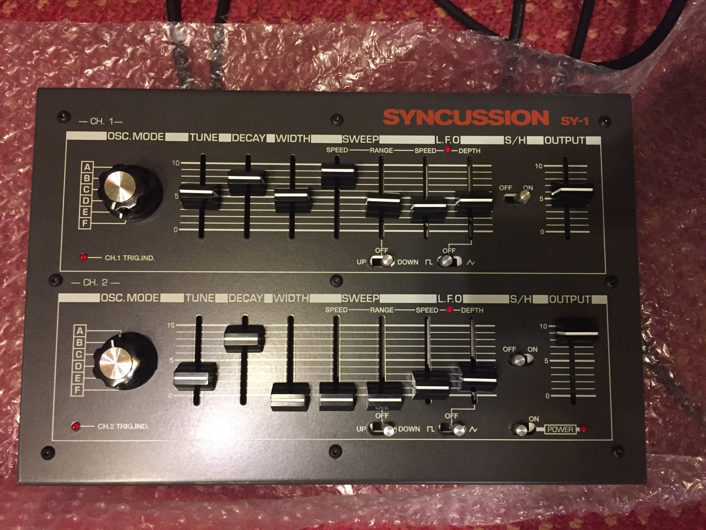
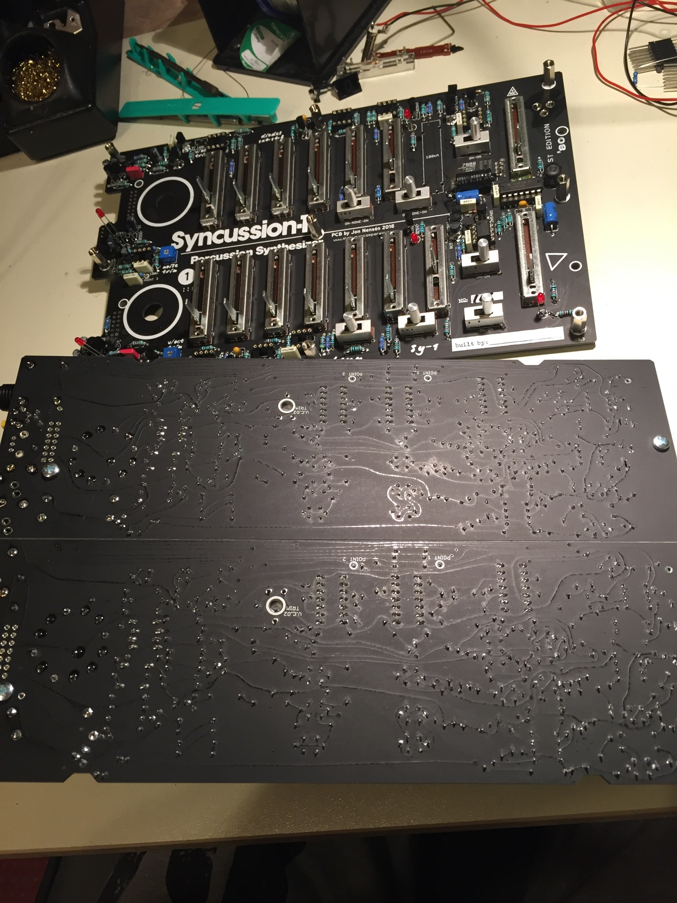
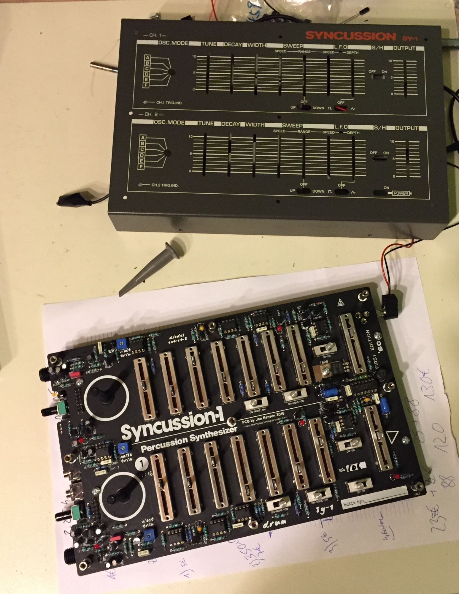

# Syncussion SY-1 clone

> **Project**
>
> ### Projecttitel: Syncussion SY-1 clone
>
> ### Status: `finished`
>
> ### Startdate: 09/2016
>
> ### Duedate: 11/2016
>
> Updated  11 Nov.2018
>
> ### Manufacture link: [http://thehumancomparator.net/](http://thehumancomparator.net/)
>
> Forum: [http://translate.google.com/translate?hl=&sl=auto&tl=en&u=http%3A%2F%2Fwww.99musik.se%2Fshowthread.php%3F330802-Syncussion-SY-1-klontr%C3%A5den%2Fpage24](http://translate.google.com/translate?hl=&sl=auto&tl=en&u=http%3A%2F%2Fwww.99musik.se%2Fshowthread.php%3F330802-Syncussion-SY-1-klontr%C3%A5den%2Fpage24)

i built the syncussion in 2016 and got an assembled SY-1 too.

**This Version is from Jon / Thehumcomparator.net from 2016 !**

> **Achtung**
>
> please use my improved powersupply mod, otherwise you have a hum on the audio path.
>
> **[Syncussion Power Modification](syncussion-power-modification/index.md)**

**BOM:**

[Syncussion-BOM.pdf](assets/Syncussion-BOM.pdf)

inductor/choke, not needed for the Mod: **[Syncussion Power Modification](syncussion-power-modification/index.md)**

[https://www.mouser.co.uk/ProjectManager/ProjectDetail.aspx?AccessID=12](https://www.mouser.co.uk/ProjectManager/ProjectDetail.aspx?AccessID=12)4d5dd0a6

with sliders:

[https://www.mouser.de/ProjectManager/ProjectDetail.aspx?AccessID=8e5238571e](https://www.mouser.de/ProjectManager/ProjectDetail.aspx?AccessID=8e5238571e)

**PCB Overlay**

[Syncussion-Overlay.pdf](assets/Syncussion-Overlay.pdf)

> **Hinweis**
>
> **copy from thehumancomparator.net:**
>
> Errors on board. Unfortunately we have a few mishaps on the PCB, nothing major, but it’s nice to be aware of when building.
>
> - Board 1, The pinout of the noise transistor is wrong. It’s labeled as EBC from top to bottom, but it should be CBE instead. A BC547 will fit with the silkscreen and work well.
>
> 
>
> - Board 1, The rate slider for the LFO might kill the LFO when it’s at bottom. Increase the 470Ω resistor next to it to something between 560Ω and 1k depending on your preference. This might not affect all builds.
>
> - Board 2 & 3, Four resistors are marked with the wrong value – 100k and 47k instead of 22k! See image for their location, it shows the values to install.
>
> 
>
> 
>
> **own notice:**

**Mode Description:**

A VCO 1 only
 B VCO 1 modulates VCO 2 frequency, the latter is routed to the VCF
 C Both VCO to the filter but VCO1 at reduced level.
 D EG 1 modulates VCO1, EG2 modulates VCO2.  Both VCO to the filter
 E VCO 1 modulates VCO 2 which has a sawtooth wave.  VCO 2 to VCF
 F Noise to VCF, no oscillators

**Usage:**

in case of a TR-808, use the Trigger Outs of your TR-808 for each SY-1Channel.

in case of a ARP Sequencer, use the 8/2 function and trigger each SY-1 Channel

further you can try a clock divider or DIN-Sync to analog clock with a Clock divider.

