# The Cloney project Synthey AKS clone

> **Project**
>
> ### Projecttitel: Cloney Synthey AKS clone
>
> #### Status: `done`
>
> #### Startdate: 05.July.2023
>
> #### Duedate: September 2023
>
> #### Last Update: 06.Jan. 2025

> **Hinweis**
>
> **This Pages are only for builder and owner of the Cloney Synthey.**
>
> **CLEANED UP due to copyright claims March2026**

the official guides and PCB pictures/scans are only available for registered users who can be identified with the Synthey Serialnumber or by name. you have to send me a email to get access 

I bought the kit without the X-Y-Z PCB (because I left one assembled and tested PCB set from a cloney)

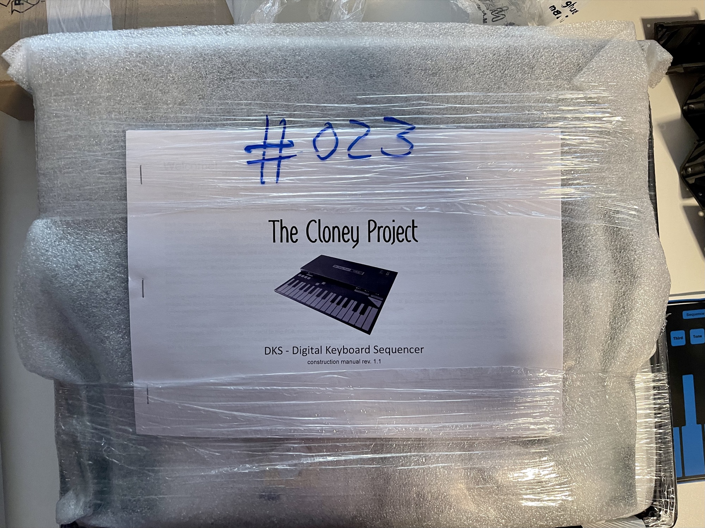

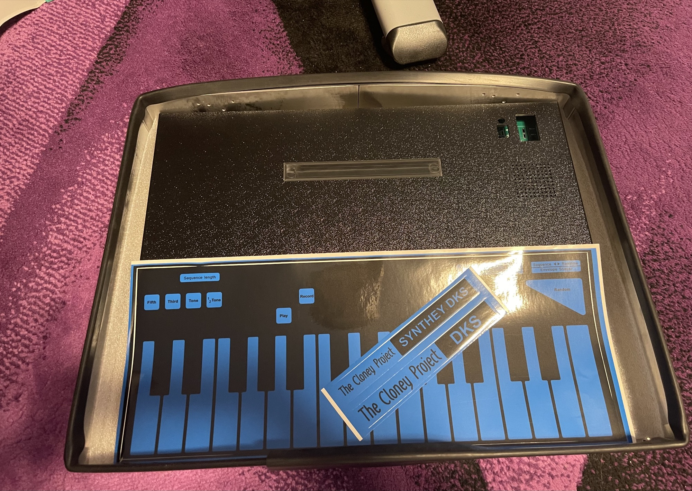

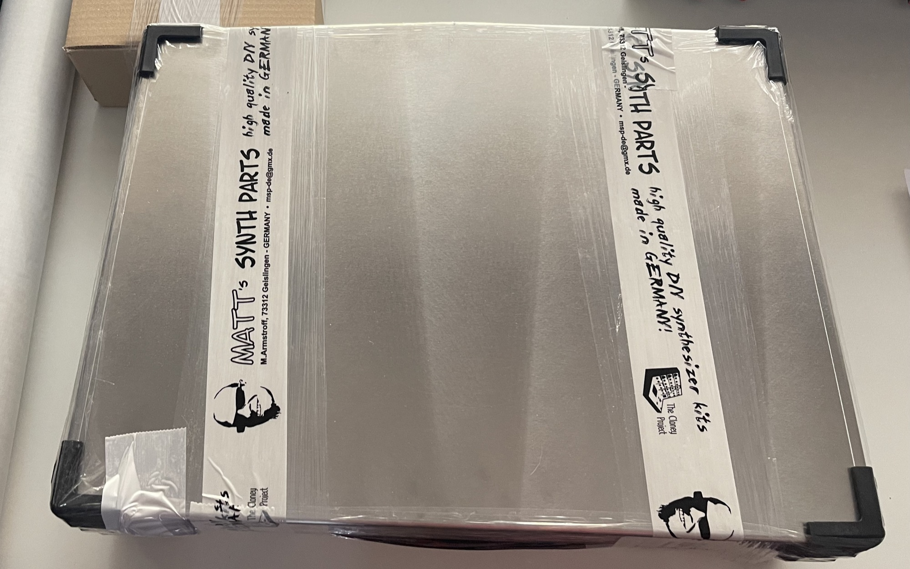

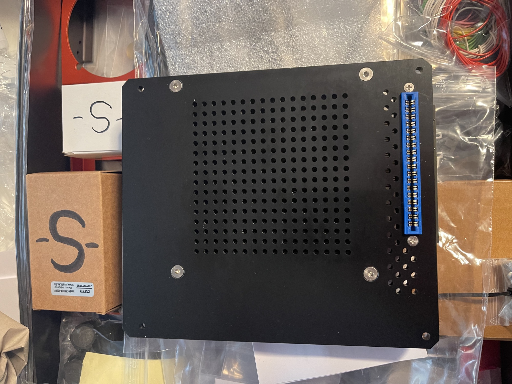

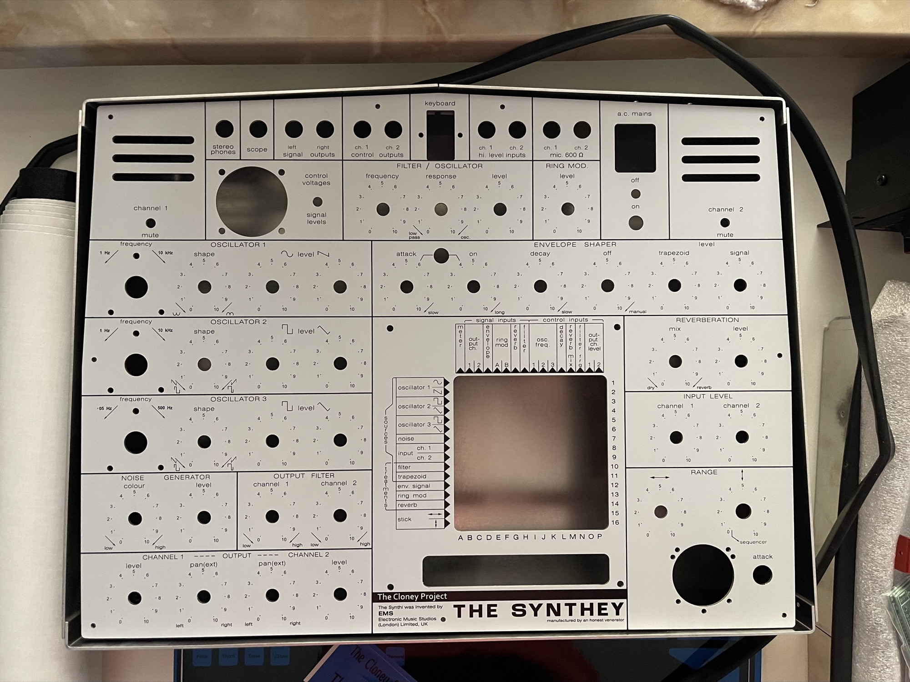

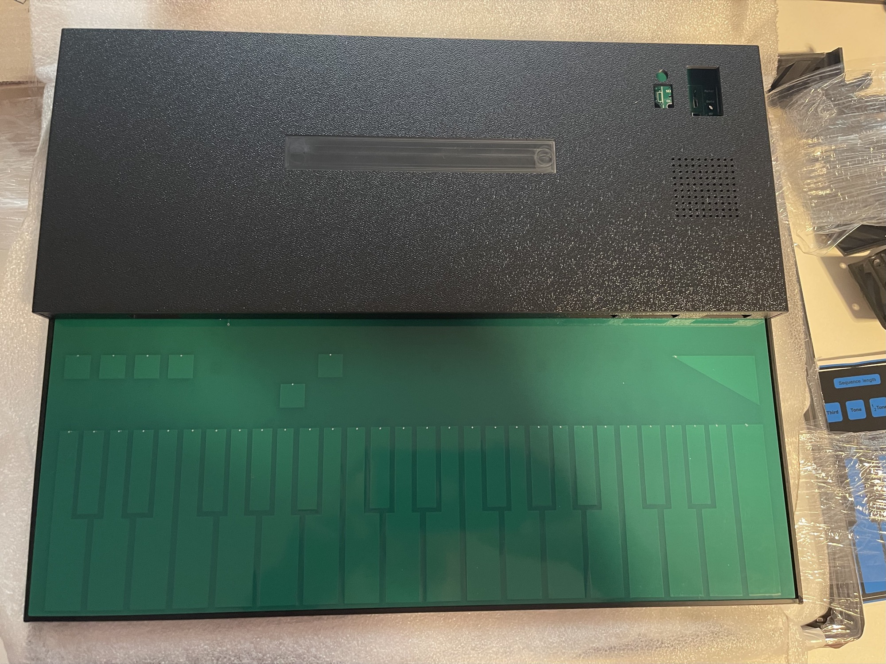

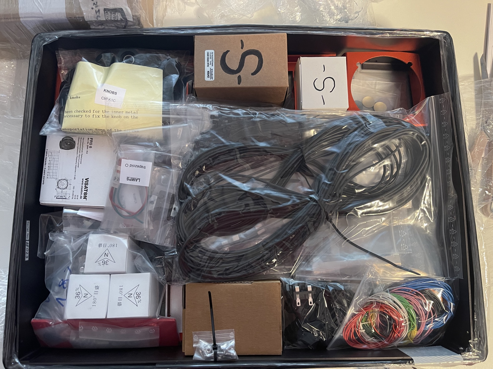

| **Issue ID** | **Date** | **Location** | **Type** | **Identified issue** | **Resolution** | **related for development** | **affected PCB version** | **fixed Version** |
|---|---|---|---|---|---|---|---|---|
| **1** | **20.july 2023** | **SynthiA** | **bug** | **the X card is in contact with the speaker** 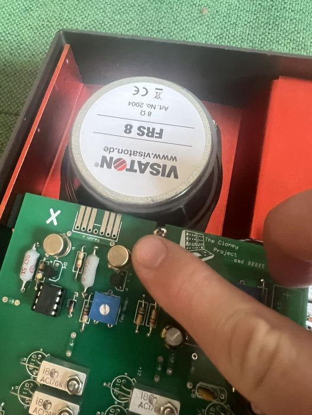 | **options:** **A:   use a other speaker or** **B:   use a Dremel and cut the pcb** **C: wide the holes that the pcb is in other place** |   | **rev1 Synthey from 2023** |   |
| **2** | **20 july** | **keybed** | **tip** | **decals** | **use water while placing the decal on the pcb and the case** | **make a note in the guides** |   |   |
| **3** | **20 july** | **keybed** | **info** | **CN3 clock LED info** | **"This LED is just an option Because EMS did not provide any power LED nor a clock LED on the KS there is no hole for an LED on the DKS case.** **So it is up to the builder to use this feature or to leave it. CN3 gives one the option to connect the (optional) LED, when mounted or glued to the case. Otherwise the LED can be directly soldered to the PCB (on the upper side)." from Mathias** |   |   |   |
| **4** | **20 july 2023** | **synthiA** | **critical bug** | **the Screw is 11mm instead of 10mm and touch the transformer** 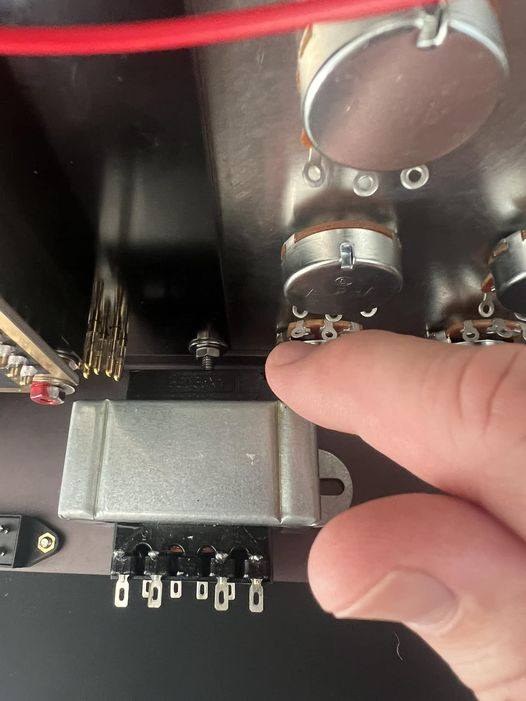 | **use a 10mm screw** **or mount the transformer on a other place** **or use a other transformer (torradial )** |   |   |   |
| **5** | **20 july 2023** | **keybed** | **warning** | **make sure you solder carefully the LED - otherwise it can happen you have a short there:** 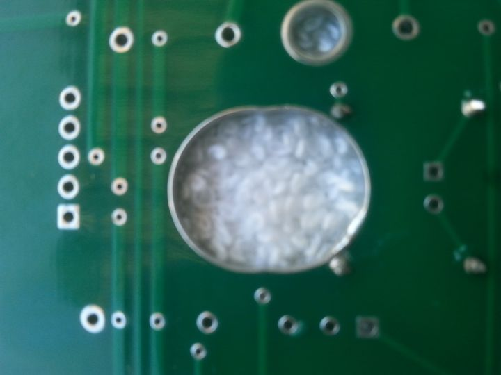 | **in case you get too close or in contact with the "metal ring" you can use a Dremel and cut the metal ring as your needs** |   |   |   |
| **6** | **20 July 2023** | **keybed** | **info** | **its just a info from a user who used a header/cable for the LED** 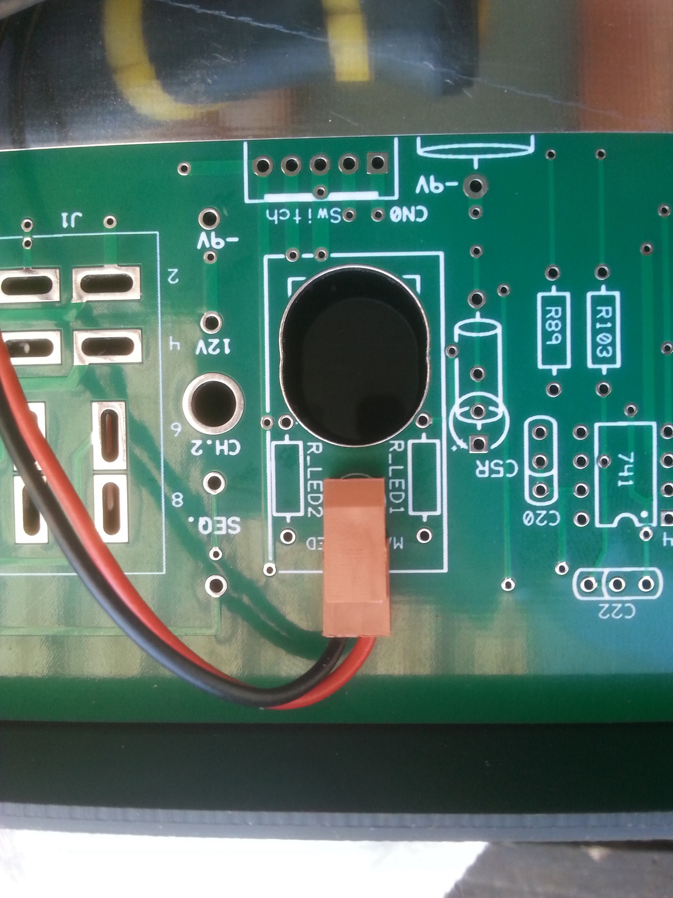 |   |   |   |   |
| **7** | **20 july 2023** | **SynthiA** | **info** | **about the panel screws:** **the screws within the DIN 7991 / DIN EN ISO 10642** **The DIN has 90degrees as reference.** |   |   |   |   |
| **8** | **10/2024** | **SynthiA** | **BUG** | **Wiring guide failure** | **Connect a Cable from VR10 wiper to Y30 - or your envelope will not work, lamp is off** |   |   |   |
| **9** | **12.Nov.2024** | **Keyboard** | **info** | **The Fan pinout depends on the  direction of the PCB Header** | that's how it works correctly 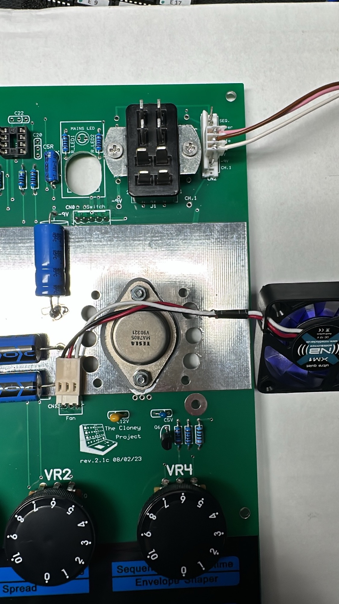 |   |   |   |
| **10** | **12.Nov.2024** | **Keyboard** | **info** | **make sure to buy 4  x 10mm Standoffs which fits in the holes of the fan and attach 1mm washers - check the distance.** **A option can be, to buy 2.5mm Versions instead of 3mm, and buy flat hat screws as described in the buildguide** |   |   |   |   |
| **11** | **12.Nov.2024** | **Keyboard** | **Info** | **Switch connector** | **a good way is to cut the header to get more space to the case bottom** | 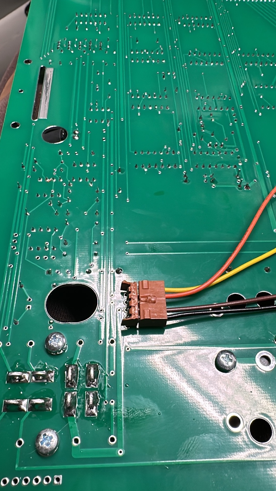 |   |   |
| **12** | **12.Nov.2024** | **Keyboard** | **Bug7Warning** | **to avoid contact with the Powerswitch, use a Dremel and remove the ring** | 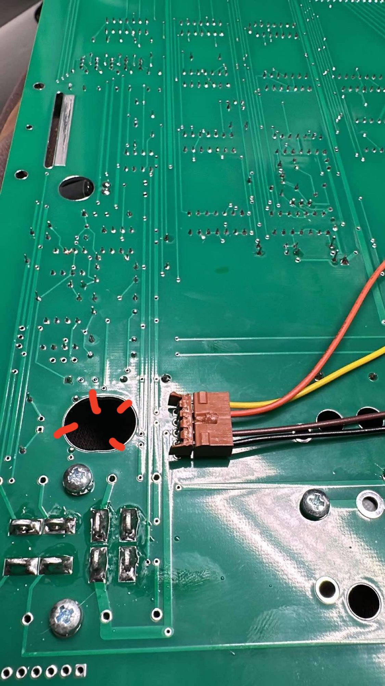  |   |   |   |
| **13** | **12.Nov.2024** | **Keyboard** | **Info** | **for easing and safety testing.** | **install a Connector and attach a Bipolar Bench Psu. under full load you need max. 250mA per Channel. (typical 150mA)** also, install 2 Jumpers as shown on the second picture (instead of a switch while testing) | 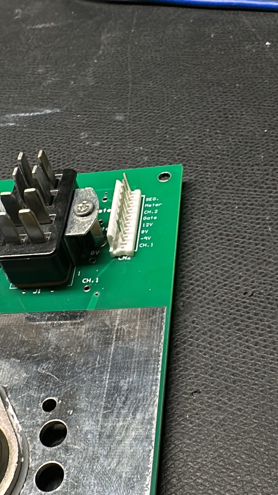 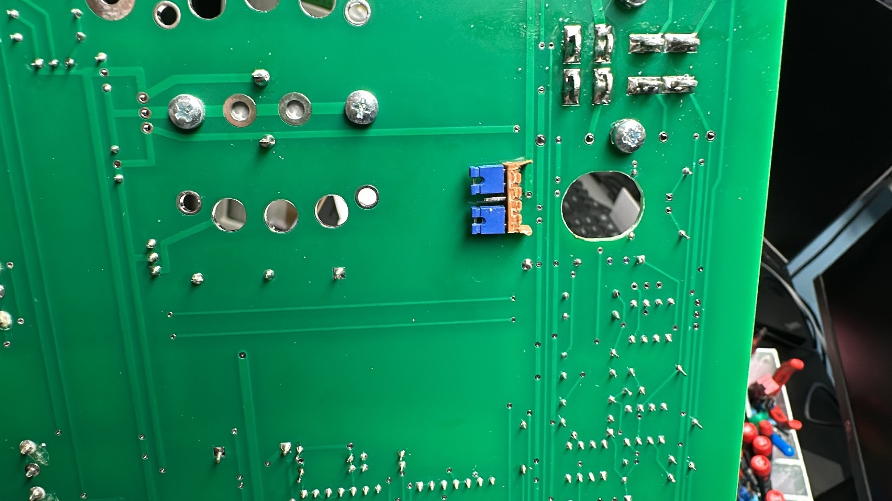 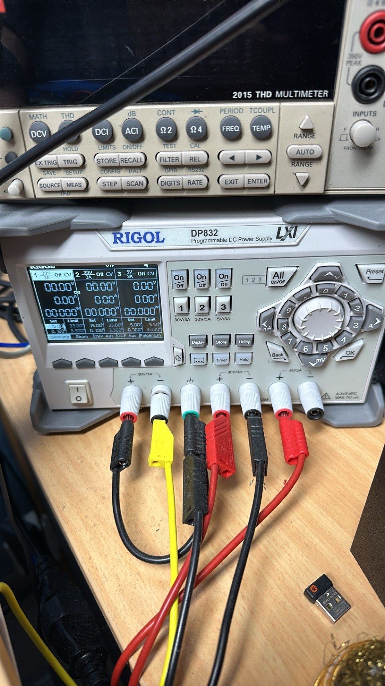 |   |   |
