# The Cloney Project VCS3 Clone

> **Project**
>
> ### Projecttitel: The Cloney Project - VCS3 Clone
>
> ### Status: `finished`
>
> ### Startdate: 08/2018
>
> ### Duedate: 09/2018
>
> ### Updated 02/2026
>
> ### Manufacture link: facebook group

The Cloney Project-owner contacted me about the information rights and copyright on my website here.

It´s his good right by law, which I fully respect, with the result:  **The documents of  the “Cloney Project “ and third party content are not  public anymore**

You can ask your seller of the cloney, in case of any question or regarding support.

### **My website is since 2013 without a paywall and the pages are non commercial.**

one part of my business case is my onlineshop, where you can buy parts or pcbs:  [diysynth.de](http://diysynth.de)  and I offer repair and build services.

> **Info**
>
> **Builders guide info, different projects = different pages:**
>
> [Cloney 2019 issue list and support](cloney-2019-issue-list-and-support/index.md)
>
> [LMNC Cloney 2025 batch](lmnc-cloney-2025-batch/index.md)
>
> [The Cloney - secret files](#)
>
> [Synthey Buildguide and PCB scans](#)
>
> [EMS Synthi A Clone](../ems-synthi-a-clone/index.md)

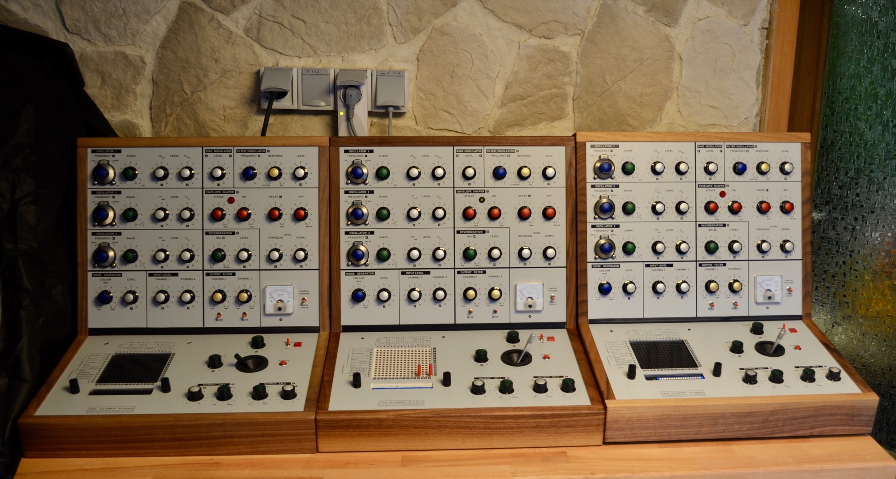

### Build notes:

**Cabinet**: i got an unassembled Cabinet, its CNC milled,  you have to check the panel slots before you assemble it - on mine it wasn´t possible to attach the frontpanels without rework 2 slots, 

this was happen on one of 6 Cloneys and it was easy to rework with some tools.

**Frontpanel parts**: mount all Upper panel parts (potentiometer, switches, meter) before you attach it in the cabinet ! for the lower panel not (otherwise you can´t attach the panel in the cabinet)

"L2" on upper panel is the Envelope Lamp

there are few resistors which are connected between busboard and matrix, mount the resitors on the matrix.

mount inline capacitors on the potentiometer (not on the busboard)

ground all shielded cables on the potentiometers ground, only one end must be grounded (not on busboard - because there´s no space)

change the board cable/wiring to MTA100 - solder the cables - (because tons of shielded cables)

### Project summary and general notes:

I got the cloney full kit from a friend (my Oberheim OB-6 gone for this investment) in August 2018.

The assembly wasn´t very difficult for me, but what does it mean " isn´t very difficult" ?

to explain this:

My technician background and experience in SDIY from the last 10 years and from my day job "IT system analyzing/administration (and Teamlead/ projectlead)  gives me all the time a other view on "projects", there´s no difference between synthesizer projects/planning and IT-projects.

The most documenations/build guides are best practice guides - how does works for the designer, but the most designer are not PRO DIY guys.. the most are more a salesman or a developer and never build hundreds of synthesizers.

They dont have the same tools like we have.. they dont have the same skills and a developer view instead of customers view.

Its not possible to create a 100% perfect build guide for this device..

**To build big devices like DDRM, VCS3 , TTSH - you need to understand:  how works this device and how is it assembled**

**mechanical construction** (case, panels, where are screws, what and when you have to attach a part/cable. &gt; you need a lot of tools

**electronic skills:**you need to understand the signal routing, functions of the device, difference in shielded /unshielded cable, "synthesizer infrastructure" &gt; you have to read the Cloney build guides ( paperform in each Cloney kit, they are copyrighted ! )

AC Main power handling is required ! or ask a cerfied local company for build/test of the powersupply unit. ( you need to respect earth/grounding for security reasons - or you can lost your life or you device/house in case of electrical shock or fire )

**its not enough to build eurorack modules, a TTSH or a DDRM and you´re able to build a VCS3 Clone  - because the VCS3 is an oldscool device - very much wiring and no instruction which cable you have to attach at first**

**But yes there´s a wiring scheme available which helps you.**

 to troubleshoot/repair this device you need a correct wiring, no missing or wrong parts placement..

I spend ~ 100h in total  (including time to read manuals, documentations).

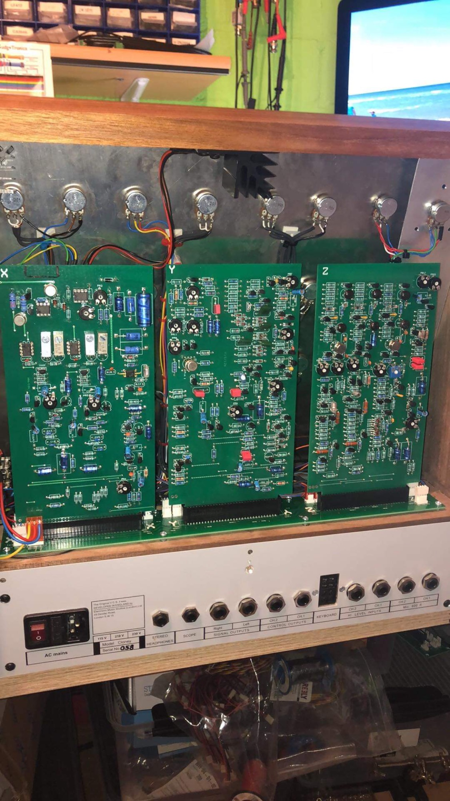

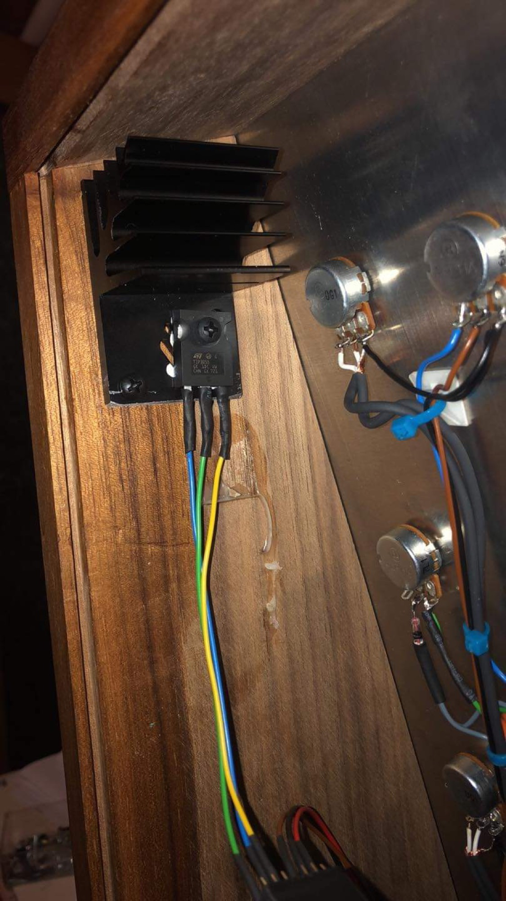

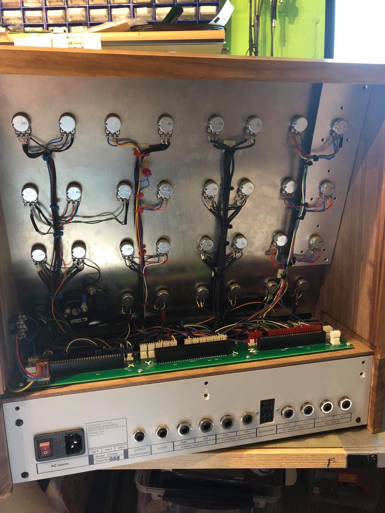

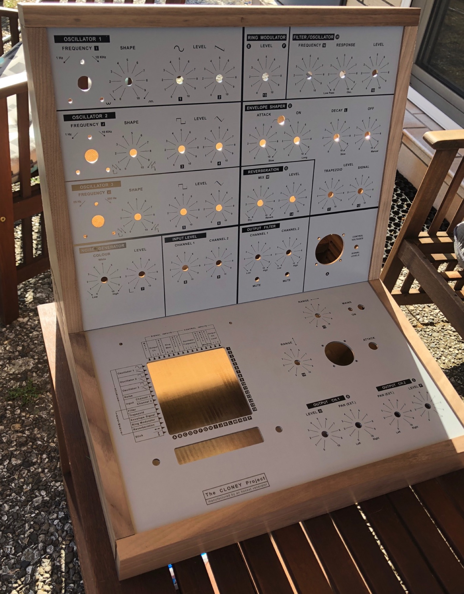

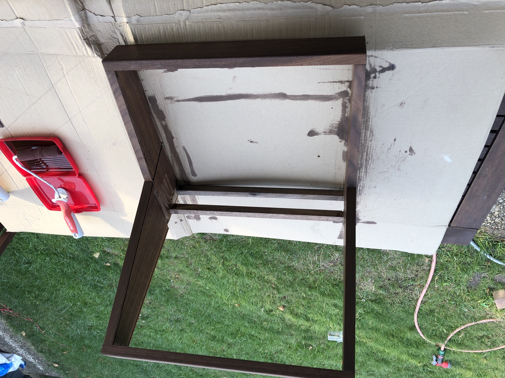

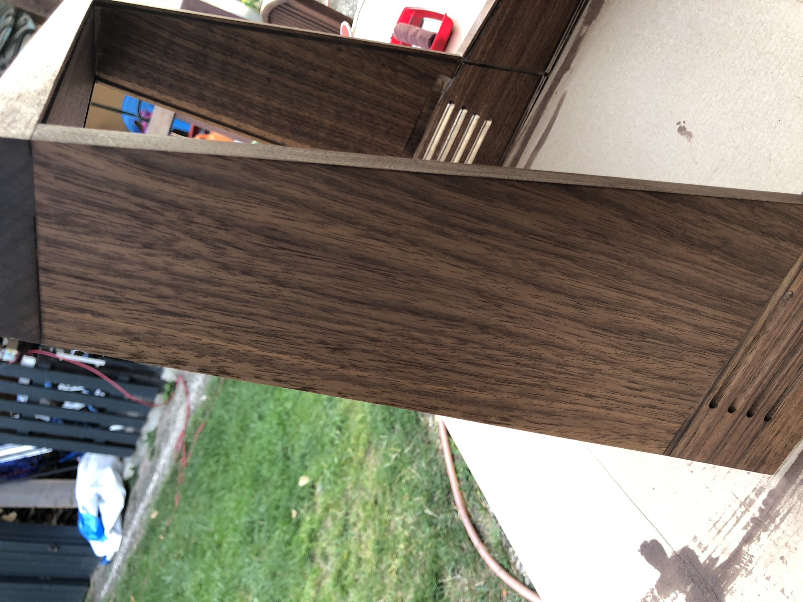

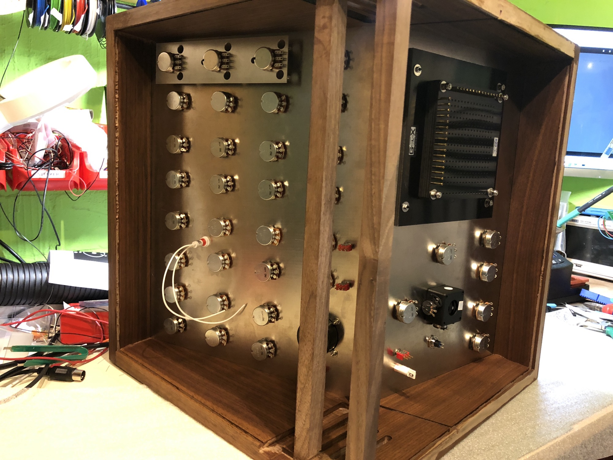

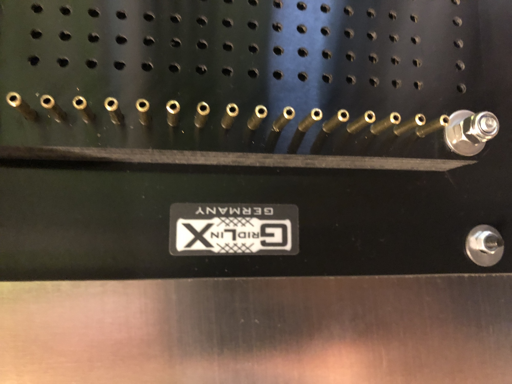

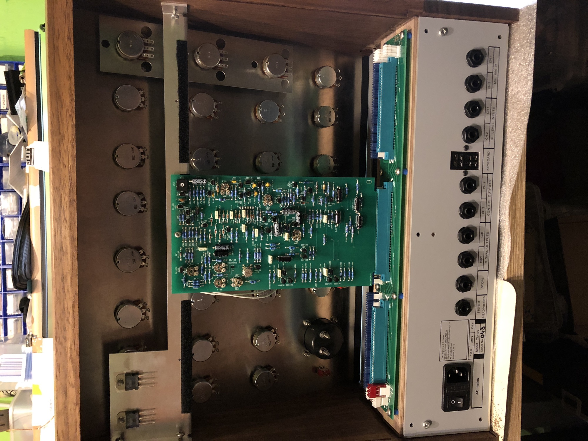

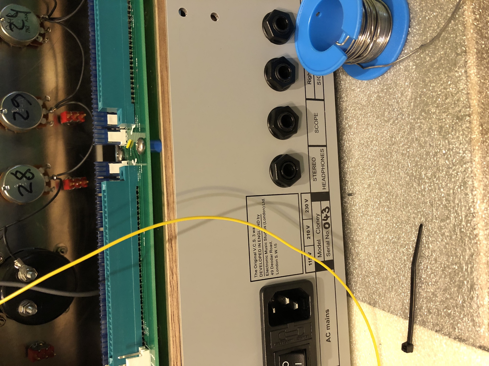

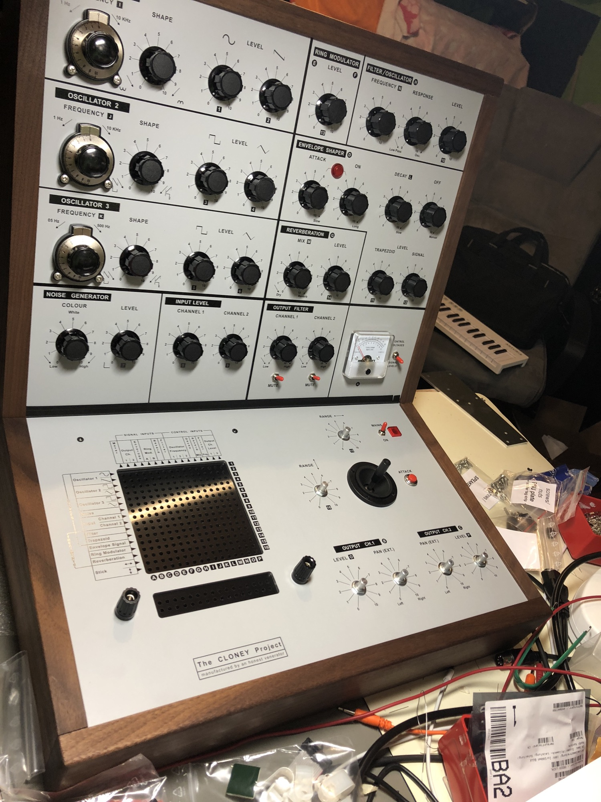

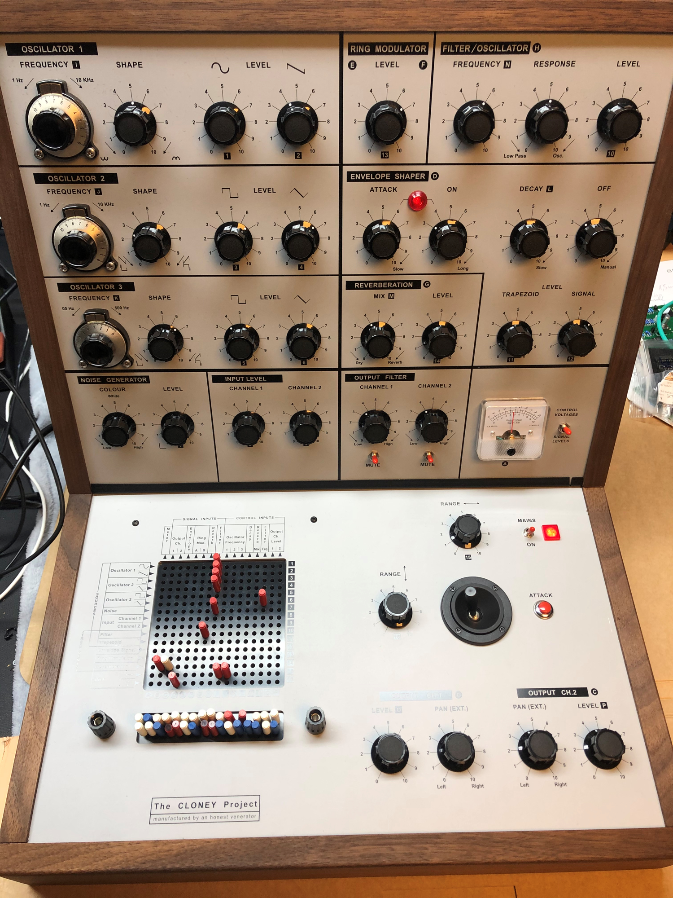

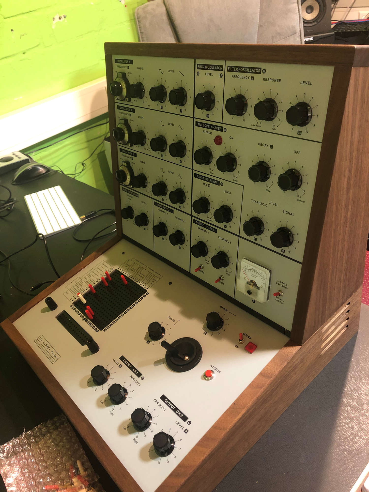

- [IMG_9150.JPG](assets/IMG_9150.jpg)
- [IMG_9151.JPG](assets/IMG_9151.jpg)
- [IMG_9152.JPG](assets/IMG_9152.jpg)
- [IMG_2601.jpg](assets/IMG_2601.jpg)
- [D6766403-2BA5-456B-888A-97B970625891.jpeg](assets/D6766403-2BA5-456B-888A-97B970625891.jpeg)
- [F4BB72E8-71D8-483F-B4B3-CCF33F66EAEB.jpeg](assets/F4BB72E8-71D8-483F-B4B3-CCF33F66EAEB.jpeg)
- [BAD7174F-C4C6-4822-8752-864E124ED3FE.jpeg](assets/BAD7174F-C4C6-4822-8752-864E124ED3FE.jpeg)
- [4E15B543-48FE-4403-B44C-9A848BC38398.jpeg](assets/4E15B543-48FE-4403-B44C-9A848BC38398.jpeg)
- [84EB0FEC-1189-40E9-9EAB-879072FE616D.jpeg](assets/84EB0FEC-1189-40E9-9EAB-879072FE616D.jpeg)
- [C95F1725-EC87-402E-9BBD-2D9FE299735B.jpeg](assets/C95F1725-EC87-402E-9BBD-2D9FE299735B.jpeg)
- [B8534D9F-EFF9-427D-A24E-70232ABEA0FE.jpeg](assets/B8534D9F-EFF9-427D-A24E-70232ABEA0FE.jpeg)
- [cloney_front.png](assets/cloney_front.png)
- [cloney_side.png](assets/cloney_side.png)
- [DSC_0264.jpeg](assets/DSC_0264.jpeg)
