# LMNC Cloney 2025 batch

Cleaned up due to copyright claim

this page is only for the Cloney batch from 2025, called “**LMNC**”version  from the “look mum no computer” build

feel free to check my other VCS3/Cloney/SynthiA/Synthey pages [The Cloney Project VCS3 Clone](../index.md) to get an idea how an assembled Cloney was built.

I built 7 Cloney and few other EMS Clones.

**Facebook Page:**[https://www.facebook.com/groups/2067997920405850](https://www.facebook.com/groups/2067997920405850)

| **name** | **&lt;doc&gt;** | **info** |
|---|---|---|
| **Population guiden (X-Y-Z PCB)** |   |   |
| **Calibration guide** | [EMS SM.pdf](assets/EMS-SM.pdf) | When you measure .. make sure you measure it correct- make reference measurements. |
| **BUG (issue 17) from February 2026** |   | **On the X-Board trace errors were identified.** this affects the pins 5, 6 and 7 on the 64 pin connector. Close to the connector, the corners of the pads 5, 6 and 7 dont show enough distance. When being soldered, they tend to connect to a short. Solution: separate the corners of the pads 5, 6 and 7 even more by a sharp cutter. See therefor the photo attached. |
| **BUG (issue 18) from February 2026** |   | By investigating a set of populated boards on my workbench for a preliminary check I want to share a couple of things: **Six capacitors on the X Board are wrongly placed.** All three 741s on the audio amplifiers were dead. They are of the same batch as the ones regulating the voltages on the PSU. And these work well. So I replaced the dead ones. All fine so far. With one remark: The volume on the speakers was a bit slappy. I found the capacitors C21/81, C29/82 and C80/801 placed on the wrong positions. Better said, the values were the opposite. This is a mistake in the parts lists. So for a proper volume level, exchange the named capacitors on the X board and use 33 pF instead of 330 pF on C81 and C82. Keep 330 pF on C80. **To be clear:** **C80 = 330 pF** **C81, C82 = 33 pF** **C21, 29, 801 = 1 nF** See also the picture attached. **Another topic is the print on the Z-board** PR22 tells "METER ADJ." This is labelled wrong. That preset is for adjusting the NOISE LEVEL. For adjusting the METER's center, use PR14 instead. **Further Informations** On this certain board set on my workbench, OSC.2 required a 36 k (S.O.T.) resistor between R227 and R229 and OSC.3 a 27k (S.O.T.) resistor between R261 and R263 to achieve the waveform's center on SHAPE position 5. This is a usual procedure to adjust the SHAPE potentiometers to the given circuitry. The S.O.T. resistor values may vary on your individual units. These are affected by the unit's voltage levels, the individual SHAPE potentiometer tolerances and of course the all over resistor tolerances. But the named values will be a good orientation for you to start with. See also the picture attached. Everything else on the board set is perfect and the oscillators show up EMS-unlike stable. |
| Backplane soldering ISSUE  16 |   | **TOPIC 2** Another topic is how to solder signal cables to the backplane. It seems some guys misunderstand how a signal cable is soldered to the related destination pad on the backplane. The pads show two holes, but both holes share the same pad and therefor the same signal. It is not possible to solder the core of a given cable to one hole and the screen to the other. This will cause malfunction or even a short. The two holes are just an option. To decide whether a cable is just soldered flat onto the pad or stuck into one of the holes and then soldered. This shall serve the direction, the cable arrives on the destination. So it can be soldered without further tension. Find attached a graphic, showing an example of the way a shielded signal cable is installed on the backplane. "Hot" means this is the core of the cable which leads to the signal. **Extra Info from Patrick:**use cable shrink, put the cable shrink on both cable ends  before you remove the isolation. it looks better, especially by RG157/158 cables. |
| general info |   | capacitors have footprint for 5-7.5mm or 2.5thru 5mm. which means 2 “holes” are still connected with a trace (yellow box) |
|   |   |   |
| Issue 9a | here comes an update for the Construction Manual Part I - mechanical work - Obviously there is a mistake on the fibreboard. Check also the attached photograph and screenshot. The lower small hole for the tapping screw seems to be on a very low position. Normally it has to be in a distance of 28 mm to the lower edge. A builder reported a problem with this hole. After checking the last batch here in the workshop the hole is at 10 mm. So I checked the CAD data and changed the hole position to the 10 mm. The preview shows the hole will match to the upper center hole on the connection panel. Very cool! So there is not really a problem. This way the third countersunk M4 screw to fix the wooden bar to the connection panel is obsolete. **IMPORTANT:** The center hole on the wooden bar should not be drilled by 4 mm. Because the fibreboard screw will then stay loosely. So drill the center hole on the wooden bar with a 3 mm drill (0.12") and no more. |   |
|   |   |   |
| you should cover the via holes with a tape to avoid a electrical contact to the germanium transistors. | 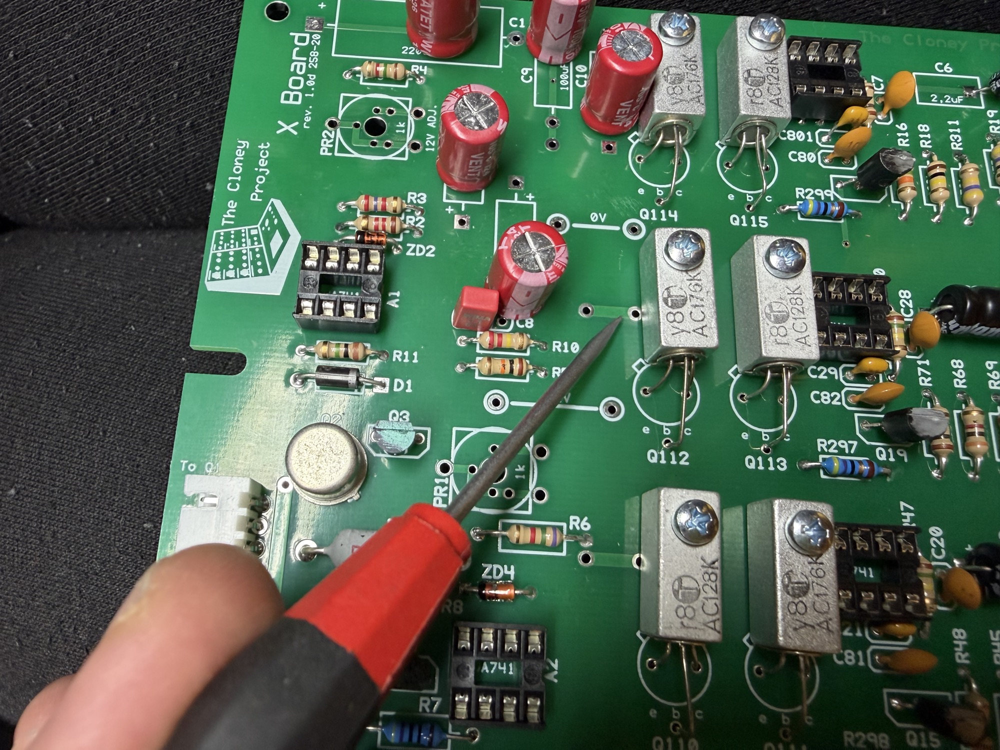 | Its not an official Bug, but you can run in trouble with this.. |
| Kit Pictures | 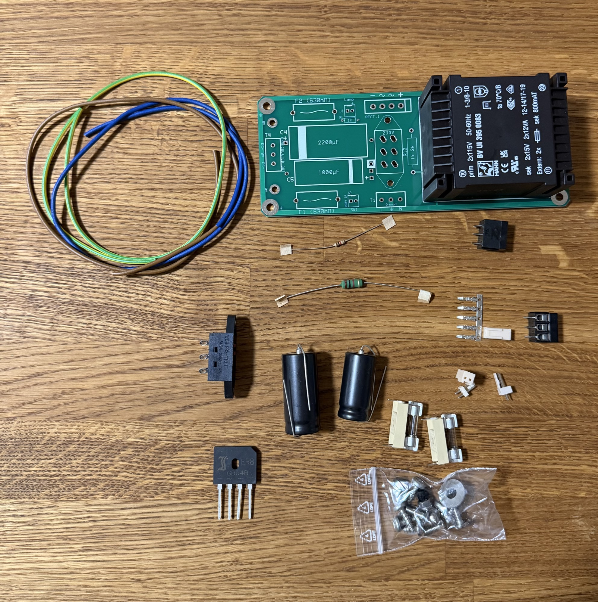 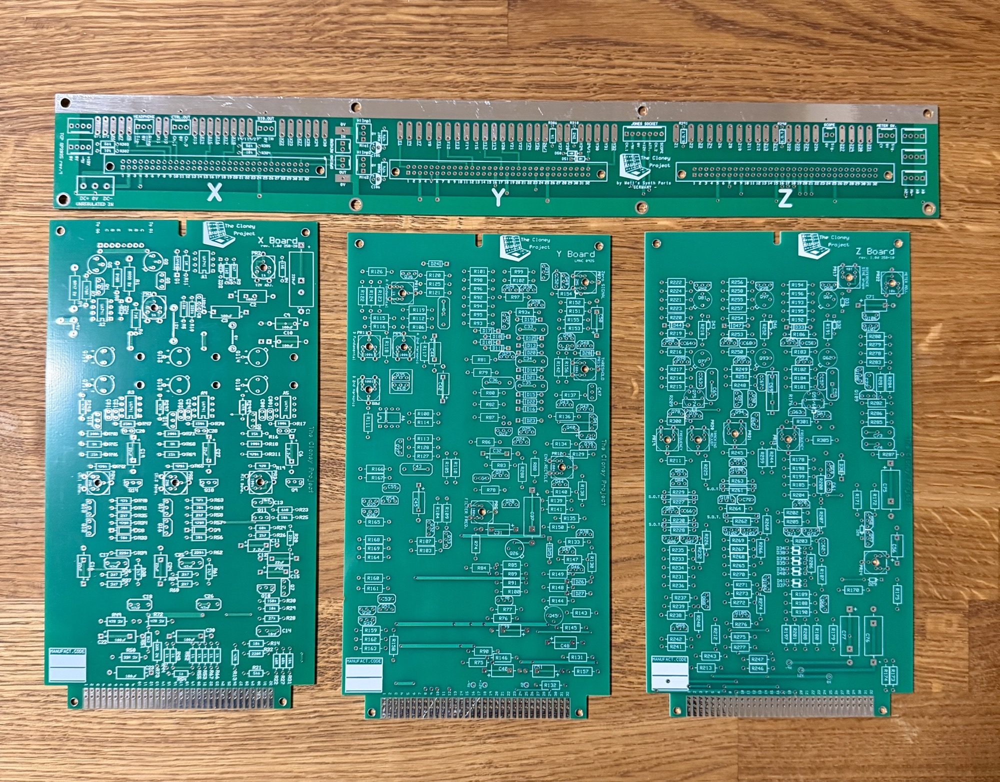 | 230V is when the middle pin and upper pins are connected. (switch  lever is to the rectifier orientation. (the issue is here: you can install the switch in wrong orientation and use the wrong voltage…) |
| Kit Pictures | 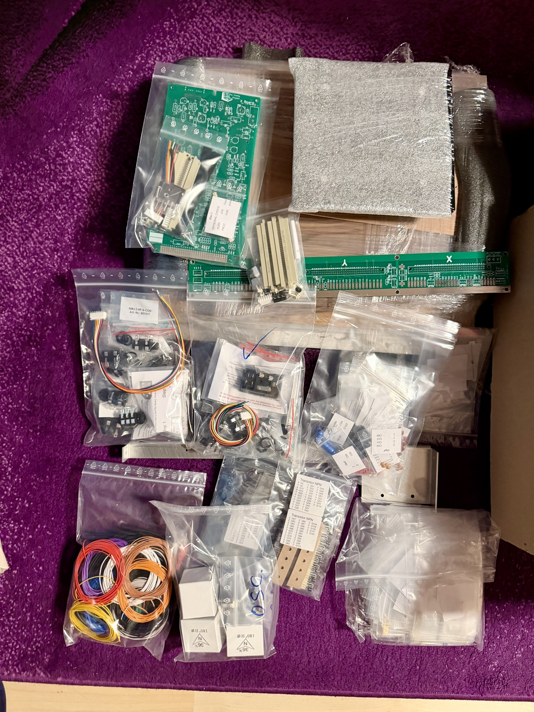 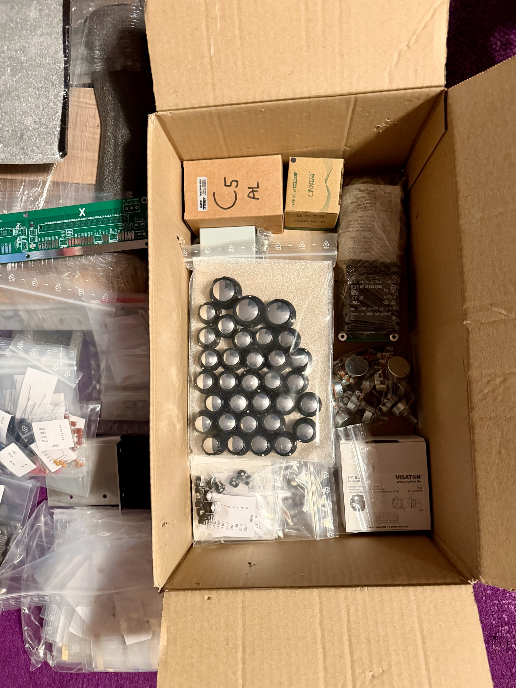 |   |
| PCB Scans, Copyright of the scan by Patrick.J (DSL-man.de | [Cloney-2025-batch-pcbs .pdf](assets/Cloney-2025-batch-pcbs.pdf) |   |
|   |   |   |
|   |   |   |
|   |   |   |
|   |   |   |
|   |   |   |

General Tips & Tricks, Improvements

| **ID** |   |   |
|---|---|---|
| wiring - cables **improvement** | before you install other cables, it can be a improvement  to have no risk of crosstalk, signal bleeding. **It´s for builder with experience.** Mogami offer tiny shielded cables - 1 Core and 2 Core. you need for the Cloney Potentiometers at few places 3 different cable types: unshielded cable 0.25-0.5mm shielded coax cable single core shielded coax cable 2 core (like microphone cable but much smaller) you get in the full kit of the Cloney RG157/RG158/RG159 cable for example, this is a shielded coax single core cable and works fine. but it´s easier for me to use other cables like the mogami W2784 , its only 1.8mm diameter. | 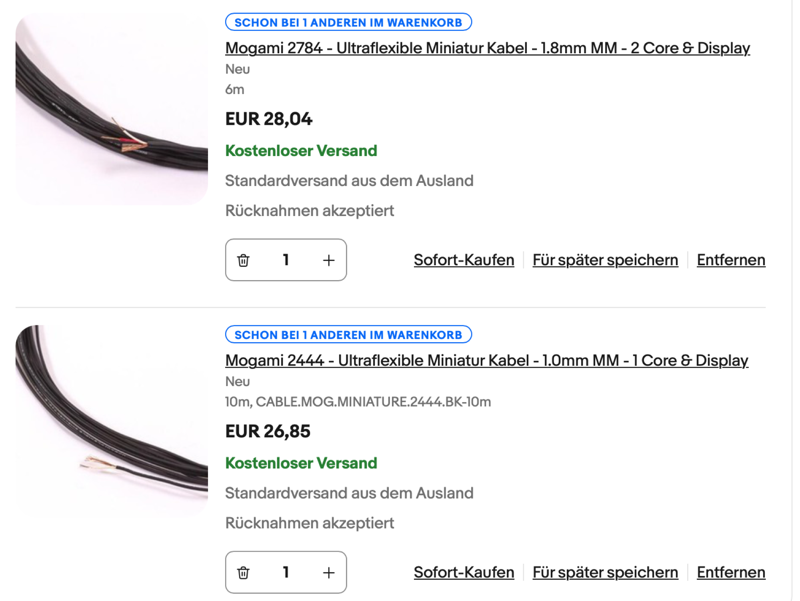 |
| general parts info | Und R305, ebenfalls 47 R, ist ja als Alternative zum optionalen PR23 Trimmer |   |
| general info | R 297, R 298 und R299 sind Koppelwiderstände (1/4 W) für die Leistungsstufe der NF Amps. Zur Reduzierung des Klirrfaktors und Verbesserung des Ansprechverhaltens der beiden Germanium Transistoren bei sehr geringen Lautstärken. Können aber auch weggelassen werden, ohne dass jemandem der Unterschied im normalen Musiker Umgang mit dem Gerät auffallen würde. |   |
| reverb hum | select Q9 for low voltage - 1v/1mv? |   |
| Power Inlet Ymaaha PA-30 | [vcs3\_power\_ext\_LMNC.fpd](assets/vcs3_power_ext_LMNC.fpd) | 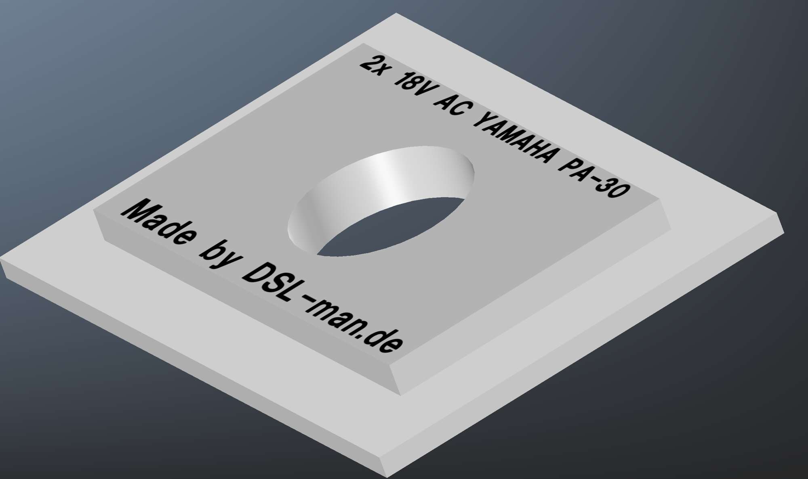 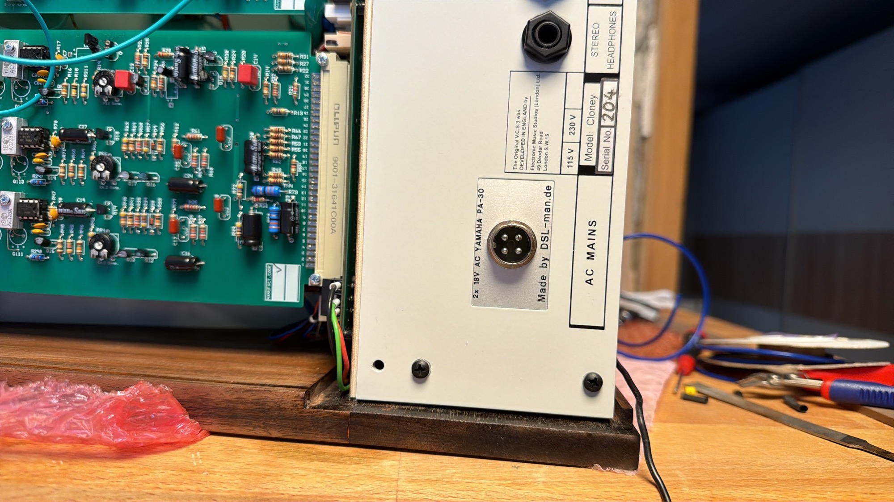 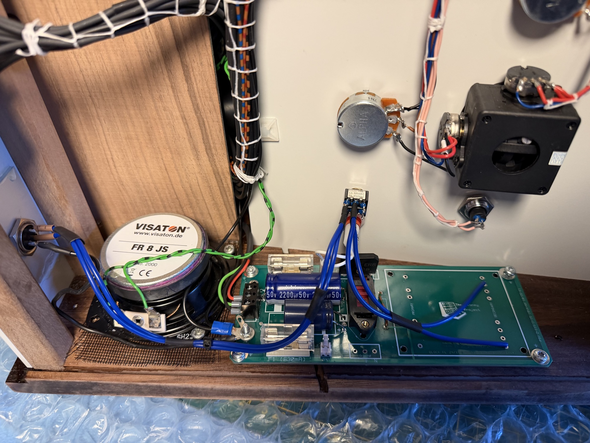 |

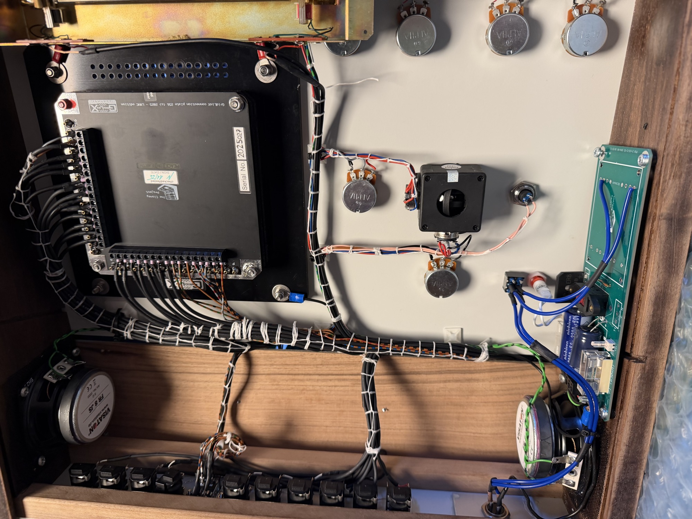

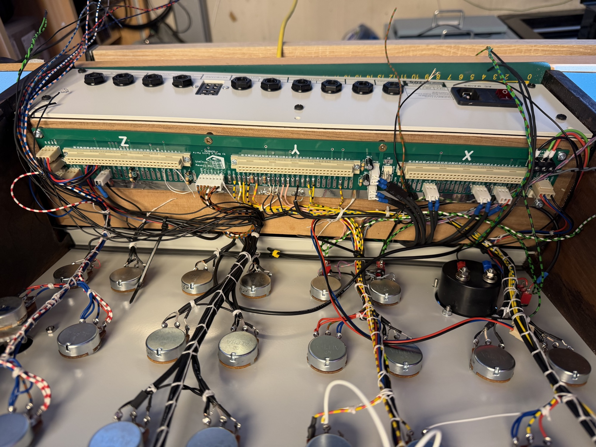
