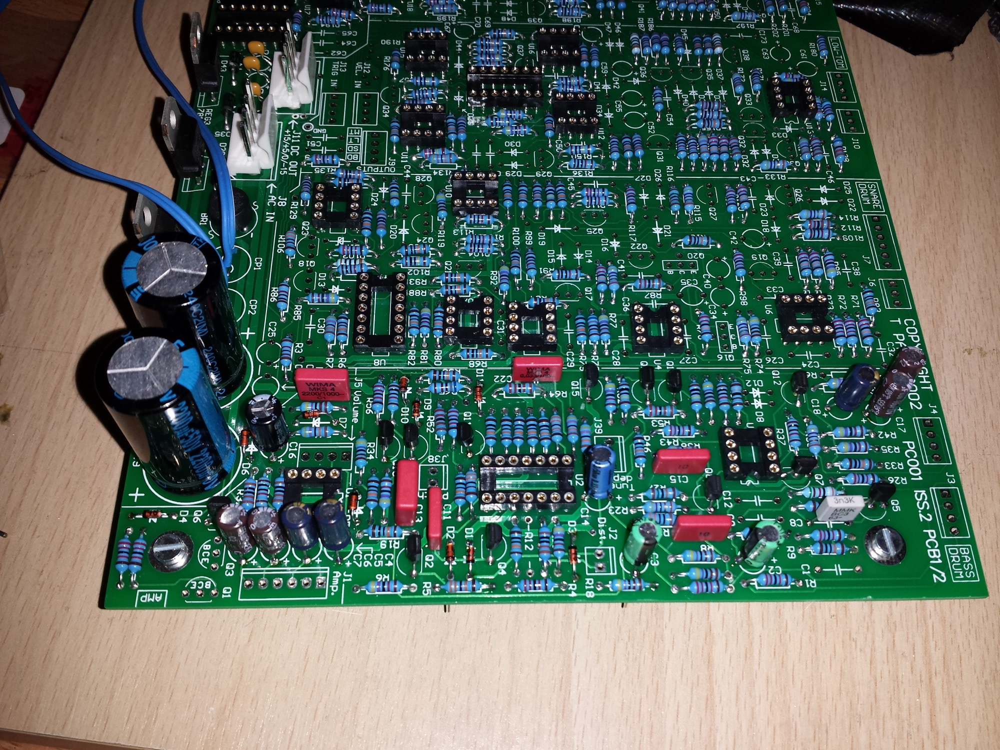
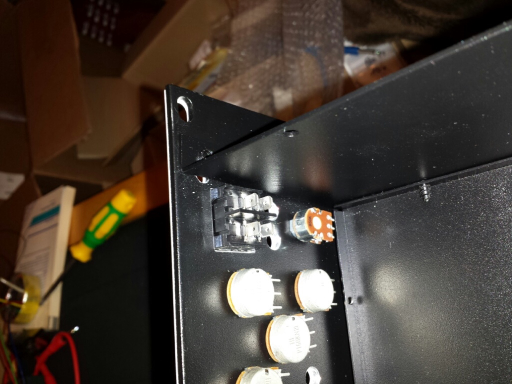
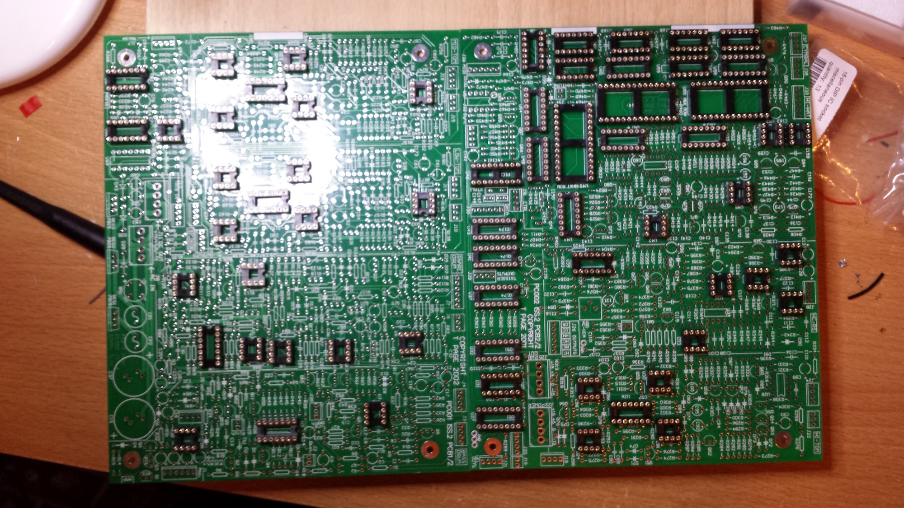
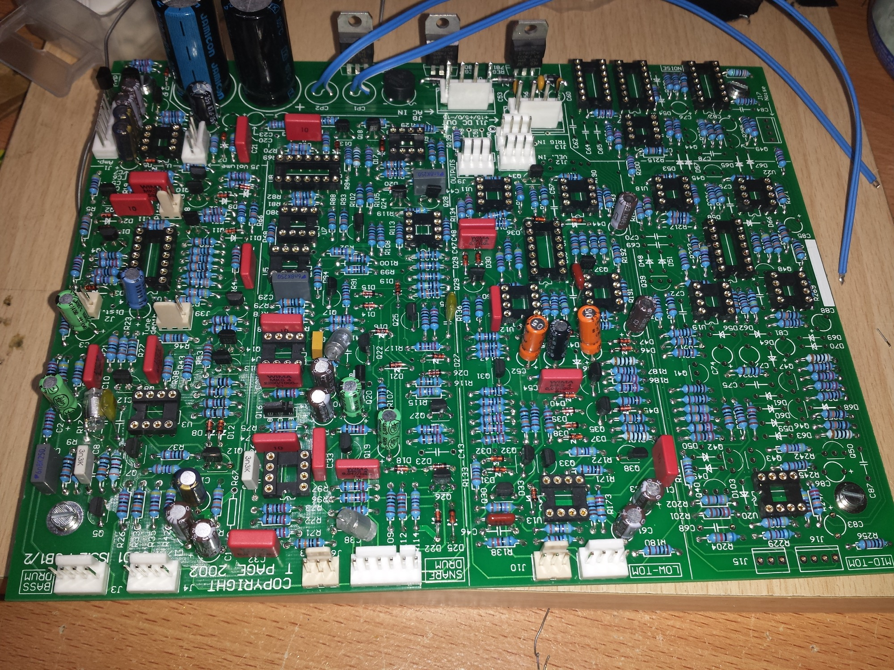

# TR9090 Project

### TR9090 - a 909 Clone without Sequencer

### `STATUS`

### Startdate: 01.10.2013

### Duedate: 03.02.2014

### Manufacture link:[http://www.bild-schall.com/product/digi-eins](http://www.bild-schall.com/product/digi-eins)[http://www.9090project.co.uk/](http://www.9090project.co.uk/)

**More infos:**

[http://www.subatomicglue.com/9090l0g/](http://www.subatomicglue.com/9090l0g/)

**Files from 9090 project (download from projectwebsite)**

[9090\_partslist\_5thJanuary2004.pdf](assets/9090_partslist_5thJanuary2004.pdf)

[9090\_schems\_10june02.pdf](assets/9090_schems_10june02.pdf)

[9090\_silkscreens.pdf](assets/9090_silkscreens.pdf)

[9090\_wiring.pdf](assets/9090_wiring.pdf)

[9090userguide161102.pdf](assets/9090userguide161102.pdf) (user and construction guide)

**Extracted in pdf view:**

[9090\_partslist\_5thJanuary2004.pdf](assets/9090_partslist_5thJanuary2004.pdf)

[9090\_schems\_10june02.pdf](assets/9090_schems_10june02.pdf)

[9090\_silkscreens.pdf](assets/9090_silkscreens.pdf)

[9090\_wiring.pdf](assets/9090_wiring.pdf)

[9090userguide161102.pdf](assets/9090userguide161102.pdf)

**Building Steps:**

### Building issues:

BC559 BC549 have CBE pinout

its needed to bend and change the 2SA115 2SC603 pins from ECB to CBE

check replacement transistoren for matching.

replace dual trannies **2SA798**by BC559 or 2SA115 **matched**

**Frontpanel Powerswitch**

**the frontpanel don´t fit to the case due to enough space for the powerswitch..**

**the powerswitch must insert on the rearpanel or order a new customcase**

**(wrong 19" rack ordered before)**

**Project cancelled: Milestones failed, not enough enthusiasm to finish a crap project.**

**a Roland TR-8 sounds very good and have a sequencer**😉
