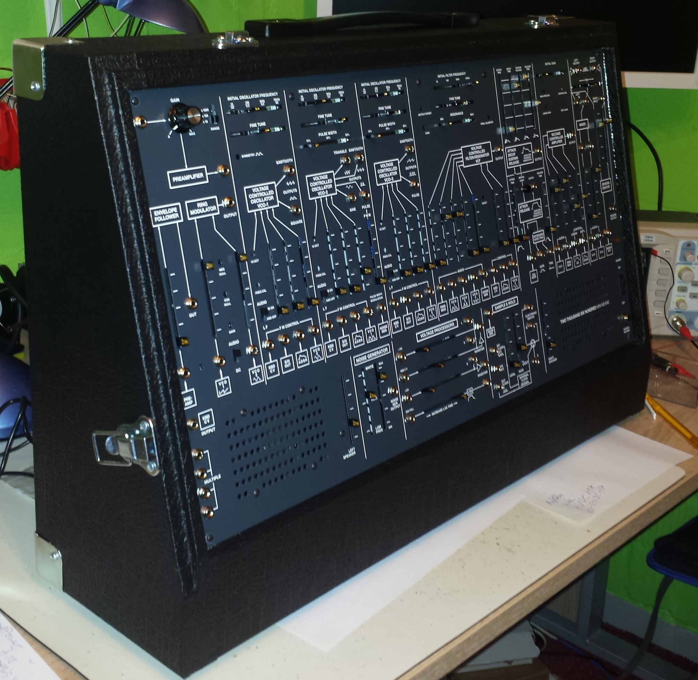

# TTSH ARP 2600 Clone

### Status: `finished`

**due to price changes on my Webhosting, feel free to send a [paypal gift to support my website](../../../impressum-info/impressum/paypal/index.md)**

**thank you**

<form action="https://www.paypal.com/cgi-bin/webscr" method="post" target="_top">
<input type="hidden" name="cmd" value="_donations">
<input type="hidden" name="business" value="percysworld@web.de">
<input type="hidden" name="lc" value="GB">
<input type="hidden" name="item_name" value="DSL-man">
<input type="hidden" name="no_note" value="0">
<input type="hidden" name="currency_code" value="EUR">
<input type="hidden" name="bn" value="PP-DonationsBF:btn_donateCC_LG_global.gif:NonHostedGuest">
<input type="image" src="https://www.paypalobjects.com/en_US/i/btn/btn_donateCC_LG_global.gif" border="0" name="submit" alt="PayPal - The safer, easier way to pay online!">

</form>

> **Info**
>
> **please use this page for more Infos:**
>
> **[TTSH Home](../../../ttsh/index.md)**

TTSH company page: [http://thehumancomparator.net/](http://thehumancomparator.net/)

Forum muffwigler: [http://www.muffwiggler.com/forum/viewtopic.php?t=82997](http://www.muffwiggler.com/forum/viewtopic.php?t=82997)

release plan: [TTSH Home](../../../ttsh/index.md)

### Children Pages:

## **TTSH Project documentation TTSH (Arp 2600 clone)**

These project documentations and services are non commercial

**german version:**

"Dieses "Projekt" ist ausschliesslich privat für einen mir bekannten Nutzerkreis.

Alle hier aufgezeigten Details sind zur Projektdokumentation bestimmt."

