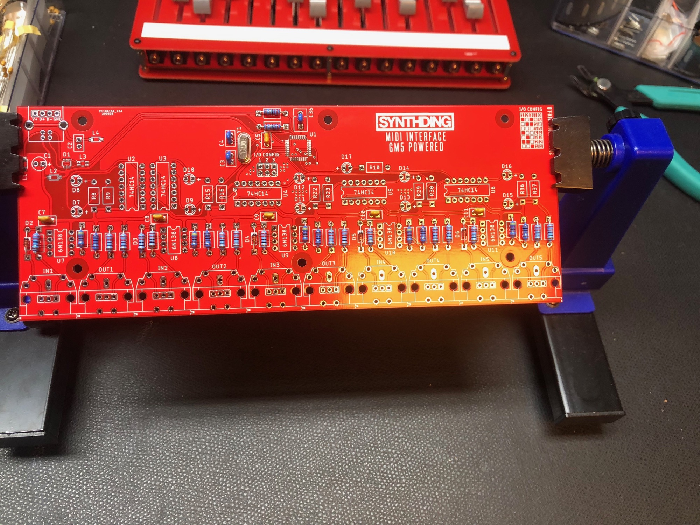
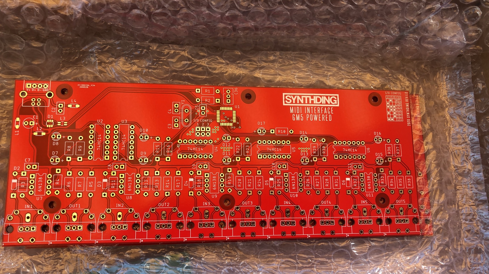
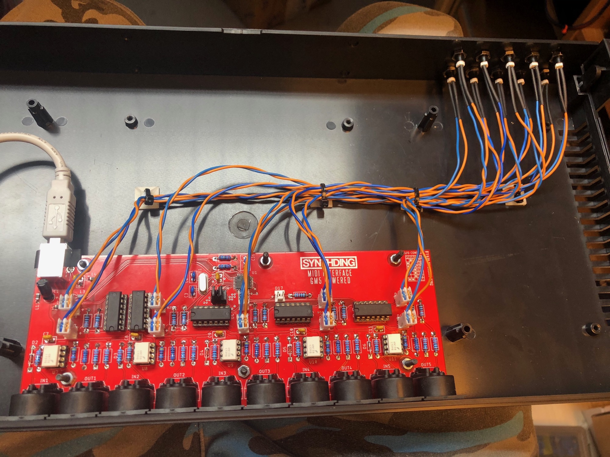
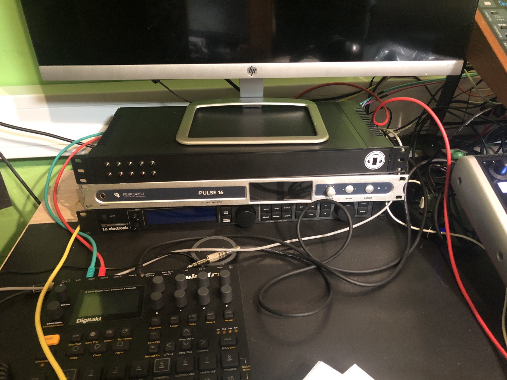
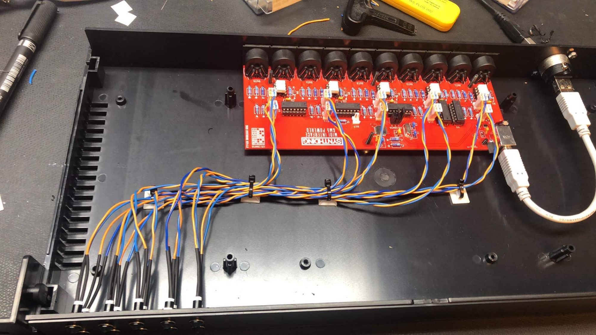

# USB MIDI Interface

> **Project**
>
> ### Projecttitel: USB MIDI Interface
>
> ### Status: `done`
>
> ### Startdate: 04/2020
>
> ### Duedate: 06/2020
>
> ### Manufacture link:

**Specs:**

5x MIDI IN and5x MIDI Out with USB2.0

The Software/Firmware is from ploytec and used in many commercial products.

PCB and Preprogrammed chip is available from me (until all pcbs are gone) on diysynth.de

**BOM:**

[Partlist](assets/Partlist)

[https://docs.google.com/spreadsheets/d/1u6wgABhqt0vknTZJFNVShALNdmQvRK\_okAad-lOCuyc/edit#gid=0](https://docs.google.com/spreadsheets/d/1u6wgABhqt0vknTZJFNVShALNdmQvRK_okAad-lOCuyc/edit#gid=0)

(Screws, spacers, LEDs and LED holder are not in the BOM)

Addional parts which are not in the above BOM:

When you want the plastic/ABS case, order this 3 parts from TME.eu

Case:  G17081UBK Gehäuse:standardmäßig 19";1U;schwarz;Mat.Geh:ABS;Y:203mm

USB adapter:

CP30111 Adapter;USB A Buchse-Hinterteil,USB B Buchse-Vorderteil;FT ROHS Hersteller: CLIFF 

USB cable for inside: 

CAB-USBAB/0.19 Kabel;USB 2.0;USB A-Stecker,USB

