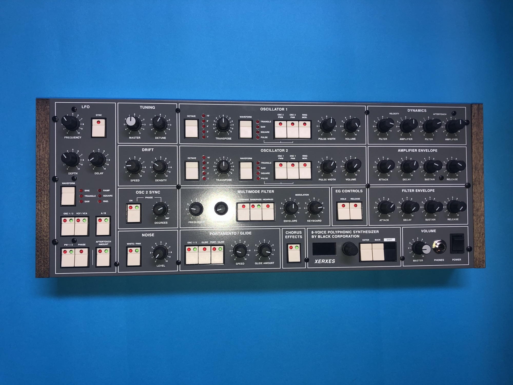
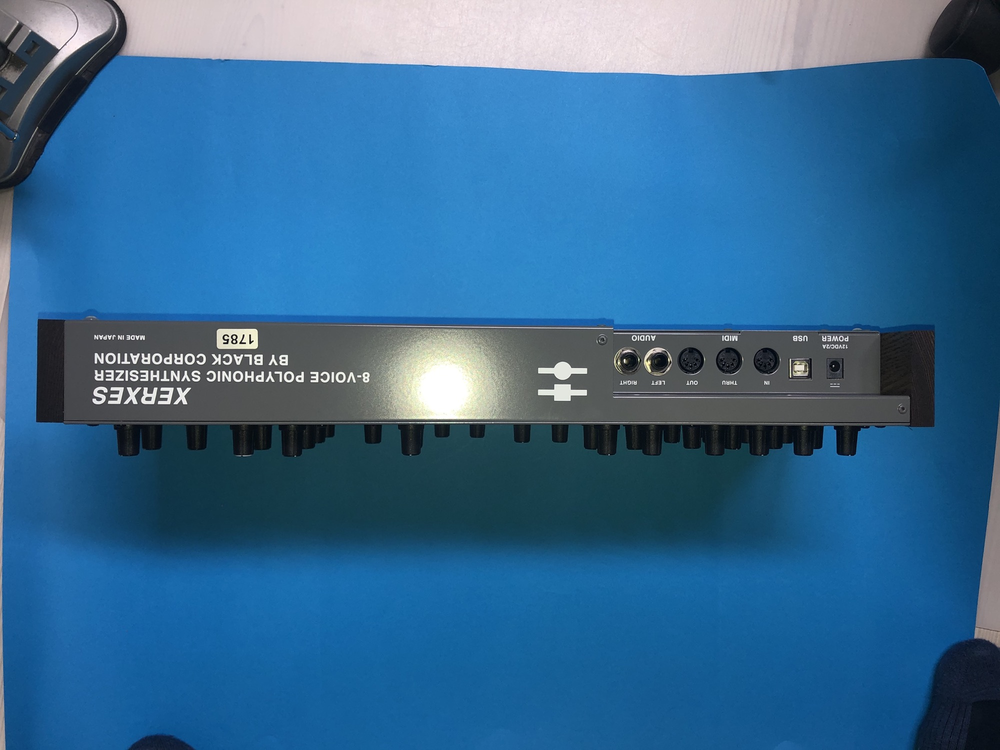
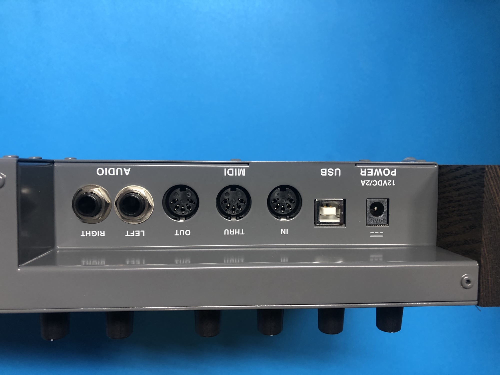
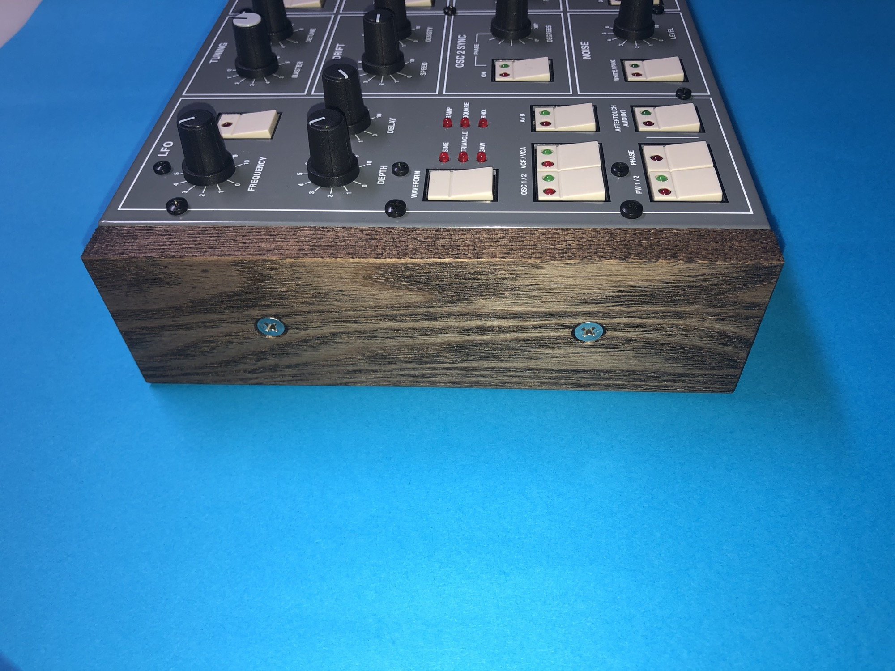

# Xerxes Elka Synthex inspired Synth

(its not a DIY Project)

Here's my review for amazon.de about the Xerxes:

[https://www.amazona.de/test-black-corporation-xerxes-synthesizer/](https://www.amazona.de/test-black-corporation-xerxes-synthesizer/)

please note: there's a bug fix for the first version

> XERXES delivers and unmatchable level of warmth through its two digitally controlled analog oscillators. A multimode analog filter, noise generator, 2 ADSR envelopes, 2 sync-able LFOs, unique analog BBD chorus with 3 modes, full MPE-based polyphonic aftertouch, and complete MIDI control work together to bring a classic analog sound ready to integrate into modern times.
>
> Xerxes produces triangle, saw, square, and PWM waveforms with variable drift controls from each oscillator, sync with variable phase shifting, and ring modulation allowing for complex cross-modulation effects. Each oscillator features an octave switch, bipolar transpose potentiometer +/-7 semitones, a master tuning pot affecting both oscillators, and a detune knob for subtly detuning Oscillator 2 to Oscillator 1. Portamento/Glissando or Glide can be programmed to affect Oscillator 1, 2, or both.
>
> The analog multimode filter on XERXES offers 24db/oct low pass and high pass modes and a band pass filter mode switchable from 12db/oct & 24db/oct for all kinds of filter characteristics. The filter can also be modulated by the dedicated ADSR envelope, LFO, velocity, and aftertouch (both MPE and Polyphonic Aftertouch supporting) allowing for incredibly expressive performance and programming.
>
> XERXES features 6 LFO waveforms: Sine, triangle, saw, ramp, square, and random, plus a dedicated delay control to fade the LFO to the full amount set by the depth knob. Two LFOs are selectable with an A/B switch, each of which can be used to control multiple parameters set by the button switches to control oscillator tuning (A/B/Both) filter cutoff, and amplifier levels (VCF/VCA/Both.) Each of these LFOs also includes a Sync on/off switch.
>
> XERXES features a beautiful, fully-analogue BBD-based chorus with 3 selectable modes, similar to the chorus effect found on the vintage Elka Synthex synthesizer. XERXES is equipped with stereo 1/4” outputs to take full advantage of the stereo chorusing effect.
>
> Finally, XERXES features full MIDI control and ability to store 128 user presets per bank across 11 banks (Factory, Vintage and 9 user banks), integrating this classic synth concept seamlessly into any studio setup.

**User Manual:**

[Xerxes-Instruction-Manual-Rev-0.7.pdf](assets/Xerxes-Instruction-Manual-Rev-0.7.pdf)

