# Yocto 808 clone

> **Project**
>
> ### Projecttitel: Yocto 808 clone
>
> ### Status: `finished`
>
> ### Startdate: Feb.2014
>
> ### Duedate: March 2014
>
> ### Manufacture link:[http://www.e-licktronic.com/en/](http://www.e-licktronic.com/en/)

#### Subpages:

[https://www.youtube.com/watch?v=a0ZU\_H\_4Rl0](https://www.youtube.com/watch?v=a0ZU_H_4Rl0)

#### Documents for build and guides:

[Yocto Main Board v1.0.rar](assets/Yocto-Main-Board-v1.0.rar) -&gt; eagle files -&gt; extracted as png [see here](yocto-schematics/index.md)

[Yocto v1.0 user manual.pdf](assets/Yocto-v1.0-user-manual.pdf)

[Detail Yocto Kit v1.0.pdf](assets/Detail-Yocto-Kit-v1.0.pdf) (BOM)

[Yocto schaeffer faceplate.rar](assets/Yocto-schaeffer-faceplate.rar)

[Yocto\_v1.0\_Acrylic\_Case.rar](assets/Yocto_v1.0_Acrylic_Case.rar)

[Yocto Overlay v1.0.jpg](assets/Yocto-Overlay-v1.0.jpg)

### Schematics:

[link](yocto-schematics/index.md)

### Mods and Building tips:

[see here](yocto-808-clone-known-issues-building-tipps/index.md)

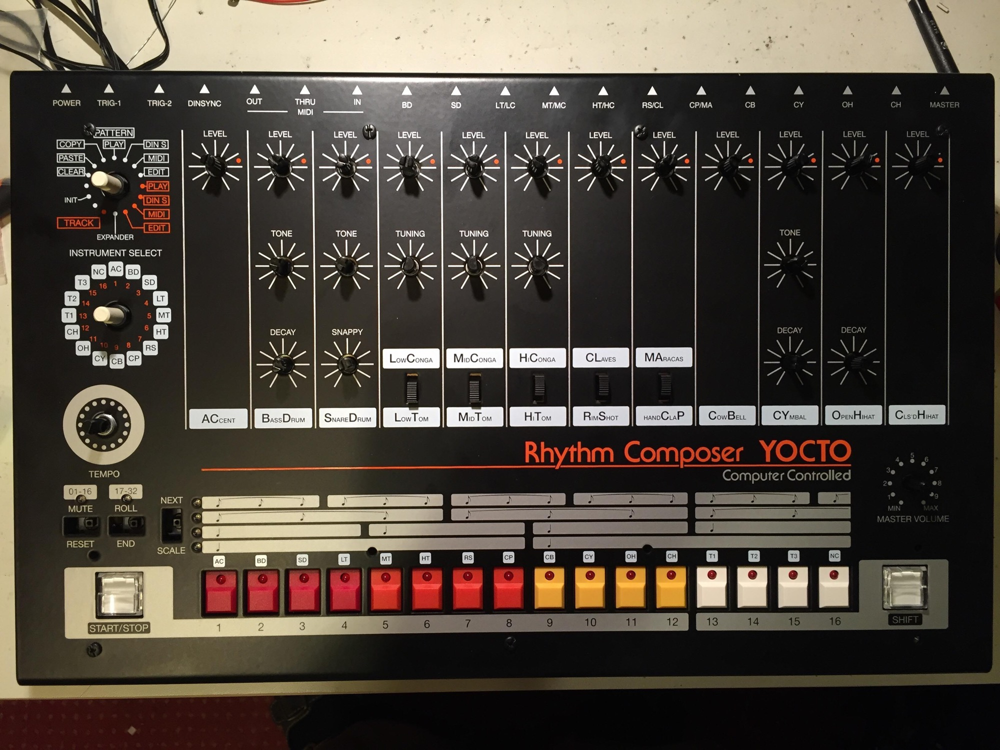

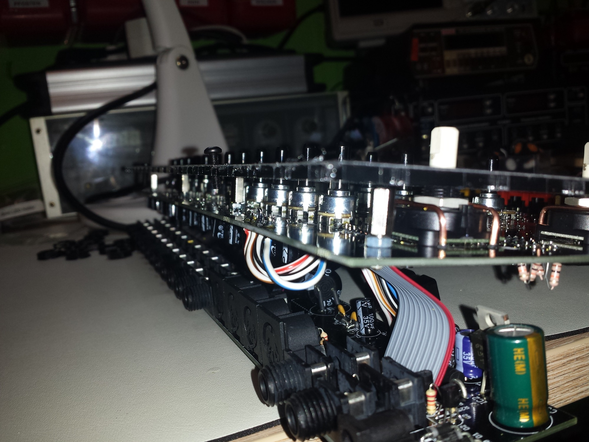

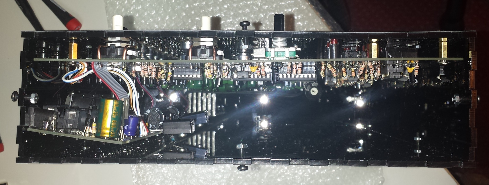

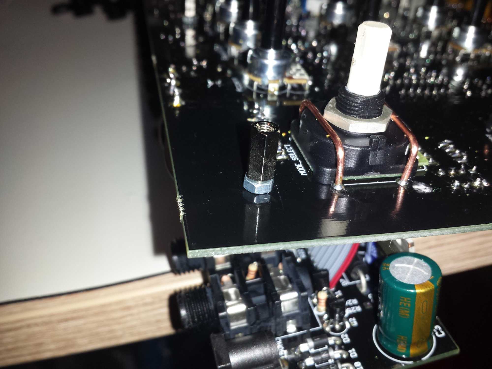

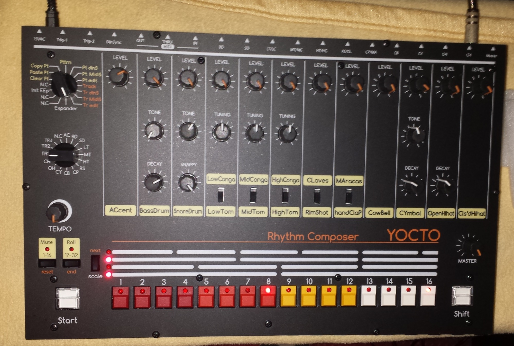

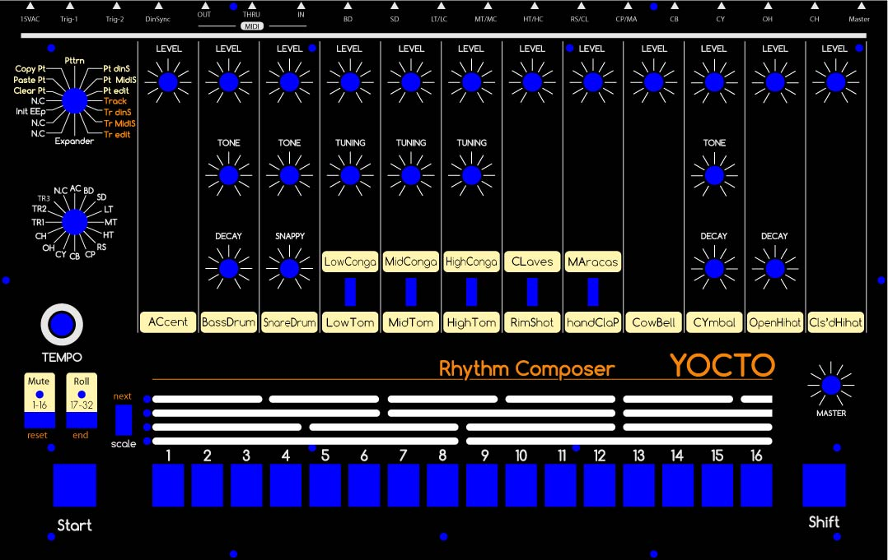

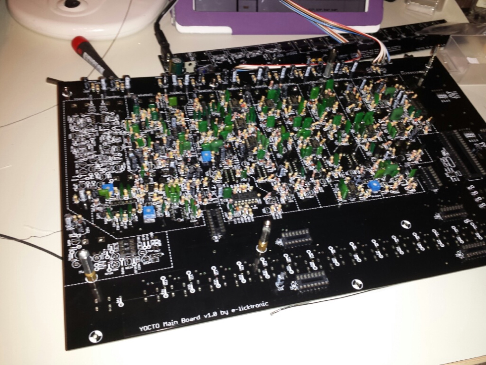

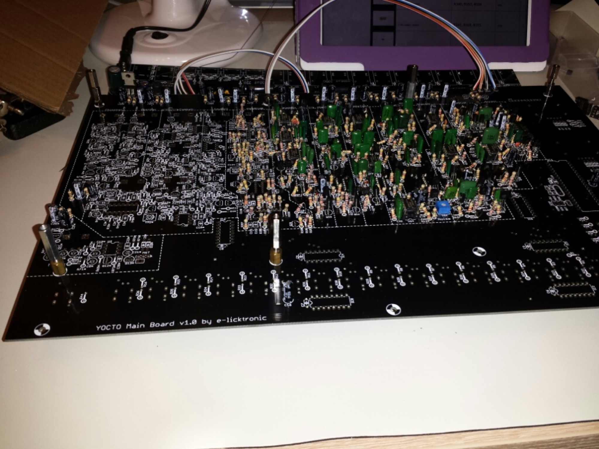

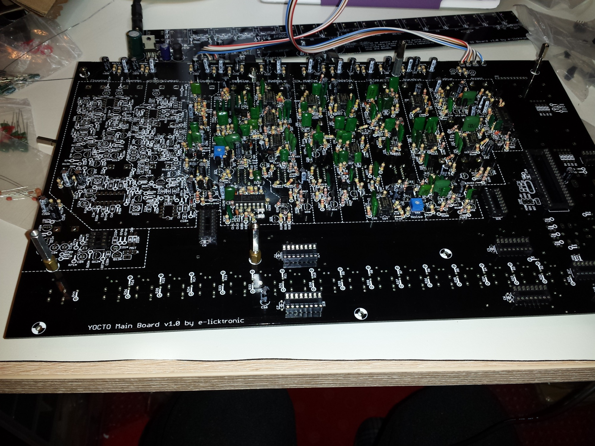

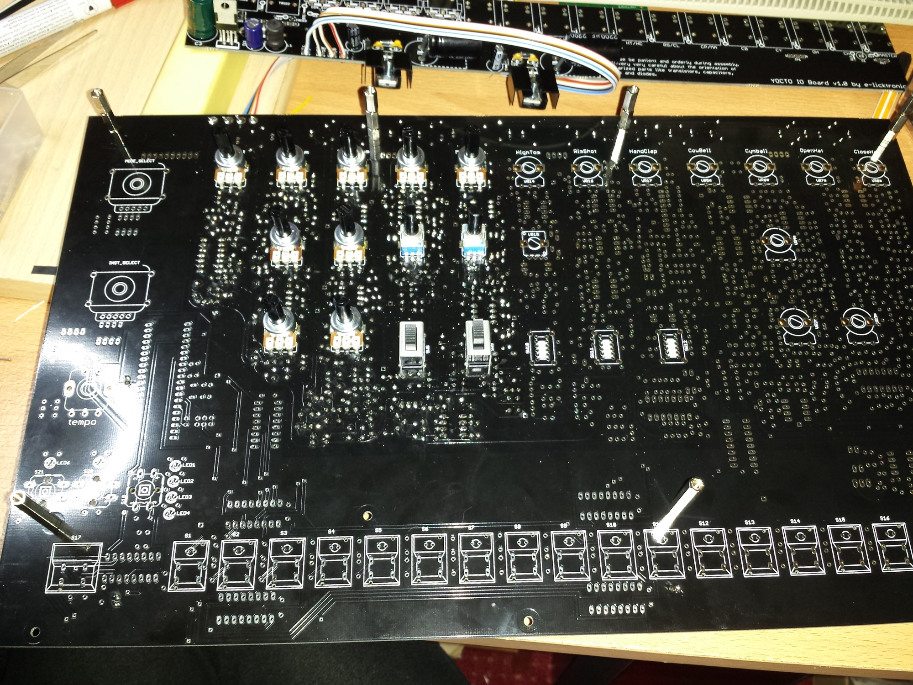

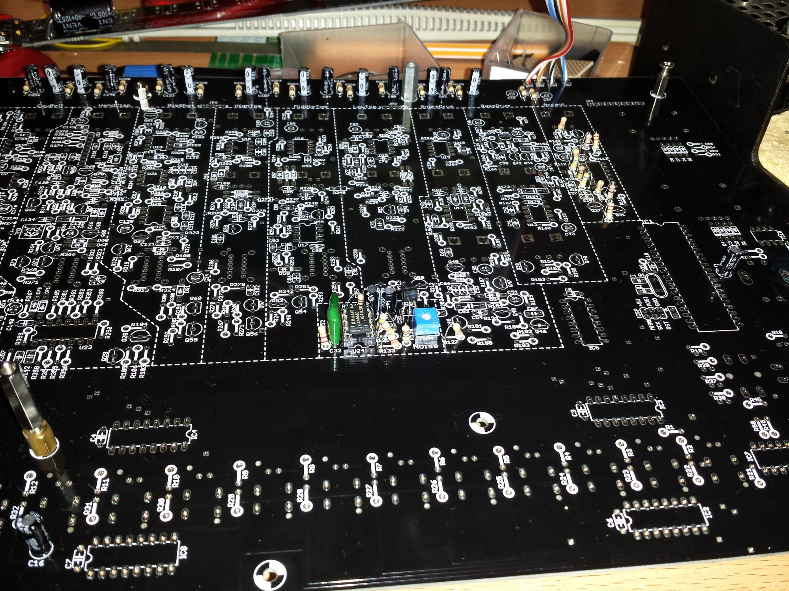

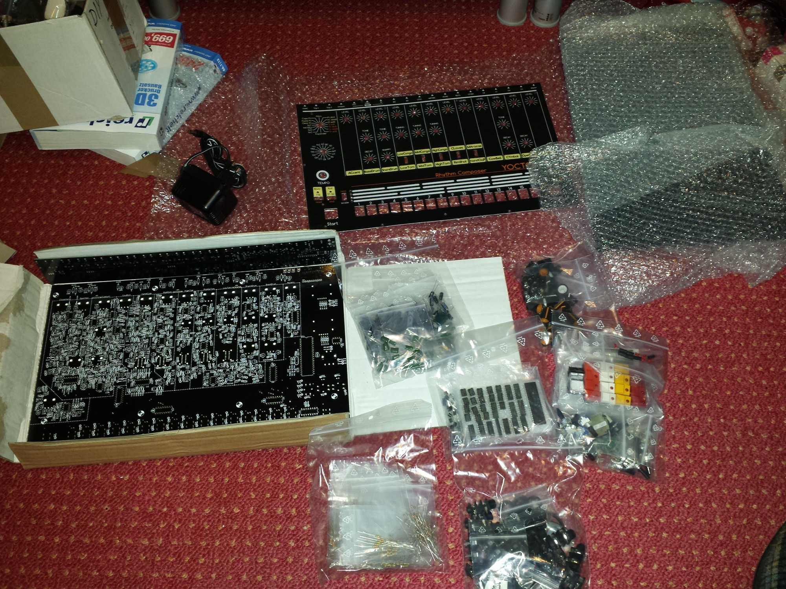
