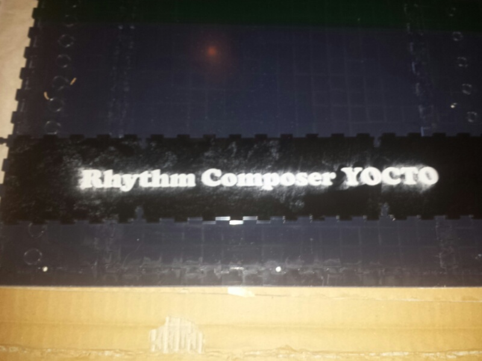

# Yocto 808 clone - Known Issues, Building tipps

## Known Issues and Building tipps for yocto 808 Clone Batch2 - January 2014 pcb version

### Failure in Cymbal Build Instruction before 11.02.2014

**(copy von e-licktronic forum)**

A customers found a mistake on the schematic.

R108\* and R111\* in the Cymbal section are switched.

The right value of R108\* is 22K and R111\* is 18K.

(the building instruction was updated to correct value on 10.2/11.2.2014)

R44 from 100k to 50k otherwise a 100k Trimmer to  change the„tuning range“ for TM1   ✅ validation July2014

### Chassis

unscrew the nuts from all pots/encoder or the board bends.

if needed use washers together with spacers

### Custom Rearpanel:

i´m planning for a second yocto a rearpanel with powerswitch.

in the EPS file i removed the square hole for the powerconnection, i have to connect from the pcb the gnd cable to the switch, see here - same is in the LXR Drumsynth modification.

here is the modificated EPS file.

[Yocto\_v1.0\_Acrylic\_Case\_ohne\_powercon.eps](assets/Yocto_v1.0_Acrylic_Case_ohne_powercon.eps)

### Custom LOGO:

added a "Rhythm Composer YOCTO at the Frontpanel

and removed the powersupply square cutting at the rearpanel (see custom rearpanel info above)

[Yocto\_v1.0\_Acrylic\_Case\_ohne\_powercon.eps](assets/Yocto_v1.0_Acrylic_Case_ohne_powercon.eps)

### Noise section:

**Measurement AC** !!

Adjust the TM4 trimmer for  130mV on pin 1 of 4558.  

**its important** to use a good DMM (multimeter), most cheap DMM have in AC voltage measurement with 3digits high failure rates and cant display 160mV  - shows only 0,01.

i highly recommend a 4,5digits or better DMM with 0,1% tolerance

i have at least 250mV so changing R127 to 47K ...

**for Handclap section:**

[**http://www.e-licktronic.com/forum/viewtopic.php?f=16&t=146&p=525#p525**](http://www.e-licktronic.com/forum/viewtopic.php?f=16&t=146&p=525#p525)

**hear the issue:**

[**http://m.soundcloud.com/patrickj-ricke/yocto-handclap-issue**](http://m.soundcloud.com/patrickj-ricke/yocto-handclap-issue)

**808 issue handclap:**

[http://www.muffwiggler.com/forum/viewtopic.php?t=96102&start=10&sid=d6f73a9fdac17e18f1fde05211f88b3d](http://www.muffwiggler.com/forum/viewtopic.php?t=96102&start=10&sid=d6f73a9fdac17e18f1fde05211f88b3d)

This was a little tricky to figure out:

 clap reverb mod -
 replace r376 (47k) with 100k trimpot

 This will vary the reverb between full and completely off. 

C144 must have the correct polarity

you have to trim TM3 to get a handclap sound of your choice

make sure that your noise is trimmed between 100mV and 140mV AC (RMS)

please read the TR-808 Servicemanual, you find there addional infos about Gain  (you can change 2 resistors to minimize the gain of the handclap section)

if your Handclap reverb dont work:  measure with a scope the triggeroutput (Tranny Q29), you find it too on the R360 and the q69  ( you  must have this on both ! )

### Cowbell

Range: replace  R44 to a 50k trimmer

adjiust the trimmer on left hand - after a bleedthru you must trim one trimmer a bit more to get a cowbell.

you can doublecheck them by using a scope

[http://www.e-licktronic.com/forum/viewtopic.php?f=16&t=189&start=20](http://www.e-licktronic.com/forum/viewtopic.php?f=16&t=189&start=20)

### Low Noise Ratio (SNR) for Mastersection

[http://www.e-licktronic.com/en/content/39-master](http://www.e-licktronic.com/en/content/39-master)

change in the Mastersection **all** carbonfilm resistors to Metallfilm resistors and change **all** cheap electrolyt caps to LOW ESR caps..

change the ceramic cap (220p) to a c0g capaciator

### Low Noise Ratio (SNR) for Mastersection

[http://www.e-licktronic.com/en/content/39-master](http://www.e-licktronic.com/en/content/39-master)

change in the Mastersection **all** carbonfilm resistors to Metallfilm resistors and change **all** cheap electrolyt caps to LOW ESR caps..

change the ceramic cap (220p) to a c0g capaciator

### Noise Reducing SNR/NOISE RATIO generell

in many Voices/sections you can find at the output amps a resistor, to reduce the noise ratio you can change all resistor to  metallfilm resistors.

**Bassdrum:**R175 1K, R173 6K8, R174 100K,C50 1uF/50V

**Snares:** R207 1K ,   R210  470K,   C68 33uF/35V

**Rimshot:** R295 1K, R327 470K, R330 470K, C126 33uF/35V

**Low Tom/Low Conga:**  R235 470K, R238 1k, C82 33uF/35V

**Mid Tom/Mid Conga:**R266 470K, C95 33uF/35V, R239 1K

**Hi Tom, Hi Conga:** R291 470K, R294 1K, C109 33uF/35V

**Hihat:** R161 470K, R172 1K, C83 33/6,3V, R159 470K, R169 1K, C81 33uF/35V,

**Master:** all resistors, all Electrolyt caps ( 2x 2,2uF/50V, 3x1uF/50V, 33uF/353V)

**Cowbell:** R163 1K

**Accent:** all resistors to metall, C25 + C34 to Low ESR (2x 47uF/35V)

**Cymbal:** R166 1k, R128 470K, C78 33uF/35V

**Handclap:** R296 1K, R375 470K, C145 33uF/35V

**Powersupply :** all to metallfilm and all to low ESR caps ( 100R metall x 25  and 47uF/16V x25, 3x 100uF/35V)

powersupply main: C5,C7 2x 2200uF/35, C11 220uF/35, C12,C13- 100uF/35

=   4x 1uF35V ✅

, 9x 33uF/35V,✅

 2x 2,2uF/50V,✅

 27x 47uF/35V, ✅

 3x 100uF/35V,✅

2x 2200uF/35V, ✅

 1x 220UF/35 ✅

, 2x 100uF/35V ✅

**Shopping basket @ reichelt.de**

change the 100uf cap to 35V or more  in reichelt basket

[http://www.reichelt.de/?ACTION=20;AWKID=866139;PROVID=2084](https://secure.reichelt.de/index.html?&ACTION=20&LA=5010&AWKID=866139&PROVID=2084)

metallfilm resistors don´t included there due to full homestock..
