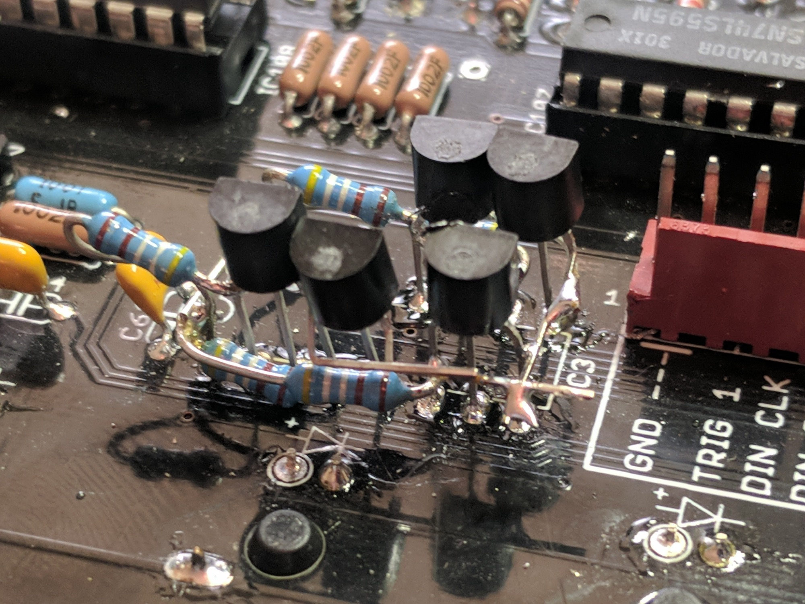
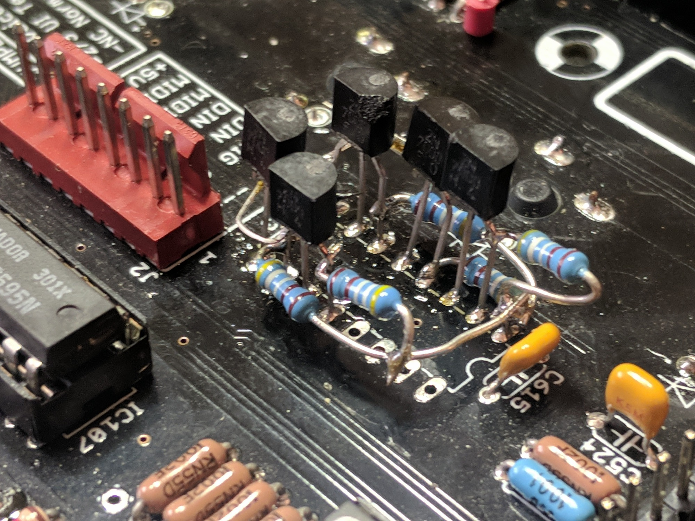

# YOCTO rev2

updated 02/2026

Modwiggler Forum : [https://modwiggler.com/forum/viewtopic.php?t=258389](https://modwiggler.com/forum/viewtopic.php?t=258389)

[https://www.e-licktronic.com/forum/viewtopic.php?t=1557](https://www.e-licktronic.com/forum/viewtopic.php?t=1557)

i have the 2.003beta preprogrammed ICs for sale on www.DIYSYNTH.de

confirmed the bug - listed below

I got a YOCTO 2 for a repair.
the voices wasn't triggered.
I swapped CD4051 IC114, IC111 to TI(Texas Instruments) and it works.

 IC3 is  a CD4049UBE from TI too and involved.
ST Versions wasn't working, in voice test mode -&gt; no sound - &gt; trigger was only 500mV

update 28Feb2026: use a Cd4009UBE from texas instruments  instead of CD4049, on my 2nd yocto2 from a client was the result better  !!

[https://www.tme.eu/de/details/cd4009ube/puffer-sender-treiber/texas-instruments/](https://www.tme.eu/de/details/cd4009ube/puffer-sender-treiber/texas-instruments/)

### Build Documents

---

All files are on GitHub

[https://github.com/e-licktronic/Yocto-V2.0/tree/main](https://github.com/e-licktronic/Yocto-V2.0/tree/main)

here are the most important files:

[Yocto v2.0 Building Manual.pdf](assets/Yocto-v2.0-Building-Manual.pdf)

[Yocto v2.007.sch](assets/Yocto-v2.007.sch)

[Yocto v2.007.brd](assets/Yocto-v2.007.brd)

[Yocto v2.002 user manual.pdf](assets/Yocto-v2.002-user-manual.pdf)

Be cautious of the 2SK30A's that are included with the kit. The suffix -Y and -GR refer to specific Idss ranges that are listed on the datasheet for that part. Invest in a transistor tester that can test Idss, or breadboard a circuit for it and test your 2SK30A's! There is one reported case already of the Idss ranges being wildly off.

### Bugfixes (Mainboard marked Rev 2.007, Firmware Rev 2.003Beta)

update 02/2026 - not required - just try different brands

---

**Issue 1: Accents not triggering drum voices in voices test mode (not only Accents)**

The first issue involves the multiplexer for the accent signals going out to each of the various voice circuitry and triggering any of the drum voices to make a sound. If your Yocto 2 says that it's on and should be sending out sounds through any of the jacks and absolutely nothing is coming out, this is probably why.

However, there seems to be cases where this bug is not a problem depending on the troublesome IC

**The Why:** The Yocto 2 has a single DAC (IC118) that spits out the analog voltage, the "Accent", under control from the Atmega1284. That voltage goes through a pair of CD4051 multiplexers (IC's 114 & 111) to various buffering TL074's (IC's 1, 2, and 110) before hitting the triggering part of each voice. Those CD4051's have address lines that get cycled through entirely on each step so that the Atmega can control which voices have been assigned the accent on that particular step. Those address lines come the Atmega, but go through a CD4049 hex inverter "buffer" first. The Atmega flicks through a 3 bit counting sequence (and inhibit lines) on those traces, but the **CD4049 does not**do the very important job of shifting the level of the digital signal **from 5V** native**to the Atmega up to the 15V** necessary to drive the address lines of the CD4051. The CD4049 inverting "buffer" was perhaps being counted on to just accept those signals and convert them from 0-5 volt logic signals to 0-15 volt logic signals, but that's not the case (though it's possible some much later CD4049's do actually have that circuitry built in, it's hard to say). As a result, the output of the CD4049 will (normally) flick between 15V and 10V, and 10V is too high to be counted as a low for the address lines of the CD4051.

**The Fix:** One thing that can be done to fix this is throw out the CD4049 and use a single MOSFET (2N7000, be extremely cautious of the pinout from the OnSemi datasheet, you can be certain of the drain and the source pins on a MOSFET by using the diode test mode on your multimeter and measuring a ~0.7V diode voltage drop in only a specific direction, in which case the positive lead of your MM is connected to the source, negative lead touching drain) and a resistor on the drain for every single inverting channel, soldered in deadbug style to give the CD4051 the correct digital drive, while also doing the inverting at the same time. The line from the Atmega goes into the gate of each MOSFET, and the source pins are just tied straight to ground. The drain has the resistor (4K99 in this case, doesn't really matter) in line before it hits +15 from the chip's regular supply. The drain ALSO is the output, which then goes into the address line of the CD4051.

If you can apply this fix, the address lines will work, and the muxes will start flicking the DAC's voltage around properly again.

**Summary:**Replace IC 3 with the following circuit ( comment from DSL-MAN: was NOT working as aspected by me, not all voices are triggered then correctly or Snare was missing)

not from me are the following pictures:

**Firmware:**

For the one who use the TL866 programmer is here a hint for the updates with .hex files.

Fuse Low Byte: 0xD6
Fuse High Byte: 0xDC
Extended Fuse Byte: 0xFD
Lock Bit Byte: 0xFF

**V2.002 (oldest)**

[Yocto\_v2\_002.hex](assets/Yocto_v2_002.hex)

v2.003:
-Fixed led scale bug
-Fixed pattern direction bug
-Fixed LCD special character bug
-Improved accent stability
-Fixed MIDI Clock lag
-Fixed DIN clock out phase
-Pattern start counting from 1 instead of 0
-Fixed Trig1 length when MIDI played
-Fixed group bug
-Improved Track mode fixtures

[Yocto\_v2\_003.hex](assets/Yocto_v2_003.hex)

[Yocto\_v2\_003.syx](assets/Yocto_v2_003.syx)

BETA:

-Should fix encoder issue

[Yocto\_v2\_003beta.hex](assets/Yocto_v2_003beta.hex)

[Yocto\_v2\_003beta.syx](assets/Yocto_v2_003beta.syx)
