# Yocto Schematics

[Board-Layout.png](assets/Board-Layout.png)

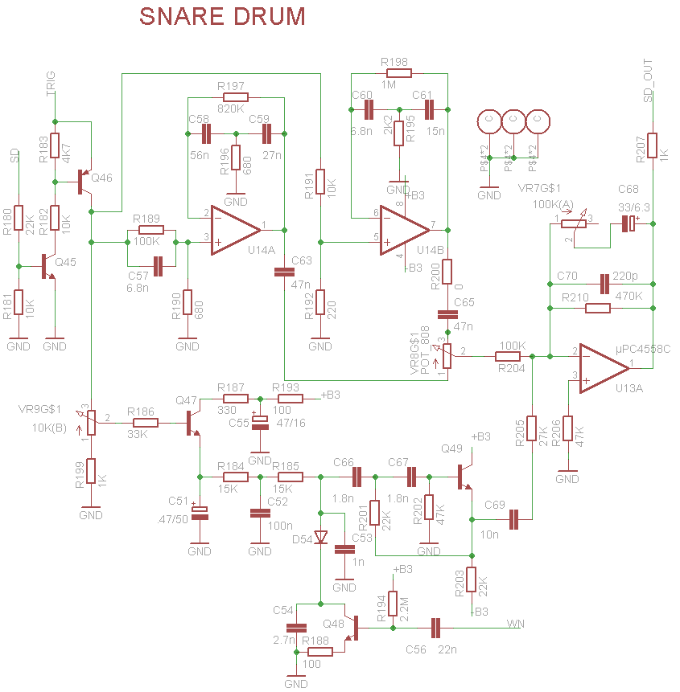

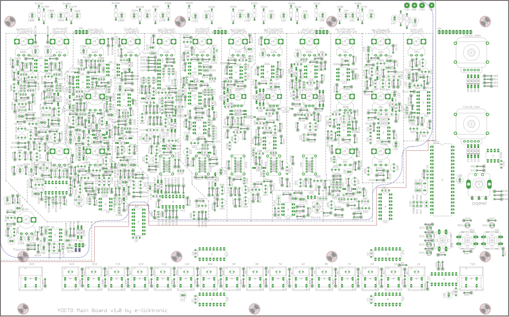

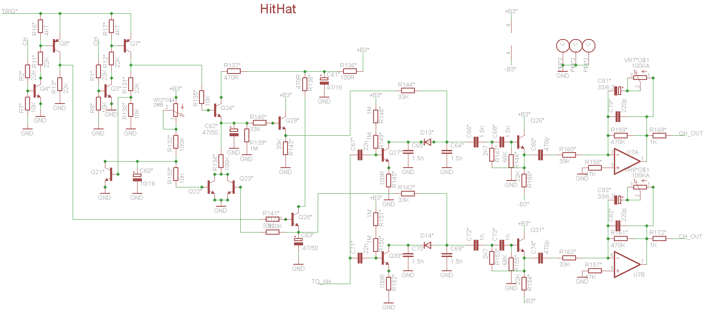

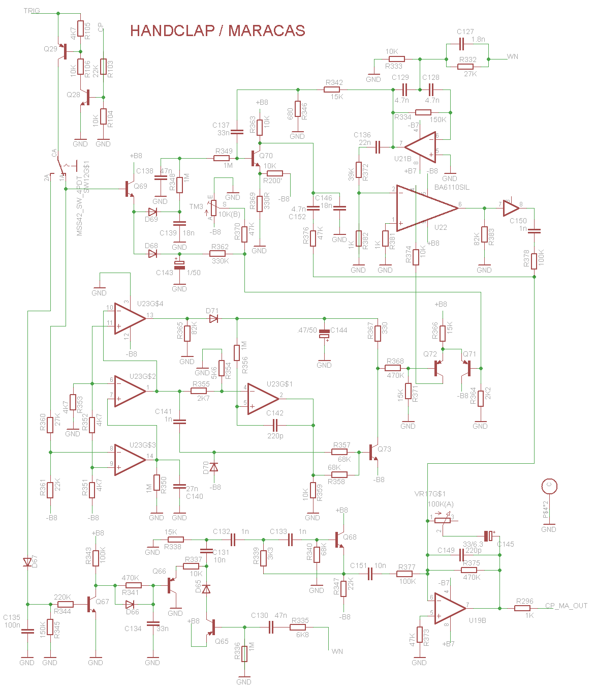

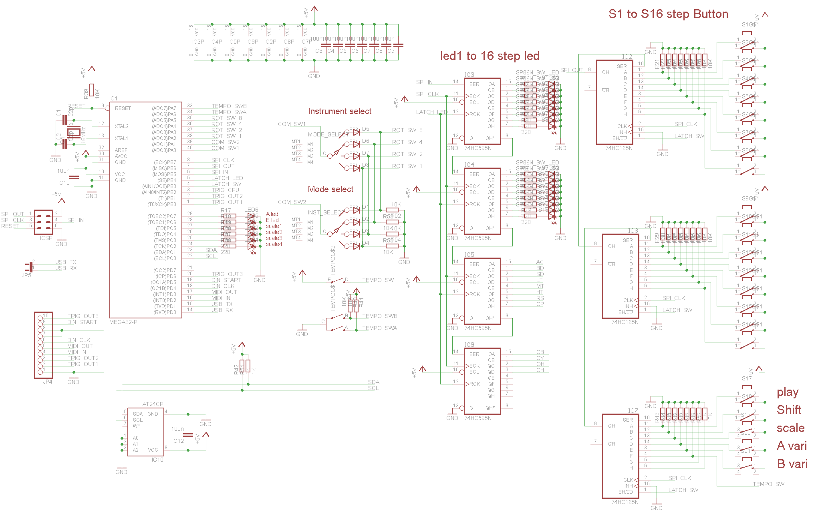

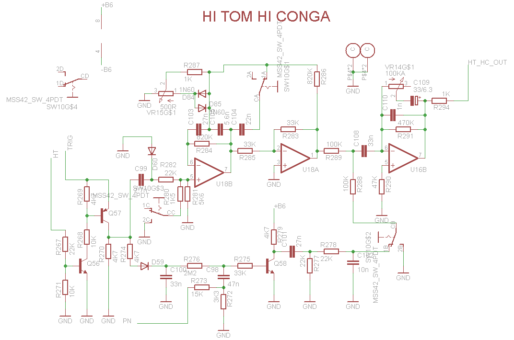

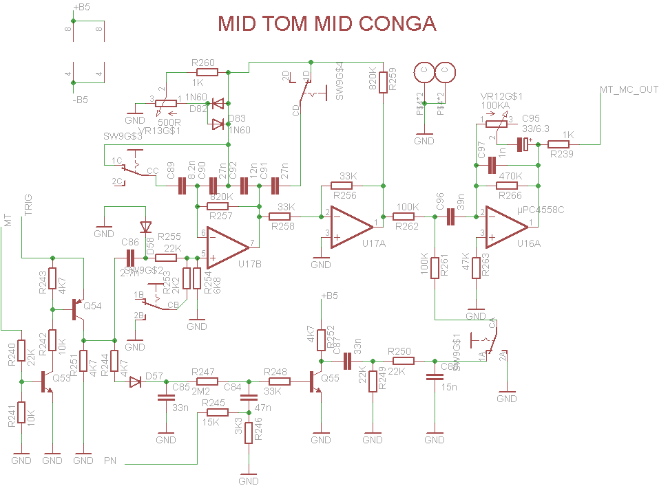

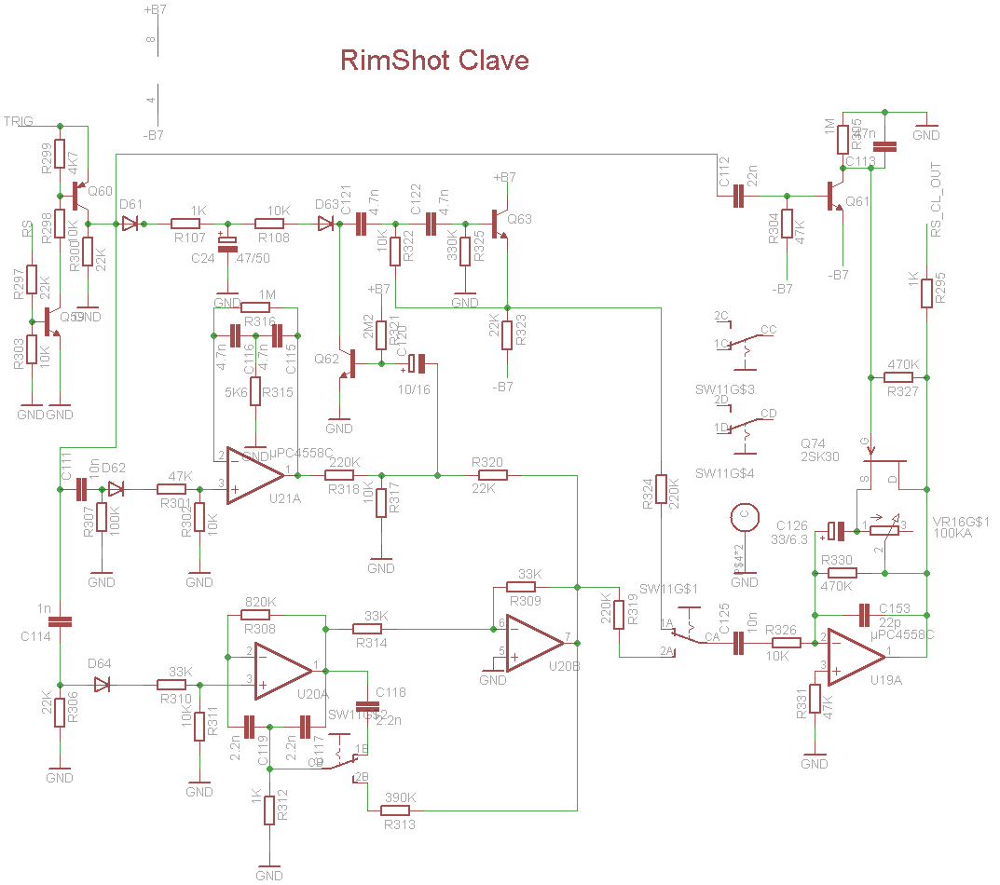

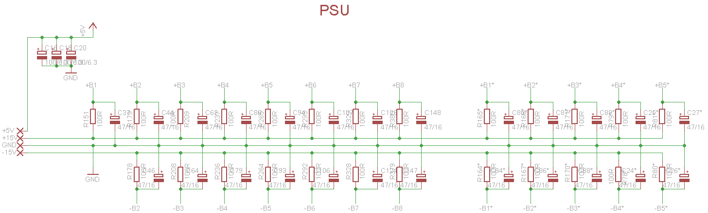

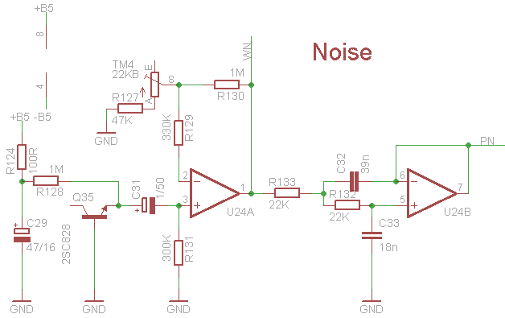

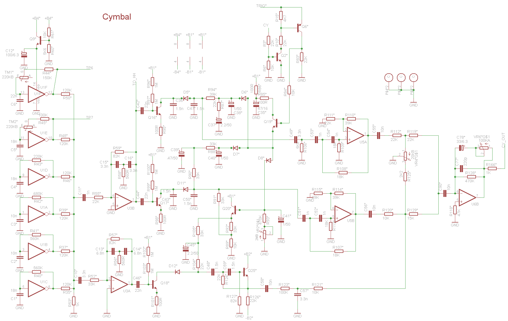

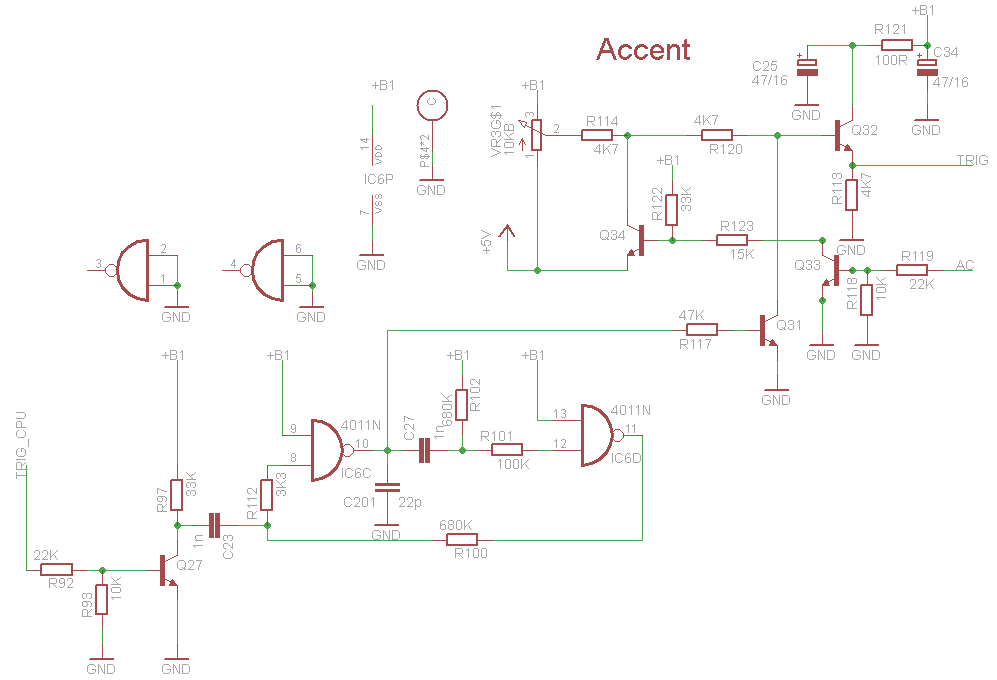

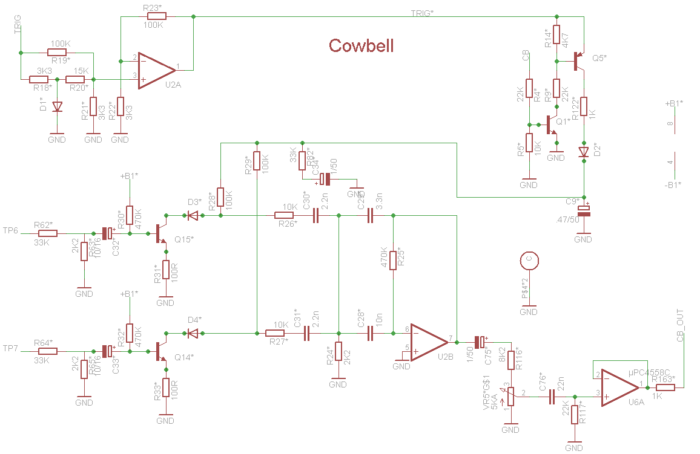

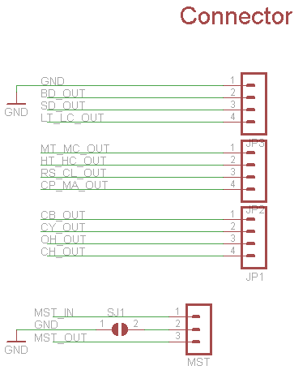

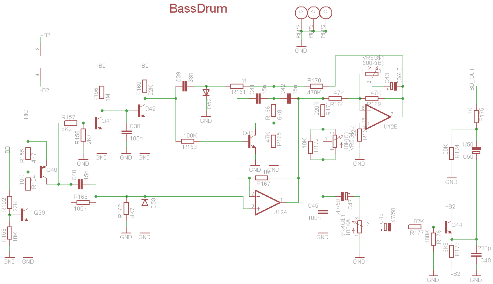

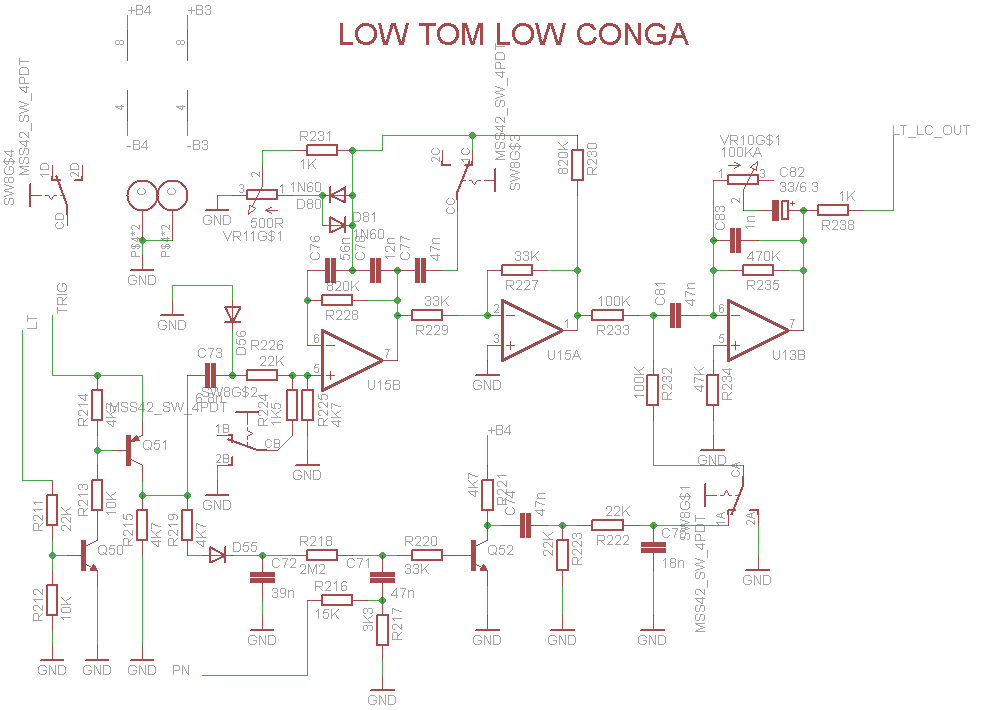

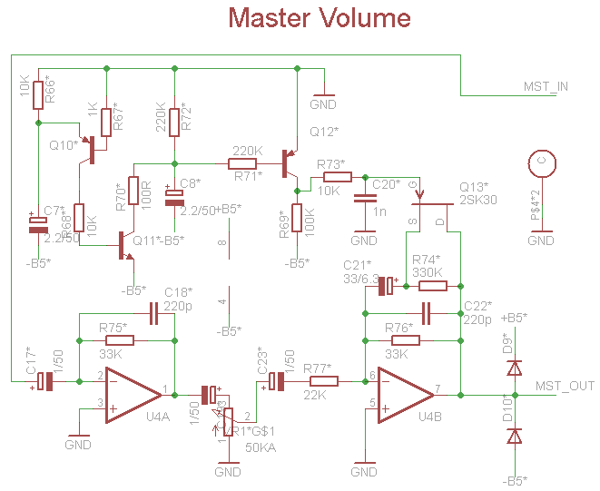

- [Snaredrum.png](assets/Snaredrum.png)
- [Board-Layout.png](assets/Board-Layout.png)
- [hihat.png](assets/hihat.png)
- [Handclap-Maracas.png](assets/Handclap-Maracas.png)
- [Sequencer.png](assets/Sequencer.png)
- [Hi-Tom-Hi-conga.png](assets/Hi-Tom-Hi-conga.png)
- [MidTom-Mid-conga.png](assets/MidTom-Mid-conga.png)
- [Rimshot-Clave.png](assets/Rimshot-Clave.png)
- [psu.png](assets/psu.png)
- [Noise.png](assets/Noise.png)
- [Cymbal.png](assets/Cymbal.png)
- [Accent.png](assets/Accent.png)
- [Cowbell.png](assets/Cowbell.png)
- [Connector.png](assets/Connector.png)
- [Bassdrum.png](assets/Bassdrum.png)
- [LowTom-LowConga.png](assets/LowTom-LowConga.png)
- [MasterVolume.png](assets/MasterVolume.png)
