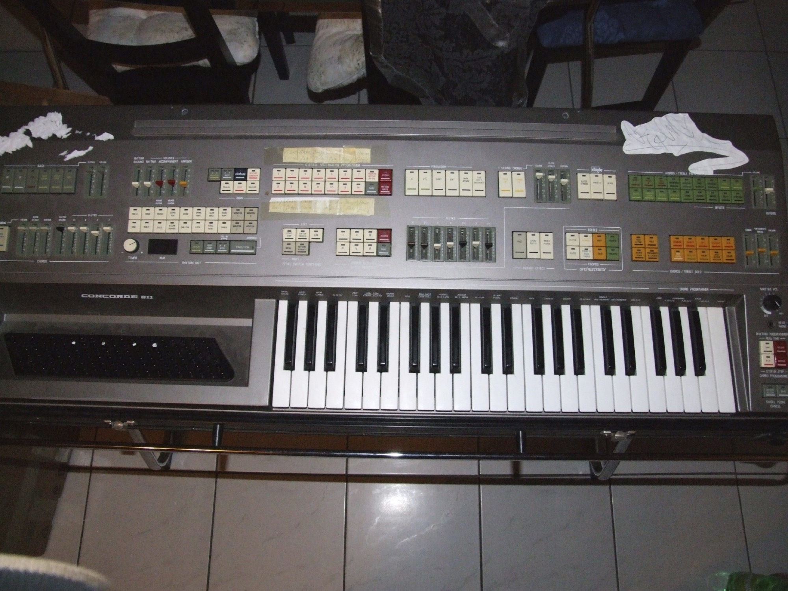
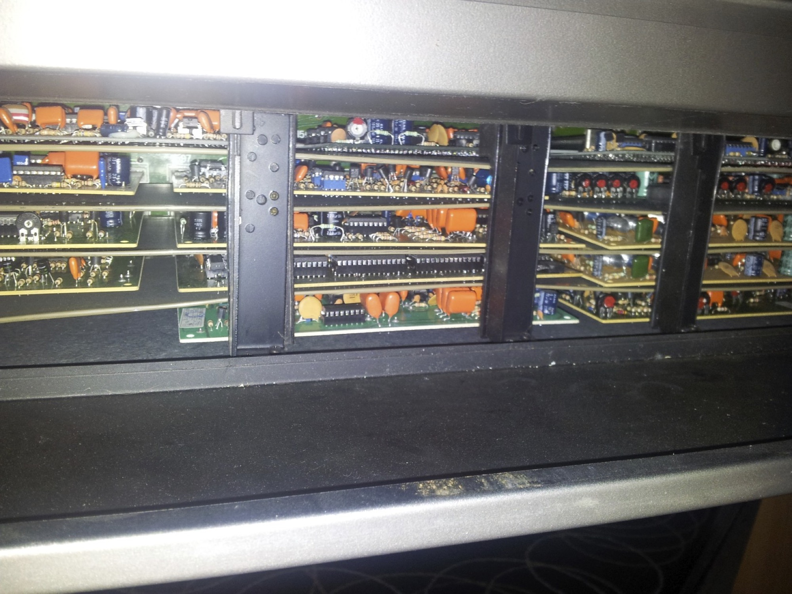

# 20.2 Elka Concorde repair

For few month i get a Elka Concorde 811 on ebay, for few euro.

But after the shipment from the seller to me, the item dosn´t work correctly – no sound, but display work, and midi out too.

After long search, i found a schematic of the pcbs in a forum. (analogorgel.de)

So i take a oscilloskop and look for the failure, but no issue found…

So many slotcards are inside… many hours of troubleshooting and no failure found.

A friend of me, a telecommunication engeneer looks inside – and found the failure after 2hours.

The powersupply -12V solderings connections off the voltage controller LM317 are broken.

(1minute soldering fix the issue)

