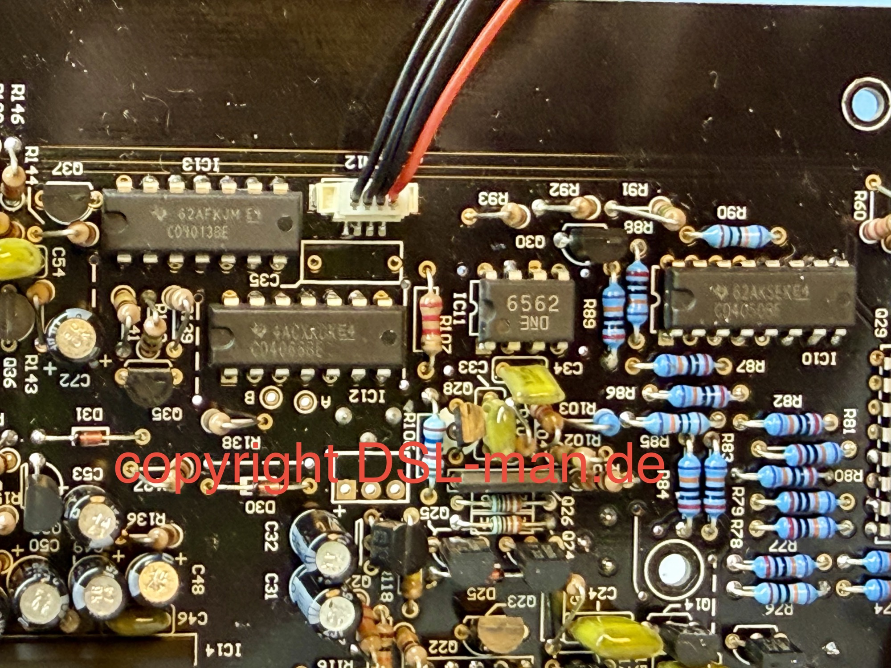
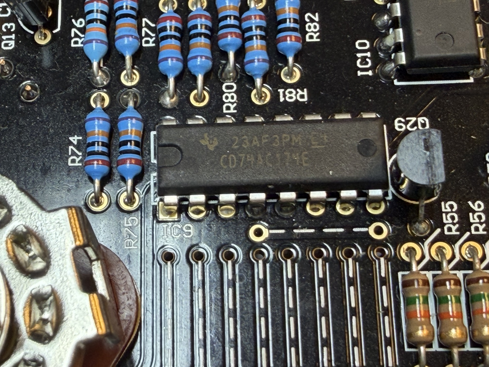
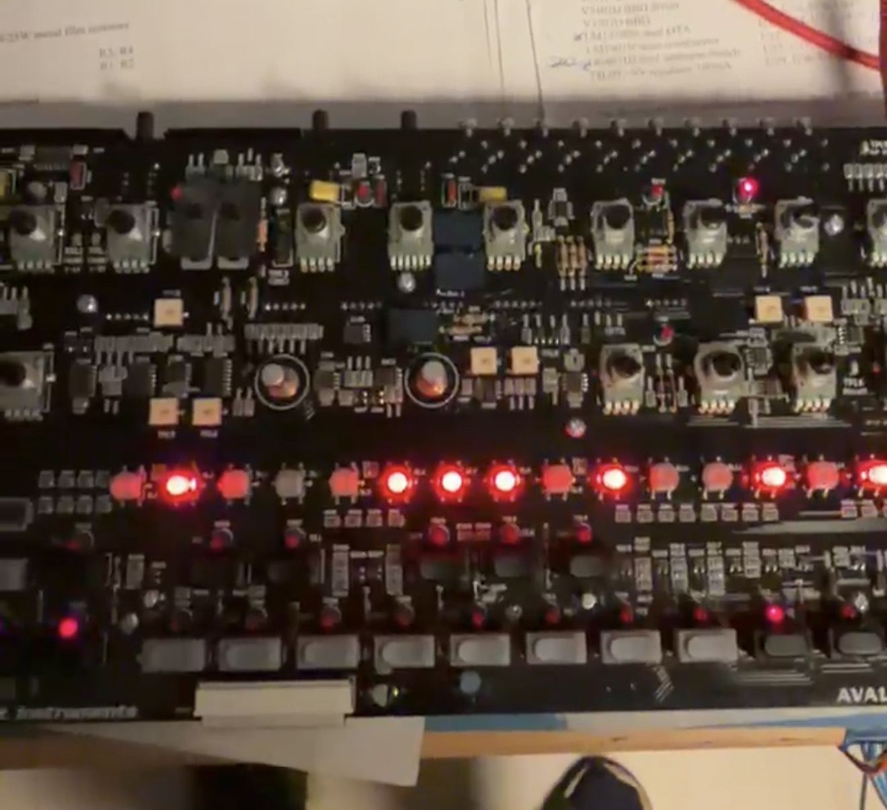
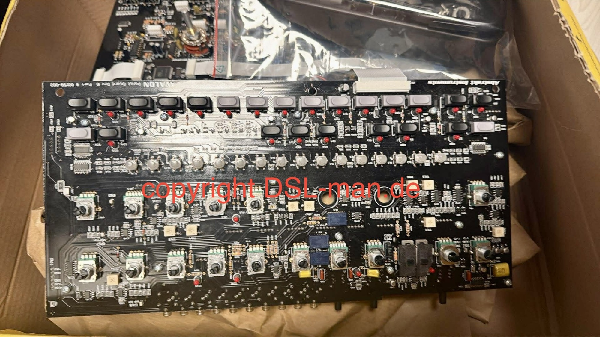

# Abstrakt Instruments Avalon Bassline repair Nr1

as a Owner of 2x Avalon Basslines and builder of a lot 303 clones I offer repairs of the Avalon bassline

one example was this machine, the sequencer wasnt running anymore, the Step LEDs was dim.

after few hours of TS, I swapped few parts and it was working as designed

here are few pictures (copyright by D[SL-man.de)](http://DSL-man.de)

