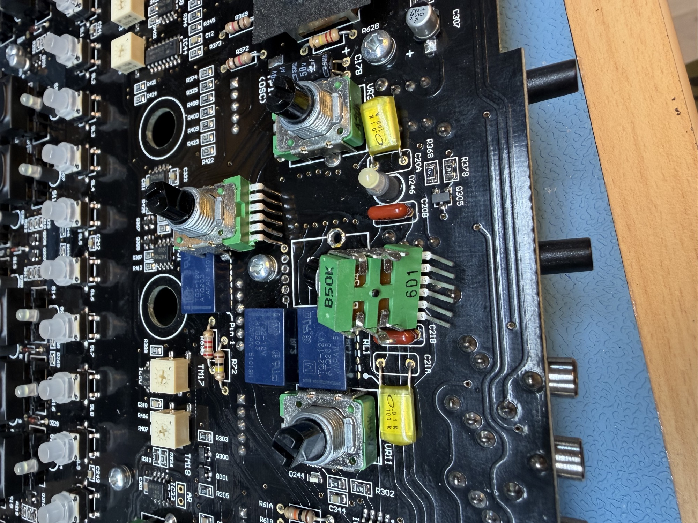
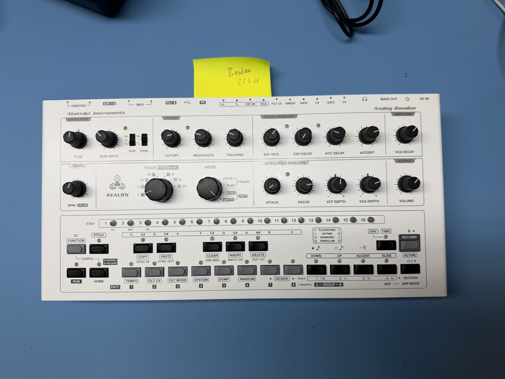

# Abstrakt Instruments Avalon Bassline repair Nr3

as a Owner of 2x Avalon Basslines and builder of a lot 303 clones I offer repairs of the Avalon bassline

here are few pictures (copyright by [DSL-man.de)](http://DSL-man.de)

Issue :

1. few LEDs are not bright
2. one LED is off
3. resonance Pot noisy - scratching.

