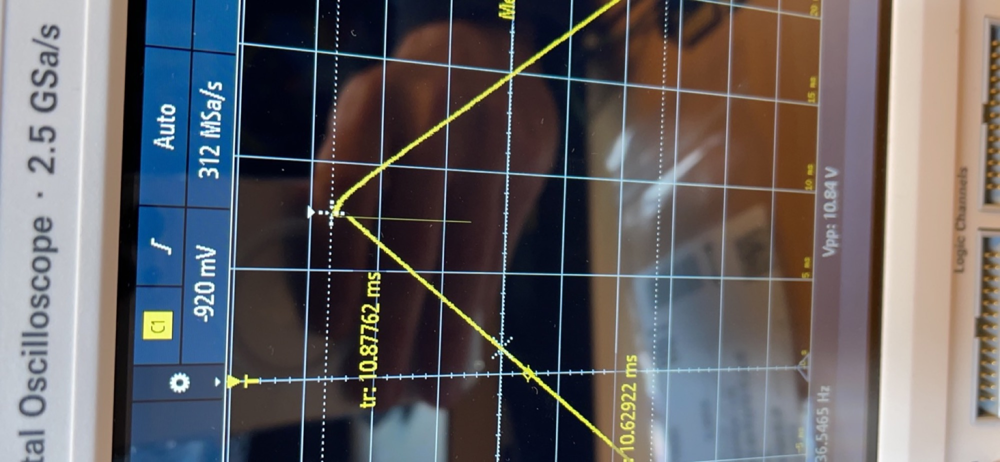
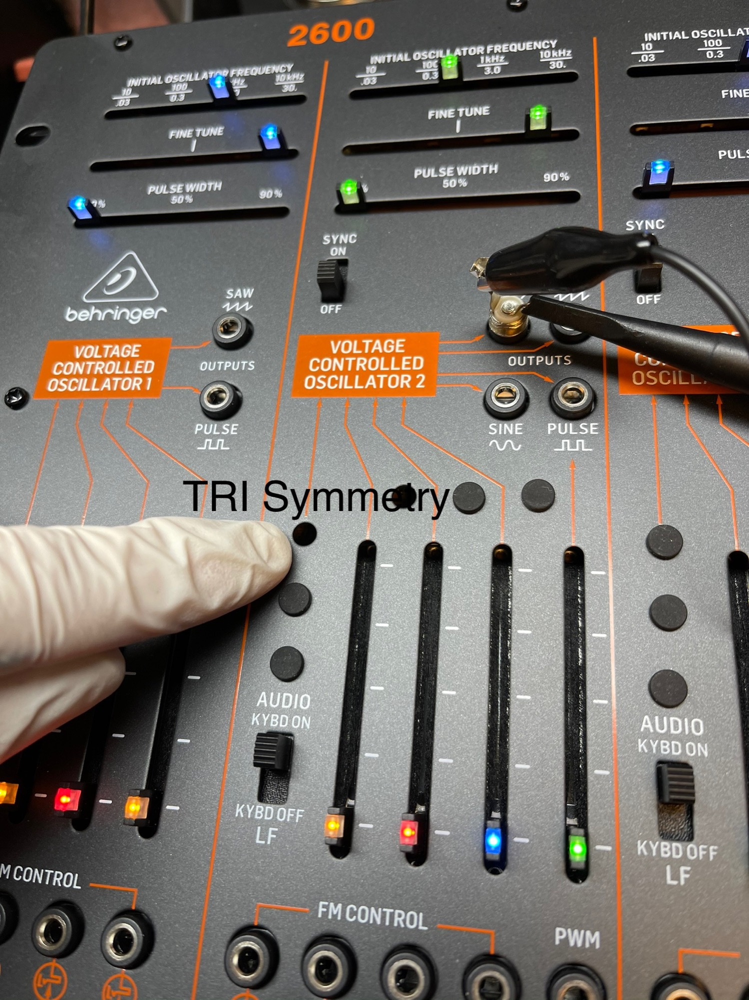
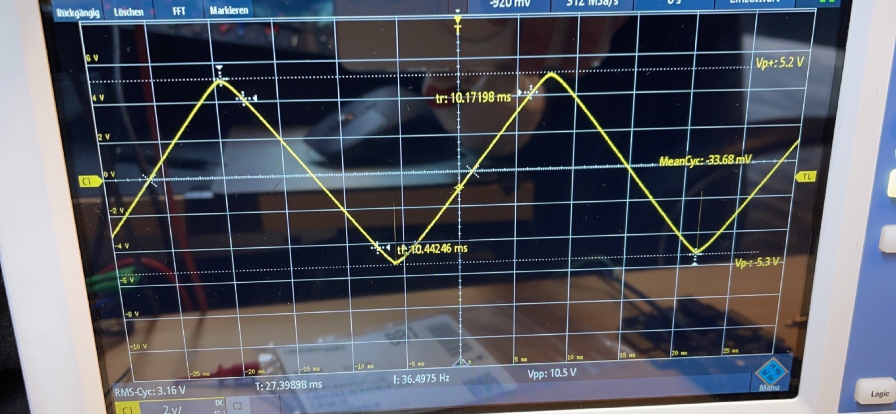
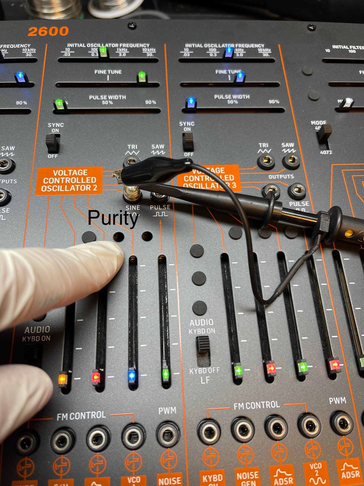
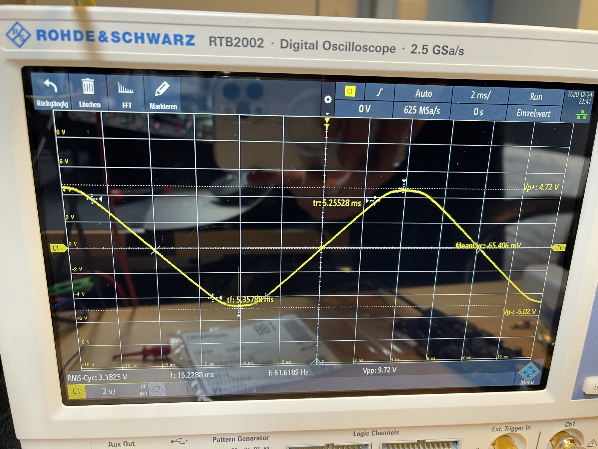
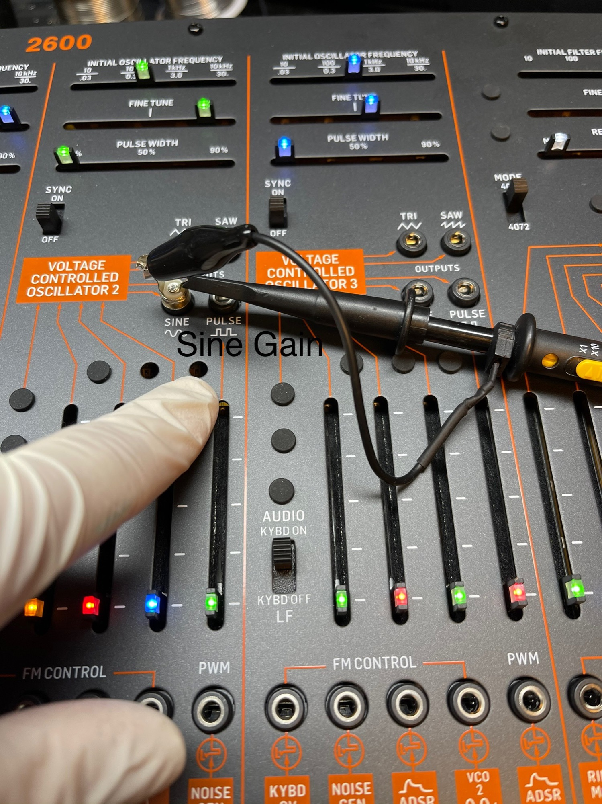
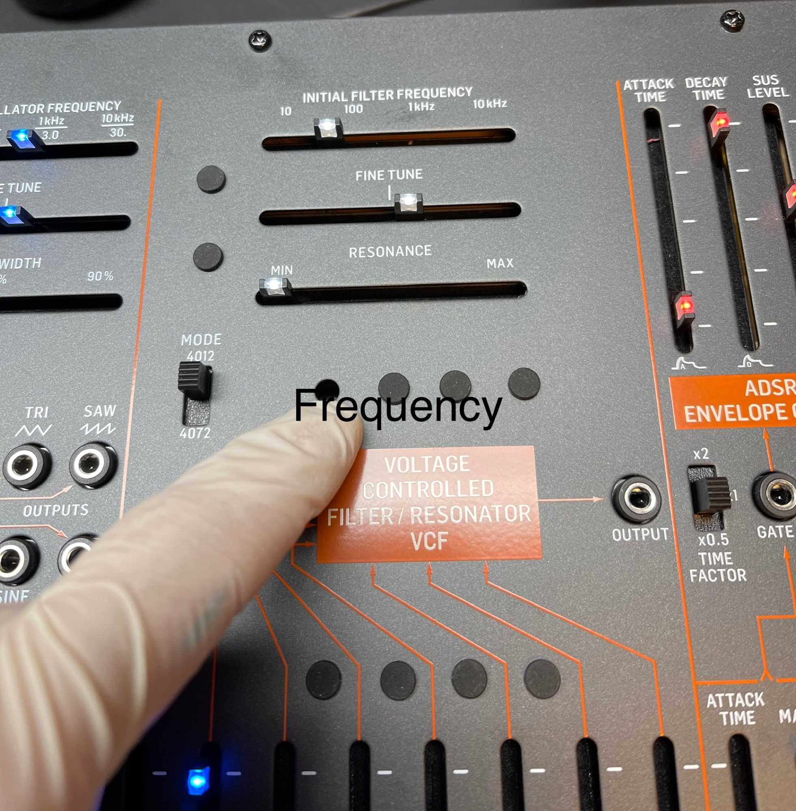
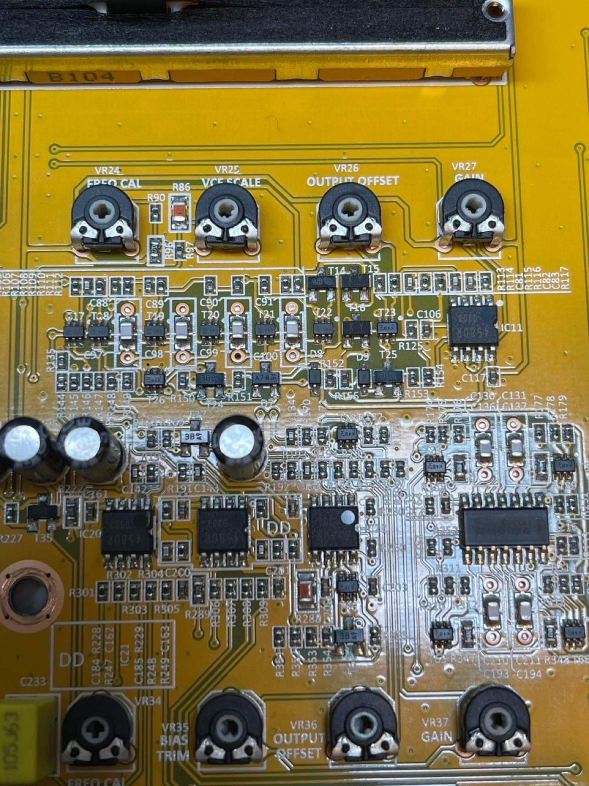
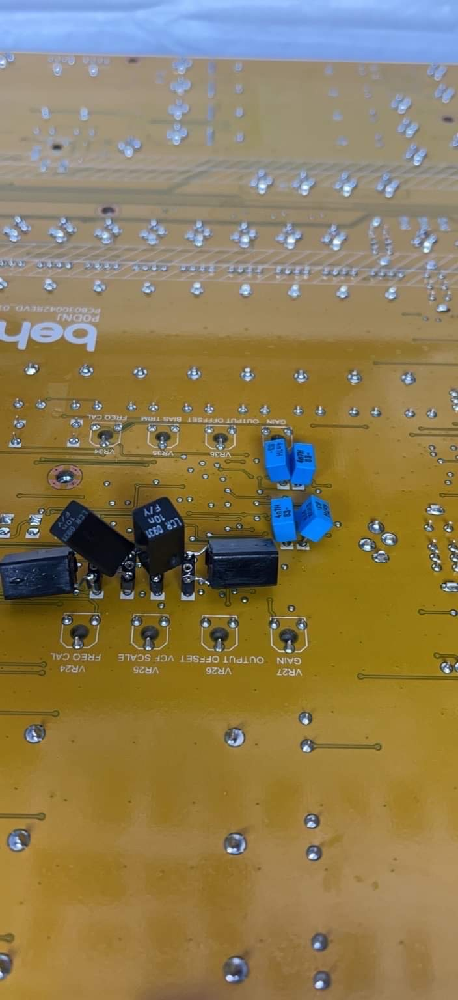

# Behringer B2600 calibration and VCF Modification

(the pictures are copyright by me - Patrick Joericke, ask me if you want a agreement)

Also read the [TTSH Calibration](../../../ttsh/ttsh-calibration-guide/index.md)guide or ask me for support.

**Triangle** , the original settings from the factory was totally wrong  - symmetry(Spike)

**Solution:**

use a scope and check your waveform and correct this by turning the trimmer TRI Symmetry

**Thats not a Sine wave !**- wrong settings from factory

**Solution:**

Purity - bends the TRI to a Sine wave - after this check the voltage to 10VPP (adjust the gain)

  

**Filter Frequency, the Filter closed at 100hz instead of less 10hz**

**Solution:**

Move 1 VCO to top in the VCF mixer and try to close the Filter, the signal must stop at 10-20hz Initial Frequency settings., not by 100hz or more, just turn the Trimmer as shown on bottom picture. (read the [TTSH](../../../ttsh/ttsh-calibration-guide/index.md)**[calibration guide](../../../ttsh/ttsh-calibration-guide/index.md)** too, to understand what you do)

## VCF Modification

Modded VCF with 1% premium LCR caps in the 4012 and matched 2.5% to 1% tolerance in the 4072 VCF.

I used sockets to make the LCR cap footprint compatible with the PCB RM5 footprint.

