# CGS WASP DUAL with Spread CV Repair

### **ISSUE:**

### both Filter dont work as designed, a addionaly pot controls Spread

in both Channel some LP/BP dont work.

here the panel of the defective module (copy from scott - bridechamber)

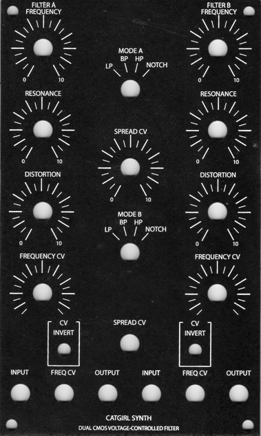

### **Website:**

[http://www.cgs.synth.net/modules/cgs49\_twf.html](http://www.cgs.synth.net/modules/cgs49_twf.html)

### Technical:

**Controls:**

- **Frequency -**sets intial filter frequency
- **Freq CV 1-** Attenuator for CV in 1
- **Resonance -**controls amount of filter resonance
- **Distortion -** Mixes in post filter distortion effect
- **Filter Mode -**selects lowpass, bandpass, highpass and notch modes

**I/O:**

- **In -**audio input to filter
- **CV 1 input -** filter frequency input with attenuator
- **CV 2 input -**filter frequency input
- **Out -**filter output

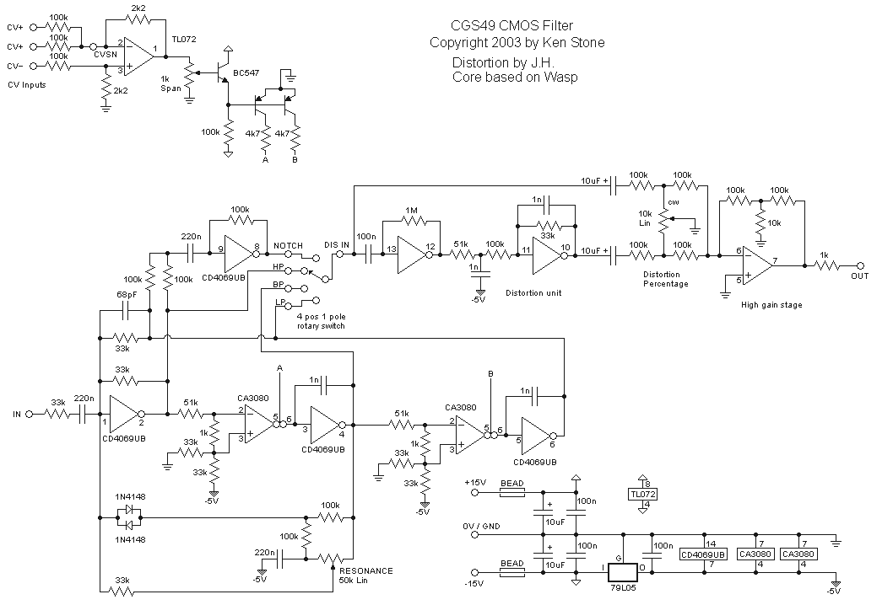

### **Troubleshoot info:**

"did the RTFM-thingy on Ken's website and connected the frequency pot to +VE / -VE and added a 150K restistor in series ... as mention on the website " found on electromusic.com

What connection would you make to the ccw position of the potentiometer in place of gnd to wire it between +/-V?

 If you mean "how do you wire the frequency pot so that it gives a wider range, going lower than the frequency obtainable with the CCW end of the pot wired to earth", the answer is you wire it to -VE. If that gives you too much range, put a resistor between the CCW end and the -VE rail. 47k would be a good starting point. 

This is just a guess, but the wiper of the Spread CV pot might be normalled to the CV input of the first filter and the Inverted CV input of the 2nd filter.

 That way it would work as a 'spread'...?

You would wire the Spread CV jack to the input of the Spread CV Pot. Then the Wiper of the Spread CV pot would go to the switched inputs of Filter 1 CV input and Filter 2 inverted CV input.
 Oh and of course ground to the 3rd lug of the Spread Pot and the Spread jack.
 A 100k Pot like the other CV inputs will be fine 

**Spread CV**

**from Scott:**Sorry for the lack of documentation on that.

 You use the switch for the inversion of the CV. The spread pot is an attenuator (100k is good) for the spread jack. From the wiper of the pot, **send one wire**to**CVSN** on filter A**via a 100k resistor,** and one to the junction of the 100k, 2k2 and pin 3 of that TL072 (where the negative CV is going) of filter B. This will apply the spread voltage positively to filter A and negatively to filter B.

**from cgs:**

It has been suggested that connecting the frequency pot between +VE and -VE instead of +VE and GND as shown will allow the filter to be used at lower frequencies. If doing this, you may find it beneficial to change the wiper resistor up to 270k, or add an extra resistor of **150k in** series with the wire from the wiper to the PCB.

**user:**

I took some advice and wired **the frequency pots +V and -V**instead of +V and Gnd**.** The filter works fine now. I'm going to experiment with limiting the range of the frequency pots.

**analogcraftsman:**

It greatly increases the range of the cutoff frequency if you connect the CCW lug of the pot to -VE and the CW lug to +VE.

### TEST CASE 1:

with layout for Spread source are the infos above.

in the defective device, the 100k is missing.

picture:   **Failure 1**,  **no** 100K resistor from spread pot to CVSN

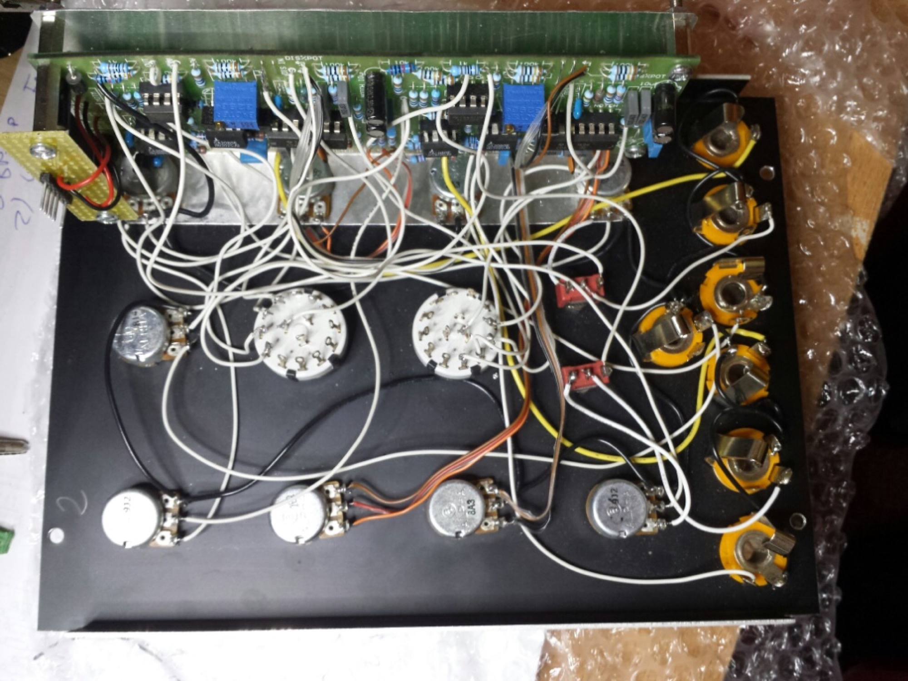

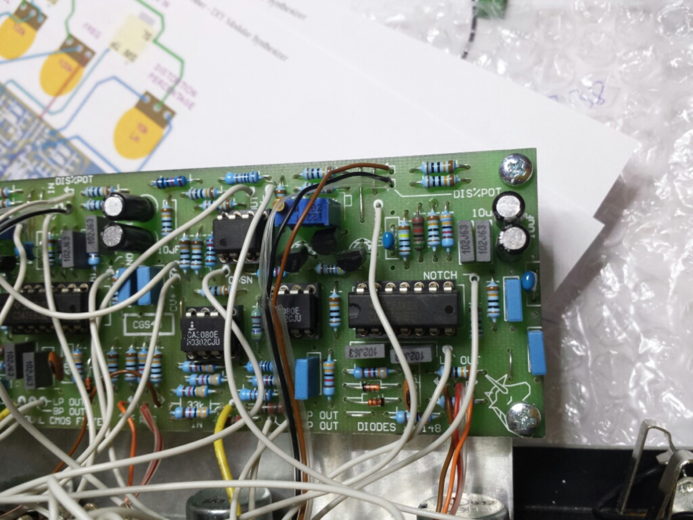

**Failure 2:**  frequency pot is connected to GND,**but must connected to -VE**

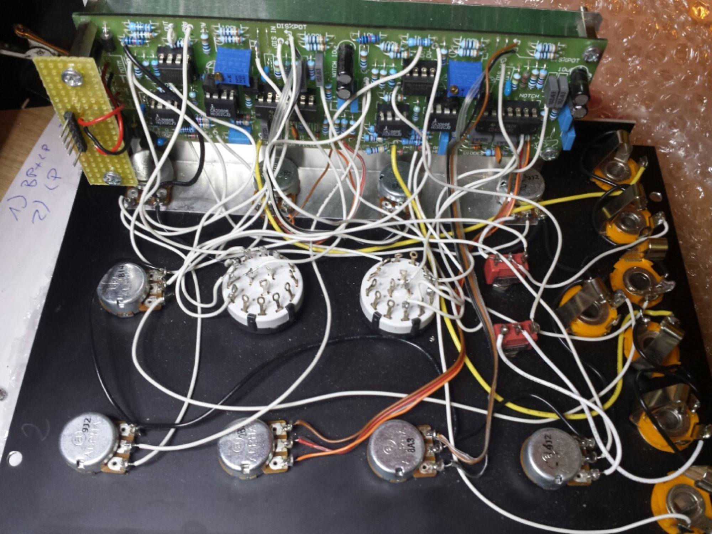

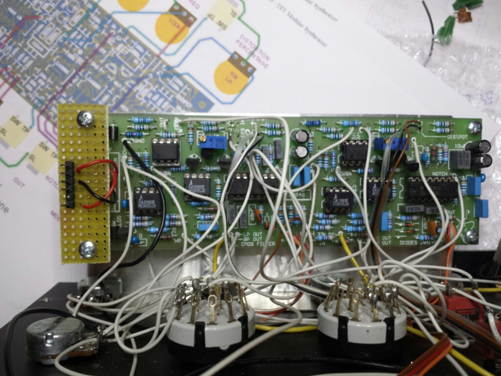

**a copy of ken stones page:**

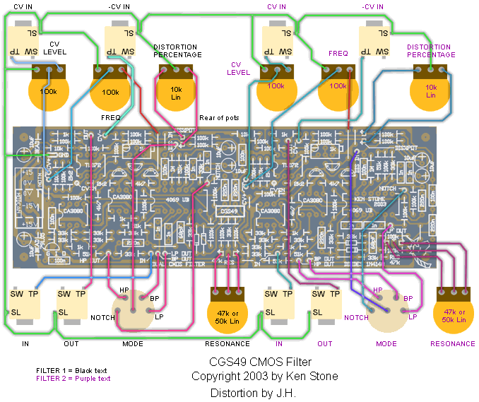

Original and working WASP Filter, was for sale in end of 2013

[build by www.analogcraftsman.com](http://www.analogcraftsman.com)

In this build, you can see the correct wiring from freq. pot to -15V on power connector

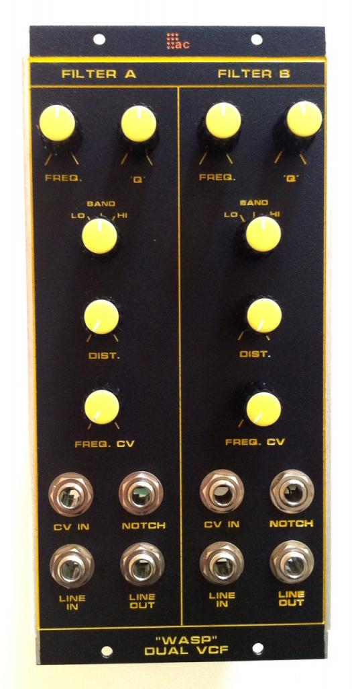

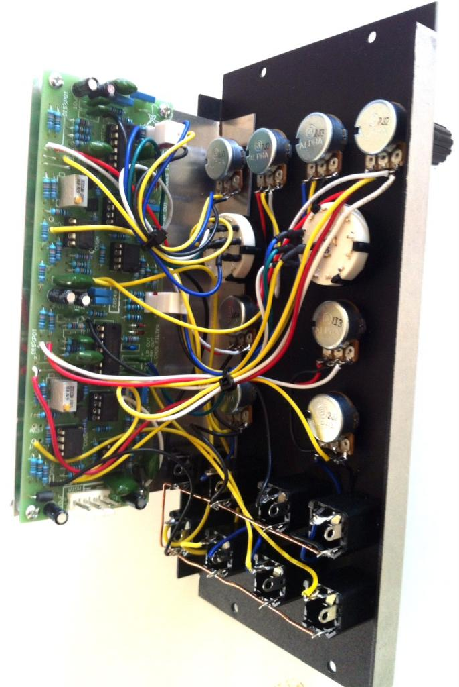

## Further Troubleshooting 07.01.2014

have connected the frequency pots to -VE and +VE instead of GND and +VE.

the groundwirings for other connections are connected further to GND.

one CA3080 from second Channel was faulty - 2 pins are damaged, after replacement same issue as before - LP Filter dont work.

(both CD4069 and TL072 was replaced by new one)

after unswap the CD4069UBE the LP works, but without cd4069 no typical wasp vcf sound..

**next step: ordering 2x new cd4069UBE oder HEF4069UBE (unbuffered)**

## Further Troubleshooting 12.01.2014

new CD4069UBE  shows same issue..   LP dont work

**todo:**

1. solder 150k resistor to freq.pot

     2.test/swap 1N capaciator  or unswap CD4096 and measure resistor between Pin5 and Pin6 on CD4069.

     3. test with oscilloscope - CA3080 ,CD4069 in/out

3. solder 100k in cv-spread..

**Result: 13.01.14**

1. solder 150k in series to wiper on freq.pot same issue as before
2. on ic scock for cd4069ube - betweeen pin 5 and 6 no bridge, desolder 1N polyester capaciator - test 1N works
3. on CA3080 and cd4069ube 5V power input works,  signal on ca3080 pin 2input, signal on pin3 output, signal on cd4069ube input - no signal on output,
  after rotation of the pcb - no signal on ca3030, sporadicly - maybe bad solderpoints or cable broken, shaking the module shows sporadicly signal lost..
4. solderpoints are very bad.

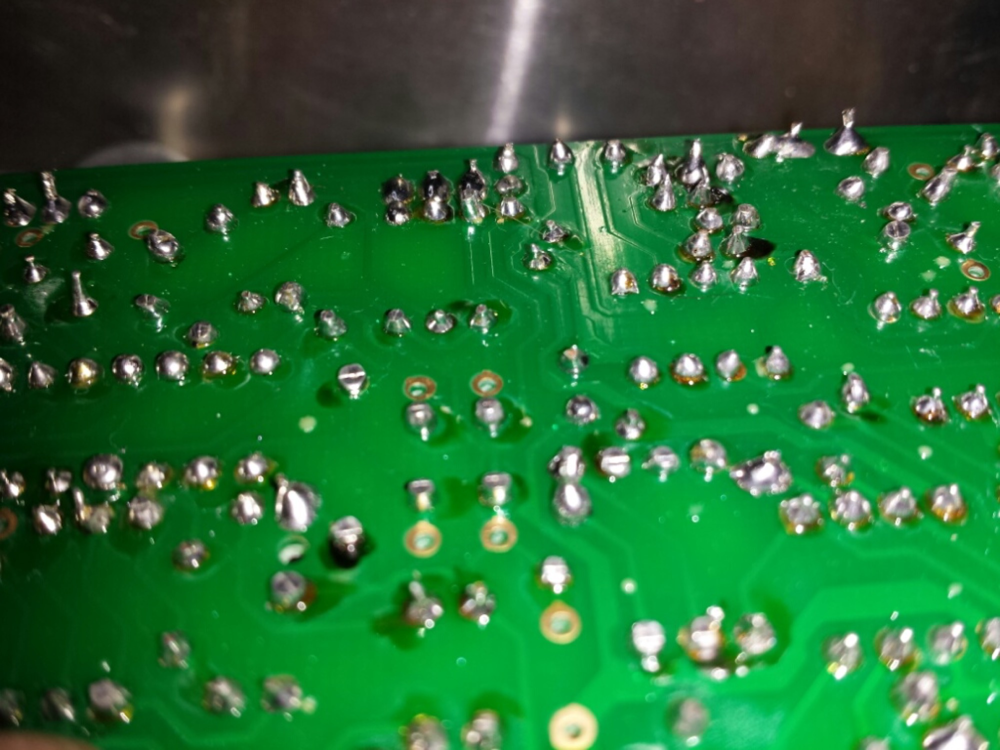

here you can see at botton the poor cable quality and bad solder points (to much tin)

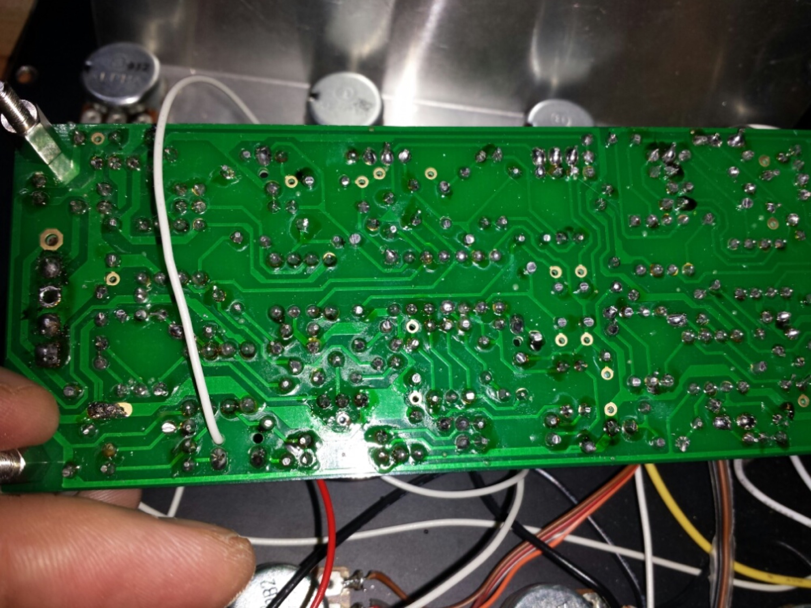

**FINALLY:  was done in early 2015**

to get a working device

- replace the pcb with a new one or desolder all parts and check the traces on pcb ✅
- replace the cheap jacks with switchcraft jacks ✅
- replace the pots or check them  -  one pot was defect !  ✅
- wiring the panel components with one channel CV-SPREAD  ✅
- testing ✅

**Modul works great**🙂
