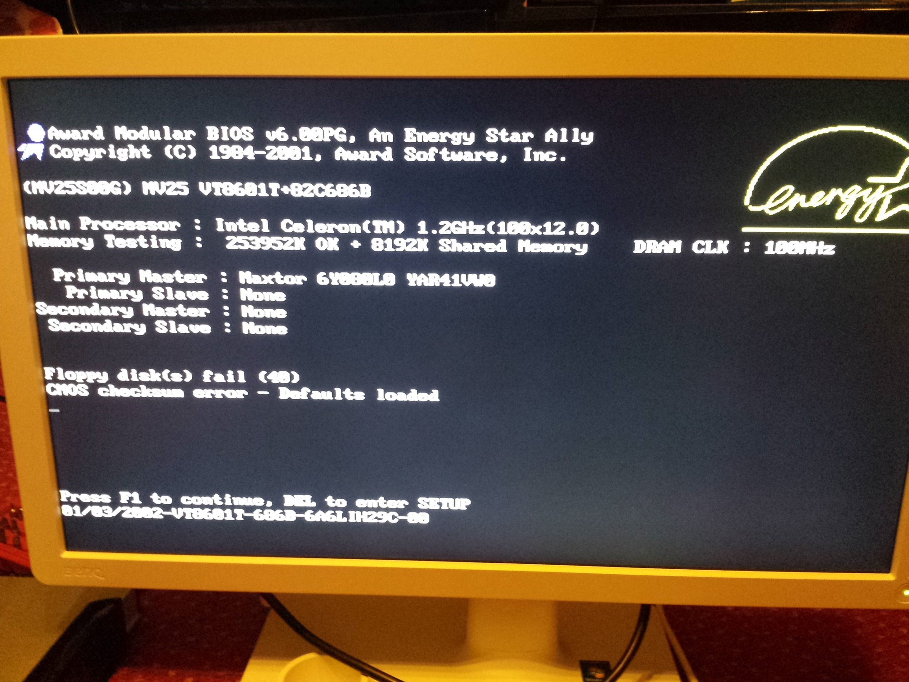
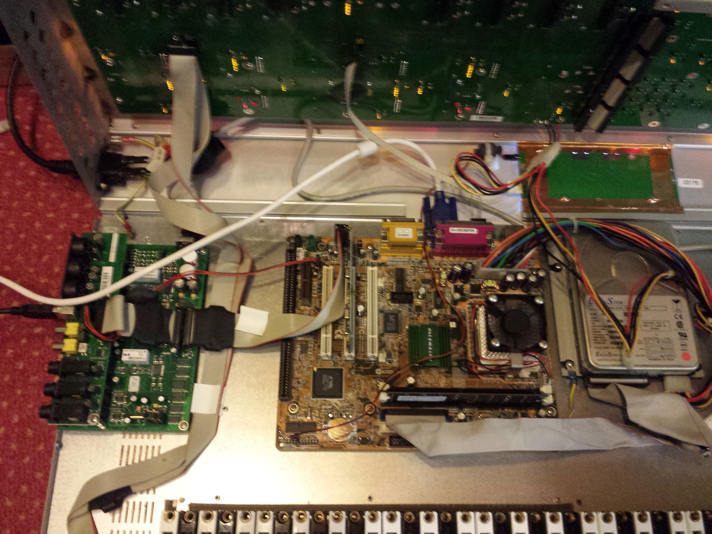
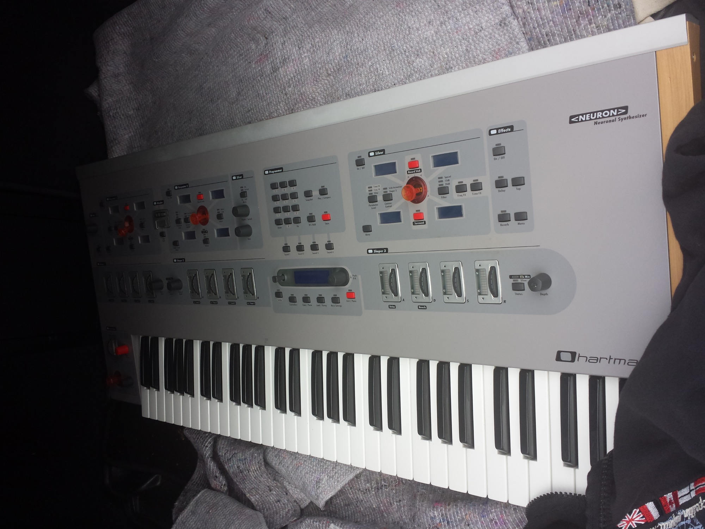
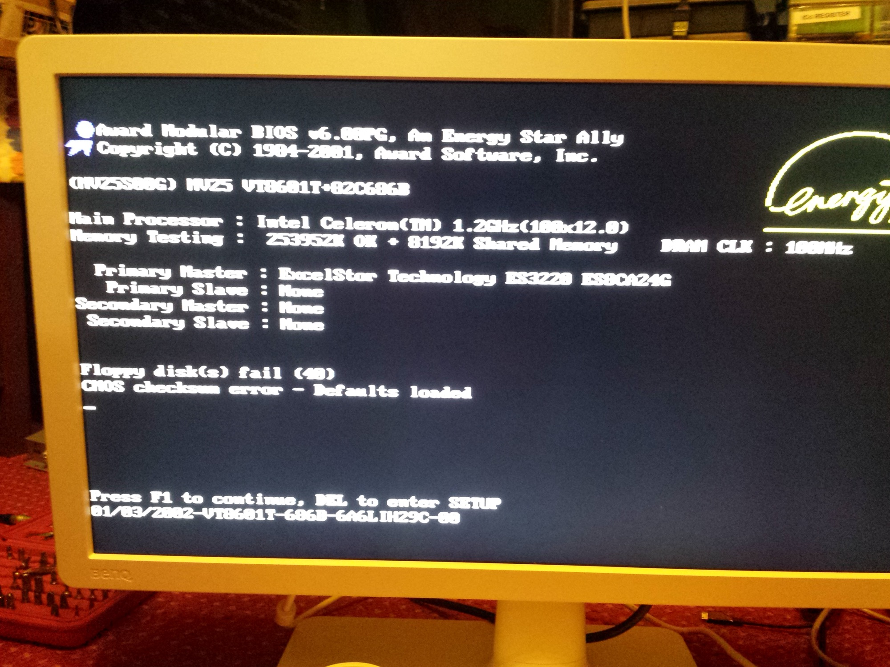
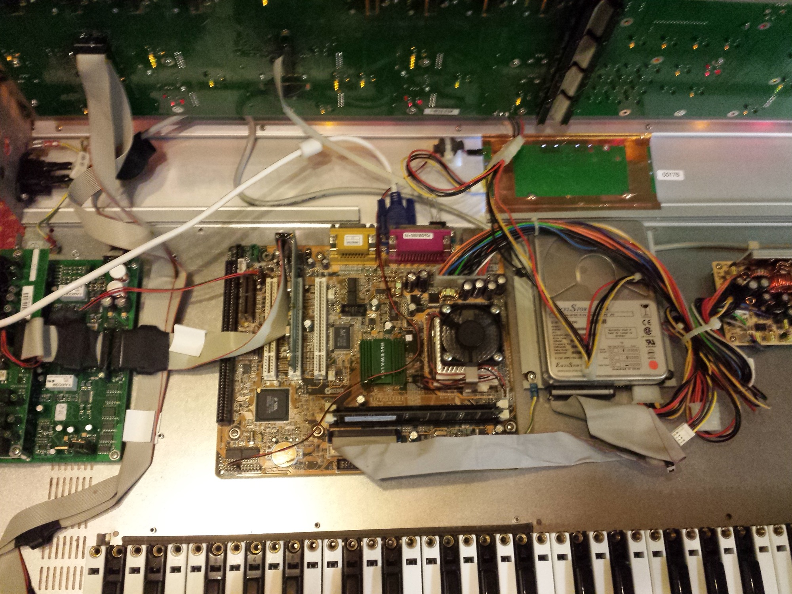
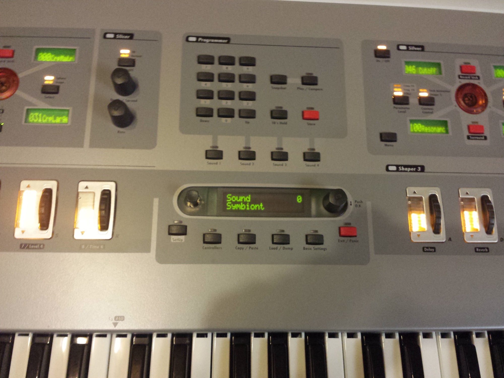
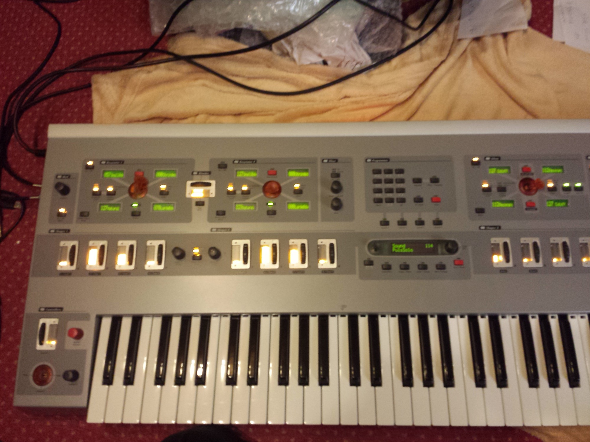
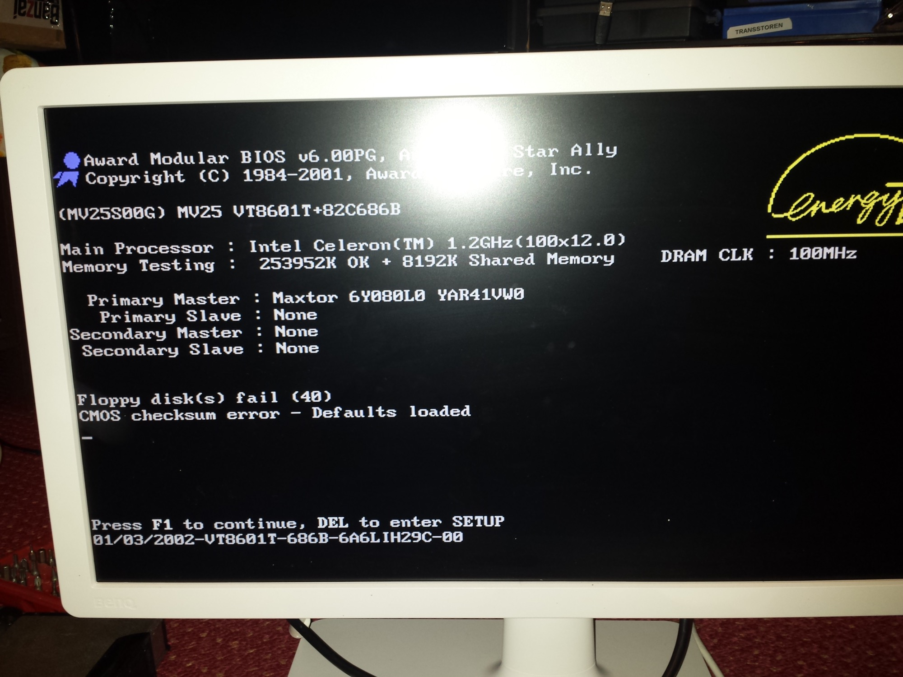

# Hartman Neuron Repair

> **Project**
>
> ### Projecttitel: Hartman Neuron Repair
>
> ### Status: `hier ändern`
>
> ### Startdate: 04/2015
>
> ### Duedate: - open
>
> ### Manufacture link: -

**Issue:**  System boot up in to Init Mode.. "Welcome to NEURON"

**Troubleshooting:**

- open the Synth
- connect a USB keyboard and Monitor (VGA connection on mainboard)
- BIOS show wrong date and time - &gt; battery check and replacement dont solved this isse &gt;  clear CMOS jumper dont solved too this issue.
- settings of bootup on failure/system halt must be disabled, IRQ/DMA set to manual instead auto mode - but with further lost cmos settings...
- sometimes on boot no VGA Screen/BIOS is shown -&gt;  mainboard failure
- i´m looking for a replacement board or maybe i try to build in a other mainboard with virtualisation OS and "hartmans" OS (linux gentoo) in a virtual environment

**Download OS Image:**

[http://neuron.audiodsp.net/](http://neuron.audiodsp.net/)

[https://www.youtube.com/watch?v=0OGcYZ6Hijk&t=11s](https://www.youtube.com/watch?v=0OGcYZ6Hijk&t=11s)

