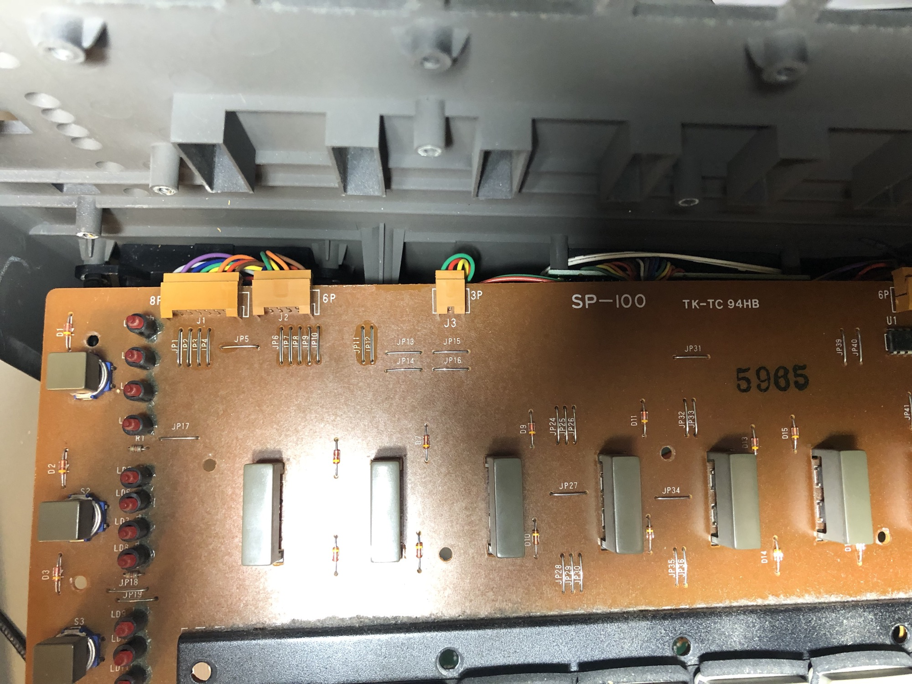
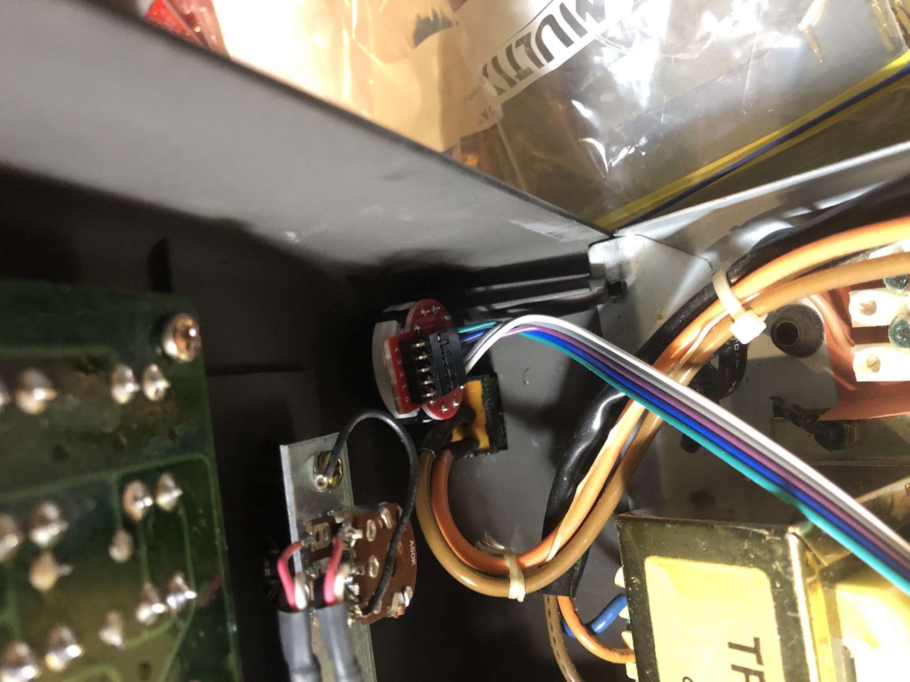
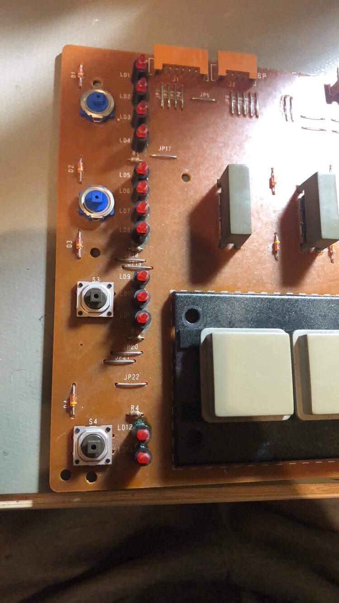
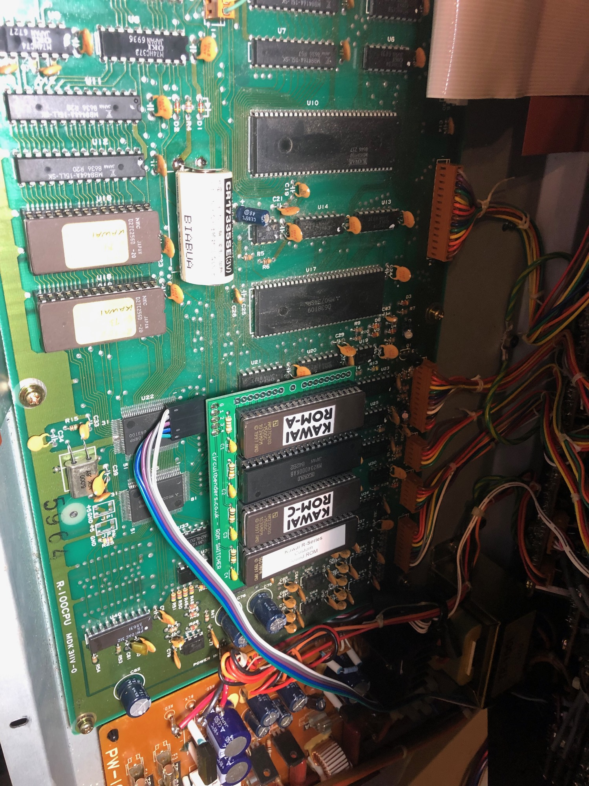

# Kawai R-100 Modification and service

> **Project**
>
> ### Projecttitel:Kawai R-100 Modification and service
>
> ### Status: `done`
>
> ### Startdate: May 2019
>
> ### Duedate: May2019
>
> ### Manufacture link:

**Todos:**

install Circuit Benders Eprom Mod

replace battery -  CR17335SE   tme.eu list the battery, also ebay shops - make sure the pinout is correct, there are 2 different versions PCB and PCB2 

replace tactile switches  - use the tactile from TB-303/RE-303:   688-SKQEAA from Mouser electronics.

replace the Volume Potentiometer, use a Stereo Typ from mouser with 25mm length instead of 20mm because they are not available, use a saw to get the correct length.

> **Info**
>
> ### TIP
>
> reset the Device after installing the Mod,
>
> turn off the machine, hold the "ERASE" button while power the machine on.
>
> then clear all patterns:
>
> To clear all pattern-song data: hold down the No.1 button and press \[ERASE\], then \[ENTER\] twice.

remove the cables, push/pull it with a flat screwdriver

new Potentiometer - remove the potentiometer knob, then remove the nut - you don't need to remove the aluminium rail !!

blue = old switches

grey = new

 circuit Benders Mod: addional  Sounds

