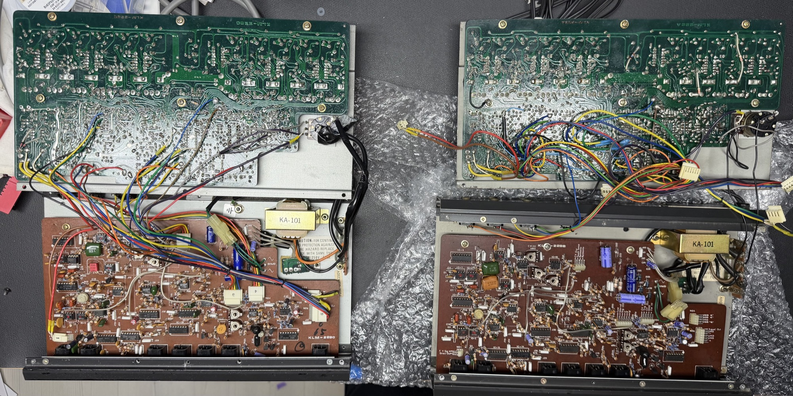

# Korg X-911 repair

I got one X-911 for a repair , the sound wasn't clean.

in the end was a electrolyte Cap replacement the first step.

It doesn't fix anything.

the device was in a bad optical condition.

the owner bought from Japan a optical good condition X-911 (Number2 called here on my page)

the transformer was at 110V, but the transformer still have the option to change the wiring to 230V without replacing the transformer. handle with care here

(only valid or certified people should do this task)

The Number 2 got new electrolyte caps at the lower PCB KLM…

The first tests bring up new issue: the envelope follower only works by feeding an external trigger  - in detail just a bridge from tip to GND was required.

it was very difficult to analyze the root cause ..  in the end I followed the audio signal and replaced all 4 LM393 and 2x CA3140 to get the device working as aspected.

but the sound change with the selection of the CA3140 - as described in the service manual- OFFSET selection.

