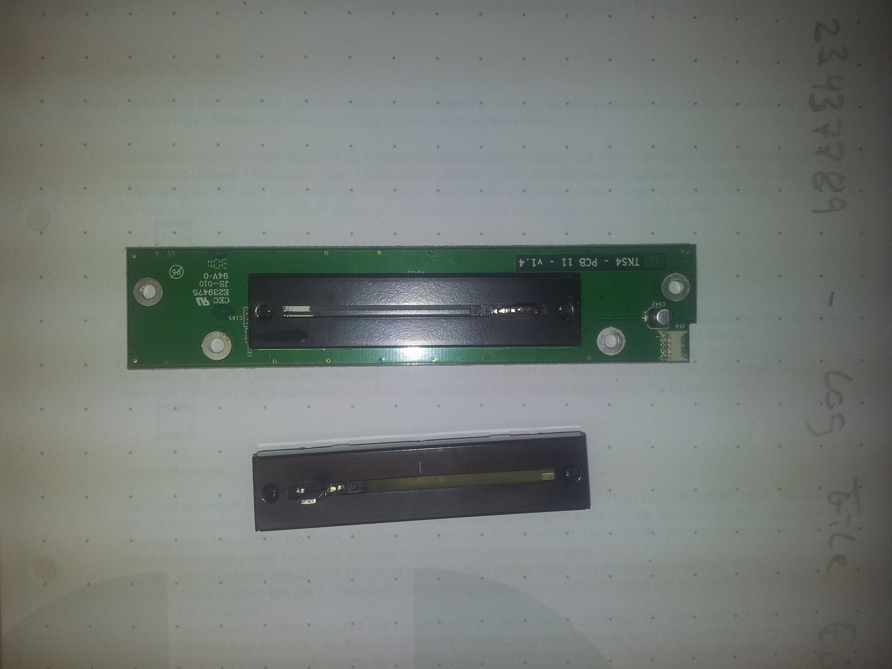
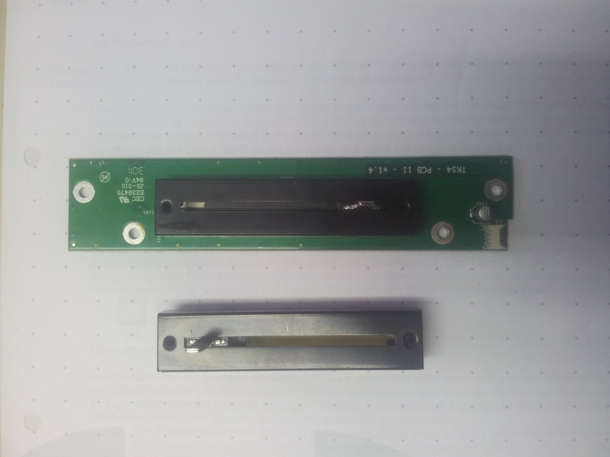
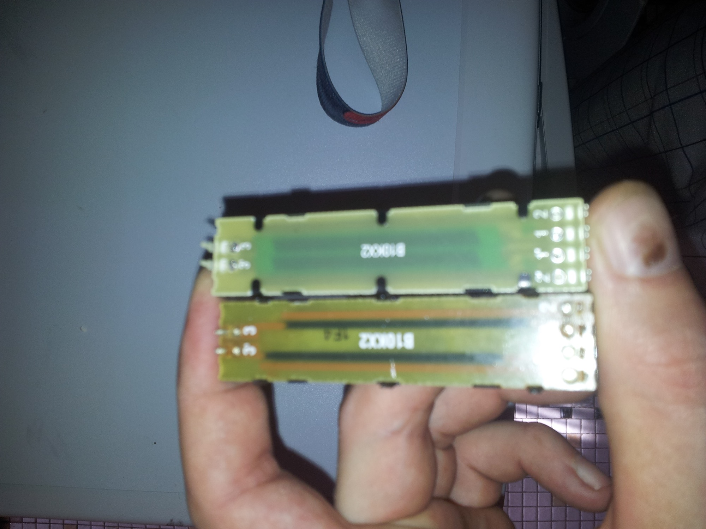
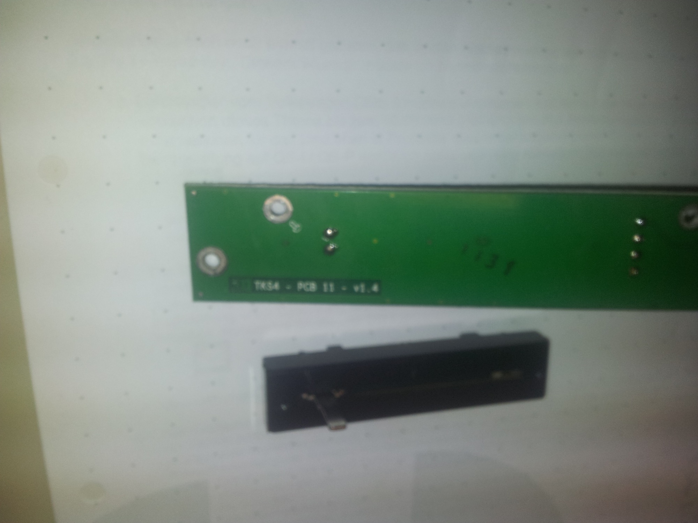
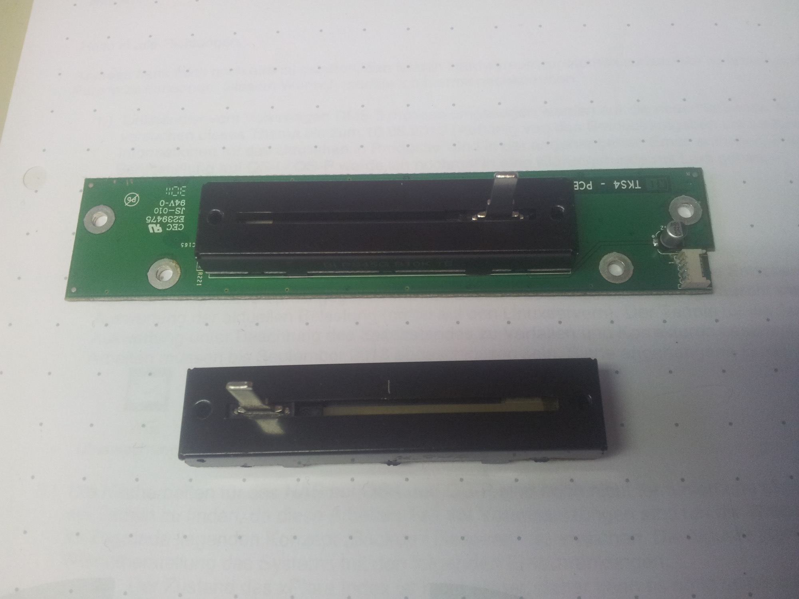

# Native Instruments S4 Controller - Crossfader repair

I have to replace a Crossfader from a Native Instruments S4 Contoller.

i dont find a replacement on worldwide electronics seller. (mouser, conrad, reichelt, etc.)

a Repair from Native Instruments costs arround 70€.

I have found on ebay.com a replace crossfader , ~18€ inkl. shipping,

the ebay replacement fader dont have the same pin size, so i had changes the pins with pliers to get the same pinsize. (see picture 1)

