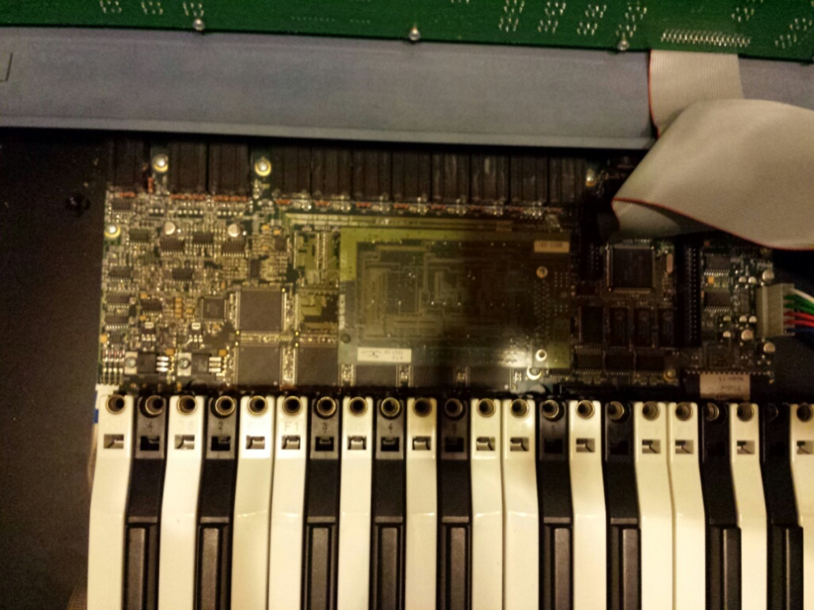
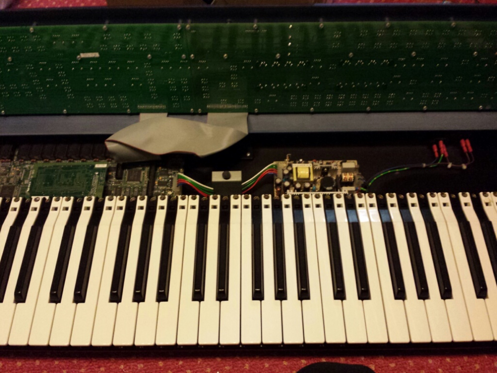
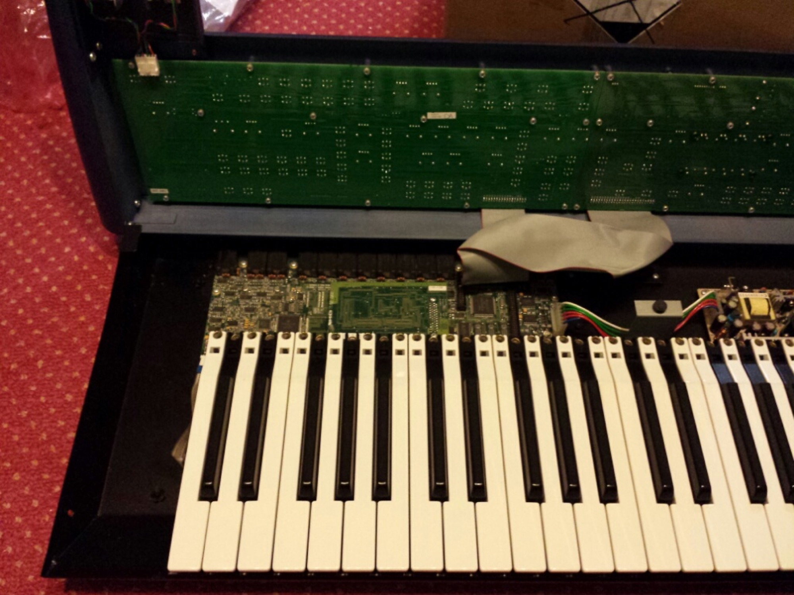
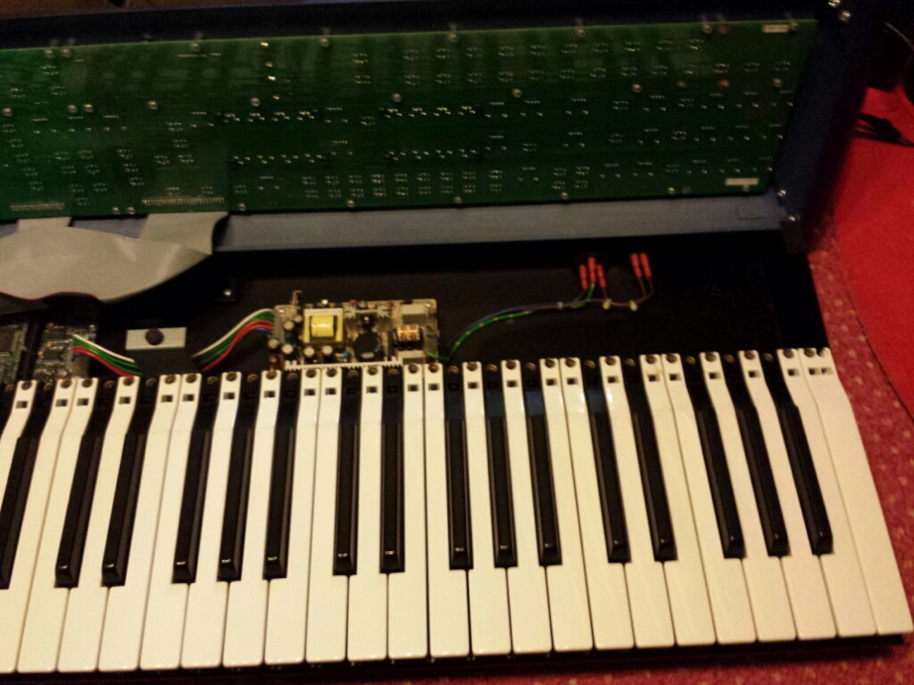

# Novation Supernova 2 Keyboard Voicecard

> if your master output or other outputs dont work, congratulation one "IC" is defect...
>
> i run in this failure on the day as i sold this device on ebay, but i repaired it by unsolder/solder the very small SOIC format IC...
>
> i dont documented it here due to the high risk, that a DIY beginner try to desolder the part..
>
> the part can only be swapped by a professional SMD technican - otherwise you destroy the mainboard

## Extend a Supernova2 from 24 to 48voices.

### Todo:

**Disconnect power** and all other cables (midi, audio etc.)

on the left and right sides of the chassis disconnect the screws ( every side 1 screw)

now you can lift up from the keyboard side .

you can find the main pcb on the left side, find the 2 pcb plastic holder.

yet you have to push the voicecard downwards  (voice card pcb holes in the mainboard pcb stands)

Attached Voicecard 2-3cm on the left from the ribbon cable

**At the left side , you can see the attached voice card**

**Powersupply**

