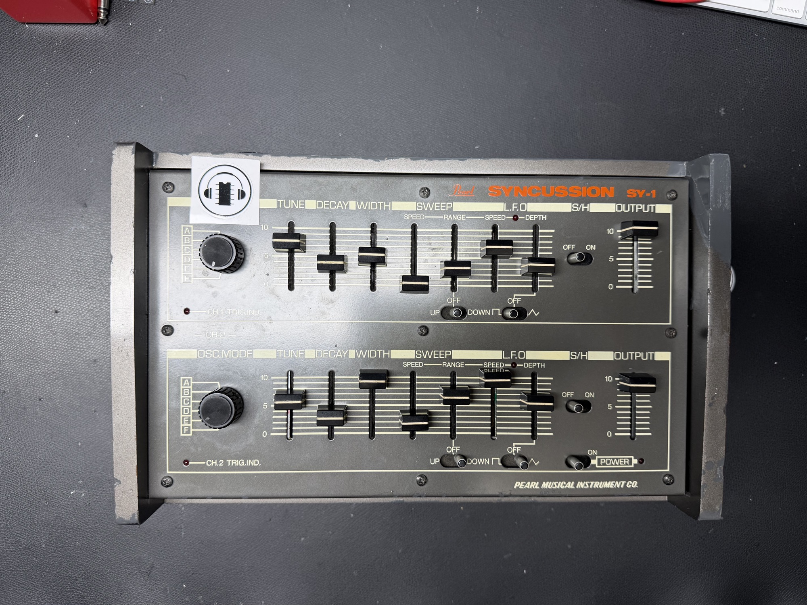
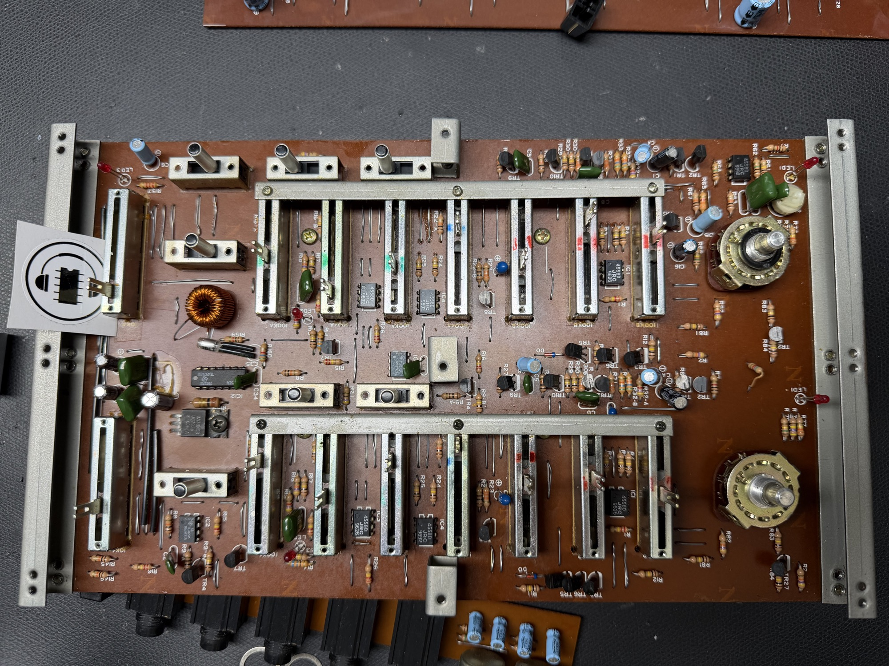
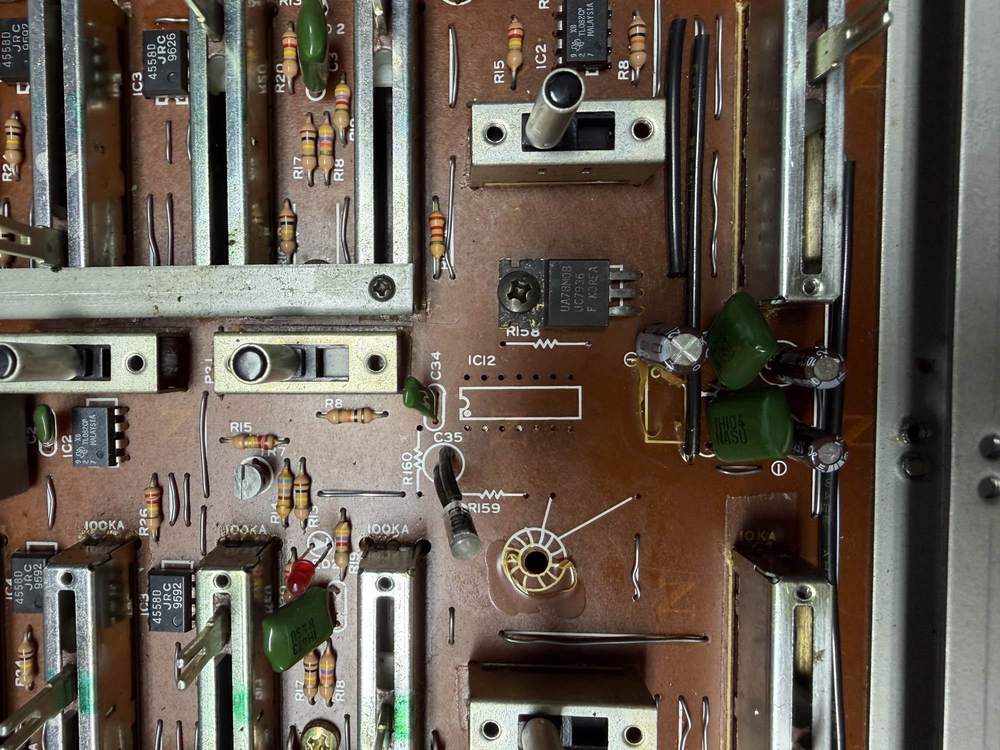
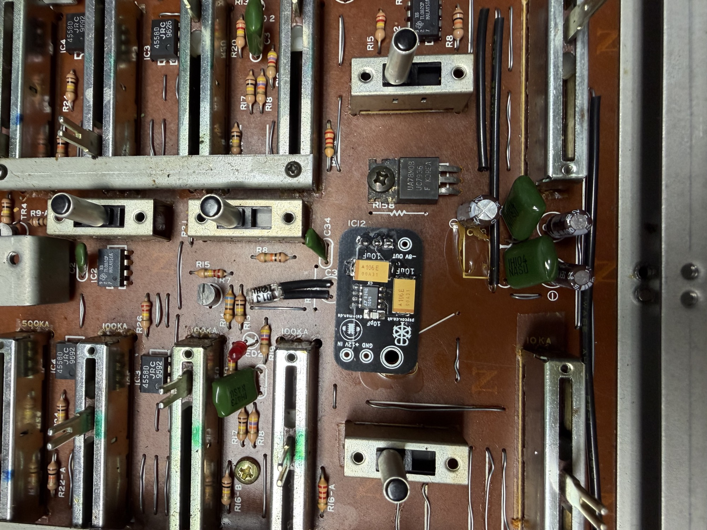
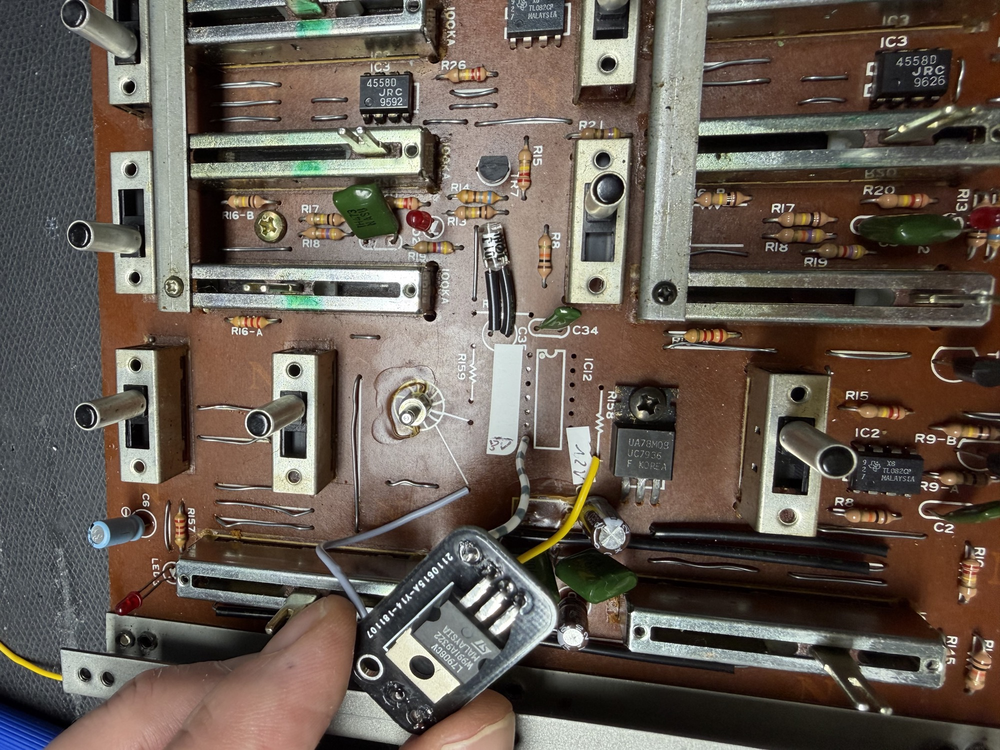
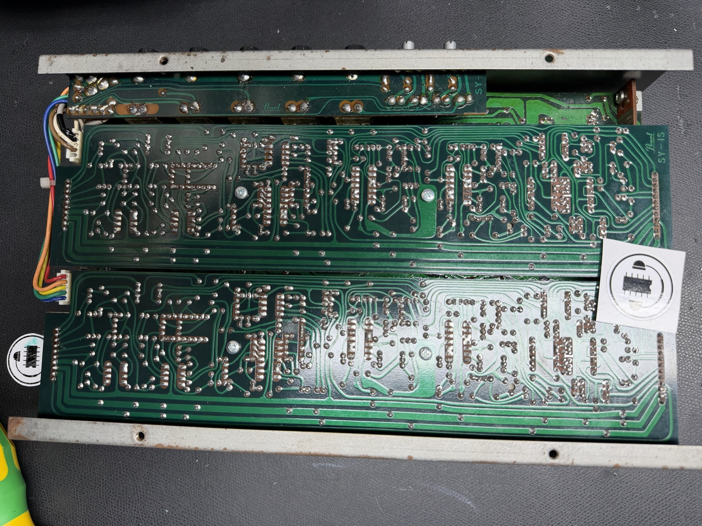
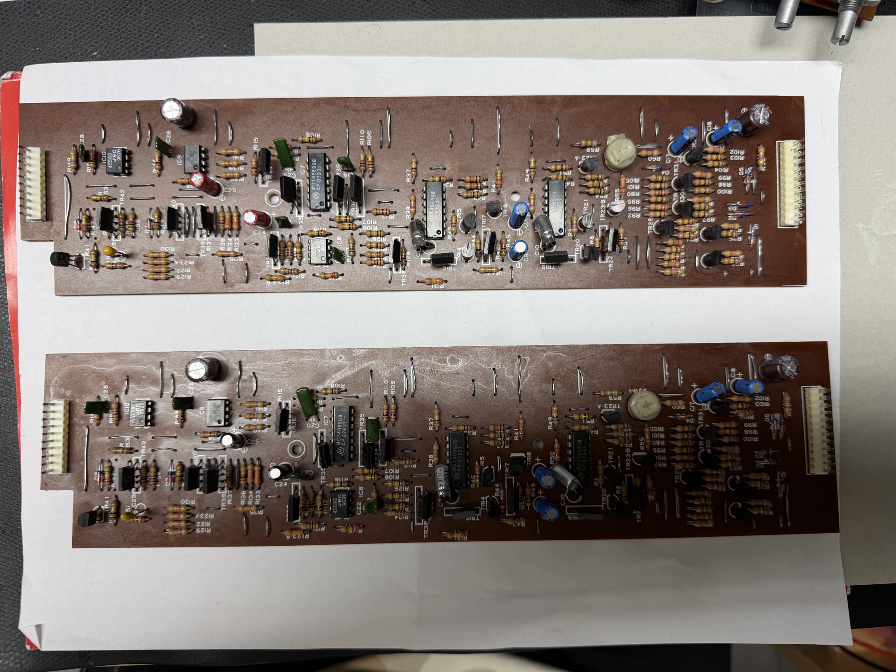
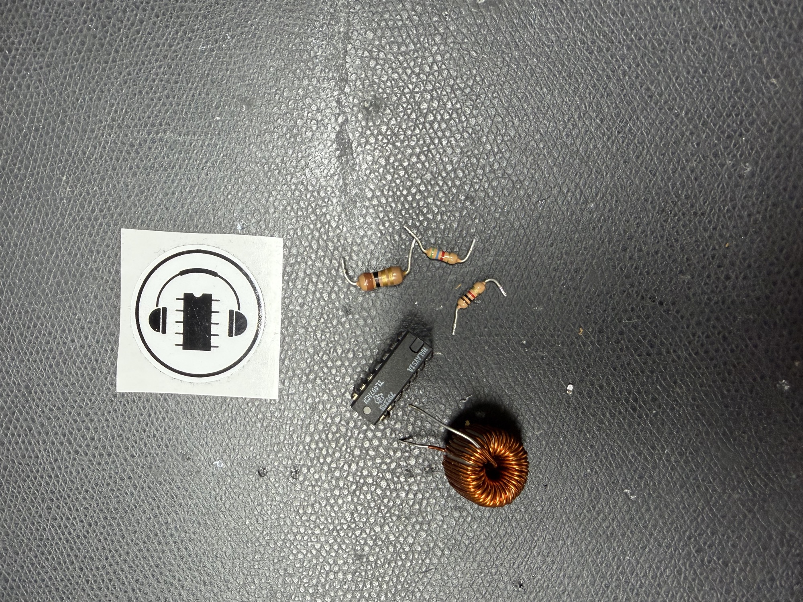
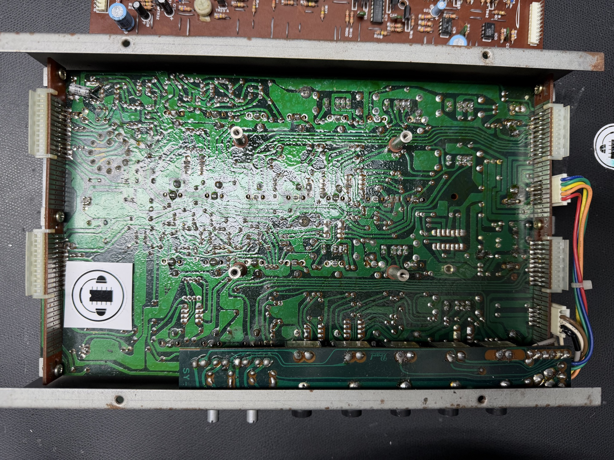

# Pearl Syncussion SY-1 Service and Psu Mod

The Pearl Syncussion arrived me from a customer and I made a service. (not the first SY-1 here)

1. Full recap of Tantalum and Elko caps.
2. Installing my Powersupply Mod - which gives you less hum and less noisy Audio Outputs,

Schematic backup from Bergofon page

[https://web.archive.org/web/20240614124500/http://bergfotron.synth.net/Percussion/super%20syncussion.html](https://web.archive.org/web/20240614124500/http://bergfotron.synth.net/Percussion/super%20syncussion.html)

[Syncussion SY-1 PSU.pdf](assets/Syncussion-SY-1-PSU.pdf)

[Syncussion SY-1.pdf](assets/Syncussion-SY-1.pdf)

## **Gallery**

