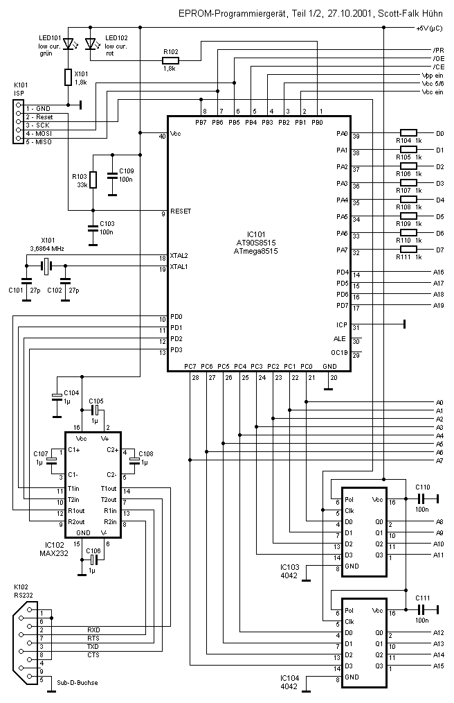
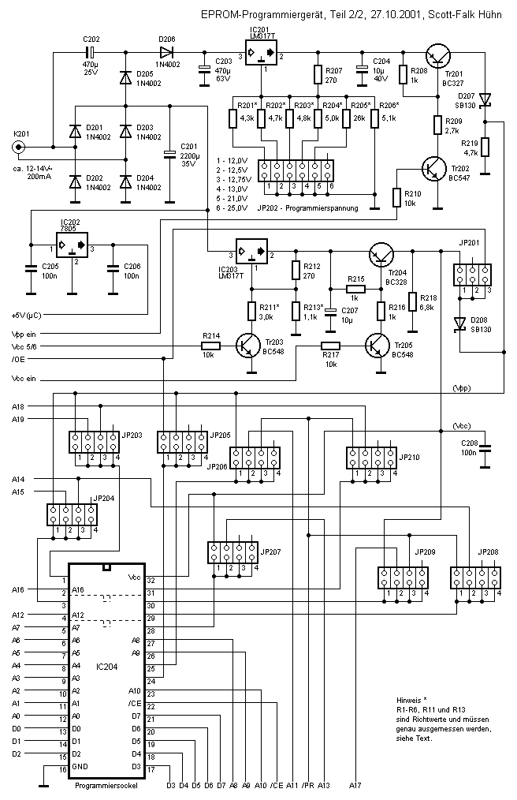
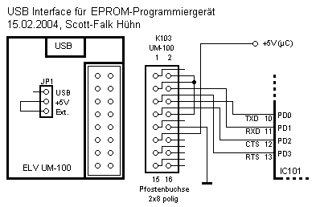
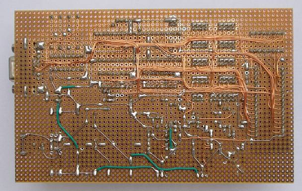
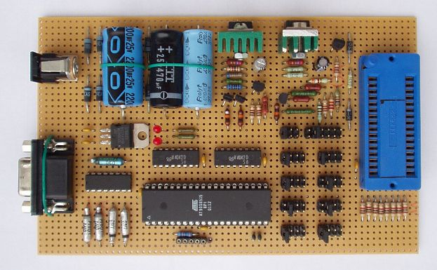
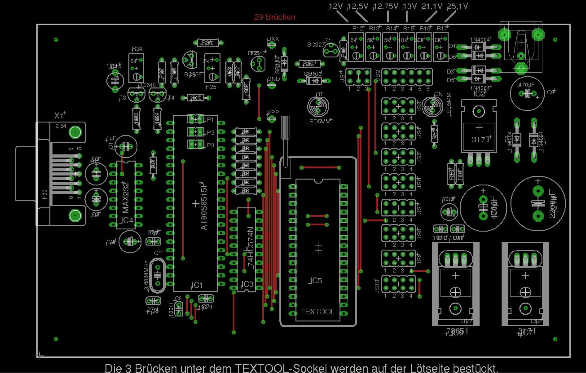

# tech docs

**source:** [http://s-huehn.de/elektronik/epromprog/epromprog.htm](http://s-huehn.de/elektronik/epromprog/epromprog.htm)

[Layout: epromprog-pl.zip](assets/epromprog-pl.zip)

[Sourcen: epromprog-v106.zip](assets/epromprog-v106.zip)

[eprommer-cam.ps](assets/eprommer-cam.ps)  layout

[eprommer-sch.ps](assets/eprommer-sch.ps)  layout

