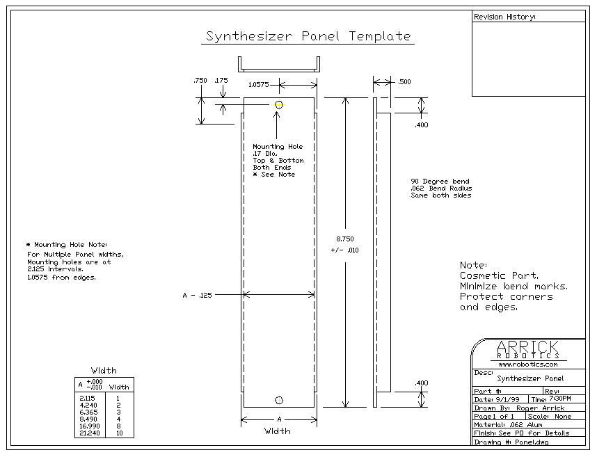
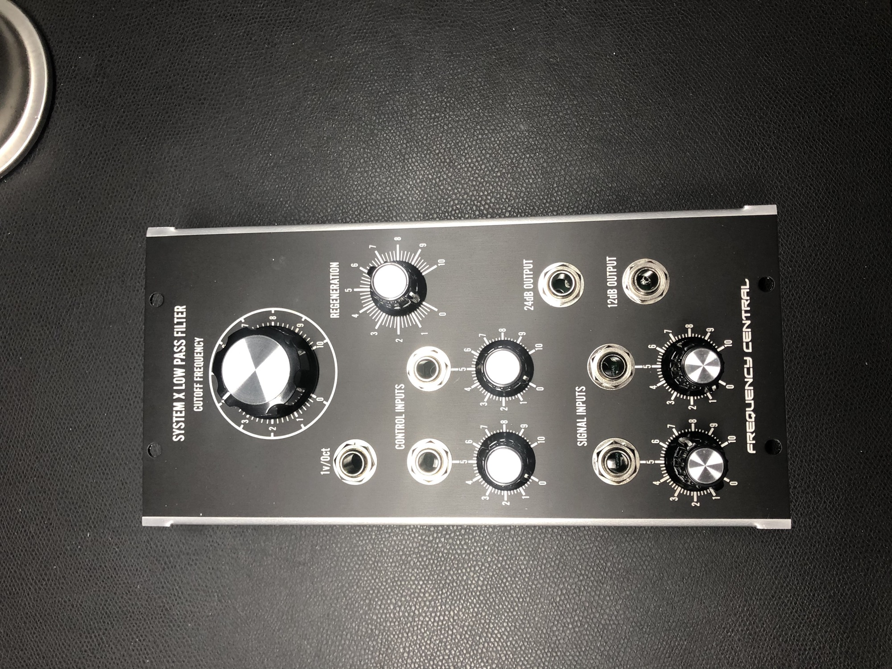
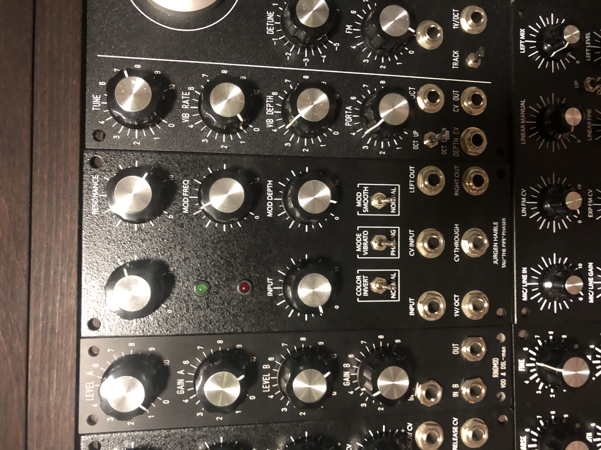

# 5U Format specifications

## MU Panels:

source: [https://synthesizers.com/technical.html](https://synthesizers.com/technical.html)

[Synthesizers.com](http://Synthesizers.com) Q series modules adhere to the **MU (Moog Unit)** format modeled after the Moog Modular.

Each synthesizer module consists of a front panel and a circuit board mounted on the back parallel with the front. Modules may be removed from the synthesizer cabinet after removing the mounting screws and the power connector. Some modules are attached to another module behind the panel as is the case of Aid modules.

Panels are made of .062" aluminium, sanded, formed on the sides for strength, masked, painted, textured, then silkscreen printed. All panels are 8.75" in height and come in various 'widths'.

**Panel Widths**
A single width panel is 2.125" - all others are multiples of this single width. Common sizes are single, double, quad, and octal, but any multiple of a single will fit in our cabinetry.

**Common Panel Widths**
Single: 2.125"
Double: 4.25"
Quad: 8.5"
Octal: 17"

[CAD drawing](https://synthesizers.com/tech/panel.gif) of a panel.

**Mounting Flanges**
Mounting flanges at the top and bottom of each module panel are .4" tall which mates nicely with a 3/8" (.375) mounting surface.

 

## **MOTM Panels:**

**history of MOTM: [https://en.wikipedia.org/wiki/MOTM](https://en.wikipedia.org/wiki/MOTM)**

**source: [http://synthtech.com/motm/info/](http://synthtech.com/motm/info/)**

**MOTM modules are designed to be easily mounted into standard 19" equipment racks. A 19" rack is slightly larger than 10U spaces wide (1U=1.75"). MOTM modules are in multiples of 1U in width, and 5U in height. Most modules are 2U wide, so 5 modules will fit across a rack. We offer the [MOTM-19A Mounting Rails](http://synthtech.com/motm/accessories/) for this purposes. These rails are stackable vertically, so multiple rows of MOTM modules can fit in the rack. The use of wood cabinets or custom rails wider than 19" is also possible.**

**SIZE: 1U=1.75" (44,52 mm) do the math byself if you multiple to 10U = 17,5"= different its 44,45cm**

**high = 221,87mm normally**

****width**2U = 3,5" 88,52mm width (normally)**

****width**3U = 5,25"**

****

**other FORMATS:**

**see here: [https://www.synthesizers.com/formfactors.html](https://www.synthesizers.com/formfactors.html)**

| Manufacturer | Model | Format | Connector | Height | Smallest Width | Power |
|---|---|---|---|---|---|---|
| **Moog** | **900** | **MU** | **1/4"** | **8.75" (5U)** | **2.125"** | **+12,-6** |
| [Synthesizers.com](http://Synthesizers.com) | **Q** | MU | 1/4" | 8.75" (5U) | 2.125" | +15,-15,+5 |
| Doepfer | A100 | EuroRack | 3.5mm | 128.5mm (~3U) | 10mm (.4") | +12,-12,+5 |
| EuroRack | Modular | EuroRack | 3.5mm | 128.5mm (~3U) | 10mm (.4") | +12,-12,+5 |
| **MOTM** | **Modular** | **MOTM** | **1/4"** | **8.75" (5U)** | **1.75" (1U)** | **+15,-15** |
| Modcan | B Series | MOTM | 1/4" | 8.75" (5U) | 1.75" (1U) | +15,-15,+5 |
| Blacet | Modular | FrackRack | 3.5mm | 5.25" (3U) | 3" | +15,-15 |
| Paia | 9700 | FrackRack | 3.5mm | 5.25" (3U) | 1.5" | +15,-15 |
| Paia | 2700/4700 |   | 3.5mm | 4" | 2" | +9,-9 |
| Buchla | 100/200/200e | 4U | Banana & TiniJax | 7" (4U) | 4.25" | +15,-15,+5, +12,+24 |
| Serge | Modular | Rack | Banana | 7" (4U) | 17" | +12,-12 |
| Polyfusion | 2000 |   | 1/4" | 7" (4U) | 3" | +15,-15 |
| PPG | 300 |   | 1/4" | 220mm | 110mm | +12,-12 |
| Steiner-Parker | Synthasystem |   | 3.5mm | 150mm | 45mm | +12,-12 |
| EMU | 2000 |   | 1/4" | 6" | 3" | +15,-15,+5 |
| ARP | 2500 |   | 3.5mm | 8" | 3" | +15,-15,+12 |
| Roland | 100M |   | 3.5mm | 230mm | 104mm | +15,-15,+22 |
| Digisound | 80 |   | 3.5mm | 9" | 3" | +15,-15,+5 |
| Aries | 300 |   | TiniJax/3.5mm | 9" | 3" | +15,-15,+5 |
| Modcan | A Series |   | Banana | 9" | 2.25" | +15,-15,+5 |
| Cynthia | A Series |   | Banana | 9" | 2.25" | +15,-15,+5 |
| KB Elec. | Wavemakers |   | 1/4" | 10" | 2" | +12,-12 |
| CMS | Modular |   | 3.5mm | 10.3" | 3" | +15,-15 |
| Wiard | 300 |   | 3.5mm | 10.5" (6U) | 2.83" | +15,-15 |
| Roland | 700 |   | 1/4" | 11" | 2.56" | +15,-15,+14.4 |
| Technosaurus | Selector |   | 1/4" | 15.75" (9U) | 1.6" | +18,-18 |

→ siehe

Special thanks to: Sam, Mike, Mark, Steve, Bernie, Nicola, Andre, Steve, Ruud, and John for helping me collect this information. -Roger.
