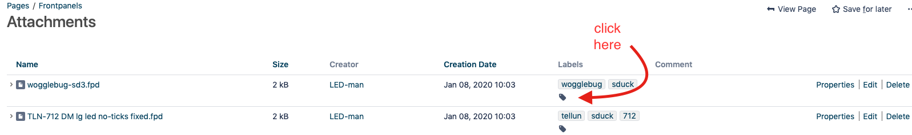

# Frontpanels

> **Welcome!**
>
> This is the home page for your Frontpanel Team space within Confluence. 
>
> **Feel free to create an account on my Website and ask for EDIT permissions by Email (or send an request as comment) or by facebook (Patrick DSLman), instagram (diysynth.de), muffwiggler (LED-man)**

> **Important**
>
> **Buchla is a company and own the Trademark "Buchla"**
>
> **visit [https://buchla.com/](https://buchla.com/company/) if you want the original Easel and 208/218 modules**
>
> **This website (DSL-man.de) is only for private usage and for documentation.**

This an backup from the depricated yahoo ModularSynth Panels group which is offline since 01/2020 (atm. its still online but discontinued)

new Panel designs can uploaded to this page.

This Website use a page history function /Versioncontrol ! ist not possible for users to delete or destroy the Website/pages.

some own Panels from me are also avaiable in the [5U Modularprojects](../diy-5u-modular-synthesizer/modular-in-5u-projects/index.md) space on this Website. 

FPD Files are front panel files for the frontpaneldesigner tool from schaeffer,**[which is available for Windows and macOS.](https://www.schaeffer-ag.de/frontplatten-designer)**

**Every attachment is labeled with an identifier like VCF or MOTM or LPG and the Name of the developer or supplier !**

**in case you upload own files, click on the attachment list and add labels for your files.**

**Labels list:**

**Label Heatmap**

**Attachment list:**

- [blacet 2010 klang werk.fpd](assets/blacet-2010-klang-werk.fpd)
- [blacet 2040 mixer.fpd](assets/blacet-2040-mixer.fpd)
- [blacet 2100 vco.fpd](assets/blacet-2100-vco.fpd)
- [blacet 2225 input.fpd](assets/blacet-2225-input.fpd)
- [blacet 2300 binary zone.fpd](assets/blacet-2300-binary-zone.fpd)
- [blacet delay.fpd](assets/blacet-delay.fpd)
- [blacet mini wave.fpd](assets/blacet-mini-wave.fpd)
- [Blacet.EG1.fpd](assets/Blacet.EG1.fpd)
- [Blacet.VCA2200.fpd](assets/Blacet.VCA2200.fpd)
- [blacetio.fpd](assets/blacetio.fpd)
- [Screen Shot 2019-12-11 at 6.45.04 PM.jpg](assets/Screen-Shot-2019-12-11-at-6.45.04-PM.jpg)
- [281-wide-frac.fpd](assets/281-wide-frac.fpd)
- [Blacet Cyn LPG 02.fpd](assets/Blacet-Cyn-LPG-02.fpd)
- [Blacet Format Mixer.fpd](assets/Blacet-Format-Mixer.fpd)
- [Blacet Format Mult.fpd](assets/Blacet-Format-Mult.fpd)
- [Blacet Freq Standards.fpd](assets/Blacet-Freq-Standards.fpd)
- [Blacet Gabotronics OScope.fpd](assets/Blacet-Gabotronics-OScope.fpd)
- [Blacet JH Shifter 02.fpd](assets/Blacet-JH-Shifter-02.fpd)
- [Blacet JH Tau Phaser.fpd](assets/Blacet-JH-Tau-Phaser.fpd)
- [Blacet JH Varislope.fpd](assets/Blacet-JH-Varislope.fpd)
- [Blacet Mankato.fpd](assets/Blacet-Mankato.fpd)
- [Blacet MOTM 300 VCO triple 02.fpd](assets/Blacet-MOTM-300-VCO-triple-02.fpd)
- [Blacet MOTM 420.fpd](assets/Blacet-MOTM-420.fpd)
- [Blacet MOTM 440.fpd](assets/Blacet-MOTM-440.fpd)
- [Blacet Plague Bearer with mult 02.fpd](assets/Blacet-Plague-Bearer-with-mult-02.fpd)
- [Blacet Quad_vca_1.fpd](assets/Blacet-Quad_vca_1.fpd)
- [Blacet Saw Animator.fpd](assets/Blacet-Saw-Animator.fpd)
- [Blacet Yu Fixed Filter.fpd](assets/Blacet-Yu-Fixed-Filter.fpd)
- [Blacet YU Gate Delay.fpd](assets/Blacet-YU-Gate-Delay.fpd)
- [Blacet YUARP Filter 1U.fpd](assets/Blacet-YUARP-Filter-1U.fpd)
- [Blacet YUMoog Filter 1U.fpd](assets/Blacet-YUMoog-Filter-1U.fpd)
- [EFM VCF7 Panel FINAL.fpd](assets/EFM-VCF7-Panel-FINAL.fpd)
- [encore 2space rev2.fpd](assets/encore-2space-rev2.fpd)
- [OScope and A440 02 quarter inch LEDs.fpd](assets/OScope-and-A440-02-quarter-inch-LEDs.fpd)
- [Screen Shot 2019-12-11 at 4.34.10 PM.jpg](assets/Screen-Shot-2019-12-11-at-4.34.10-PM.jpg)
- [Screen Shot 2019-12-11 at 4.34.28 PM.jpg](assets/Screen-Shot-2019-12-11-at-4.34.28-PM.jpg)
- [Screen Shot 2019-12-11 at 4.34.38 PM.jpg](assets/Screen-Shot-2019-12-11-at-4.34.38-PM.jpg)
- [1U HPGL 11-13-07.fpd](assets/1U-HPGL-11-13-07.fpd)
- [2U HPGL 11-13-07.fpd](assets/2U-HPGL-11-13-07.fpd)
- [AM4075 VCF.FPD](assets/AM4075-VCF.fpd)
- [CGS Bi-N-Tic.fpd](assets/CGS-Bi-N-Tic.fpd)
- [DJB-001 Keyboard.fpd](assets/DJB-001-Keyboard.fpd)
- [DJB-002 Reverb.fpd](assets/DJB-002-Reverb.fpd)
- [DJB-003 Multiples.fpd](assets/DJB-003-Multiples.fpd)
- [DJB-004 Mix FWR Cmp.fpd](assets/DJB-004-Mix-FWR-Cmp.fpd)
- [DJB-005 Voltage Mon.fpd](assets/DJB-005-Voltage-Mon.fpd)
- [DJB-006 Control.fpd](assets/DJB-006-Control.fpd)
- [DJB-006A Control.fpd](assets/DJB-006A-Control.fpd)
- [DJB-007 Power.fpd](assets/DJB-007-Power.fpd)
- [DJB-008 Dual Delay.fpd](assets/DJB-008-Dual-Delay.fpd)
- [DJB-009 Analogic.fpd](assets/DJB-009-Analogic.fpd)
- [DJB-010 Attenuators.fpd](assets/DJB-010-Attenuators.fpd)
- [DJB-011 Ribbon.fpd](assets/DJB-011-Ribbon.fpd)
- [DJB-012 Tape Interface.fpd](assets/DJB-012-Tape-Interface.fpd)
- [DJB-013 Quantize-Lag.fpd](assets/DJB-013-Quantize-Lag.fpd)
- [DJB-014 Output.fpd](assets/DJB-014-Output.fpd)
- [DJB-015 Sound Canvas.fpd](assets/DJB-015-Sound-Canvas.fpd)
- [DJB-016 Level Shift.fpd](assets/DJB-016-Level-Shift.fpd)
- [DJB-017 MIDI2CV.fpd](assets/DJB-017-MIDI2CV.fpd)
- [DJB-018 Joystick.fpd](assets/DJB-018-Joystick.fpd)
- [DJB-CVS.fpd](assets/DJB-CVS.fpd)
- [DJB-PSIM.fpd](assets/DJB-PSIM.fpd)
- [OMS-410.FPD](assets/OMS-410.fpd)
- [OMS-EFG.fpd](assets/OMS-EFG.fpd)
- [OMS-Equinoxe.fpd](assets/OMS-Equinoxe.fpd)
- [Screen Shot 2019-12-11 at 4.51.44 PM.jpg](assets/Screen-Shot-2019-12-11-at-4.51.44-PM.jpg)
- [Screen Shot 2019-12-11 at 4.52.04 PM.jpg](assets/Screen-Shot-2019-12-11-at-4.52.04-PM.jpg)
- [Screen Shot 2019-12-11 at 4.52.16 PM.jpg](assets/Screen-Shot-2019-12-11-at-4.52.16-PM.jpg)
- [Screen Shot 2019-12-11 at 4.52.22 PM.jpg](assets/Screen-Shot-2019-12-11-at-4.52.22-PM.jpg)
- [TH-201 Mankato VCF.fpd](assets/TH-201-Mankato-VCF.fpd)
- [TH-566 VCO.fpd](assets/TH-566-VCO.fpd)
- [Wiard JAG.fpd](assets/Wiard-JAG.fpd)
- [Wogglebug.fpd](assets/Wogglebug.fpd)
- [Wogglebug.pdf](assets/Wogglebug.pdf)
- [YuSynth FFB.fpd](assets/YuSynth-FFB.fpd)
- [ATTENUATE4.fpd](assets/ATTENUATE4.fpd)
- [ATTENUATE4.gif](assets/ATTENUATE4.gif)
- [ATTENUATE12D.fpd](assets/ATTENUATE12D.fpd)
- [ATTENUATE12D.gif](assets/ATTENUATE12D.gif)
- [BUFFER.fpd](assets/BUFFER.fpd)
- [BUFFER.gif](assets/BUFFER.gif)
- [E340 3U MOTM.fpd](assets/E340-3U-MOTM.fpd)
- [E340 3U MOTM.gif](assets/E340-3U-MOTM.gif)
- [MINMAX.fpd](assets/MINMAX.fpd)
- [MINMAX.gif](assets/MINMAX.gif)
- [Screen Shot 2019-12-07 at 11.19.06 PM.jpg](assets/Screen-Shot-2019-12-07-at-11.19.06-PM.jpg)
- [ARP VCF.fpd](assets/ARP-VCF.fpd)
- [dualADSR.fpd](assets/dualADSR.fpd)
- [EFM-VC~1.FPD](assets/EFM-VC-1.fpd)
- [efm-vcf1e.fpd](assets/efm-vcf1e.fpd)
- [efm-vcf6c v2.fpd](assets/efm-vcf6c-v2.fpd)
- [efm-vcf6c.fpd](assets/efm-vcf6c.fpd)
- [efm-vcf12a.fpd](assets/efm-vcf12a.fpd)
- [efm-vcradsr.fpd](assets/efm-vcradsr.fpd)
- [efm-vcws1b.fpd](assets/efm-vcws1b.fpd)
- [EGLFO.fpd](assets/EGLFO.fpd)
- [Screen Shot 2019-12-11 at 6.37.39 PM.jpg](assets/Screen-Shot-2019-12-11-at-6.37.39-PM.jpg)
- [vco1e.fpd](assets/vco1e.fpd)
- [gw MFOS sequencer_5U Circle.fpd](assets/gw-MFOS-sequencer_5U-Circle.fpd)
- [GW-MPS.fpd](assets/GW-MPS.fpd)
- [GWThomas White KLEE Rotary Design V2.fpd](assets/GWThomas-White-KLEE-Rotary-Design-V2.fpd)
- [Screen Shot 2019-12-07 at 11.23.07 PM.jpg](assets/Screen-Shot-2019-12-07-at-11.23.07-PM.jpg)
- [efg.fpd](assets/efg.fpd)
- [MOOG super ladder.fpd](assets/MOOG-super-ladder.fpd)
- [oakley noisefilter.fpd](assets/oakley-noisefilter.fpd)
- [oakley svf.fpd](assets/oakley-svf.fpd)
- [oakley triple lfo.fpd](assets/oakley-triple-lfo.fpd)
- [oakley triple vca.fpd](assets/oakley-triple-vca.fpd)
- [Oakley.efglaglfo.fpd](assets/Oakley.efglaglfo.fpd)
- [Oakley.lfolag.fpd](assets/Oakley.lfolag.fpd)
- [Oakley.oms-4102.fpd](assets/Oakley.oms-4102.fpd)
- [OakleySVF.fpd](assets/OakleySVF.fpd)
- [ROLAND super ladder SILVER.fpd](assets/ROLAND-super-ladder-SILVER.fpd)
- [Screen Shot 2019-12-11 at 6.42.57 PM.jpg](assets/Screen-Shot-2019-12-11-at-6.42.57-PM.jpg)
- [Screen Shot 2019-12-11 at 6.43.09 PM.jpg](assets/Screen-Shot-2019-12-11-at-6.43.09-PM.jpg)
- [vca.fpd](assets/vca.fpd)
- [vco-panel2.fpd](assets/vco-panel2.fpd)
- [Elektor formant VCO met lin FM.fpd](assets/Elektor-formant-VCO-met-lin-FM.fpd)
- [JLH-831.fpd](assets/JLH-831.fpd)
- [Korg MS-20.fpd](assets/Korg-MS-20.fpd)
- [polivoks_vcf.fpd](assets/polivoks_vcf.fpd)
- [Screen Shot 2019-12-07 at 11.13.52 PM.jpg](assets/Screen-Shot-2019-12-07-at-11.13.52-PM.jpg)
- [vcf_synthacon.fpd](assets/vcf_synthacon.fpd)
- [Vocoder.fpd](assets/Vocoder.fpd)
- [Yusynth EMS filter.fpd](assets/Yusynth-EMS-filter.fpd)
- [5U MPS.pdf](assets/5U-MPS.pdf)
- [Screen Shot 2019-12-08 at 12.10.10 PM.jpg](assets/Screen-Shot-2019-12-08-at-12.10.10-PM.jpg)
- [1U Dixon ASR fixed.fpd](assets/1U-Dixon-ASR-fixed.fpd)
- [1u motm LPG sd1-colors.fpd](assets/1u-motm-LPG-sd1-colors.fpd)
- [1u motm Plague Bearer sd1-colors.fpd](assets/1u-motm-Plague-Bearer-sd1-colors.fpd)
- [2u CLee 8Channel Quantizer sd1 colors.fpd](assets/2u-CLee-8Channel-Quantizer-sd1-colors.fpd)
- [2u motm digital scope.fpd](assets/2u-motm-digital-scope.fpd)
- [2u motm dual choices-sd1-colors.fpd](assets/2u-motm-dual-choices-sd1-colors.fpd)
- [2u motm dual lpg-sd1-colors.fpd](assets/2u-motm-dual-lpg-sd1-colors.fpd)
- [2u motm e340 sd1 colors.fpd](assets/2u-motm-e340-sd1-colors.fpd)
- [2u motm e350 sd1 colors.fpd](assets/2u-motm-e350-sd1-colors.fpd)
- [2u motm J3rk 258 clone sd1 colors.fpd](assets/2u-motm-J3rk-258-clone-sd1-colors.fpd)
- [2u motm lpg-sd1-colors.fpd](assets/2u-motm-lpg-sd1-colors.fpd)
- [2u motm SCMRCD sd1 colors w taptempo.fpd](assets/2u-motm-SCMRCD-sd1-colors-w-taptempo.fpd)
- [2u motm TH MPS sd1 colors2.fpd](assets/2u-motm-TH-MPS-sd1-colors2.fpd)
- [2u motm VCS-sd1-colors.fpd](assets/2u-motm-VCS-sd1-colors.fpd)
- [2u Toppobrillo TWF.fpd](assets/2u-Toppobrillo-TWF.fpd)
- [2u yusynth vc panner sd1 colors.fpd](assets/2u-yusynth-vc-panner-sd1-colors.fpd)
- [3U Dual Bug sd1 colors.fpd](assets/3U-Dual-Bug-sd1-colors.fpd)
- [3U SoST sd1 colors v2.fpd](assets/3U-SoST-sd1-colors-v2.fpd)
- [3U SoST sd1 colors.fpd](assets/3U-SoST-sd1-colors.fpd)
- [blacet-BZ sd1.fpd](assets/blacet-BZ-sd1.fpd)
- [blacet-DSC sd1.fpd](assets/blacet-DSC-sd1.fpd)
- [blacet-MW sd1.fpd](assets/blacet-MW-sd1.fpd)
- [Euro 8hp-MOTM adaptor w 2x4 multiple holes.fpd](assets/Euro-8hp-MOTM-adaptor-w-2x4-multiple-holes.fpd)
- [Frac-MOTM adaptor w 2x4 multiple holes.fpd](assets/Frac-MOTM-adaptor-w-2x4-multiple-holes.fpd)
- [Frac-MOTM adaptor w-o  multiple holes.fpd](assets/Frac-MOTM-adaptor-w-o-multiple-holes.fpd)
- [kleesd1.fpd](assets/kleesd1.fpd)
- [kleesd1respaced.fpd](assets/kleesd1respaced.fpd)
- [MFOS WSG2.fpd](assets/MFOS-WSG2.fpd)
- [Screen Shot 2019-12-08 at 12.11.11 PM.jpg](assets/Screen-Shot-2019-12-08-at-12.11.11-PM.jpg)
- [Screen Shot 2019-12-08 at 12.11.25 PM.jpg](assets/Screen-Shot-2019-12-08-at-12.11.25-PM.jpg)
- [Screen Shot 2019-12-08 at 12.11.43 PM.jpg](assets/Screen-Shot-2019-12-08-at-12.11.43-PM.jpg)
- [Screen Shot 2019-12-08 at 12.11.52 PM.jpg](assets/Screen-Shot-2019-12-08-at-12.11.52-PM.jpg)
- [SD-DJB-Frequency Shifter1.fpd](assets/SD-DJB-Frequency-Shifter1.fpd)
- [TLN-712 DM lg led no-ticks fixed.fpd](assets/TLN-712-DM-lg-led-no-ticks-fixed.fpd)
- [wogglebug-sd3.fpd](assets/wogglebug-sd3.fpd)
- [Bildschirmfoto 2020-01-08 um 10.23.12.png](assets/Bildschirmfoto-2020-01-08-um-10.23.12.png)
- [Bildschirmfoto 2020-01-08 um 10.26.41.png](assets/Bildschirmfoto-2020-01-08-um-10.26.41.png)
- [blacet_mixer_MOTM_back.jpg](assets/blacet_mixer_MOTM_back.jpg)
- [my3-820.fpd](assets/my3-820.fpd)
- [oakley-superladder-5.fpd](assets/oakley-superladder-5.fpd)
- [passives.fpd](assets/passives.fpd)
- [standard-woggle.fpd](assets/standard-woggle.fpd)
- [blacet-double-mini-wave.fpd](assets/blacet-double-mini-wave.fpd)
- [blacet-mini-wave-1.fpd](assets/blacet-mini-wave-1.fpd)
- [blacet-mixer-2.fpd](assets/blacet-mixer-2.fpd)
- [blacet-mixer-3.fpd](assets/blacet-mixer-3.fpd)
- [blacet-vca-2200-3.fpd](assets/blacet-vca-2200-3.fpd)
- [blacet-vco-2100-3.fpd](assets/blacet-vco-2100-3.fpd)
- [blacet2070-2.fpd](assets/blacet2070-2.fpd)
- [cgs-small-21.fpd](assets/cgs-small-21.fpd)
- [cgs-small-mods.fpd](assets/cgs-small-mods.fpd)
- [cgs-vco-3.fpd](assets/cgs-vco-3.fpd)
- [cgs32-infinite-melody-2.fpd](assets/cgs32-infinite-melody-2.fpd)
- [cgs49-twin-wasp-vcf.fpd](assets/cgs49-twin-wasp-vcf.fpd)
- [cgs75-serge-vcs.fpd](assets/cgs75-serge-vcs.fpd)
- [dual-lfo-eg.fpd](assets/dual-lfo-eg.fpd)
- [mix-attn-2.fpd](assets/mix-attn-2.fpd)
- [mix-attn-double-2.fpd](assets/mix-attn-double-2.fpd)
- [mix-cmp3.fpd](assets/mix-cmp3.fpd)
- [281 AR v3.fpd](assets/281-AR-v3.fpd)
- [300 dual vc switch.fpd](assets/300-dual-vc-switch.fpd)
- [BZ-300.fpd](assets/BZ-300.fpd)
- [MaxiWave-ASR-Mult.fpd](assets/MaxiWave-ASR-Mult.fpd)
- [Maxiwave-Expander-v5.fpd](assets/Maxiwave-Expander-v5.fpd)
- [QUAD LPG 300.fpd](assets/QUAD-LPG-300.fpd)
- [quad quant 300.fpd](assets/quad-quant-300.fpd)
- [Screen Shot 2019-12-11 at 4.47.05 PM.jpg](assets/Screen-Shot-2019-12-11-at-4.47.05-PM.jpg)
- [Wiard adapter mult.fpd](assets/Wiard-adapter-mult.fpd)
- [Buchla194.fpd](assets/Buchla194.fpd)
- [Buchla291_mixoptions.fpd](assets/Buchla291_mixoptions.fpd)
- [BuchlaCynd1.4-1.fpd](assets/BuchlaCynd1.4-1.fpd)
- [Screen Shot 2019-12-11 at 4.42.29 PM.jpg](assets/Screen-Shot-2019-12-11-at-4.42.29-PM.jpg)
- [cgs dual asr.fpd](assets/cgs-dual-asr.fpd)
- [cgs dual bandpass.fpd](assets/cgs-dual-bandpass.fpd)
- [cgs dual chime.fpd](assets/cgs-dual-chime.fpd)
- [cgs gate seq V3.fpd](assets/cgs-gate-seq-V3.fpd)
- [cgs gated comp.fpd](assets/cgs-gated-comp.fpd)
- [cgs mast div.fpd](assets/cgs-mast-div.fpd)
- [cgs mega mixer.fpd](assets/cgs-mega-mixer.fpd)
- [cgs multiplier.fpd](assets/cgs-multiplier.fpd)
- [cgs proc.fpd](assets/cgs-proc.fpd)
- [cgs quad bandpass.fpd](assets/cgs-quad-bandpass.fpd)
- [cgs quad bandpass2.fpd](assets/cgs-quad-bandpass2.fpd)
- [cgs quad drum.fpd](assets/cgs-quad-drum.fpd)
- [cgs steiner vcf.fpd](assets/cgs-steiner-vcf.fpd)
- [cgs subosc.fpd](assets/cgs-subosc.fpd)
- [cgs super psycho.fpd](assets/cgs-super-psycho.fpd)
- [CGS_Synthacon_VCF.jpg](assets/CGS_Synthacon_VCF.jpg)
- [cgs.analogic.fpd](assets/cgs.analogic.fpd)
- [cgs.asr.fpd](assets/cgs.asr.fpd)
- [cgs.burstgen.fpd](assets/cgs.burstgen.fpd)
- [cgs.cascademixer.fpd](assets/cgs.cascademixer.fpd)
- [cgs.cvcluster2U.fpd](assets/cgs.cvcluster2U.fpd)
- [cgs.dualcynare2U.fpd](assets/cgs.dualcynare2U.fpd)
- [cgs.gatedcomp.fpd](assets/cgs.gatedcomp.fpd)
- [cgs.masterdivider.rotary.fpd](assets/cgs.masterdivider.rotary.fpd)
- [cgs.pulse.divider.fpd](assets/cgs.pulse.divider.fpd)
- [cgs.seqswitch.fpd](assets/cgs.seqswitch.fpd)
- [cgs.superpsycho.fpd](assets/cgs.superpsycho.fpd)
- [cgs.synthaconvcf 2U.fpd](assets/cgs.synthaconvcf-2U.fpd)
- [cgs.synthaconvcf.fpd](assets/cgs.synthaconvcf.fpd)
- [cgs.vcdivider.fpd](assets/cgs.vcdivider.fpd)
- [cgs.vco3U.4row.fpd](assets/cgs.vco3U.4row.fpd)
- [cgs.wavemultiplier2.fpd](assets/cgs.wavemultiplier2.fpd)
- [cgs.wavemultiplier3.fpd](assets/cgs.wavemultiplier3.fpd)
- [cgs33 matrix mixer 4x4.gif](assets/cgs33-matrix-mixer-4x4.gif)
- [cgs33 matrix mixer4x4.fpd](assets/cgs33-matrix-mixer4x4.fpd)
- [dual-cgs-burstgen.fpd](assets/dual-cgs-burstgen.fpd)
- [dual-cgs-synthaconvcf.fpd](assets/dual-cgs-synthaconvcf.fpd)
- [dual-cgs-vco.fpd](assets/dual-cgs-vco.fpd)
- [dualpsychocluster.fpd](assets/dualpsychocluster.fpd)
- [DUSG.fpd](assets/DUSG.fpd)
- [lockhardring.fpd](assets/lockhardring.fpd)
- [modulo.fpd](assets/modulo.fpd)
- [newmixer.fpd](assets/newmixer.fpd)
- [reverbmix.fpd](assets/reverbmix.fpd)
- [Screen Shot 2019-12-11 at 6.46.58 PM.jpg](assets/Screen-Shot-2019-12-11-at-6.46.58-PM.jpg)
- [Screen Shot 2019-12-11 at 6.47.12 PM.jpg](assets/Screen-Shot-2019-12-11-at-6.47.12-PM.jpg)
- [Screen Shot 2019-12-11 at 6.47.30 PM.jpg](assets/Screen-Shot-2019-12-11-at-6.47.30-PM.jpg)
- [Screen Shot 2019-12-11 at 6.47.40 PM.jpg](assets/Screen-Shot-2019-12-11-at-6.47.40-PM.jpg)
- [Screen Shot 2019-12-11 at 6.48.18 PM.jpg](assets/Screen-Shot-2019-12-11-at-6.48.18-PM.jpg)
- [seq-sw-quad-row.fpd](assets/seq-sw-quad-row.fpd)
- [seqswitch.fpd](assets/seqswitch.fpd)
- [synthaconvcf_1un_qp..pdf](assets/synthaconvcf_1un_qp.pdf)
- [tubevca.fpd](assets/tubevca.fpd)
- [utilitylfo.fpd](assets/utilitylfo.fpd)
- [wavemulti_2u_qp..pdf](assets/wavemulti_2u_qp.pdf)
- [7chanmix.fpd](assets/7chanmix.fpd)
- [cgs.burstgenred.fpd](assets/cgs.burstgenred.fpd)
- [cgsquadrumred.fpd](assets/cgsquadrumred.fpd)
- [cgsseqred.fpd](assets/cgsseqred.fpd)
- [cgs-59.fpd](assets/cgs-59.fpd)
- [bananalogue_vcs.fpd](assets/bananalogue_vcs.fpd)
- [AS RS500E EMS FILTER.fpd](assets/AS-RS500E-EMS-FILTER.fpd)
- [BLACET BZ2300 BINARY ZONE v2.fpd](assets/BLACET-BZ2300-BINARY-ZONE-v2.fpd)
- [BUCHLA QUAD LOPASS GATES V3.fpd](assets/BUCHLA-QUAD-LOPASS-GATES-V3.fpd)
- [BUCHLA QUAD LPG buchla style V1.fpd](assets/BUCHLA-QUAD-LPG-buchla-style-V1.fpd)
- [CGS PULSE DIVIDER AND LOGIC.fpd](assets/CGS-PULSE-DIVIDER-AND-LOGIC.fpd)
- [DOEPFER 114 DUAL RM ok.fpd](assets/DOEPFER-114-DUAL-RM-ok.fpd)
- [DOEPFER 116 VC WAVE PROCESSOR.fpd](assets/DOEPFER-116-VC-WAVE-PROCESSOR.fpd)
- [DOEPFER 160-161.fpd](assets/DOEPFER-160-161.fpd)
- [DOEPFER DUAL QUANTISER A-156.fpd](assets/DOEPFER-DUAL-QUANTISER-A-156.fpd)
- [ENVFOLL-FILTER-LFO -NUMEROS.fpd](assets/ENVFOLL-FILTER-LFO--NUMEROS.fpd)
- [FORMANT VCO B.fpd](assets/FORMANT-VCO-B.fpd)
- [MILTON SEQUENCER .75 spacing.fpd](assets/MILTON-SEQUENCER-.75-spacing.fpd)
- [MILTON SEQUENCER SERGE FORMAT.fpd](assets/MILTON-SEQUENCER-SERGE-FORMAT.fpd)
- [MILTON SEQUENCER V2.fpd](assets/MILTON-SEQUENCER-V2.fpd)
- [POLYFUSION VCLFO.fpd](assets/POLYFUSION-VCLFO.fpd)
- [Readme.txt](assets/Readme.txt)
- [Screen Shot 2019-12-11 at 5.26.47 PM.jpg](assets/Screen-Shot-2019-12-11-at-5.26.47-PM.jpg)
- [Screen Shot 2019-12-11 at 5.27.03 PM.jpg](assets/Screen-Shot-2019-12-11-at-5.27.03-PM.jpg)
- [SEQ2 V3.fpd](assets/SEQ2-V3.fpd)
- [STEINER SYNTHACON FILTER.fpd](assets/STEINER-SYNTHACON-FILTER.fpd)
- [STUDIOMASTER SF805 MODULATON SOURCE.fpd](assets/STUDIOMASTER-SF805-MODULATON-SOURCE.fpd)
- [TLN-428 SVF.fpd](assets/TLN-428-SVF.fpd)
- [TRIPLE ATENUATTOR-INVERTER.fpd](assets/TRIPLE-ATENUATTOR-INVERTER.fpd)
- [1U 3PSV filter.fpd](assets/1U-3PSV-filter.fpd)
- [1U Fonik Switch Expansion.fpd](assets/1U-Fonik-Switch-Expansion.fpd)
- [2U 3PSV filter Ver2.fpd](assets/2U-3PSV-filter-Ver2.fpd)
- [2U Jen SX1000 VCF.fpd](assets/2U-Jen-SX1000-VCF.fpd)
- [2U MOTM Lopass Gate With Fonik Switch.fpd](assets/2U-MOTM-Lopass-Gate-With-Fonik-Switch.fpd)
- [CGS80 Multi Mixer 16JUN12.fpd](assets/CGS80-Multi-Mixer-16JUN12.fpd)
- [Curetronic 112 VCO.fpd](assets/Curetronic-112-VCO.fpd)
- [Curetronic 121 VCF.fpd](assets/Curetronic-121-VCF.fpd)
- [Curetronic 150 1U.fpd](assets/Curetronic-150-1U.fpd)
- [Curetronic 150 2U A.fpd](assets/Curetronic-150-2U-A.fpd)
- [Curetronic 150 2U B.fpd](assets/Curetronic-150-2U-B.fpd)
- [Curetronic 172 1U.fpd](assets/Curetronic-172-1U.fpd)
- [Curetronic 3379 VCF-VCA-Panner 18JUN12.fpd](assets/Curetronic-3379-VCF-VCA-Panner-18JUN12.fpd)
- [Fonik 2U Ringmod.fpd](assets/Fonik-2U-Ringmod.fpd)
- [Fonik VCPS8_SEQ_MAG_101.fpd](assets/Fonik-VCPS8_SEQ_MAG_101.fpd)
- [MFOS ADSR MOTM Format.fpd](assets/MFOS-ADSR-MOTM-Format.fpd)
- [Milton.fpd](assets/Milton.fpd)
- [Screen Shot 2019-12-11 at 4.41.11 PM.jpg](assets/Screen-Shot-2019-12-11-at-4.41.11-PM.jpg)
- [POWER OUTLET & SWITCH 2U mult.fpd](assets/POWER-OUTLET-SWITCH-2U-mult.fpd)
- [POWER OUTLET & SWITCH 2U.FPD](assets/POWER-OUTLET-SWITCH-2U.fpd)
- [mophing terrarium.fpd](assets/mophing-terrarium.fpd)
- [CGS23 CV Mega Mixer 2TE design 2.fpd](assets/CGS23-CV-Mega-Mixer-2TE-design-2.fpd)
- [MILTON GATE BUS.pdf](assets/MILTON-GATE-BUS.pdf)
- [MILTON SEQUENCER.pdf](assets/MILTON-SEQUENCER.pdf)
- [MPS-complete.svg](assets/MPS-complete.svg)
- [blacet-vco.fpd](assets/blacet-vco.fpd)
- [box1.fpd](assets/box1.fpd)
- [dunsel.fpd](assets/dunsel.fpd)
- [GATEPROCESSOR.fpd](assets/GATEPROCESSOR.fpd)
- [interscan.fpd](assets/interscan.fpd)
- [klee.fpd](assets/klee.fpd)
- [mfos-noise-s&h.fpd](assets/mfos-noise-s-h.fpd)
- [POLIVOKS.fpd](assets/POLIVOKS.fpd)
- [quadlag.fpd](assets/quadlag.fpd)
- [Screen Shot 2019-12-08 at 12.03.39 PM.jpg](assets/Screen-Shot-2019-12-08-at-12.03.39-PM.jpg)
- [Screen Shot 2019-12-08 at 12.03.48 PM.jpg](assets/Screen-Shot-2019-12-08-at-12.03.48-PM.jpg)
- [slope.fpd](assets/slope.fpd)
- [STRINGFILTER.fpd](assets/STRINGFILTER.fpd)
- [SWITCHCOMP.fpd](assets/SWITCHCOMP.fpd)
- [fatman-plus.fpd](assets/fatman-plus.fpd)
- [paia midi2cv8.fpd](assets/paia-midi2cv8.fpd)
- [paia vca.fpd](assets/paia-vca.fpd)
- [paia vco.fpd](assets/paia-vco.fpd)
- [paiadrumtone.fpd](assets/paiadrumtone.fpd)
- [paiavcf.fpd](assets/paiavcf.fpd)
- [Euro JH-5 VCO.fpd](assets/Euro-JH-5-VCO.fpd)
- [Euro Yu Fixed Filter.fpd](assets/Euro-Yu-Fixed-Filter.fpd)
- [EuroMMM-AF1.fpd](assets/EuroMMM-AF1.fpd)
- [1U HPGL 11-13-07.dxf](assets/1U-HPGL-11-13-07.dxf)
- [909 Kick.dxf](assets/909-Kick.dxf)
- [cgs.dxf](assets/cgs.dxf)
- [newmixer.dxf](assets/newmixer.dxf)
- [Dual Burst Gen 1.5.fpd](assets/Dual-Burst-Gen-1.5.fpd)
- [E5801.5.fpd](assets/E5801.5.fpd)
- [MutantFilter1.5U.fpd](assets/MutantFilter1.5U.fpd)
- [_TLN-156_2.FPD](assets/TLN-156_2.fpd)
- [_TLN-156.FPD](assets/TLN-156.fpd)
- [_2u motm J3rk 291 clone.fpd](assets/2u-motm-J3rk-291-clone.fpd)
- [_a440multpower.fpd](assets/a440multpower.fpd)
- [_advmidi.fpd](assets/advmidi.fpd)
- [_asm1b.fpd](assets/asm1b.fpd)
- [_blvcothree.fpd](assets/blvcothree.fpd)
- [_Brewster-Brown Bi-N-Tic filter (revB).jpg](assets/Brewster-Brown-Bi-N-Tic-filter-revB.jpg)
- [_Buchla 281rev3.1.fpd](assets/Buchla-281rev3.1.fpd)
- [_CGS65Build_with_bias_switch.jpg](assets/CGS65Build_with_bias_switch.jpg)
- [_cmosvco.fpd](assets/cmosvco.fpd)
- [_cyndustriessawtoothanimator2.fpd](assets/cyndustriessawtoothanimator2.fpd)
- [_dual-buchla-281-2U-Rev4.fpd](assets/dual-buchla-281-2U-Rev4.fpd)
- [_evenfallvco.fpd](assets/evenfallvco.fpd)
- [_frequensteiner.fpd](assets/frequensteiner.fpd)
- [_JLR_1MU_DotComBlank_v3.fpd](assets/JLR_1MU_DotComBlank_v3.fpd)
- [_JLR_2MU_DotComBlank_v3.fpd](assets/JLR_2MU_DotComBlank_v3.fpd)
- [_JLR_MS2000R_Eurorack_Interface_4_PowderCoat.fpd](assets/JLR_MS2000R_Eurorack_Interface_4_PowderCoat.fpd)
- [_KLeeRev.pdf](assets/KLeeRev.pdf)
- [_lfxlfo.fpd](assets/lfxlfo.fpd)
- [_MFOS mixer rev1.4.fpd](assets/MFOS-mixer-rev1.4.fpd)
- [_MOFS 8 chan mix.fpd](assets/MOFS-8-chan-mix.fpd)
- [_motm_kenton_pro2000.fpd](assets/motm_kenton_pro2000.fpd)
- [_Plague Bearer.fpd](assets/Plague-Bearer.fpd)
- [_Powermult1Uver1.2.fpd](assets/Powermult1Uver1.2.fpd)
- [_RESONANT EQ PRINT copy.fpd](assets/RESONANT-EQ-PRINT-copy.fpd)
- [_SEMfullpanel.fpd](assets/SEMfullpanel.fpd)
- [_Serge_res_freq.fpd](assets/Serge_res_freq.fpd)
- [_SN-VOICE 3u.jpg](assets/SN-VOICE-3u.jpg)
- [_Thomas White KLEE Rotary Design.fpd](assets/Thomas-White-KLEE-Rotary-Design.fpd)

## Blog stream

## Recently updated
