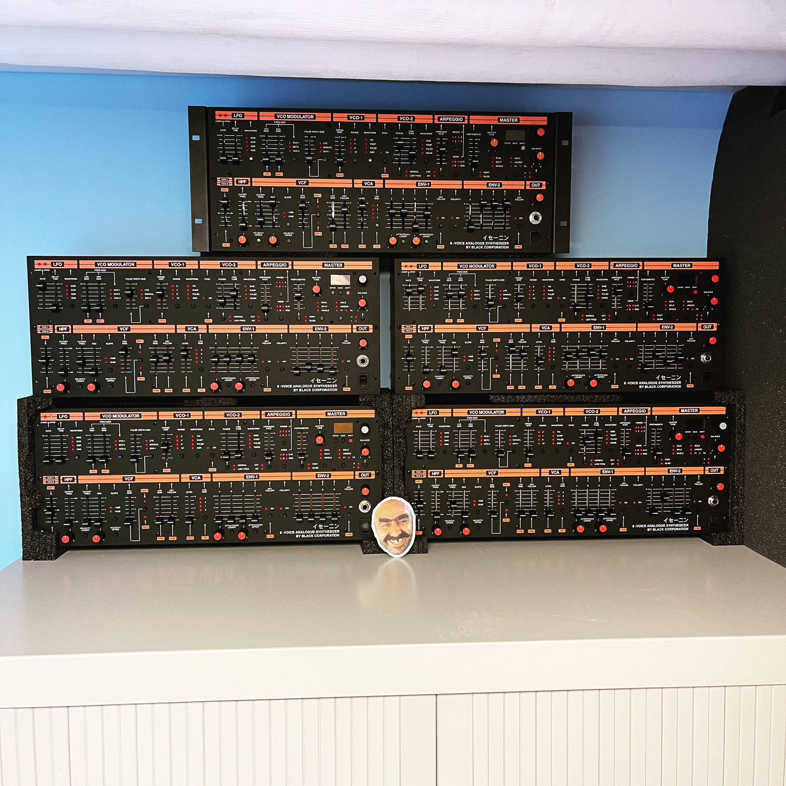

# ISENIN Home

> **Welcome to the ISE-NIN space!**
>
> Hi all, this is the place to find the latest building documents for Black Corporation's ISE-NIN polyphonic synthesizer.
>
> feel free to share videos, audio demos for this pages ([contact me](../impressum-info/info-home/impressum/index.md))

> **Links**
>
> ### Manufacture link: [https://black-corporation.com](https://black-corporation.com)
>
> ### Modwiggler**:** [https://www.modwiggler.com/forum/viewtopic.php?t=265268](https://www.modwiggler.com/forum/viewtopic.php?t=265268)
>
> ### Facebook Build Group: [https://www.facebook.com/groups/517757979447099](https://www.facebook.com/groups/517757979447099)
>
> ### Facebook User Group: [https://www.facebook.com/groups/800008500661600](https://www.facebook.com/groups/800008500661600)
>
> ### Gearspace : [https://gearspace.com/board/electronic-music-instruments-and-electronic-music-production/1353336-black-corporation-ise-nin-8-voice-analogue-synthesizer-15.html](https://gearspace.com/board/electronic-music-instruments-and-electronic-music-production/1353336-black-corporation-ise-nin-8-voice-analogue-synthesizer-15.html)

if you like my work, feel free to use my paypal gift function to support the rootserver fees

<form action="https://www.paypal.com/cgi-bin/webscr" method="post" target="_top">
<input type="hidden" name="cmd" value="_donations">
<input type="hidden" name="business" value="percysworld@web.de">
<input type="hidden" name="lc" value="GB">
<input type="hidden" name="item_name" value="DSL-man">
<input type="hidden" name="no_note" value="0">
<input type="hidden" name="currency_code" value="EUR">
<input type="hidden" name="bn" value="PP-DonationsBF:btn_donateCC_LG_global.gif:NonHostedGuest">
<input type="image" src="https://www.paypalobjects.com/en_US/i/btn/btn_donateCC_LG_global.gif" border="0" name="submit" alt="PayPal - The safer, easier way to pay online!">

</form>

[https://www.youtube.com/watch?v=h1wB-vp68B4&t=6s](https://www.youtube.com/watch?v=h1wB-vp68B4&t=6s)

  

[https://vimeo.com/766795383](https://vimeo.com/766795383)

## Complete these tasks to get started

- [x] **Edit this home page** - Click *Edit* in the top right of this screen to customize your Space home page
- [x] **complete the build-guide   [ISE-NIN Build guide](ise-nin-build-guide/index.md)**
- [ ] **upload manuals and firmware**
- [ ] **advertising**

## Recent space activity

## Space contributors
