# ISE-NIN Build guide

> **Project**
>
> ### Projecttitel: ISE-NIN
>
> ### Status: `finished`
>
> ### Startdate: 26th Aug.2022
>
> ### Duedate: 15th Sep.2022
>
> ### Last page update: 08.Jan.2025 - potentiometer Volume
>
> ### Manufacture link: [https://black-corporation.com](https://black-corporation.com)
>
> ### Modwiggler**:** [https://www.modwiggler.com/forum/viewtopic.php?t=265268](https://www.modwiggler.com/forum/viewtopic.php?t=265268)
>
> ### Facebook Build Group: [https://www.facebook.com/groups/517757979447099](https://www.facebook.com/groups/517757979447099)
>
> ### Facebook User Group: [https://www.facebook.com/groups/800008500661600](https://www.facebook.com/groups/800008500661600)
>
> ### Gearspace : [https://gearspace.com/board/electronic-music-instruments-and-electronic-music-production/1353336-black-corporation-ise-nin-8-voice-analogue-synthesizer-15.html](https://gearspace.com/board/electronic-music-instruments-and-electronic-music-production/1353336-black-corporation-ise-nin-8-voice-analogue-synthesizer-15.html)

> **Disclamer**
>
> This guide is a**best practice guide**and I'm not responsible for any damage, or product quality.
>
> Please respect your local laws/regulation for handling of electronics/electricity.
>
> I'm not responsible for damages, failures with your build.
>
> **Do not try to build this device without basic knowledge of synthesizers. You need experience.**

> **Tools**
>
> ### **Before you built the ISE-NIN kit:**
>
> 1. You need experience in soldering SMT Parts (around 350 SMT capacitors and 32 ICs in SOIC format).
> 2. required Tools are: Soldering Station, Flux pen, magnifying Glasses, Oscilloscope, some pliers, tweezers, PC or Mac for installation of the boot loader and firmware
> 3. It is recommended to have a bench- power supply with current limiter for the first test.
> 4. Programming is done via an ST-link programmer which is listed in the BOM (former DDRM builders can use the existing programmer) - normally its a Windows App. but with some experience in MacOS possible too

---

## **BOM:**

[**ISE-NIN-BOM-REV1.0.4.xlsx**](assets/ISE-NIN-BOM-REV1.0.4.xlsx)**uploaded 26.Feb.2022 (PSU alternativ part was swapped in line 198/199)**

[~~ISE-NIN-BOM-REV1.0.3.xlsx~~](assets/ISE-NIN-BOM-REV1.0.3.xlsx)~~uploaded 10.Dec.2022~~

[~~ISE-NIN-BOM-REV1.0.2.xlsx~~](assets/ISE-NIN-BOM-REV1.0.2.xlsx)~~uploaded 24.Nov.2022~~

[~~ISE-NIN-BOM-REV1.0.1.xlsx~~](assets/ISE-NIN-BOM-REV1.0.1.xlsx)~~updated by BC on 24th.Sep.2022~~

[~~ISE-NIN-BOM-REV1.0.1.pdf~~](assets/ISE-NIN-BOM-REV1.0.1.pdf)~~. updated by BC on 24th.Sep.2022~~

~~Add to your order: ATS-55250W-C1-R0 (from the) its a 1inch cooler for DC-DC PSU (read the issue list) 17.Nov.2022~~

the Mouser project can't be shared anymore, its the best that everyone create a own to their requirements.

too much parts are out of stock and its highly recommend to order by other shops too.

Tme.eu is a good place for European users. (EU)

other sources are digikey, Distrelec, RS, farnell, reichelt, Conrad, Uk-electronik, banzai (call the guys about the stock), thonk.

here´s an excel with some parts which I ordered by tme (it doesn't include all- but some parts are here much cheaper and in stock)

[TME-order-ISE-NIN-partial!!.xlsx](assets/TME-order-ISE-NIN-partial.xlsx)

**some notes:**

the tactiles are out of stock by mouser - use tme.eu or other supplier.

for the 3900pf caps, you can use polypropylene caps 

use eBay or tme for the SMT caps to safe money

**Tempco resistors and matched pair transistor are available by me:**

[https://www.diysynth.de/diy-components/passive-komponenten/tempco/tempco.html](https://www.diysynth.de/diy-components/passive-komponenten/tempco/tempco.html)

[https://www.diysynth.de/diy-components/aktive-bauteile/gematche-transistoren.html?language=de](https://www.diysynth.de/diy-components/aktive-bauteile/gematche-transistoren.html?language=de)

**The ssi2131,as2164,as3109 are available as a bundle by**

[https://www.uk-electronic.de/onlineshop/product\_info.php?products\_id=5024](https://www.uk-electronic.de/onlineshop/product_info.php?products_id=5024)

**Issues**: have a look at the ISSUE lists below for changes!!

the part number for the trimmer at mouser isn't correct (more information - it’s described in the "Issue" list)

### **Information on the content of the DIY-Kit**

The case and panel are included with the kit.

"The additional parts include:

Enclosure and Frontpanel

19" Rack Ears x2

 Display Lens x1 (in the blac Noise IC Box)

Sliders x2 (Center detent)

Potentiometer 20k Lin x7
Noise IC x1

ALL MOUNTING HARDWARE: Screws, Nuts, Standoffs(Spacer, L-Bracket for the Breakoutboard pcb)

(Motherboards have all DACS, CPU, audio CODEC, and headphone amp already mounted on them).

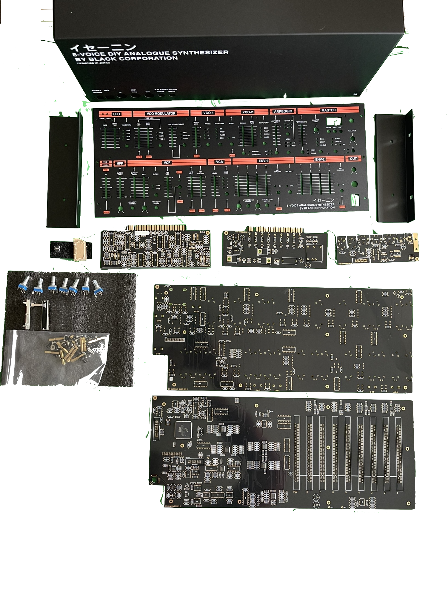

## **Currently identified Errors / Omissions / Errata:**

| **Issue ID** | **Date** | **Location** | **Type** | **Identified issue** | **Resolution** | **related for development** | **affected PCB version** | **fixed Version** |
|---|---|---|---|---|---|---|---|---|
| 1 | ~~30 Aug. 2022~~ | ~~BOM - Voices~~ | ~~ERROR~~ | ~~Mouser part number for the trimmer is invalid~~ | ~~Line 180: 652-3296X-1-103RLF~~ ~~Line 181: 652-3296X-1-104RLF~~ | ~~BOM 1.0.0 and 1.0.1 update needed~~ | -- | BOM 1.02 |
| 2 | 30. Aug 2022 | BOM - Mainboard | INFO | the 220uF caps on the Mainboard are **BI-POLAR  -** | respect the BOM partnumber |   |   |   |
| 3 | 07 Sep. 2022 | Hardware Board | BUG | there's no Pinout described on the Hardware Board for the OLED - | please read the INFO section in the next table on  "OLED  selection" carefully | can be improved with better silkscreen information | 1.0 |   |
| 4 | 13 Sep. 2022 | BOM: Voices | INFO | the Mouser BOM shows 32x 240pF C0G capacitors for the Voices - used in the OTA Filter. These are 10% tolerance. | you can change the capacitors to Polypropylene, Silver MICA, Styrene - with 1-2.5% or match good capacitors in this range with an LCR meter (check the data sheets of the meter) | - | - | - |
| 5 | 13.Sep.2022 |   |   |   |   | create a Silkscreen for MTA156 Powerheader pinout | 1.0 |   |
| 6 | 29.Oct.2022 | Voices | BUG | VCO Sync use the wrong waveform | **a must have change !** remove on every Voicecard IC3 (TL064). bend Pin 12 of the TL064 outwards, install the IC3 back in the IC socket and solder a resistor leg from Pin12 to Pin10 as shown: 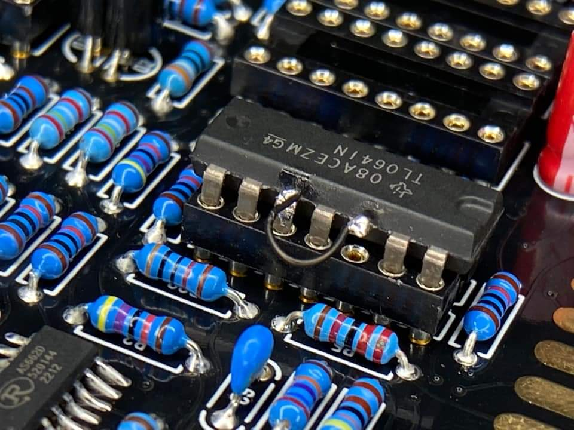 | fix the PCB routing | 1.0 |   |
| 7 | 17.Nov.2022 | PSU card | INFO | The DC-DC converter goes very hot after 30minutes, but its within the data sheet specs (65degrees Celsius is the max. operation). The 65 degrees can be reached in Summer or other conditions (few hours operating time) But for longterm stability of the components,**I highly recommend the usage of a big cooler** | install a 25x25mm cooler with an high of minimum 20mm. I found on tme.eu a product with self adhesive foil and 24.5mm height. the temperature of the DC.DC converter is 51 degrees after an hour on the regulator and 43 degrees on the cooler. TME Part nr. ATS-55250W-C1-R0 | 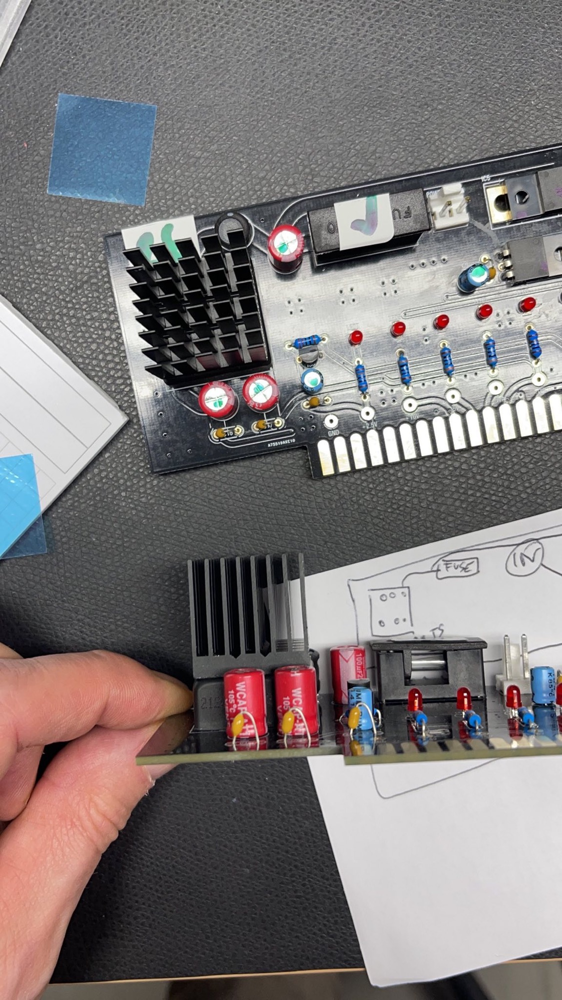 | 1.0 | BOM 1.02 is updated for this !! |
| 8 | 08.Oct.2023 update on 04.Nov.2023 | all voices | **BUG** | failure in Sync function there's a "stepping" in the sync sound. respect Step 6 from the Issue list too. | **not recommended !!!** **at your own risk, the change result isn't worth the risk and work/time.** there's a additional 10K resistor to be installed, which isn't described in the notes here. Connect an additional 10K Resistor to GND via PIN10. This resistor is shown in the ssi2131 data sheet. 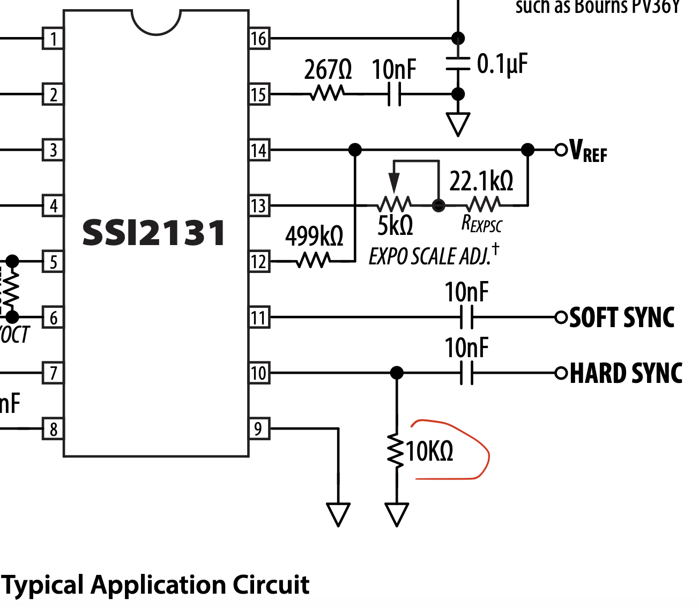 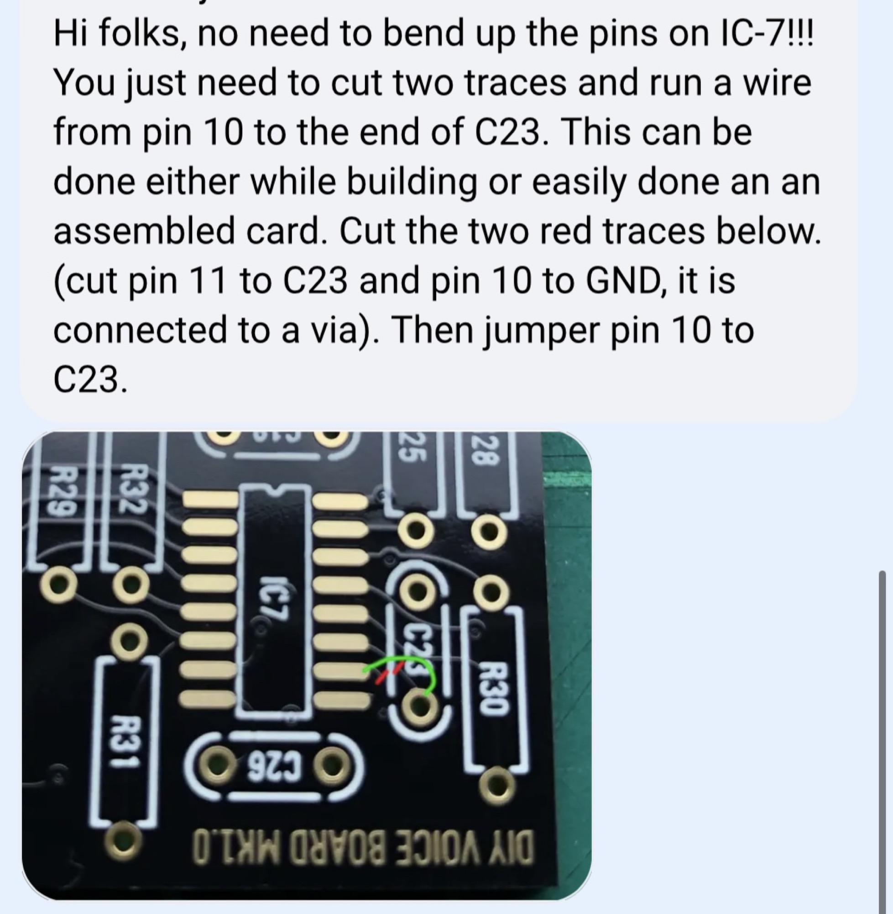 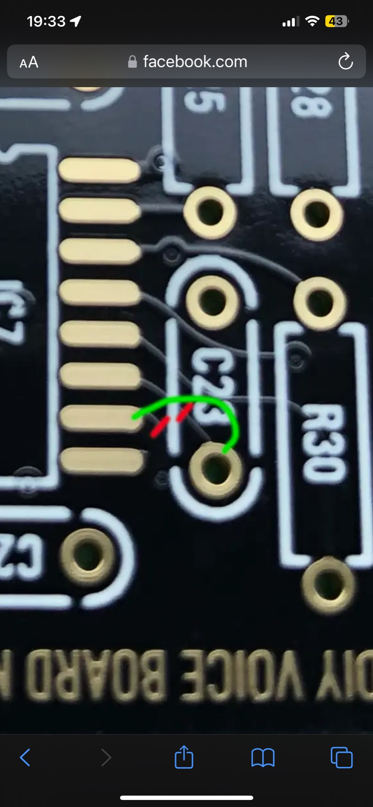 |   | 1.0 |   |
| 9 | Jan.2025 | Mainboard | bug | Volume gain is only 50% | from BC BOB: “Hey Everyone, here is the solution to the DIY volume issue. “On the MB (motherboard), replace resistors R99, R100, R101, R102 with 100k 1%. 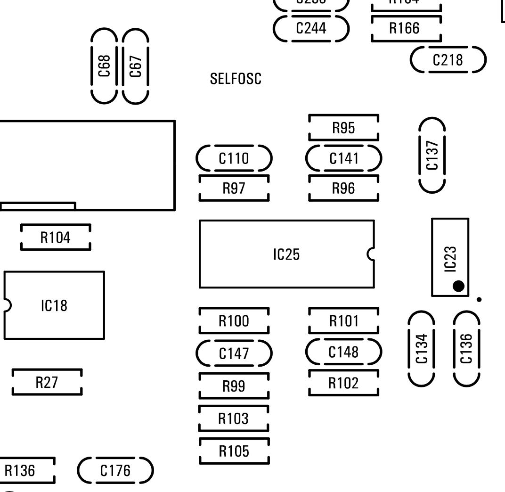 | related for development |   |   |
| 10 | Jan.2025 | Mainboard | Improvement | Gainstage of  VCA 2164 change | Remove R149 C167, C171,C179,C181 must be 100pF C0G RM5 | Change **C0001** | all |   |
| 11 | Jan | Voice card | **Improvement only for users with experience and knowledge about gain staging of VCAs !!!!** | Gainstage at the voice cards | remove R87 change: R92, R100, R103 R106 to 220K C24 C53, C54 C58 to 1200pF C0G RM5 C52 C56 must be 100pF C0G RM5 R104 R107 must be 100K | not for ENDUSERS ! experimental Change No. **C000X1** |   |   |

## **Important Information before you start assembling:**

| **Info ID** | **Date** | **Location** | **Type** | **Issue** | **Tip** |   |
|---|---|---|---|---|---|---|
| 1 | 13. Aug.2022 | Hardware Board | INFO | minimize Slider/Potentiometer malfunctions Soldering Info | when you install the sliders, DO NOT solder all pins successively, solder only one pin at the top and the bottom and proceed to the next slider, when you have installed all of them -  solder the next single pin of each slider. this has to be respected with potentiometers too. The Sliders and Potentiometers have lubrication inside which is sensitive to heat and can be easily damaged (this mistake was made in  many Syncussion clones ) |   |
| 2 | 13. Aug.2022 | Hardware Board | INFO | OLED Selection and R101/R32 - R100/R102 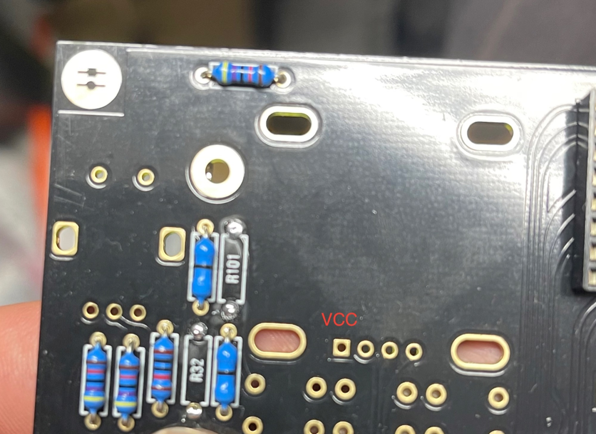 | when you have an OLED with the PINOUT: VCC-GND-SCL-SDA install R100 and R102 (0 Ohm - a bridge) (R32/R101 must be left empty) in case you have an OLED with the PINOUT: GND-VCC-SCL-SDA install R101 and R32 (0 Ohm -a bridge) |   |
| 3 | 13. Aug. 2022 | All pcbs | INFO | some IC Sockets do not point in the same direction as the others, it´s a known issue that people install ICs backwards | Double and triple check every IC orientation -  maybe 80% of all device malfunctions happen because of that and often end in very expensive repairs |   |
| 4 | 13. Aug.2022 | Hardware Board, PSU, Mainboard | INFO | the LEDs do not work | when you build the device - its important to start with the power supply - here you can test the LED orientation. never trust the vendor pinout for LEDs. normally the long LED leg is the positive end (anode) (but some circuits are powered from negative rails and GND is the positive end in this case- just as an explanation) |   |
| 5 | 13. Aug. 2022 | Mainboard | INFO | solder the pins on the Edgecard holder where you find the white stripe on the PCB - 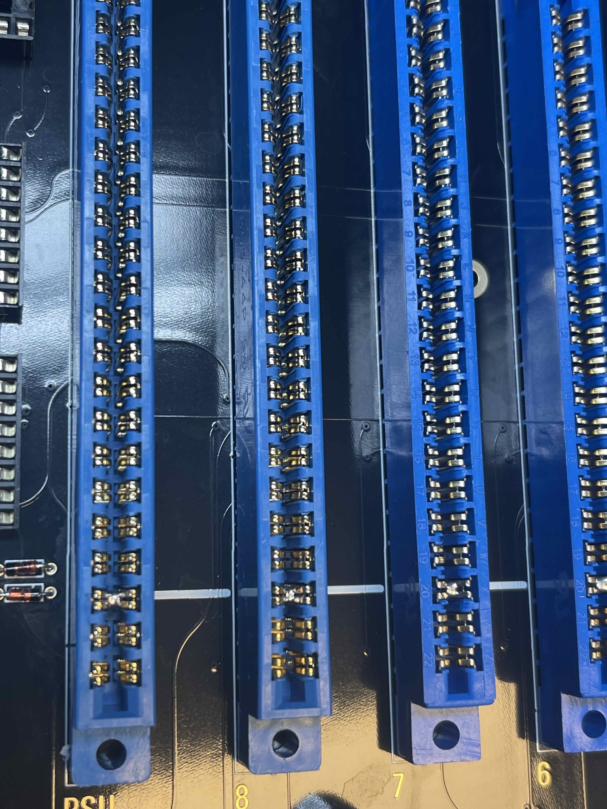 | you can't install the edge cards in the wrong way |   |
| 6 | 14.Aug.2022 | Mainboard | INFO | keep the length of the power cable as short as possible - that minimizes the risk that you accidentally put the PSU card in a voice card slot |   |   |
| 7 | 14.Aug.2022 | Hardware Board | INFO | **pay attention to "Pot23 - Volume"** (upper right corner) this is the **one non-center detent pot.** |   |   |
| 8 | 14.Aug.2022 | Mainboard | BUG |   | BOM1.0 Change- **fixed in BOM v1.0.1** R103, R104, R105 = 330K (was 30k in BOM rev 1.0.0) R128, R143 = 10K (was 30k in BOM rev1.0.0) R137, R146 = 10K.  (was 20k in BOM rev1.0.0) 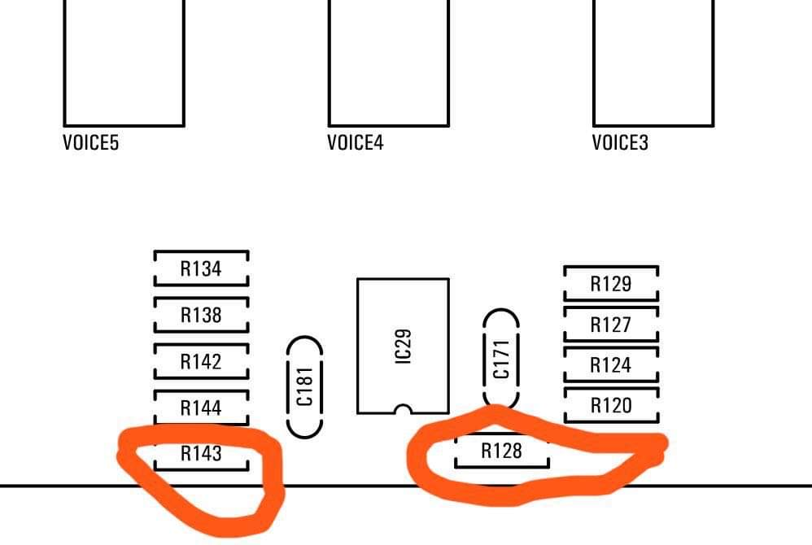 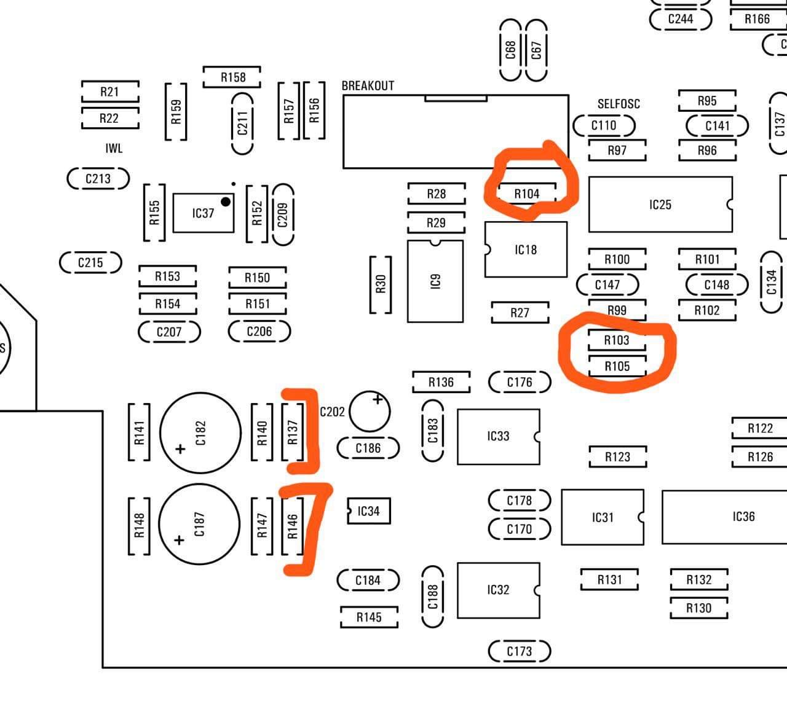 | fixed on 24.Sep.2022 in BOM 1.0.1 |
| 9 | 03.Oct.2022 | Parts | INFO | the 2N3094 on the Voicecards must be a matched pair (within 2mV vbe) | A. if you are a pro builder.. you still have a device to match trannys. B. you can order or build a tester C. you order matched pairs by me or thonk [https://www.diysynth.de/diy-components/aktive-bauteile/gematche-transistoren.html?language=de](https://www.diysynth.de/diy-components/aktive-bauteile/gematche-transistoren.html?language=de) |   |
| 10 | 18 April 2023 **updated 23June 2023** | **PSU** | **BUG** | R8 220R 250mW  on the PSU goes very hot - it affect the lifetime of this part and brings thermal noise in the circuits. | **replace R8 (220R) with a  470R 1watt 1% metalfilm with 50ppm** digikey: BC4533CT-ND a other untested workaround is in to remove the 220R and connect a wire thru 100R 1-2Watt to the the 5VA regulator output to the left TL431 (use the pad of the 220R). this workaround is only for people who know what they do - they dont need my help/infos to do this mod. |   |
| 11 | 08.Okt.2023 | **all Voices** | **BUG** | the Sync function must be fixed there's a "stepping" in the sync sound. respect Step 6 from the Issue list too. The Issie is reported in this list, because its easier to cut the trace before you have installed the SMT IC7 |   |   |

## **PCB Scan Pictures (thanks Janne.I)**

[ISE-NIN\_PCB\_SCANS.zip](assets/ISE-NIN_PCB_SCANS.zip)

## **Build guide: ( in progress)**

### Power supply PCB (PSUb) -

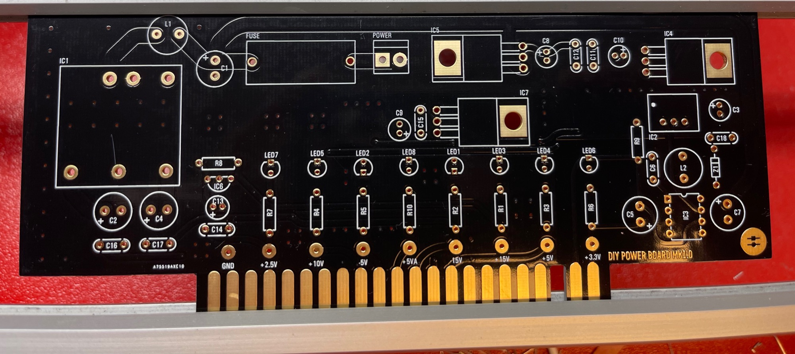

1. install the resistors and diodes
2. install the ceramic capacitors (not the electrolyte caps yet)
3. install the TO-220 regulators (IC4, IC5, IC7), the black isolated regulators do not match with the pcb holes, its not important. bend the pins as short as possible that they can be soldered from the rear-side of the pcb
4. install IC3 - I prefer without a socket for better thermal regulation, but should be fine with a socket too.
5. install the electrolyte caps
6. install the LEDs - LED orientation - the square pad is ground (short leg) its the flat side of the LED designator
7. install the fuse socket and MTA 156 2pole header
8. install the DC-DC bricks (IC1, IC2)
9. Double check the IC orientation and part values, Capacitor polarity
10. wash the PCB carefully and let they dry over night
11. optional - use a bench psu for testing with current limiter 12v 250- 500mA don't use a smaller current limit to avoid problems while start, the 250mA is a given value without any devices connected
12. **must do**: all LEDs must be on, check against the given PCB voltages - all voltages must be correct
13. Install the Heatsink by the self adhesive tape and push the heatsink against the DC-DC for 20-30seconds (new task since 24.Nov.2022)

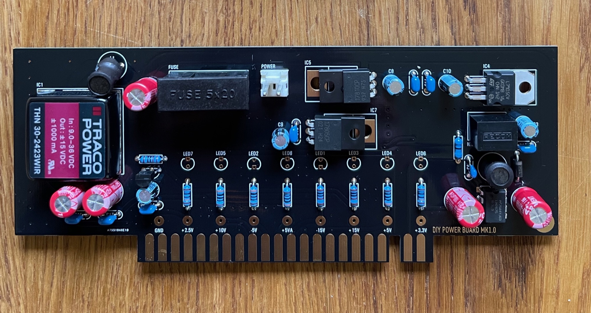

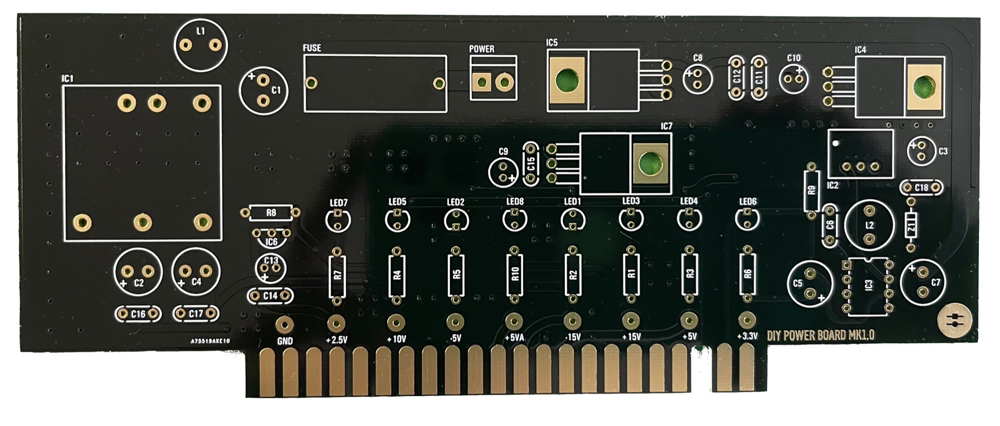

first test on a bench PSU with current limit

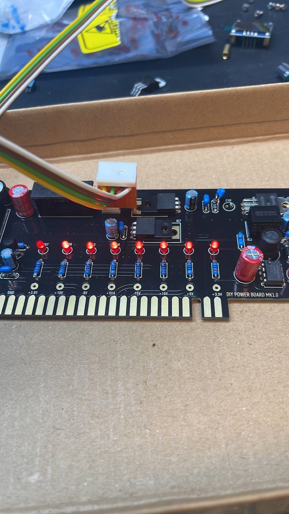

### Breakoutboard (BB)

Start with the SMT parts on the rear side and IC4.

here´s an example how this has been installed by me, add some solder on one pad and heat up this pad while you move a capacitor with a tweezer to the location, then add some solder on the other side too, normally no extra flux (fluxpen) is needed but depends on your skills. 

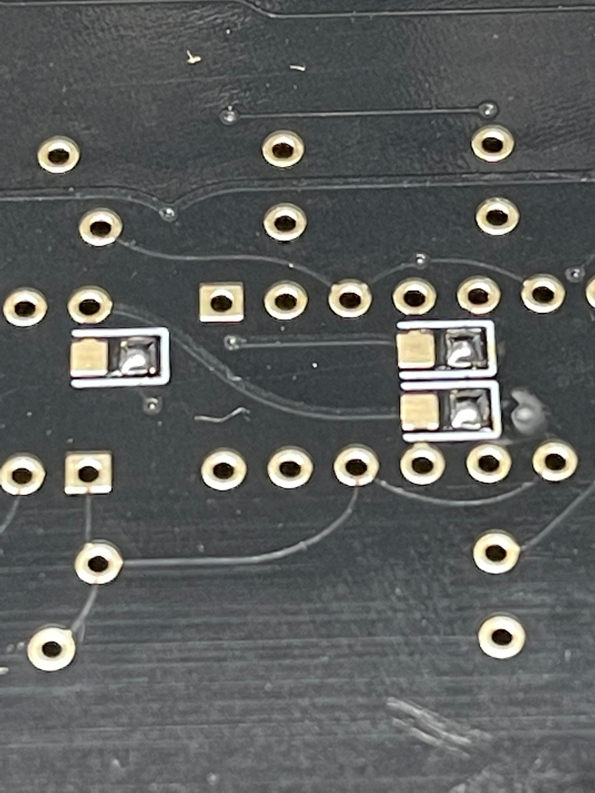

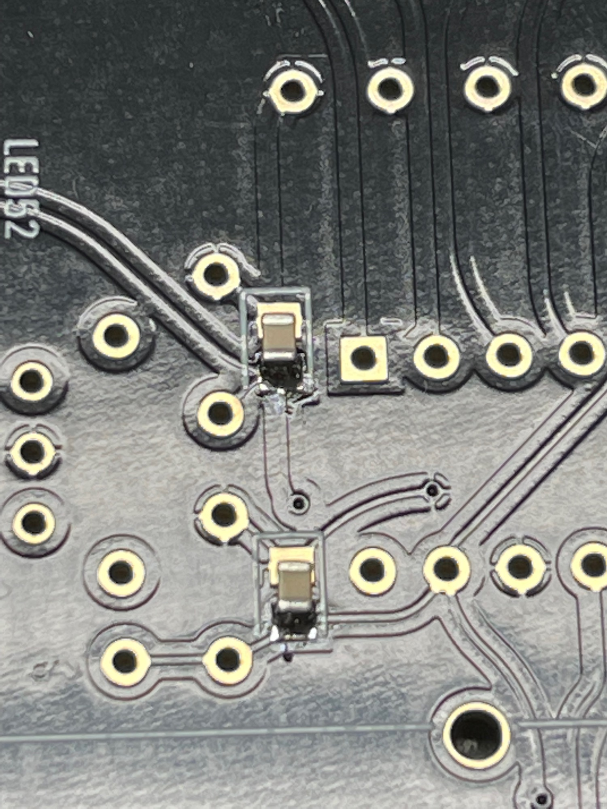

1. install the SMT capacitors and IC4 (the dot on the PCB is pin1)
2. install the resistors - solder all pins.
3. install the ceramic capacitors - solder all pins
4. install the IC sockets - standard IC sockets preferred - solder all pins after you have checked the alignment
5. install the power socket, MTA156 header, 16pin IDC connector
6. **wash/clean the pcb** **before you install the USB socket, MIDI socket, Audio jacks**
7. wash/clean the pcbs carefully with respect on ESD safe handling
8. install the USB and Midi Socket, Audio jacks
9. Double and triple check the IC orientation

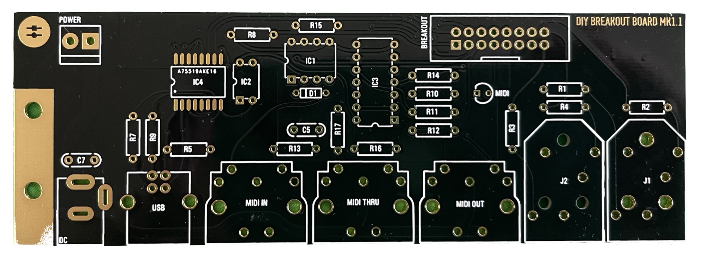

### Mainboard (MB)

the heart of the ISE-NIN must be build really carefully !!

you need an ESD map and ESD safe handling (tools) - because the uController is preinstalled and can be destroyed due to wrong handling.

**I really prefer to use a Soldering frame - Ideal Teck PCSA-4 (the MB and HB-pcb fits perfect)**

1. install the SMT capacitors as before described in the Breakoutboard section.
2. **install the resistors - read ISSUE ID2 and**respect in the BOM the resistors **which are not populated** - this info is at the end of each section in the BOM. fill the solder holes or use a tape/pen to have a notice there. otherwise it can be confusing.
3. install the ceramic capacitors - solder all pins
4. install the IC sockets - standard IC sockets preferred - solder all pins after you have checked the alignment
5. install the Transistors/regulators, quartz - do not overheat the pins here
6. install the Filmcapacitors/Electrolyte caps and solder one pin - align the capacitors before you solder the second pins.
7. install the EDGE connectors - solder only at top and bottom a pin and check the alignment, solder from left to right to minimize overheat problems with the connectors.
8. don't forget to solder bridges at the white flat line on the EDGE cards as shown in the above table.
9. **check the soldering on the EDGE card pins carefully** for shorts/solder bridges.
10. wash/clean the pcbs carefully with respect on ESD safe handling
11. install the ICs
12. Double and triple check the IC orientation ( tip: mark with a pen all ICs which did you checked)

**do not install the 10pin headers/pins yet** (we put the header on the pcb later - when we have finished the controlboard - to get the best alignment)

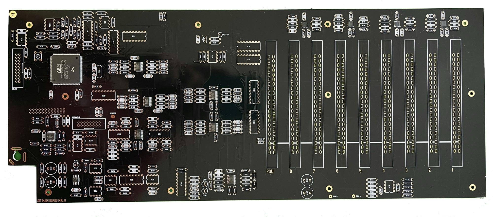

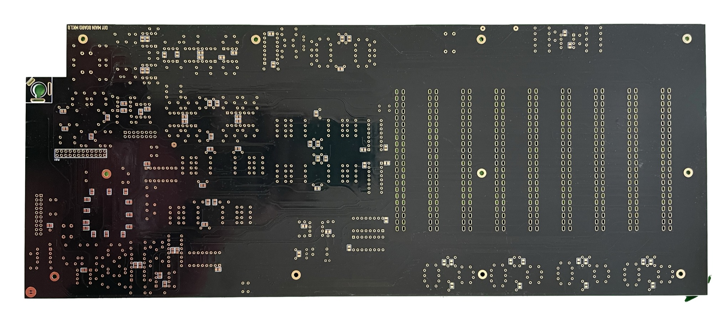

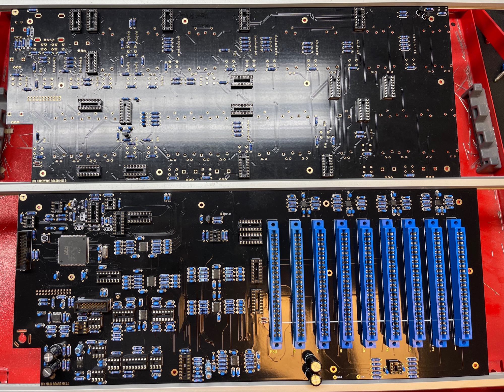

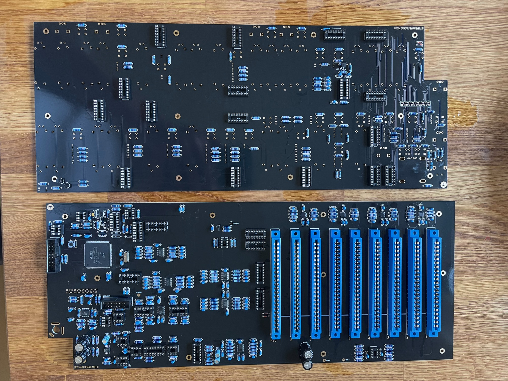

**Hardware Board (HB) (sometimes called Controlboard)**

1. we start with the PCB side with the IC sockets, the rear-side which is connected to the Mainboard (as shown in my pictures)
2. install the SMT capacitors as before described in the Breakoutboard section.
3. install the resistors - solder all pins.
4. install the ceramic capacitors - solder all pins
5. install the IC sockets - standard IC sockets preferred - solder all pins after you have checked the alignment
6. install the transistors - do not overheat the pins here
7. wash the pcb carefully with isopropyl and soap with handwarm water up to 50C Celsius.
8. Install all ICs when the pcbs are dry
9. double and triple check the IC orientation ( tip: mark with a pen all ICs which did you checked)

**do not install the OLED yet - to avoid damages and dust on the screen**

**do not install the headers /pins yet**

**do not install the LEDs yet, no sliders , no potentiometers for now !!**

because you have to clean/wash the PCBs before we can proceed - jump to Voicecard assembly until the pcbs are dry. (normally overnight in a warm room)

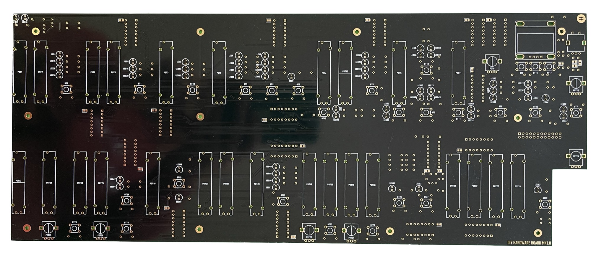

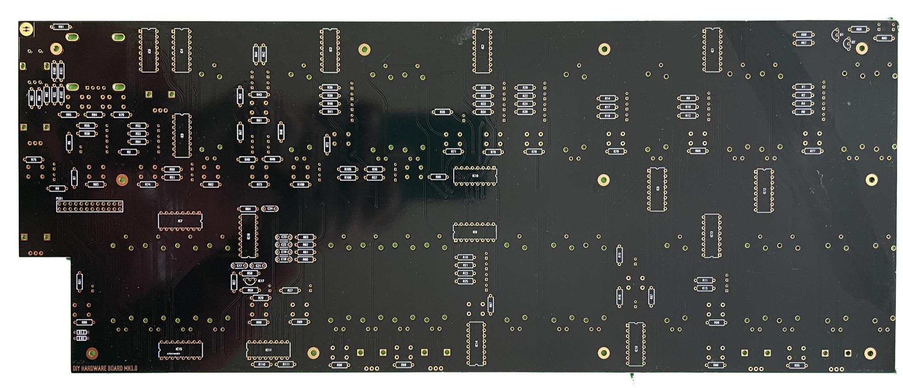

### Voicecards:

assemble the voices until the other pcbs are dry  - do not install the trimmers until you have washed the PCBs!

1. install the SMT capacitors as before described in the Breakoutboard section.
2. install the SMT ICs
3. install the resistors - solder all pins, do not install the Tempco Resistor yet
4. install the ceramic capacitors - solder all pins
5. install the IC sockets - standard IC sockets preferred - solder all pins after you have checked the alignment
6. install the matched Transistor pair (2N3904), regulators - do not overheat the pins here
7. look in my above guide - about the 240pf capacitors - maybe you have to select or match something - its not needed but for some builders just a notice
8. install the Filmcapacitors/Electrolyte caps and solder one pin - align the capacitors before you solder the second pins.
9. wash the pcbs as described before
10. when the pcbs are dry - install the Trimmers
11. install all ICS
12. install the Tempco resistors  - this must be thermal connected, use thermal paste
13. use shrink tube for the 2N3904 pair and thermal paste
14. double and triple check the IC orientation

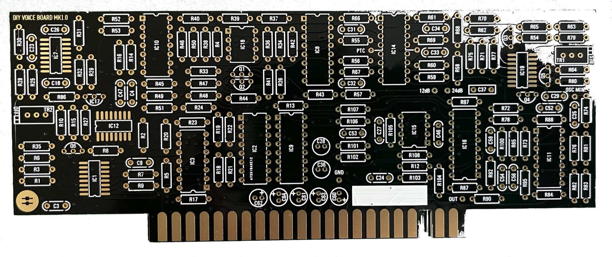

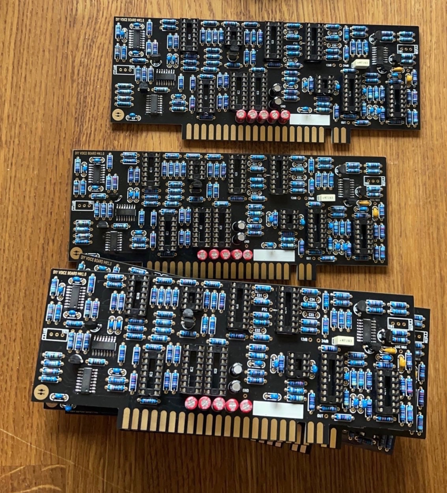

### Hardwareboard part 2: (read this before you start)

1. install the 12mm spacer on the HW.board,
2. then put on the mainboard the opposite part
3. then put the boards together and fix the pcbs with few screws on the spacers
4. then solder the 10pin dual row header/socket all pins - solder both parts completely before you remove the pcbs again (otherwise some pins can be accidentally removed)
5. clean these solderpoints with eartips carefully.
6. remove the screws and disassembly the pcbs
7. --------
8. install the sliders on the Hardware Board, and carefully solder them - pin by pin - as described in the above table (do not overheat the parts)

**finally we can move to the last steps which can be done in different ways**

9. install the tactile switches and solder these, solder 1-2 per switch - not all pins together to have less heat on the part.

10.  the last parts can be installed with one step or step by step - but in this case, you have to remove the frontpanel a few times. (customers with experience from DDRM/Kijimi can try to install the pots, OLED, LEDs, tactiles and the tactile caps in one step)

11. ~~cut/remove the locker pin on the potentiometers~~

12. the potentiometer must be installed with the front panel attached for best alignment - please note: one Potentiometer is not Center detent !! its marked on the pcb without an line in the circle.(volume pot)

13. the potentiometer have to sit on the pcb - do not try to to install the potentiometers in a higher position (or you can run in problems with the knob height)

14. there are 2 options how to do that.. but my shown option should be the best with separate nuts (no wobbling pots)

DO NOT try to install the nut on the frontpanel side !!  install a nut as shown below .

15. **OLED** - install 2x M2 5mm Spacers on the OLED (you dont need 4 spacers) and respect the pinout as described in the Information List ID2  - its important to double check the pinout and measure the GND pad of the OLED against other GND pads on the HW.Board.

be careful with the OLED !!

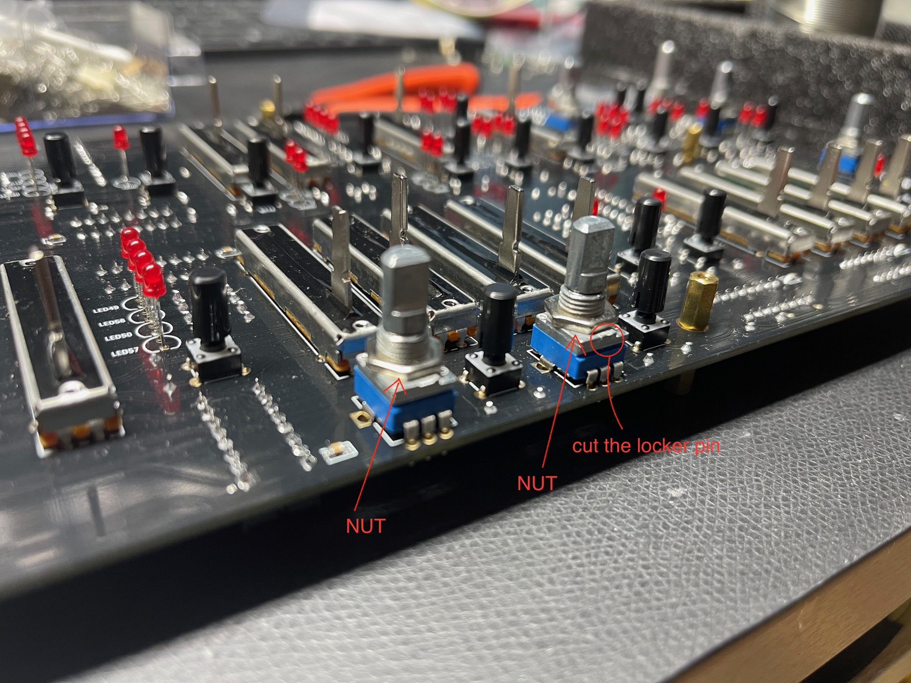

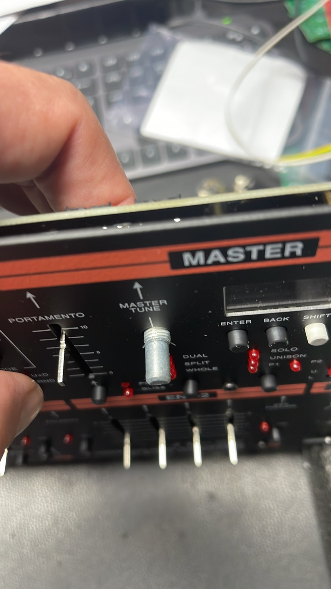

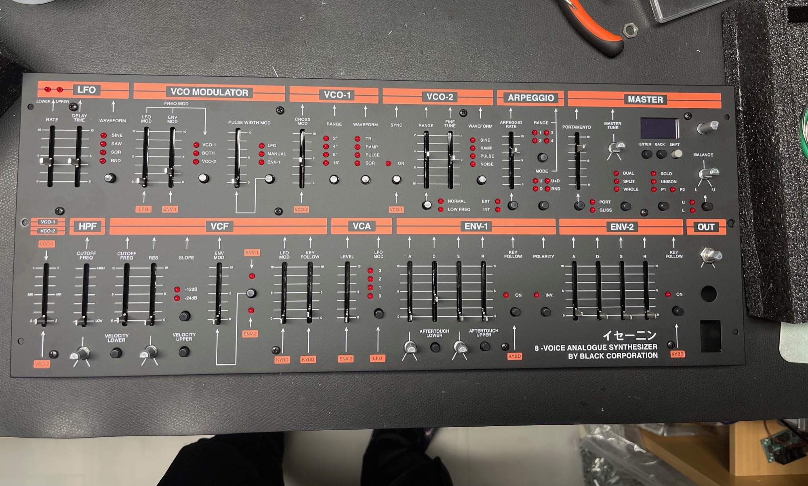

**LEDs:**

here´s an example how to install the LEDs easily:

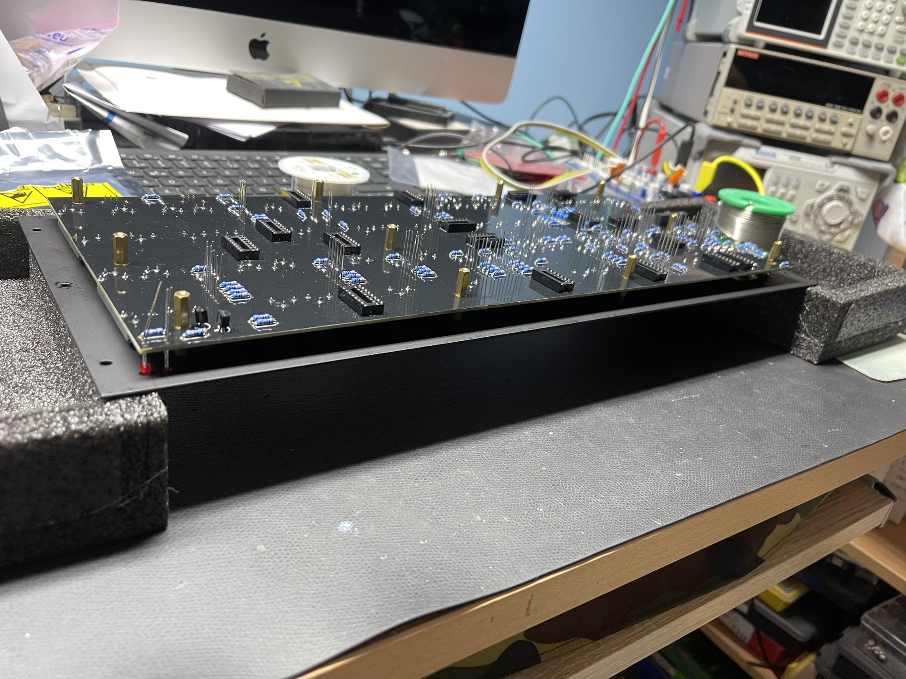

**Put the HW board on the Mainboard:**

install the spacers (12mm spacer between HB and MB) put the MB on the HB - then solder the headers on the pcbs

mount the bracket on the BB pcbs with 2 screws.

### Cable/wiring:

We use MTA156 headers which can be used with cables of 1.5mm2 maximum.

the current is 1300mA at 12V under load, cable length is 0.5m max. 

**A = ( I x 0,0175 x L x 2 ) / (fk x U)**

result is 0.75mm2 for 1m is safe !

(0.5mm2 is fine too since I used in my calculation 1meter and 2Amps)

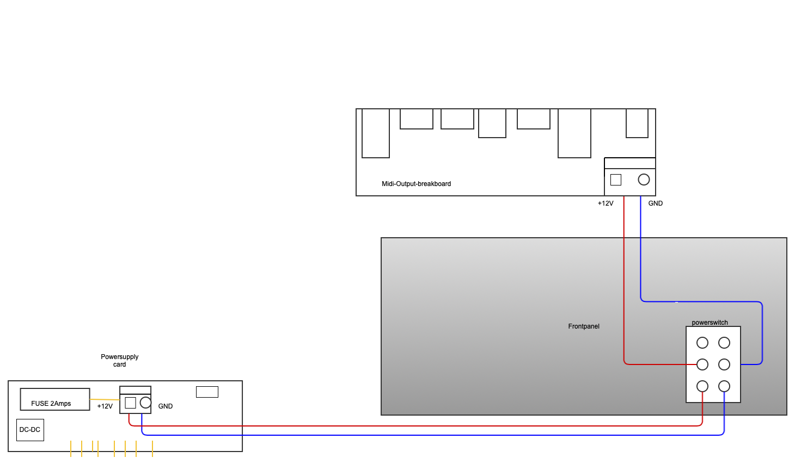

### testing

Test the PSU without BB - on a bench psu with current limiter 250mA only the PSU.

with mainboard connected 1000mA (without Voicecard)

with one card try 1000mA- with all cards up to 2.000mA

The OLED and LEDs will only work after you have installed the Firmware !! (some leds are on without the firmware)

---

## **Firmware Installation**

The latest Firmware and install guide  is on a separate page : [ISE-NIN Manuals and Firmware](../ise-nin-manuals-and-firmware/index.md)

---

## **Calibration**

**Instructions for Calibrating**

> **Slider and Potentiometer Calibration**
>
> • First, put all CENTER DETENT pot / sliders at center, 
>
>  • Go into MENU, CALIBRATION, SLIDER POT CALIBRATION,  press run

> **Oscillator Calibration**
>
> **after 30 min of warmup**
>
> go to the MENU, CALIBRATION, VCO CALIBRATION,    press run.

> **Resonance Calibration**
>
> ## **Here is a step by step guide to calibrate the filter resonance: (ONLY AFTER that you need to calibrate filters in further step)**
>
> **It´s recommend turning the resonance trimmer TR1 fully clockwise on each voicecard to make this procedure as easy as possible!**
>
> 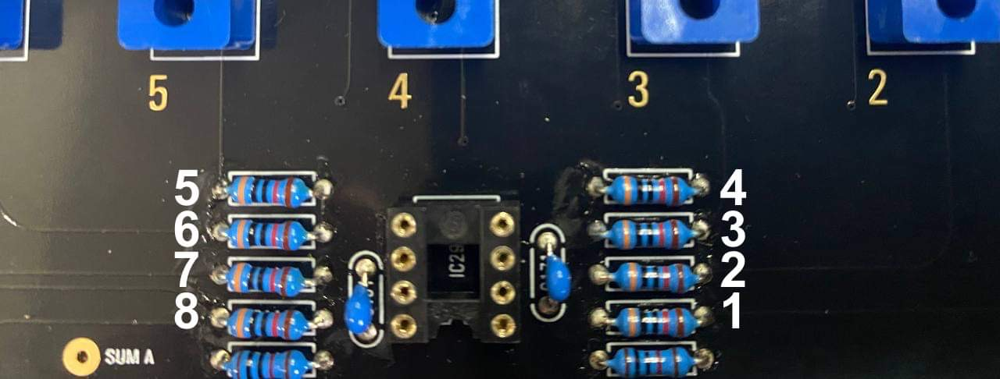
>
> **The best way is to use 8 resistors on the mainboard for making a measurement.**
>
> 1. **Warm up your unit**about 30-40 mins
>
> 2. turn on ISE-NIN, Go to menu (press shift (grey cap button) + Back (middle button under the display), then calibration, **choose CROSSMOD then press SHIFT and press the encoder, this will add the hidden RESONANCE and CROSSMOD TRIM function (its hidden since prebuilt units do not need this)** (The display should read: "card 1" and you should hear a**test tone**through the outputs (for the next voice card you can press the "next (Back)" button to cycle through the voice cards)
>
> 3. Connect a Scope **probe on the Mainboard**, to the resistor of the card which you calibrate , set your oscilloscope to "timebase 0.5ms/cm" and "1V/cm" (on DMM: 0.5V -1V is fine too, depends on your scope screen resolution - some new scopes are HD resolution in 720p or more and the ADC are very accurat)
>
> 4. You should **see the filter signal on your scope**. If you have turned the trimmer fully clockwise the signal should be- and sound distorted. now **turn the "resonance" trimmer TR1 on the Voicecard**anti- clockwise until you get a clean signal as in the picture below (The difference of maximum and minimum amplitude in one cycle has to be 4-times.)
>
> make sure to have enough gain otherwise the Filter calibration step will fail as described in next section.
>
> Comment from Black Corp: "We especially made all settings in resonanse calibration how they should be (square, cutoff, 12db etc)."
>
> 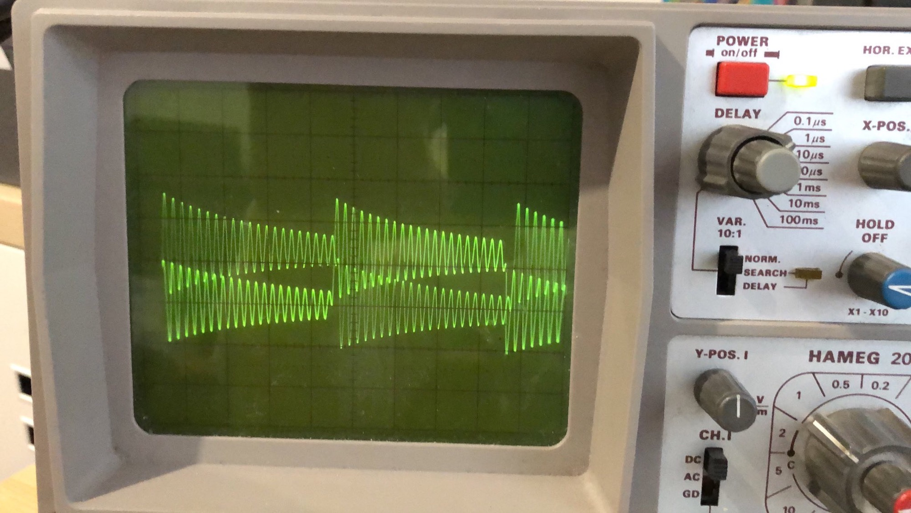
>
> Congratulations, you have successfilly calibrated the filter resonance for all of the voices!
>
> ### **Resonance calibration Method according to the Roland Jupiter-8 service manual (not recommended yet → use above method!!!):**
>
> Go into  MENU, CALIBRATION, RESONANCE.
>
> Follow these steps from the Jupiter 8 manual, turning Trim1 for each voice (or see below):
>
> 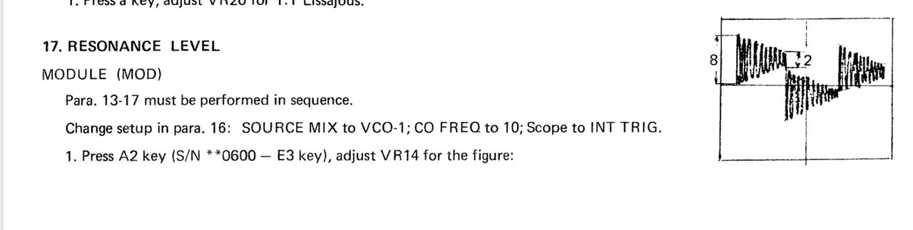
>
> **Workaround**
>
> or turn Trim TR1 until the self oscillation is **off** on each voice.
>
> **you can switch between the cards using the switch button on the mother board.**

> **Filter Calibration**
>
> you have to finish the resonance calibration before you proceed further with this step but read the Help in this section, to avoid problems. 
>
> Go into MENU, FILTER, CALIBRATION, press "run" (push the encoder or enter by a pushbutton)
>
> **Help:**
>
> in case the Frequency stuck at "37Hz" or "no Signal" is on the OLED shown, you have to turn the resonance trimmer clockwise to have more gain - your resonance calibration was wrong.
>
> if you still have issues, look in the [Troubleshooting](../troubleshooting/index.md) [page](../troubleshooting/index.md)
>
> **Technical Background:**
>
> some filter designs have the possibility to make sounds byself, the Filter can act as a Oscillator (for example percussive sounds or bass drums).
>
> Since we have a oscillator function in Filters, we can control them v/oct based for example, that's what we calibrate automatically in the ISE-NIN filter calibration method.  
>
> the Frequency Calibration is a V/Oct based Modulation which use the Filter Oscillation signal (resonance), the ISE-NIN calibration software need this signal, only with enough gain it can be analyzed and .

Respect the **Cross Mod TRIM vs** **Cross Mod Calibration** - this steps must be in the correct procedure

> **Cross Mod TRIM Calibration**
>
> MENU, CALIBRATION, **choose CROSSMOD then press SHIFT and press the encoder, this will add the hidden RESONANCE and CROSSMOD TRIM function (its hidden since prebuilt units do not need this)CROSS MOD** **TRIM**, connect USB out of ISENIN to computer, turn on ableton select ise-nin as input, put a tuner oh the channel and adjust it to 220hz with the Offset Trimmer for each voice, switch between voices with the switch button.

> **Cross Mod Calibration**
>
> Go into  MENU, CALIBRATION, **CROSS MOD CALIBRATION**,  **press** run

**History: (limit 10 versions)**
