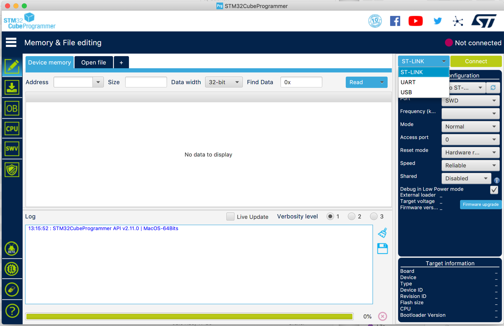
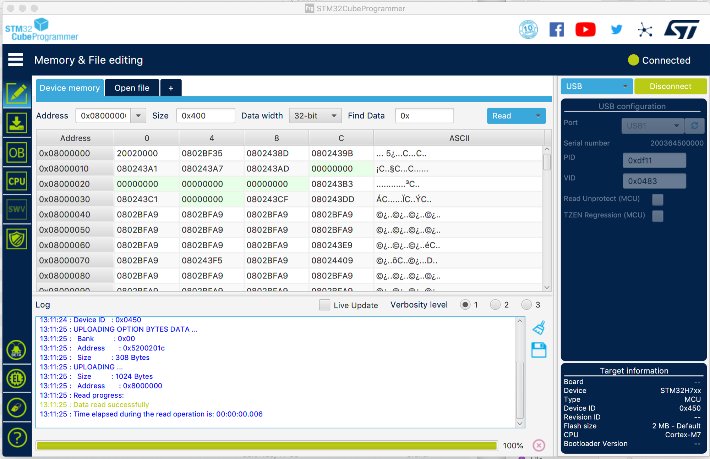

# ISE-NIN Manuals and Firmware

> **User Manual**
>
> **new**  [ise-nin\_manual\_1.1.4\_eng.pdf](assets/ise-nin_manual_1.1.4_eng.pdf) from 10.May.2024 released by Black Corp.
>
> please use the BC website for latest infos:
>
> [https://black-corporation.com/shop/product/ise-nin/#support](https://black-corporation.com/shop/product/ise-nin/#support)

> **Firmware Download**
>
> **new  **OS 1.1.4**released 10 May 2024**
>
> **[isenin\_cm4\_1.1.4.zip](assets/isenin_cm4_1.1.4.zip)**
>
> This version is for prebuilt units  and DIY Versions (DIY Version need the initial install as described at bottom of this page, before you can update to latest version)
>
> 

> 
old versions

>
> **Firmware 1.1.0 released June2023**
>
> [ISE-NIN 1.1.0 Release.zip](assets/ISE-NIN-1.1.0-Release.zip)   &gt; including Install.guide from Black Corp.
>
> **30.Nov.2022 deprecated**
>
> Release Date:   30.Nov.2022
>
> Release info: First RC 1.0.0 released incl. more Banks/Presets 
>
> Device compatibly: DIY Version and prebuilt Version
>
> [RC1.0.0 ISE-NIN-30112022.zip](assets/RC1.0.0-ISE-NIN-30112022.zip)
>
> [Benedek\_bank.syx](assets/Benedek_bank.syx) (for DIY Versions must be installed manually) 
>
> **04.Nov.2022:**  **deprecated**
>
> new beta including vintage presets
>
> you need to reset preset banks and settings after uploading the new firmware in ISE-NIN.
>
> [ISENIN\_1.0.2B.zip](assets/ISENIN_1.0.2B.zip)
>
> if you still have the old beta, you have to install again both files with ST-link  and you need to reset preset banks and settings after uploading the new firmware in ISE-NIN.
>
> **08.Oct.2022 depracted**
>
> 1.0b beta :  that’s an beta version, install both files on the devices, start with 1.0b1 and install 1.0b2
>
> In this beta are no presets available !
>
> [ISENIN\_1.0B\_2.hex](assets/ISENIN_1.0B_2.hex)
>
> [ISENIN\_1.0B\_1.hex](assets/ISENIN_1.0B_1.hex)
>
> **September 2022 depracted**
>
> 0.4/0.7 in current test for beta not released for customers (tested by Patrick)
>
> 

> **Hinweis**
>
> The DIY version uses the same firmware as the prebuilt versions.

**On this Page are 3 Firmware installation guides described:**

1. for DIY builds which are empty ( First time installation for DIY Builds)
2. for DIY builds which are on beta firmware (deprecated due to RC release)
3. Firmware Updates for Prebuilt Versions (not available yet - because we are still on RC 1.0.0)

## **1. First time firmware installation for DIY Builds**

**Instructions for Flashing**

1.1 Connect STM LINK to the Motherboard with the ribbon cable from the programmer and connect the STlink programmer with your Mac or PC

1.2 Turn ISENIN on

1.3 Open STM Cube Programmer  or ST LINK utility (cube programmer is the latest software, but STlink utility is fine too and often better)

1.4 Select ST-Link, select connect (which reads the ISE-NIN uC memory)

1.5 Select erasing and programming button (in STlink utility its "program & verify)

1.6 Browse select ISENIN 1.0.0\_1.hex file from your pc/Mac. -   Start programming \*\*\* (update Jun.2023 - use the latest hex file from the download at top of this page)

1.7 Repeat the procedure described above and select ISENIN 1.0.0\_2hex    Start programming as before (program and verify) (update Jun.2023 - use the latest hex file from the download at top of this page)

\*\*\*you don't need to restart the ISE-NIN after first programming step, in case the ST-LINK tool hangs, just reconnect the USB cable.

1.8 **Disconnect** and **restart ISE-NIN**– **its important to remove the Programmer from the ribbon cable** - or the device will not start !! 

1.9  Start ISE-NIN and go in the ISE-NIN Menu and **perform "reset all settings"**, otherwise some functions doesn't work.

(do not miss to run the calibration procedure which is described in the [ISE-NIN Build guide](../ise-nin-build-guide/index.md)

1.10 Now install /send by USB-MIDI with a sysex tool (sysex librian or other) the above Benedek.sysex file otherwise is the Benedek bank still empty. **read step 1.11 !!!!**

1.11 **perform again a reset all settings and reboot the ISE-NIN after you sent the sysex file,** or it can happen that bank is still empty.

there no receiving info on the synth when you send the sysex file to the synth.

## **2. DIY builds which are on beta firmware : (depracated)**

Mehr anzeigen

**2.1 you can use the CubeProgrammer and choose USB instead of STlink. - with following steps:**

**2.1.1**press the SHIFT button on ISE-NIN while powering on the device, the OLED shows "DFU mode", (note: windows users have to reboot the PC or windows can’t recognize the DFU-mode)

**2.1.2**on the right upper side in CubeProg. app. choose "USB" and press "Connect"

****

     2**.1.3** it must be shown as this result...         

             

2.1.4 then choose on left hand the functions to upload the 1.0.0\_1.hex - it disconnects after programming, 

2.1.5 restart ISE-NIN with shift button again and upload 1.0.0.2\_hex and done..

2.1.6 ISE-NIN  restarts with 1.0.0 in the OLED boot sequence.

2.1.7 go in the menu settings in ISE.NIN and proceed a "reset settings".

Don´t forget to upload the additional bank as listed above. (USBMIDI with sysexlib tool etc.) and proceed a "reset settings" again and reboot ISE-NIN

**you have to install both files, the first file can be uploaded and cube programmer disconnects with an error - normal**

**Changelog: (of this page)**
