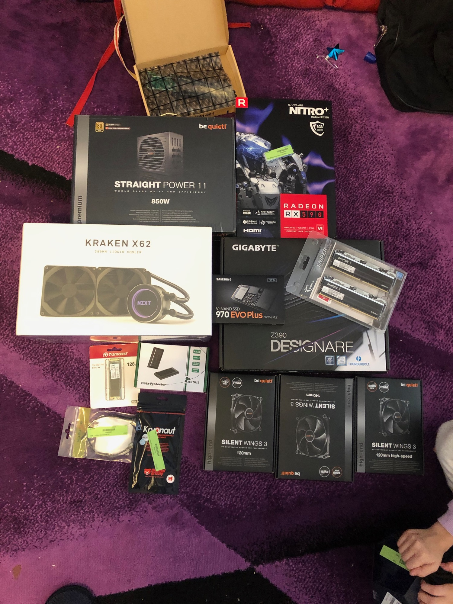
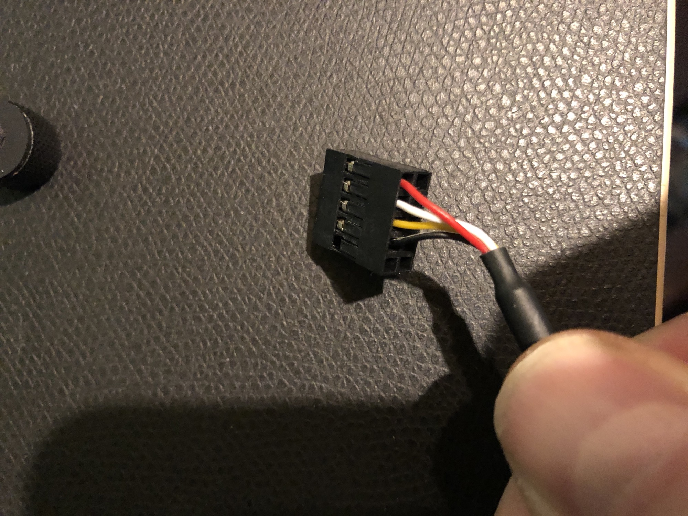
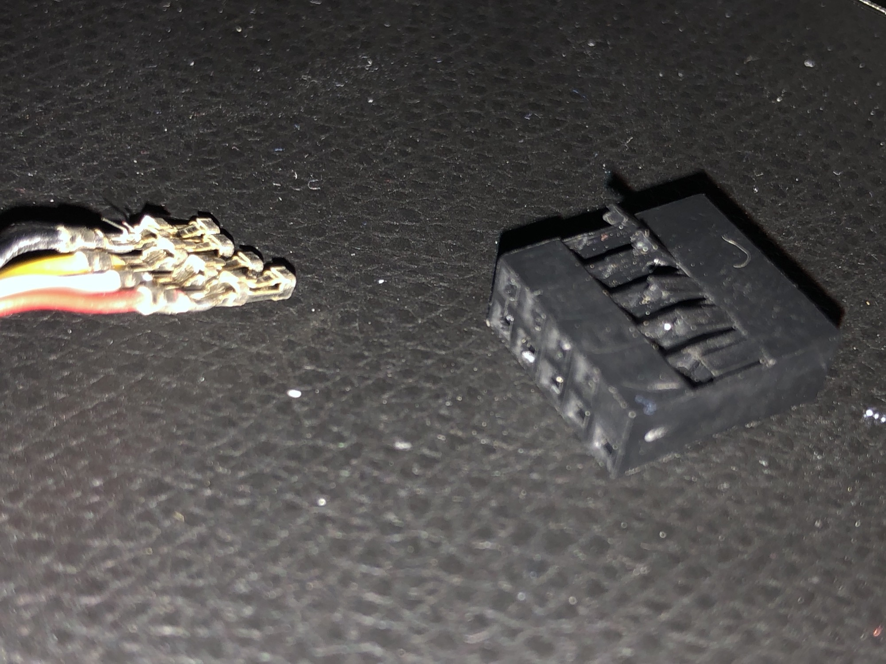
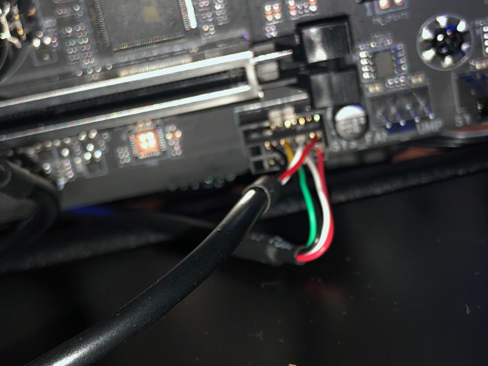
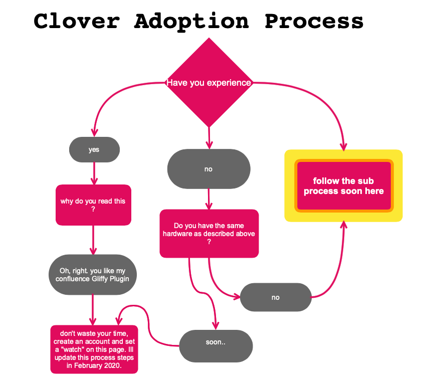
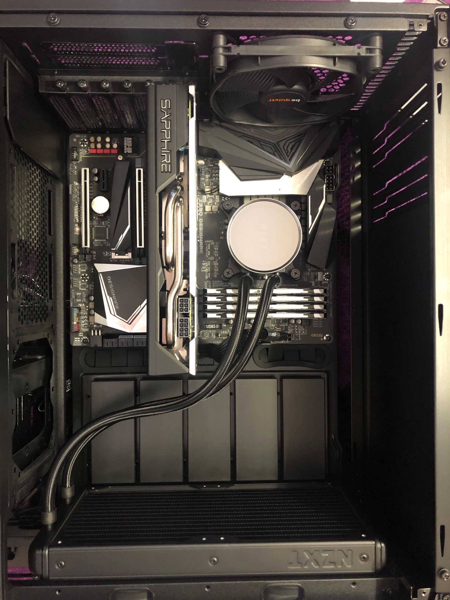
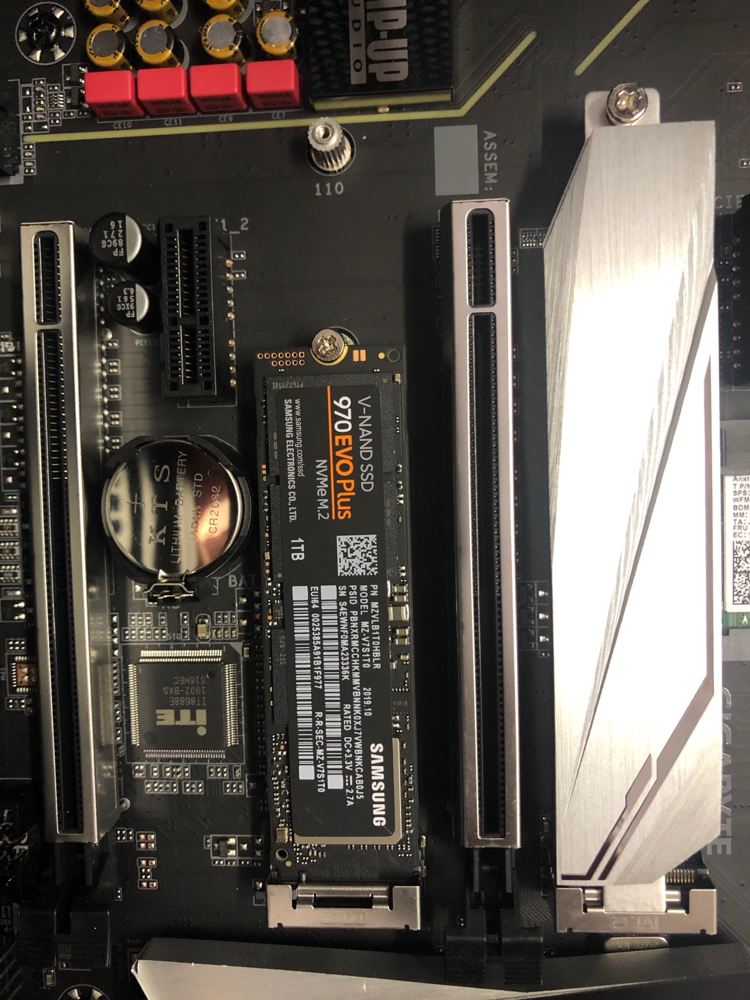
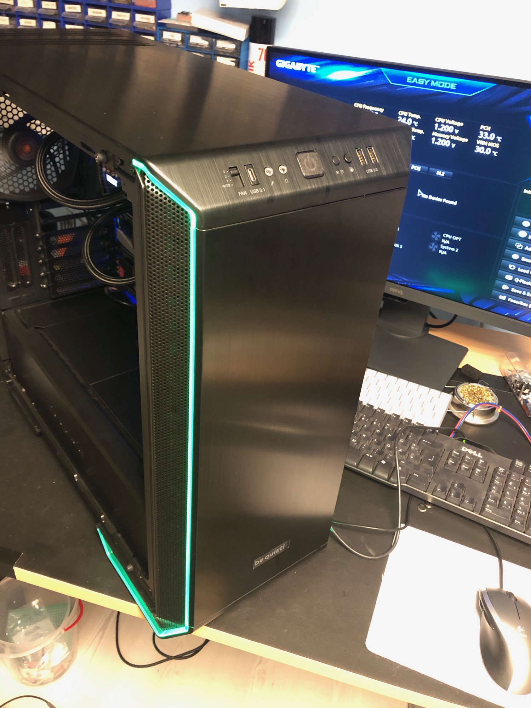
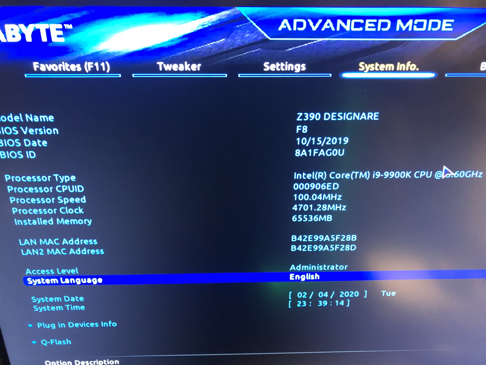
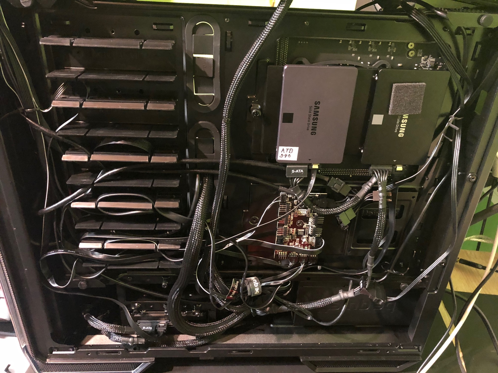

# Hackintosh



[[https://www.youtube.com/watch?v=IFgV-72HFvc](https://www.youtube.com/watch?v=IFgV-72HFvc)](https://youtu.be/IFgV-72HFvc)

**my Environment:**

iMac with Mojave

plus a working Hackintosh hardware (tested with a Windows 10 installation - do not make firmware updates yet !! )

- Gigabyte z390 Designmare (thunderbolt)
- Core i9 9900K
- nzxt Kraken x62 AIO Watercooling
- 8GB Sapphire Radeon RX 590 Nitro+
- 8G GDDR5 DUAL HDMI/DVI-D/DUAL DP W/BP UEFI
- 64GB G.Skill SniperX Urban Camouflage
- 1000GB Samsung 970 Evo Plus M.2 2280
- 850 Watt be quiet! Straight Power 11 Modular 80+ Gold
- be quiet! Dark Base 700 Case
- network and blueetoth: from amazon fenvi T919

**Hardware mods/changes:**

the onboard intel WLAN and BT isn't supported by macOS. the best way was to buy the FENVI T919 card - which use the original BCM Chips (native apple support - Broadcom chips)

the benefit by this card: Bluetooth antenna too

the WLAN card need a additional USB connection, the card comes with an cable to get USB from the mainboard USB headers, in my CASE is the header still in usage from the front USB ports of the case, but only 4 of 8 pins was in used.

so I removed the cables from the jack and plugged it to the jack of the front USB connection:







**You also need:**

32GB/64GBUSB Stick  (preferred is a very fast USB Stick - in my case a NVMe M2 in a USB3 case)

**Install/Prepare steps:**

I used this method with modification:

[https://www.hackintosh-forum.de/forum/thread/43866-gigabyte-z390-designare-fertiger-efi-ordner-zum-download/](https://www.hackintosh-forum.de/forum/thread/43866-gigabyte-z390-designare-fertiger-efi-ordner-zum-download/)

**with small changes in the first steps:**

1. download "Mojave" in app store

2. insert a empty USB Stick, format as: AFS/HFS journaled. 

3.: open terminal and:

```applescript
sudo /Applications/Install\ macOS\ Mojave.app/Contents/Resources/ createinstallmedia --volume /Volumes/INSTALLER
```

4. follow the guide above (or use my process diagram soon here)



## Tips and Tricks:

| ID |   |   |   |
|---|---|---|---|
| AIO |   | use Windows on a extra Disk and change the color, speed to your choice -<br>macOS can use this settings until you remove the power cable from the PSU !!!<br>AND always monitor your temperatures by tools like: hwsensors |   |
|   |   |   |   |
|   |   |   |   |

## Gallery:












