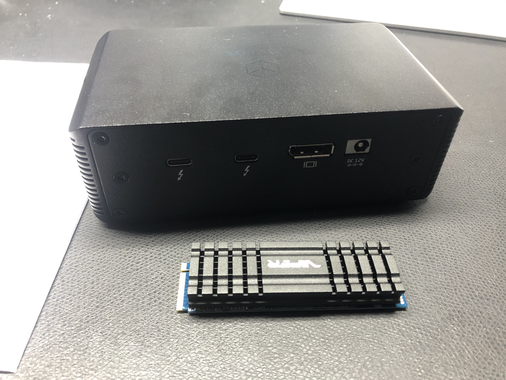
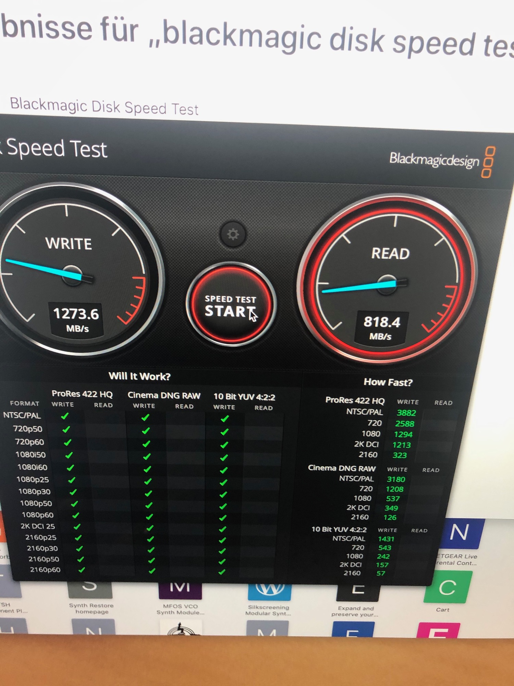
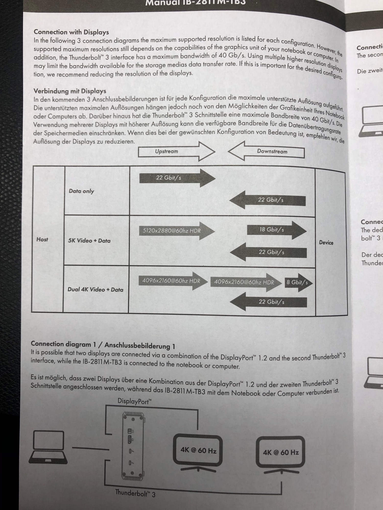

# ICYBOX NVMe enclosure IB-2811M-TB3 Thunderbolt3 TEST

i got the ICE BOX IB-2811M-TB3 which was connected by a short (30cm) thunderbolt3 cable and installed a Patriot VIPER (VPN100-2TBM28H PE000613), which was connect to my late 2017 iMac. (40gbit/s Thunderbolt3)

**Issues:** the NVME storage has a cooling block installed  (see above)- the icebox case cannot closed as designed with the supplied cover.

**Speedtest:**

the Patriot Viper NVME offer 3.000-3500MBytes/s in theory, but i got only:  1273Mbyte/s write and 818mbyte/s read..

**the root cause:**

in the supplied manual of the icebox is a graphic, which explain the reason of the poor performance, instead of 40gbit/s is only 22gbit/s for "data" available.

