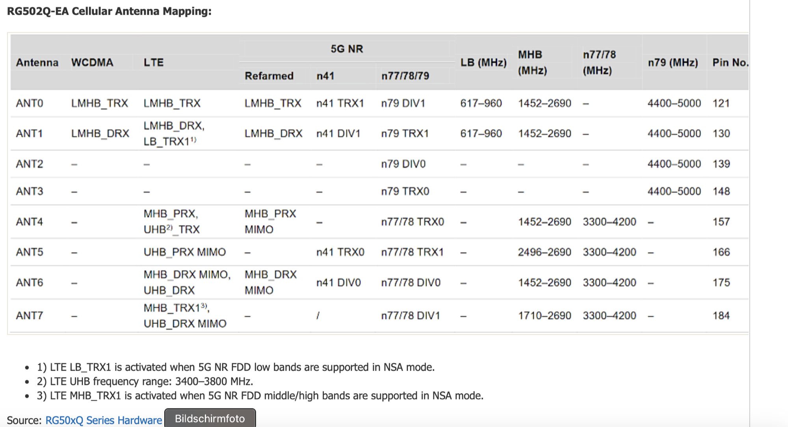
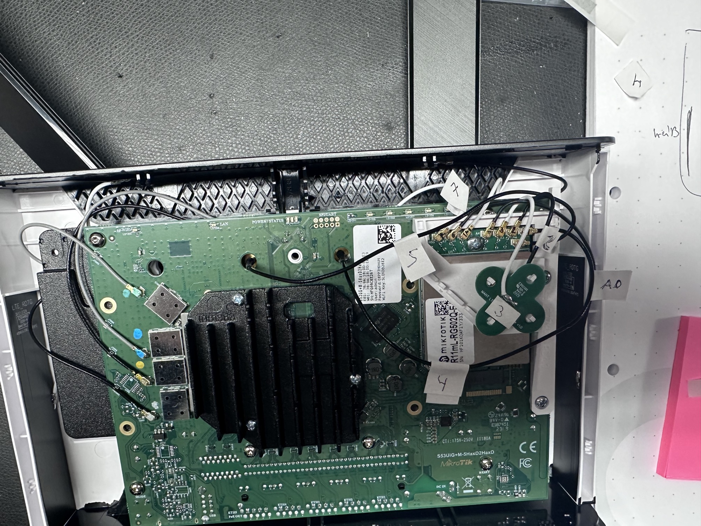
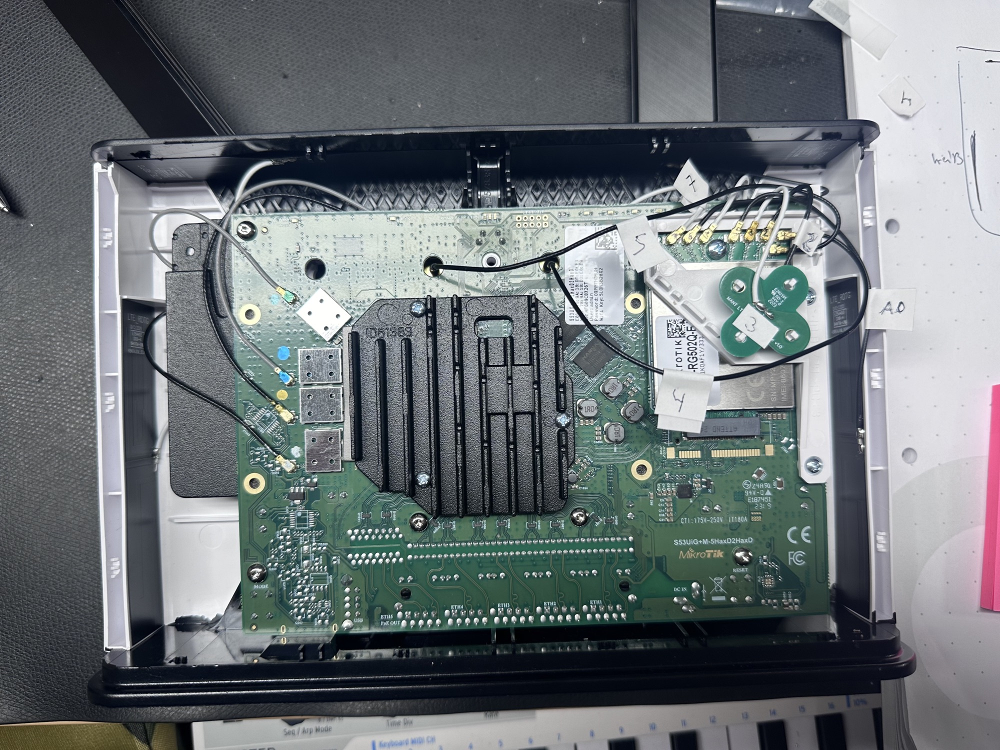
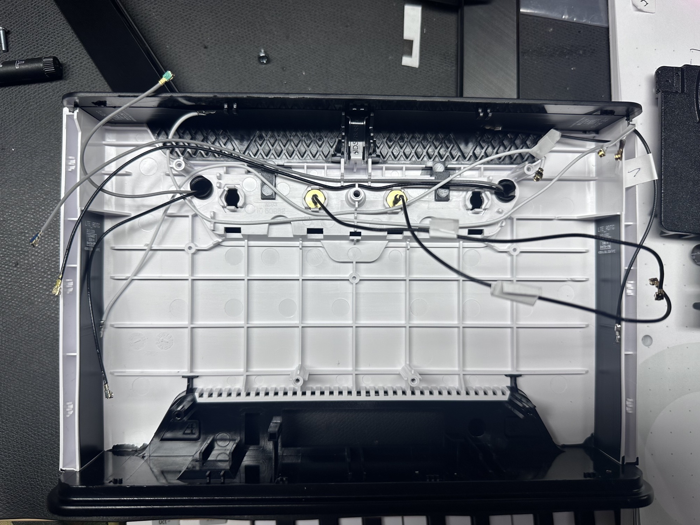
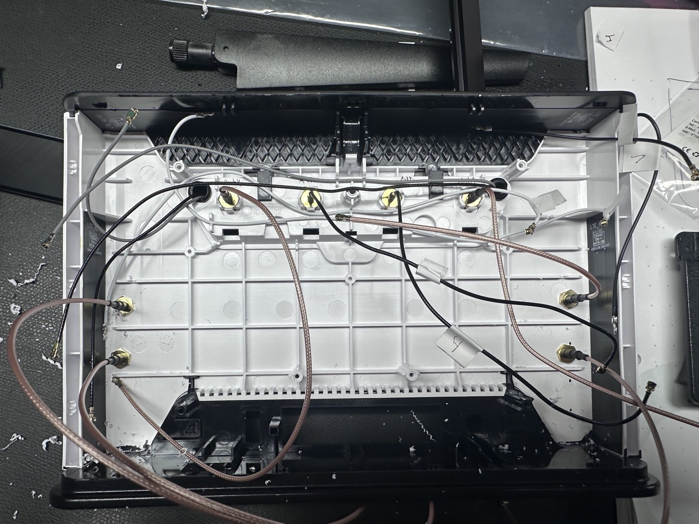
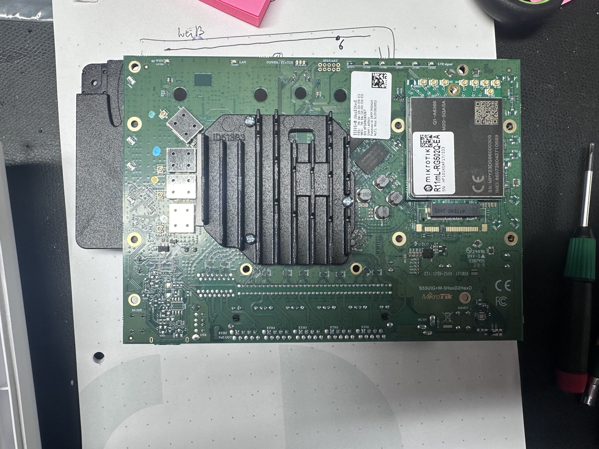
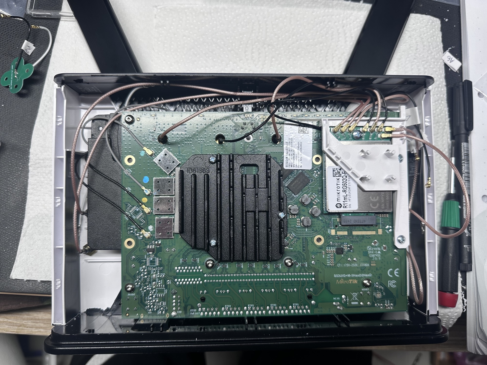

# Mikrotik Chateau 5G AX

**Manual:**

[https://help.mikrotik.com/docs/display/UM/Chateau+5G+ax](https://help.mikrotik.com/docs/display/UM/Chateau+5G+ax)

**open:**

"To remove the cover, **first remove the rear screw**, then carefully separate the front chassis part at the top a d bottom using a Spudger or similar DIY repair tool, until the front cover lifts off.  I came across [this YouTube video](https://www.youtube.com/watch?v=4-RrXyGy3Ro) for opening the Chateau LTE12, which has the same outer case as the 5G model. "

**5G Model: AX version !!**

"With the external antenna connections, you will **unlikely** need to connect anything leading to modem ports A2 or A3 as these are for 5G band n79 (4.4-5GHz), which is currently only used in a few Asian countries such as China, Hong Kong and Japan."

"All the ports ANT0 through to ANT7 on the modem are mobile data connection ports. The Wi-Fi connection ports are separate on the main board"

"Connect one set of antennas to **ANT0+1**and the second set of antennas to **ANT6+7." for 4x4 WIMO (valid for AX Version)**

**Valid for 5G (non AX version):**

**Frequency bands in table**
LB = Low Bands - All bands up to 960MHz
LMHB = Low/Middle/High Bands - All bands up to 2690MHz
MHB = Middle/High Bands - All bands from 1452MHz or 1710MHz to 2690MHz
UHB = Ultra High Bands - Bands from 3400 to 3800MHz

**4G LTE Antenna connections**
TRX = Transmit/Receive - Antenna #1 for 2x2 or 4x4 MIMO
DRX = Diversity Receive - Antenna #2 for 2x2 or 4x4 MIMO
PRX MIMO = Primary Receive #2 - Antenna #3 for 4x4 MIMO
DRX MIMO = Diversity Receive #2 - Antenna #4 for 4x4 MIMO
TRX1 = LTE Antenna #1 paired with a 5G NSA connection over FDD LMH bands (see table notes 1 & 3 above)

**5G NR Antenna connections**
TRX(0) - Transmit/Receive - Antenna #1 for 2x2 or 4x4 MIMO
DRX(0) - Diversity Receive - Antenna #2 for 2x2 or 4x4 MIMO
TRX1 - Transmit/Receive #2 - Antenna #3 for 4x4 MIMO
DRX1 - Diversity Receive #2 - Antenna #4 for 4x4 MIMO

source: [https://confusedbird.com/thread-119-post-1151.html](https://confusedbird.com/thread-119-post-1151.html)

### **Original wiring:**

port A0 = top left internal Antenna

⭐

port A1= right Antenne

⭐

port A2 on x pcb bottom

⭐

port A3 on X pcb soldered

⭐

port A4 on Antenne Connector on Ant2

⭐

port A5 on Antenne Connector Ant1

⭐

port A6 = upper side antenna soldered on right side (upper antenna on chassis)

⭐

port A7 = left side antenna soldered on left side (upper antenna on chassis)

⭐

Source: [https://confusedbird.com/thread-119.html](https://confusedbird.com/thread-119.html)

 For the fastest upload speed with a 4G only connection that utilises upload carrier aggregation, use the following antenna configuration:

**Valid for 5G AX Version:**

**2x2 MIMO antenna:**
A0 - Lead #1 of 2x2 MIMO antenna
A7 - Lead #2 of 2x2 MIMO antenna

**4x4 MIMO antenna:**
A0 - Lead #1 of 4x4 MIMO antenna
A1 - Lead #2 of 4x4 MIMO antenna
A6 - Lead #3 of 4x4 MIMO antenna
A7 - Lead #4 of 4x4 MIMO antenna

**Two 2x2 MIMO antennas:**
A0 - Lead #1 of 2x2 MIMO antenna 1 (+/-45 Degrees)
A1 - Lead #2 of 2x2 MIMO antenna 1 (+/-45 Degrees)
A6 - Lead #1 of 2x2 MIMO antenna 2 (Vertical/Horizontal)
A7 - Lead #2 of 2x2 MIMO antenna 2 (Vertical/Horizontal)

 own note: 60cm distance in height between the 2 pairs in 2x2 MIMO config

**Security Improvement: ⚠️**

**You should use a separate real server and use a VLAN to "dialup" or use a VLAN to route it on a separate server or in an enterprise WLAN Insfratructure on separate SSIDs to get the max. of security configuration by network separation, routing thru a other firewall/NAT/IDS/IPS.**

Do not use this pics for Mods, please respect the copyright of this pictures ! thanks

