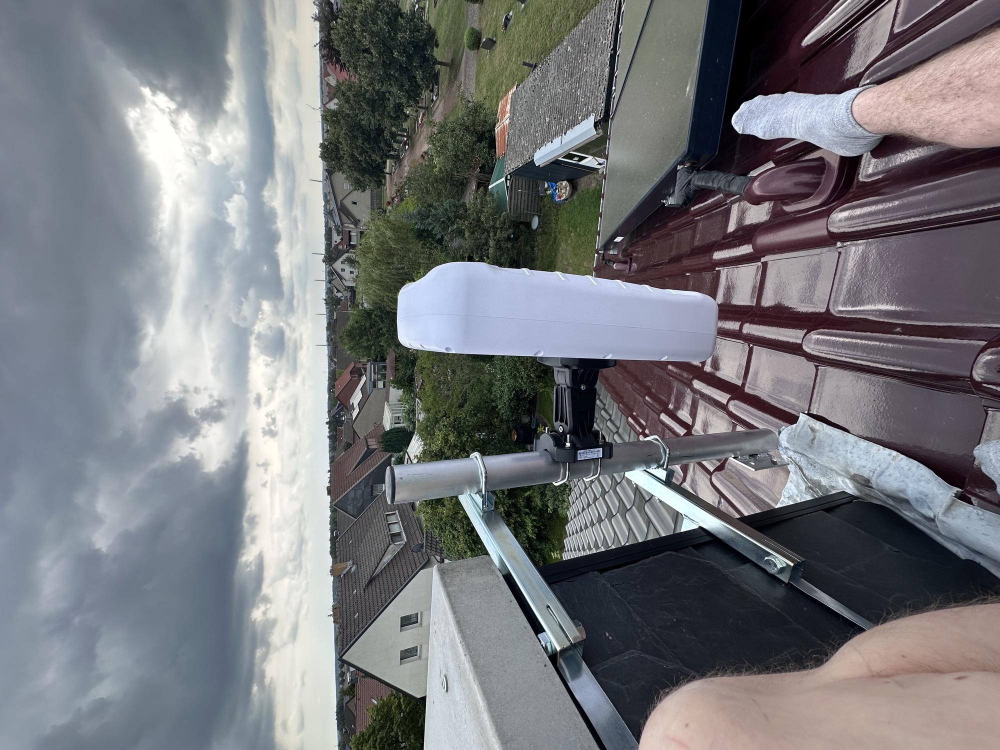
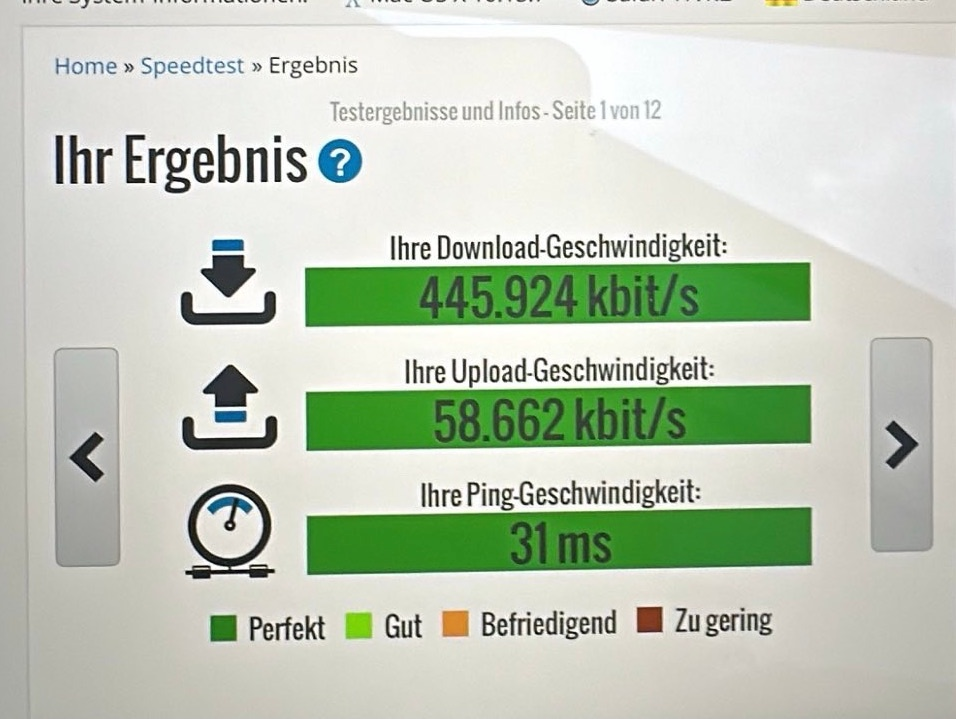

# Mobilfunknetze 4g 5G Velpke

Zusammenfassung aus 02/2024

Diese Seite dient zur Zusammenfassung von Funkzellen/Masten/Infos

**Fazit**: Maximal 500Mbit/50Mbit Down/Upload mit einer Outdoor Antenne und Enterprise Router bei Telekom und Vodafone. Die Preise beginnen hier bei ca.35€ im Businesstarif und bei ca.50€ im Privatkundenbereich.

Das beste und Preis/Leistungsverhältnis hat o2, mit ca.20-25€ bei einer echten Datenflat im 5G Netz, die hier erreichten Geschwindigkeiten von ca.150-180Mbit sind akzeptabel. Dennoch bietet hier Vodafone mehr Geschwindigkeit und die Preise beginnen bei 25Euro für echte Flatrates im 4G/5G Netz für Gewerbetreibende. Im Privatkundenbereich liegt man bei ca.30-35Euro aufwaerts. [Fragen Sie mich](../../impressum-info/impressum/index.md), da Vodafone manche Angebote nicht bewirbt.

LTE - 4G- 5G Antenne

Auszug einer Messung:

**IT-Beratungsleistung zu den folgenden Themen sind verfügbar:**

Mobilfunk Themen und Netzinfrastruktur:

- Mobilfunk - Test und Validierung von Netzverfügbarkeiten in den o2, Telekom und Vodafone Netz.
- Mobilfunk 5G vs Glasfaser vs. DSL Kosten, Leistung und Nutzen
- Mobilfunk Router zur Integration und Fallback zuhause wenn kein DSL oder Glasfaser besteht. Hier wird auf Enterprise Hardware gesetzt (kein AVM!  Fritz!Box da nicht optimal)
- Netzausbau Fragen zu Glasfaser und dessen Rollout
- DSL und dessen Möglichkeiten in Kombination mit Glasfaser oder Mobilfunk (Homeoffice Ausfallsicherheit, Redundanz, Erhöhung der Übertragungsgeschwindigkeit)

Server und Infrastruktur:

- Homeserver (Linux basierend) embedded passive gekühlt und Standard 19" Rackversionen
- NAS Storage Systeme von Standard QNAP über M2 nVME basierende Speichersysteme mit 10gbit
- Router/Switches Hardware basierend wie z.b. Mikrotikund Software wie z.B. Opnsense
- Infrastruktur Zuhause und SOHO/Homeoffice
- Enterprise WLAN Lösungen mit WLAN6, 6E, 7 - z.b. TPLINK OMADA mit bis zu 10gbit Anbindungen
- Netzwerkinfrastruktur Beratung zu 10gbit Ethernet, SFP+/Glasfaser
- Anbindung Glasfaser ONT Homeserver/Router

Allgemein

- Beratung, Konzept, Design, Proof of Concept
- Onlineshop Beratung wie z.B. Gambio
- Enterprise Content Management Systeme und Wikis wie z.B. Confluence (12 Jahre Admin im VW Konzern Umfeld)

**Sie können den Service/Beratung in meinen Onlineshop buchen:**

[https://www.diysynth.de/assembly-service-and-repair/assembly-repair-consulting-68-121.html](https://www.diysynth.de/assembly-service-and-repair/assembly-repair-consulting-68-121.html)
