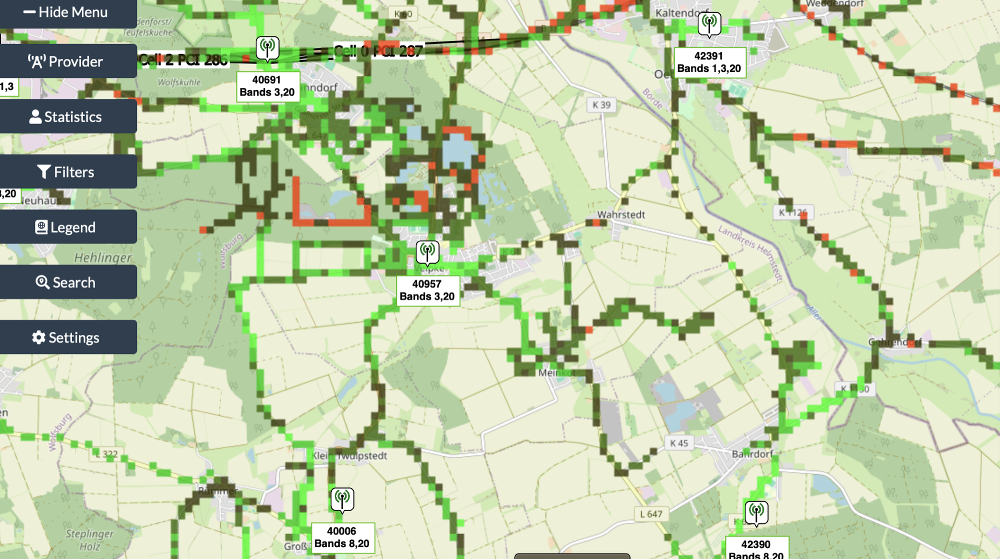
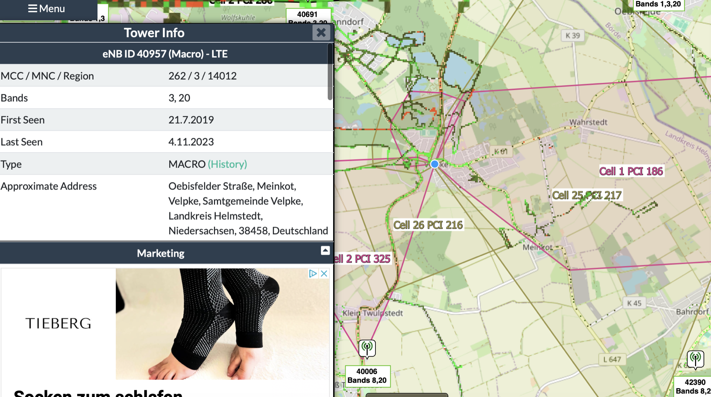
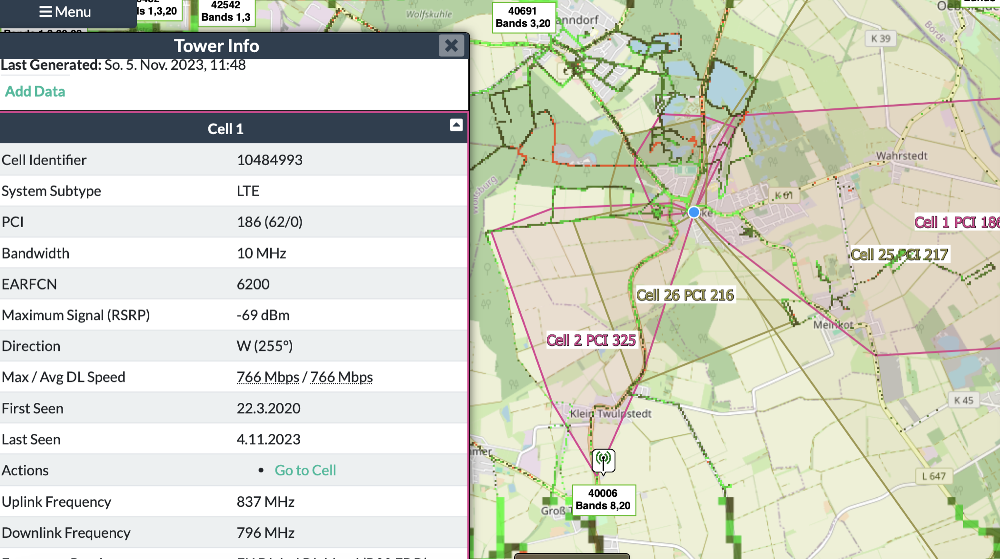
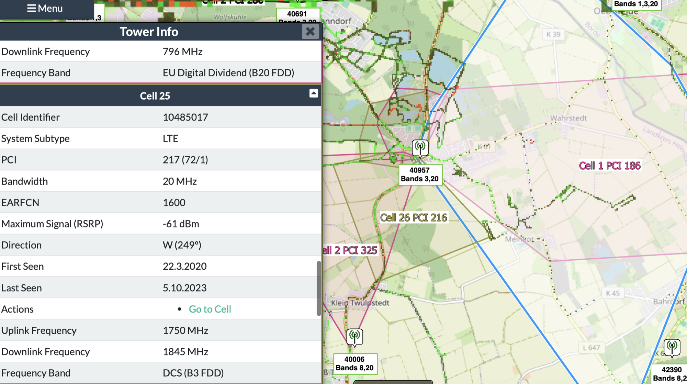
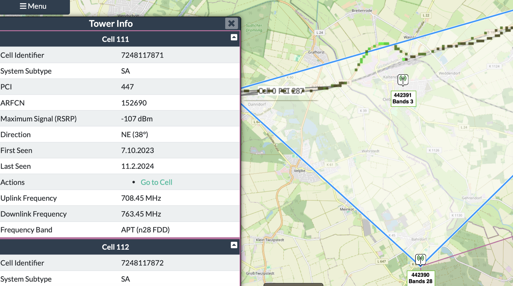
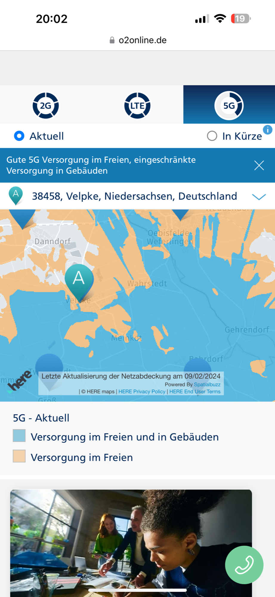
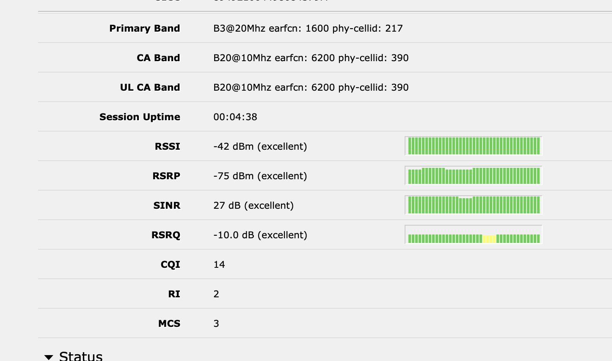
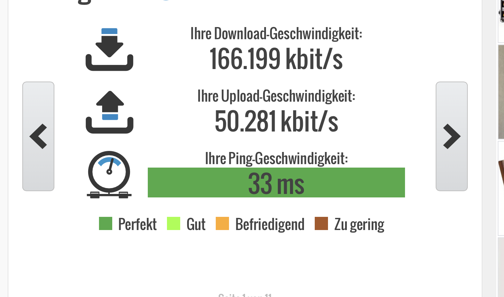
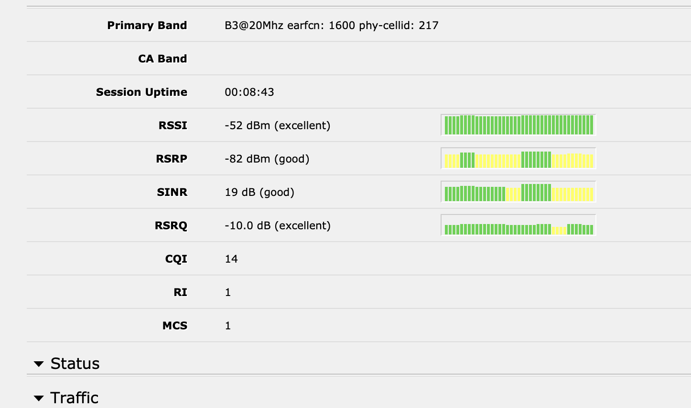

# o2 Mobilfunknetz Velpke

Hier sind die Daten für o2 in Velpke Ost.

**Fazit**: Maximal 168mbit/60mbit upload mit Outdoor Antenne und Router.

Echte 5G Geschwindigkeit liegt nicht vor, auch nicht mit extra Antenne 4x11dB.

Sollten Sie echte 5G Geschwindigkeit auch bei Regen,Nebel haben wollen, schauen Sie besser auf meine [Vodafone](../vodafone-mobilfunknetz-velpke/index.md) Messungen.

**4G/LTE Netz Bänder: (5G siehe unten)**

Velpke: 3, 20

Oebisfelde 1 3 20

Bahrdorf: 8, 20

Gross Twülpstedt 8, 20

**Funktürme:**

**Velpke Oebisfelder Str.(4G LTE nur),  Danndorf, Oebisfelde, Bahrdorf (5G) , Gross Twülpstedt**

**4G Zellen:**

**325, 216, 217, 186**

**(für mich relevant 217, 186)**

**186 Zelle:**

**Band B20**

**217 Zelle:**

**Band 3 FDD**

**rechts blauer Bereich ist Zelle 217 Richtung Osten von Turm aus**

**Testmessung**: Südausrichtung 

120Mbit/50mbit (down/up)

auf Zelle 217 mit band 3 FDD und 20

**5G Netz:**

**Zelle 217 Velpke (Band3 LTE) KEIN 5G Empfang bei mir**

5G  wird nicht empfangen - siehe auch Messung weiter unten

Zelle 447

´Daraus ergibt sich auch warum aus Richtung Süden nur 5G in der o2 Karte vorhanden ist.

## **Testfall/Messung:**

⭐

mittels 9dB Antenne Ausrichtung nach Nordwest Richtung City Velpke  

**Erreichte Geschwindigkeit: bis zu 180Mbit im Schnitt aber 150Mbit mit stabilen 50Mbit Upload und guter Latenz.**

**Es wurde kein 5G Netz genutzt ! da nicht vorhanden.**

**Angabe der genutzten Zellen: LTE Netz 217 B3 und B20**

**Messung 3**

**Antenne 9db Richtung Süden aussen**

**Fazit: kein Netz aus Bardorf Mast erhalten**

**Messung 4**

**Antenne 4x 12db analog wie Messung 3 Ergebnis trotz besserer Dämpfung war nur 150-180Mbit erreichbar.**

**Ausrichtung nach Danndorf und Zelle Bahrdorf - gleiche Ergebnisse**

