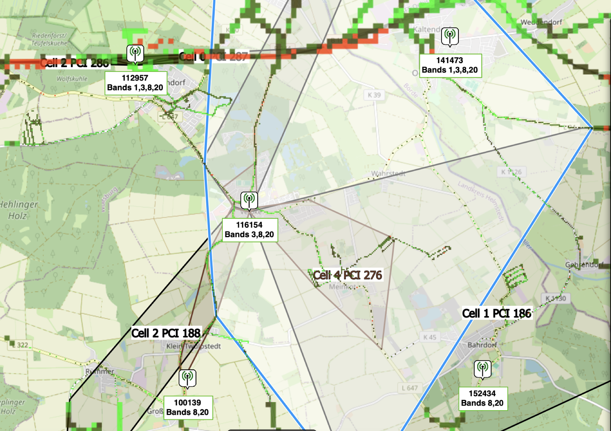
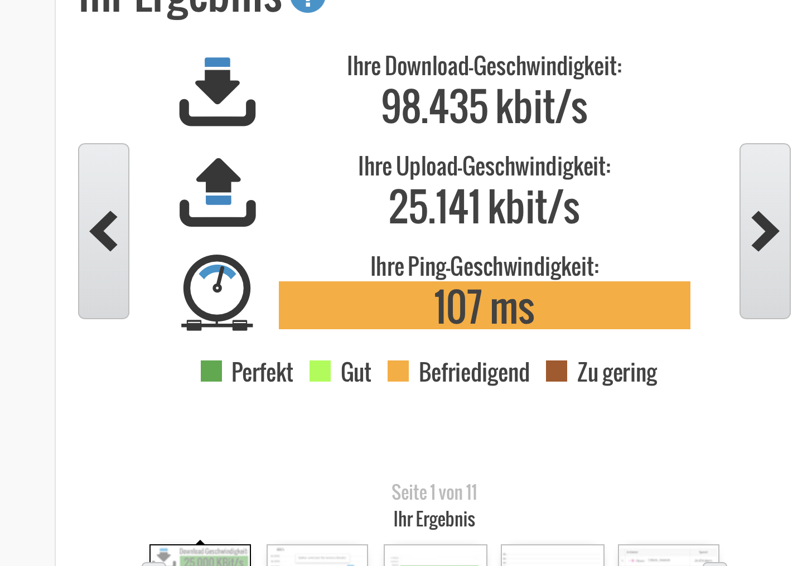
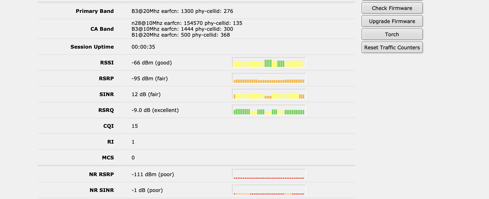

# Telekom Mobilfunknetz Velpke

Hier sind die Daten für O2 in  Velpke Ost.

**Fazit**: Maximal 221mbit/51 mbit upload mit outdoor Antenne und Router

Somit das beste und Preis/Leistungssieger für meinen Standort

**4G Funkmasten (LTE):** Danndorf, Oebisfelde, (Bahrdorf\* siehe 5G)

Oebisfeldes Funkzellen sind nicht für Velpke von Relevanz ! 

**Velpke Mast -Band: 3, 8, 20**

**4G Zellen:**

**276 cell4**

**278 cell3**

# 5G NETZ:

Test: 5G ist mittels iPhone14 auch innerhalb von Gebäuden Velpke, Danndorf empfangsfähig i

**5G Funkmasten:** Bahrdorf

**Band**: 28

**Technologie**: SA

**5G  Funkzellen :** (PCI) 272

## **Testfall/Messung:**

⭐

**Erreichte Geschwindigkeit:**

**Angabe der genutzten Zellen:**

**ohne ext. Antenne, Richtung Norden indoor**

**Testfall Messung 2:**

**mittels 9db Antenne Ausrichtung nach Velpke Ortsmitte:**
