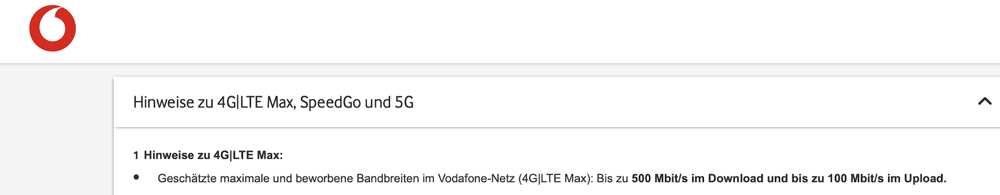
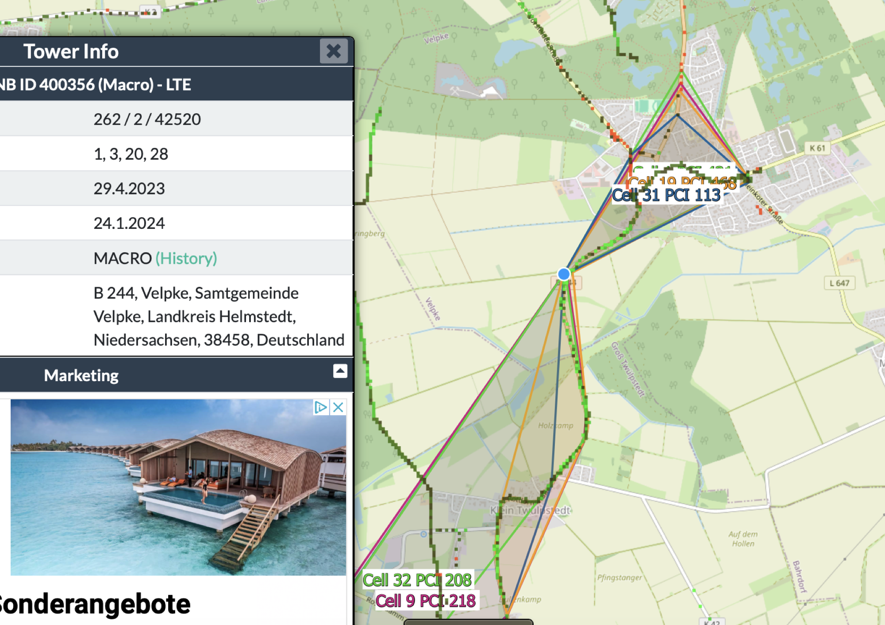
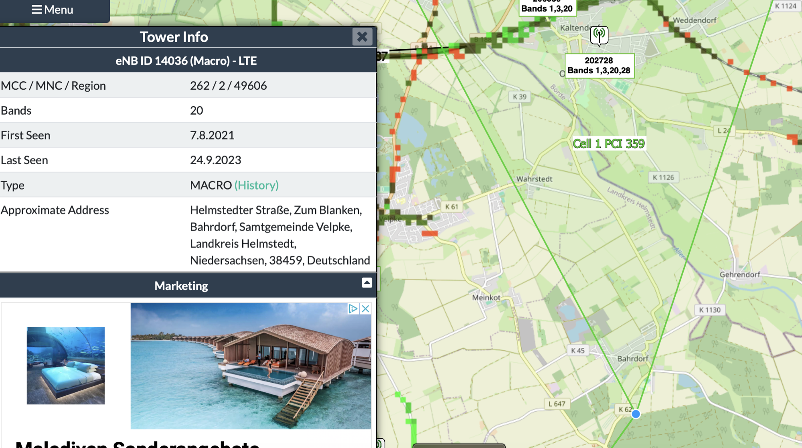
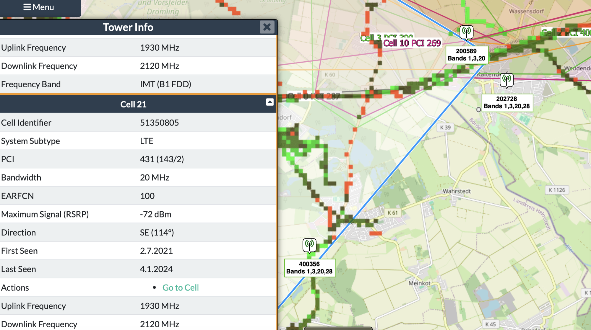
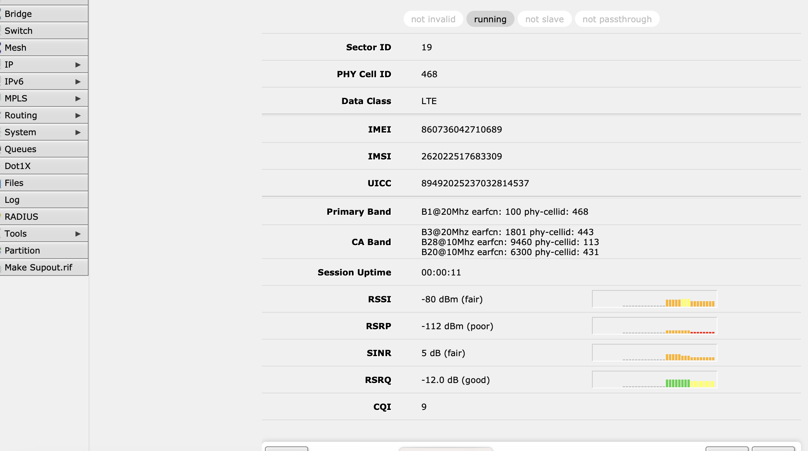
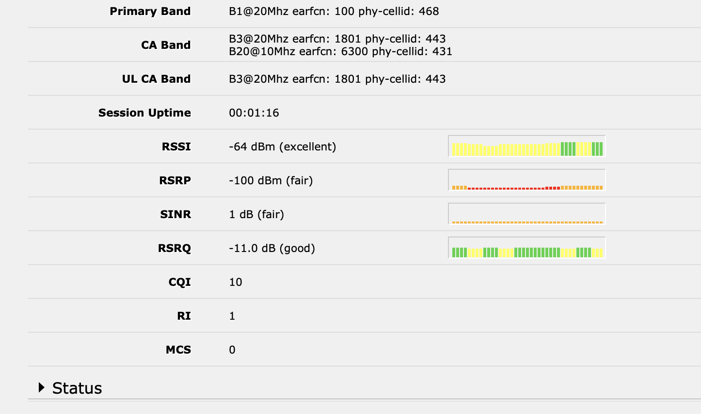
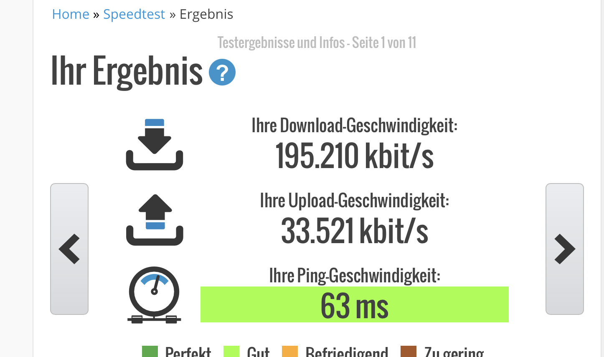
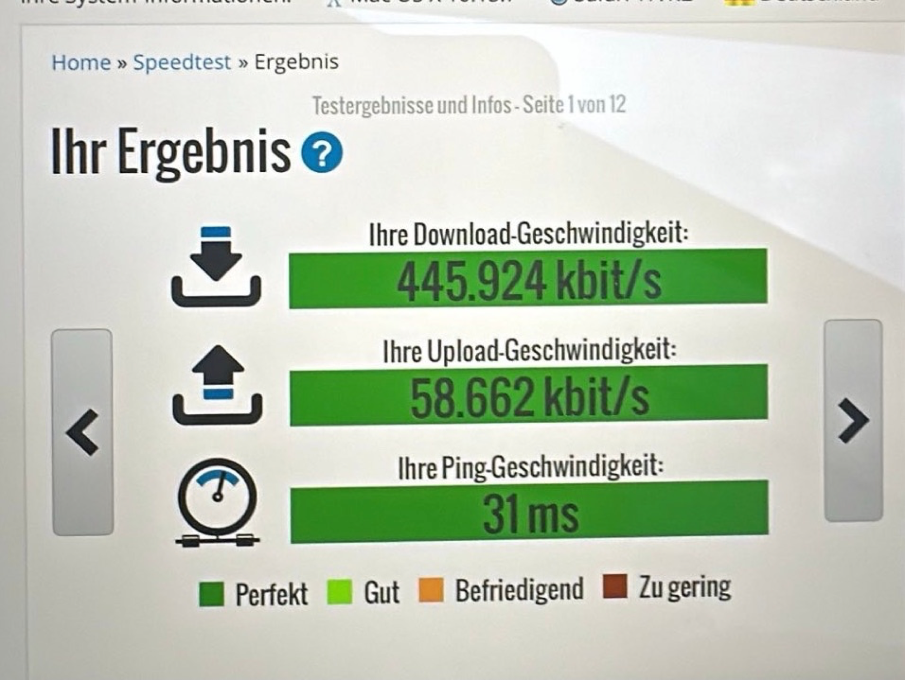

# Vodafone Mobilfunknetz Velpke

Hier sind die Daten für Vodafonein Velpke Ost.

**Fazit**: Maximal 500Mbit/50mbit upload mit **4x 11dB outdoor Antenne und angepassten Router.**

Im Durchschnitt immer um die 300-400Mbit.

Die erreichten Werte sind **nicht** mit Standard Fritz!Boxen oder ähnlichen hier zu erreichen.

Je nach Standort benötigt man individuelle Lösungen, hierbei unterstütze ich.

Eine echte 5G Flatrate beginnt bei 25Euro im Monat mit unbegrenzten Datenvolumen und mit 

Bei Fragen bitte mich [kontaktieren](../../../diy-5u-modular-synthesizer/blog/2018-04-25-general-info-about-this-website-and-webshop/index.md).

**Wichtig**: manche Anbieter bzw. Verträge bieten nur 300Mbit an, in meinem Fall sind es 500Mbit **beim Business Vertrag**

## Technische Hintergrundinfos und Messungen:

### LTE/4G

**Bänder und Frequenzen:** 1,3,20,28

**Funkmasten:** Danndorf, Oebisfelde, **Velpke** (Ortsausgang Richtung Klein Twüplstedt), Bahrdorf

Zellen: 113, 468, 431 

700mhz-900, 1800mhz, 1900mhz 2100mhz

**Bahrdorf Funkmast 4G**

**PCI (ZellID)** 359

**Band**: 20

**Oebisfelde Funkmast:**

CellID: 431

Band 1, 3 ,20

1900/2100Mhz

4G/LTE - macht auch 5G

## 5G NETZ:

**kommt aus dem o.g 4G Netz - Bündelung usw.**

**Es wird in Cellmap kein dedizierter Funkmast definiert für 5G Netz.**

[https://www.cellmapper.net/map?MCC=262&MNC=2&type=NR&latitude=52.40830313631429&longitude=10.972744526040033&zoom=13.038760619363618&showTowers=true&showIcons=true&showTowerLabels=true&clusterEnabled=true&tilesEnabled=true&showOrphans=false&showNoFrequencyOnly=false&showFrequencyOnly=false&showBandwidthOnly=false&DateFilterType=Last&showHex=false&showVerifiedOnly=false&showUnverifiedOnly=false&showLTECAOnly=false&showENDCOnly=false&showBand=0&showSectorColours=true&mapType=roadmap&darkMode=false&imperialUnits=false](https://www.cellmapper.net/map?MCC=262&MNC=2&type=NR&latitude=52.40830313631429&longitude=10.972744526040033&zoom=13.038760619363618&showTowers=true&showIcons=true&showTowerLabels=true&clusterEnabled=true&tilesEnabled=true&showOrphans=false&showNoFrequencyOnly=false&showFrequencyOnly=false&showBandwidthOnly=false&DateFilterType=Last&showHex=false&showVerifiedOnly=false&showUnverifiedOnly=false&showLTECAOnly=false&showENDCOnly=false&showBand=0&showSectorColours=true&mapType=roadmap&darkMode=false&imperialUnits=false)

## **Testfall/Messung 1**

mittels 12dB Antenne Ausrichtung nach Funkturm Velpke Ortsausgang Klein Twülpstedt:  

Mikrotik WIMO Router

**Erreichte Geschwindigkeit: 90Mbit down**

**Angabe der genutzten Zellen:**

**ohne ext.Antenne- EG Richtung Nord indoor**

## **Testfall/Messung 2**

⭐

mittels 9dB Antenne Ausrichtung nach Funkturm Velpke Ortsausgang Klein Twülpstedt:  

Mikrotik WIMO Router

**Erreichte Geschwindigkeit: 188mbit/30  - 195/33**

**Angabe der genutzten Zellen: 468/443/431**

### Testfall 3 Messung

Antenne 4x11db MIMO, outdoor Messung 2m über dem Boden, Ausrichtung nach Sued/west Richtung Funkturm mit Sichtbehinderung durch Gebäude.

Maximal war 550Mbit, sehr oft 400Mbit, im Schnitt stets 300-400Mbit mit bis zu 50Mbit Upload.

Bandsettings Router: 4G/NR: 1,3,8,20,28,78 

TRB Router

