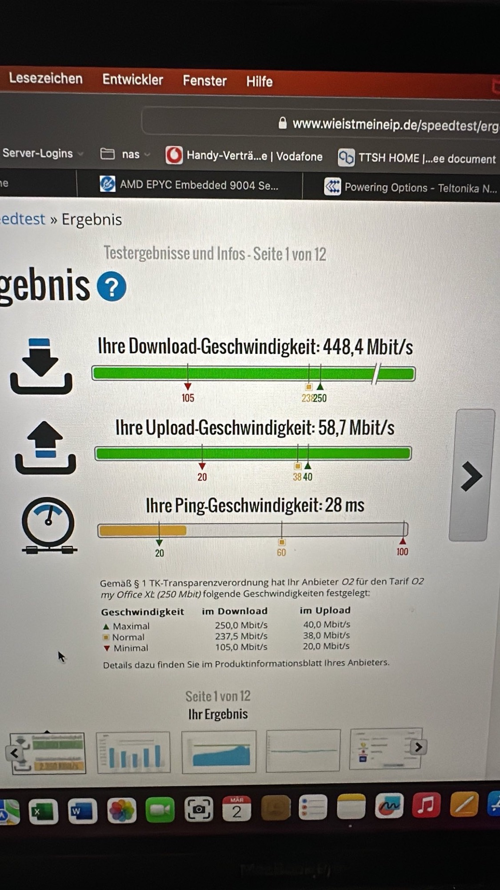
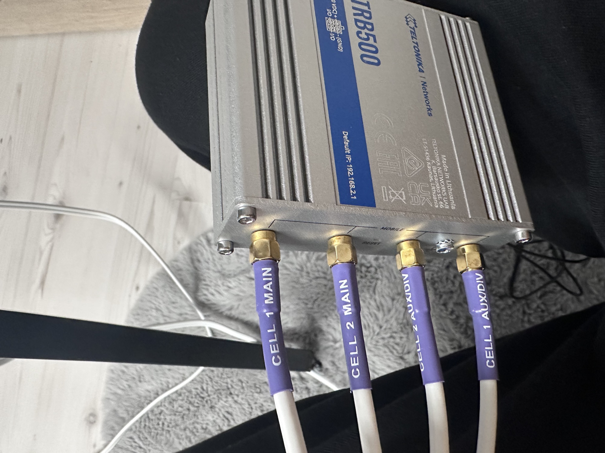
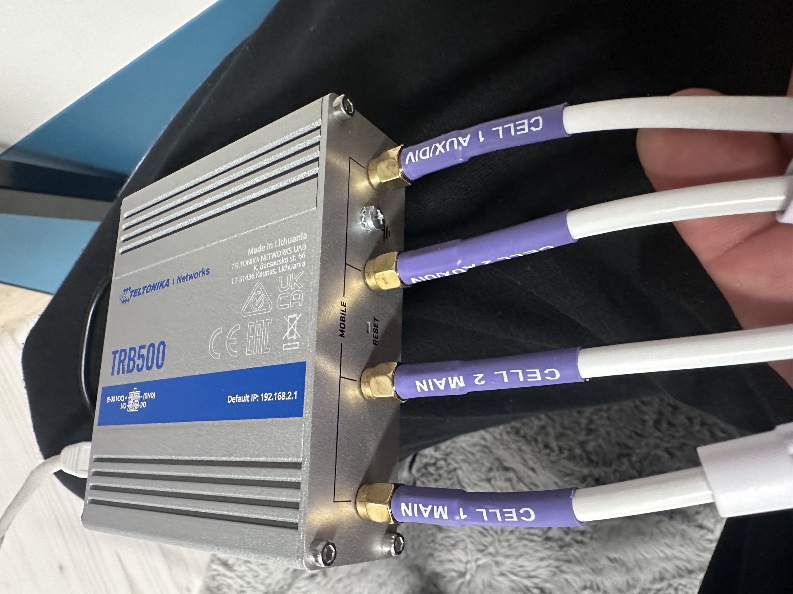

# Teltonica TRB500 notes

Requirement:  You want change the mobile mode from default "NAT mode" to bridge mode or passthrough mode

**Failure in manual:**   The manual is wrong about the Mobile Mode change to bridge or passthrough, by just warm restart, settings are wrong and the mode wasn't changed successful - some settings are still available (firewall and LAN DHCP settings)

(in my case was the passthrough on but firewall was still visible and the functionality was wrong)

**Correct steps to change the mode:**

1. there's no Fallback WAN setting, ignore the manual
2. check that a DHCP is running/configured in LAN
3. go in WAN settings and click on the mobile mode button- select the passthrough mode - do not save/apply- before you made the setting for the next step:
4. copy your routers WAN port MAC address in the WAN settings box which only is visible when you have chosen the mobile mode: passthrough.
5. save and apply, wait 1minute.
6. **turn off the device by removing power,**just a restart doesn't work !!
7. after reboot you see that some settings isn't available like firewall settings

**Antena config for a 4x4 WIMO:**

from rear view**:**(left to right)

**Cell1 Main (Antenna1)      Cell2 Main (Antenna 2)       Cell2  Aux(Antenna2 DIV)      Cell1 Aux. (Antenna1 DIV)**

**Management RMS:**

**It's**  **highly** **recommend to use the RMS - remote management system which offer great help for "Try&Error" testing and more.**

1. **download a backup from the TRB500 to your local storage on a PC/MAC.**
2. **create a account and book a one month support**
3. [**rms.teltonika-networks.com**](http://rms.teltonika-networks.com/)
4. **in case of wrong configuration its often much faster to just upload in the RMS**

**VLAN setup:**

everything was tested in "mobile  - NAT Mode"
It was not possible to create a VLAN to my router.

**Config example:**

The best way for me, turn on the passthrough mode and connect a management switch/router.

the router from Mikrotik was configured with the quick setup mode in router mode.

**German help for Mikrotik VLAN**

[https://administrator.de/tutorial/mikrotik-vlan-konfiguration-ab-routeros-version-6-41-367186.html](https://administrator.de/tutorial/mikrotik-vlan-konfiguration-ab-routeros-version-6-41-367186.html)

