# KIJIMI Documentation

if you like my work, feel free to use my paypal gift function

<form action="https://www.paypal.com/cgi-bin/webscr" method="post" target="_top">
<input type="hidden" name="cmd" value="_donations">
<input type="hidden" name="business" value="percysworld@web.de">
<input type="hidden" name="lc" value="GB">
<input type="hidden" name="item_name" value="DSL-man">
<input type="hidden" name="no_note" value="0">
<input type="hidden" name="currency_code" value="EUR">
<input type="hidden" name="bn" value="PP-DonationsBF:btn_donateCC_LG_global.gif:NonHostedGuest">
<input type="image" src="https://www.paypalobjects.com/en_US/i/btn/btn_donateCC_LG_global.gif" border="0" name="submit" alt="PayPal - The safer, easier way to pay online!">

</form>

**Subpages:**

**Page History:**

| Date | Autor |   | Change |
|---|---|---|---|
| 09.May 2018 | LED-man |   | Initital - Structure |
| Oct 2020 | LED-man |   | new structure |

### Table of Contents

[https://soundcloud.com/paul-schilling/kijimi-polykobol-127-cos](https://soundcloud.com/paul-schilling/kijimi-polykobol-127-cos)

[https://www.youtube.com/watch?v=lLEQ0fcFfpU](https://www.youtube.com/watch?v=lLEQ0fcFfpU)

> **Welcome to the KIJIMI Documentation**
>
> "As [*Synthtopia*](https://www.synthtopia.com/content/2018/04/02/new-8-voice-analog-synth-kijimi-coming-to-superbooth-2018/) reports, the Kijimi is inspired by the sound of the RSF Polykobol, a rare French polysynth from the late ’70s that was only available in very limited quantities. According to Instagram posts from Black Corporation, the synth will be available both pre-built and as a DIY kit."
>
> source: [http://www.factmag.com/2018/04/03/black-corporation-kijimi-synth/](http://www.factmag.com/2018/04/03/black-corporation-kijimi-synth/)

> **Product Info:**
>
> the KIJIMI Synthesizer is a product of the Black Corparation located in Tokio.
>
> It´s available in 2 different Version:
>
> - DIY Kit contains 12 PCBs (mostly THT)     [https://www.deckardsdream.com/product/kijimi-kit-preorder-run1](https://www.deckardsdream.com/product/kijimi-kit-preorder-run1)   (total costs for the pcbs are: $999)
> - Preassambled with Case ready to use    [https://www.deckardsdream.com/product/kijimi-built-preorder-run1](https://www.deckardsdream.com/product/kijimi-built-preorder-run1)    (total costs: **$3749**)
>
> 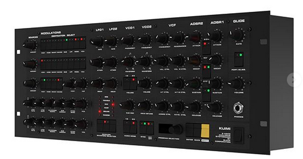
>
> The DIY kit consists of 12 PCBs:
>
> - frontpanel board
> - motherboard
> - 8x voice cards
> - power supply board
> - connectors board
>
> The motherboard has the MCU and DACs (digital to analogue converters used to control the analogue circuitry) preinstalled, the remaining parts you have to buy yourself from a local supplier. Some DIY shops will provide full parts kits.
>
> Most of the remaining parts are thruhole, except for power filtering ceramic capacitors, which are large (0805 size), all same value (0.1uF) and located on the opposite side of the thruhole parts on the PCB.
>
> The frontpanel and rack case will be supplied by [DIY HUB](http://siddarthianinnovations.bigcartel.com).

## **Kijimi Article on Amazona.de - written by me:**

[https://www.amazona.de/test-black-corporation-kijimi-synthesizer-diy-report/](https://www.amazona.de/test-black-corporation-kijimi-synthesizer-diy-report/)

## **Buildguide**

[Build guide](build-guide/index.md)

## **User Manual**

moved to page: [Manuals and Firmware](manuals-and-firmware/index.md)

**Powersuply Warning**

don't mix the external PSU bricks or you destroy your Device.

The Kijimi use a 24V DC PSU

DDRM v1 DIY use a 12 DC PSU 

DDRM v2 DIY use a 12V DC PSU

## **Wooden Case (same as in DDRM project)**

ask me if you want a wooden case  -walnut, oak .. whatever you want

please note, the case can ordered in different HE, order 5HE to include a effect device or expander (an expander isn´t confirmed yet)

   

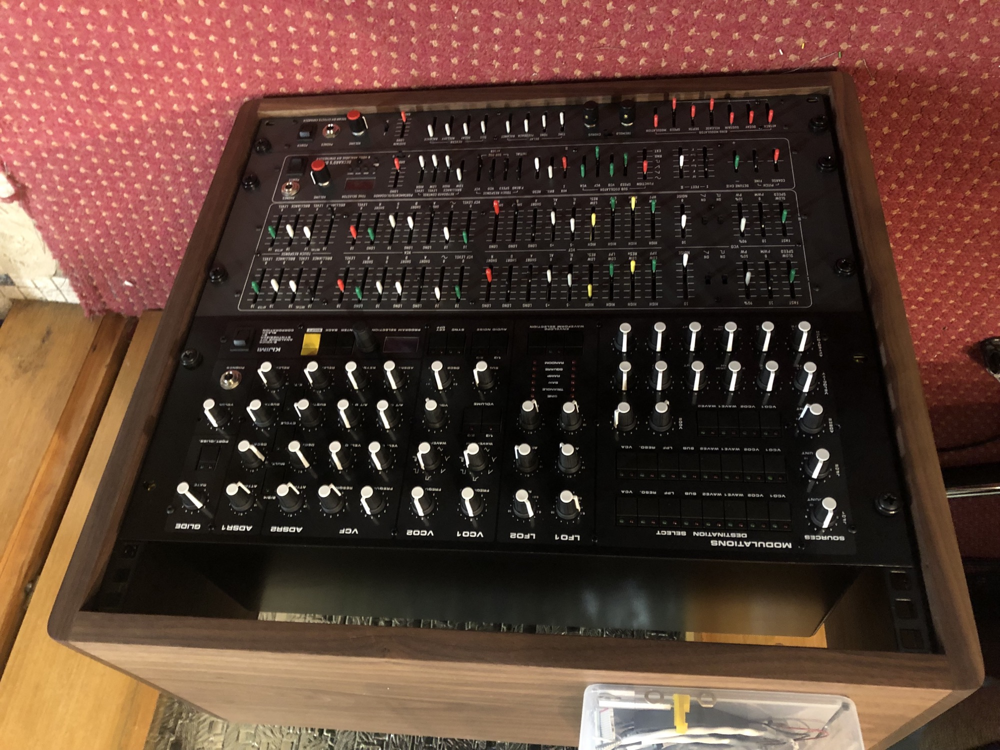

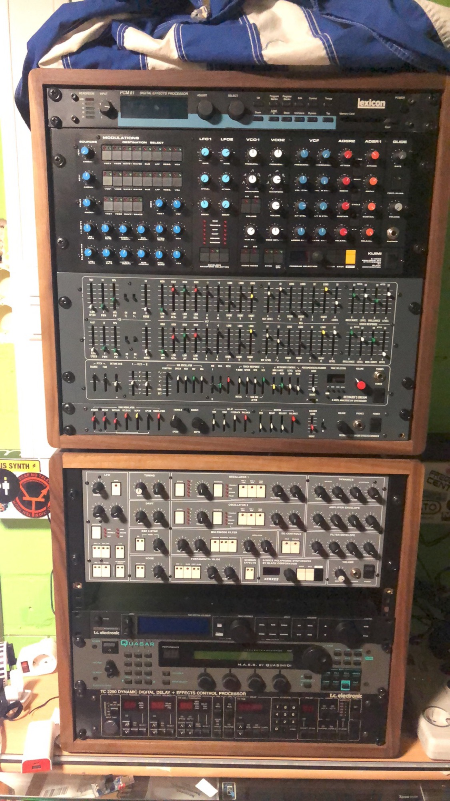

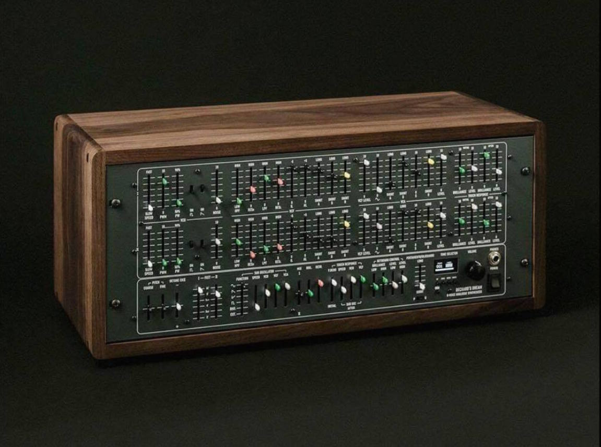

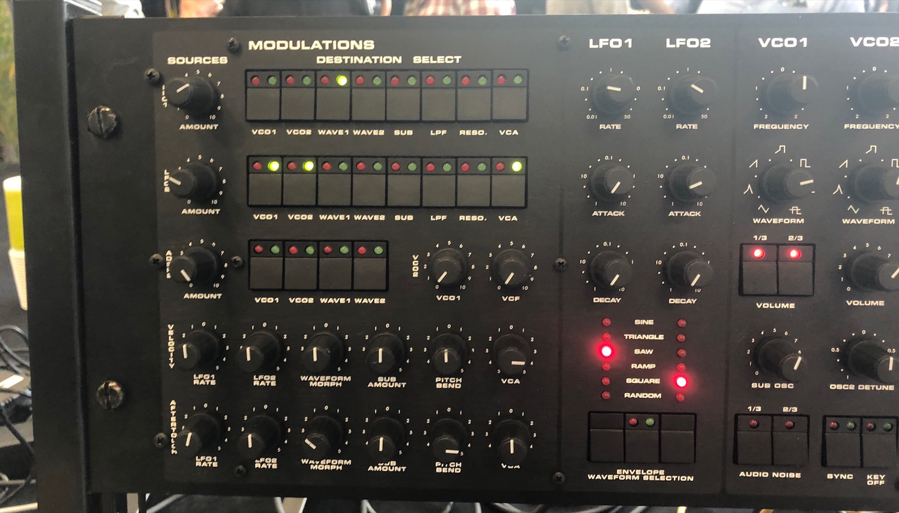

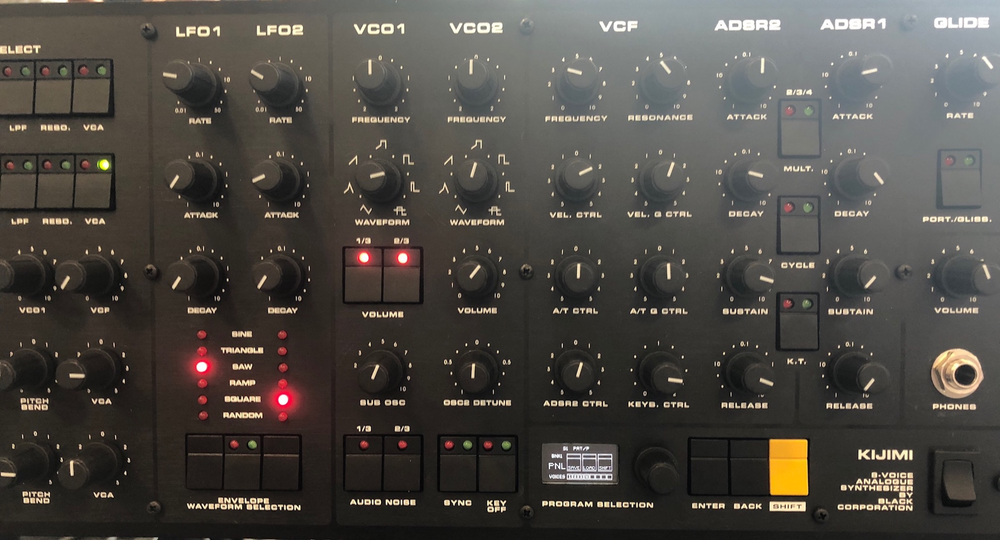

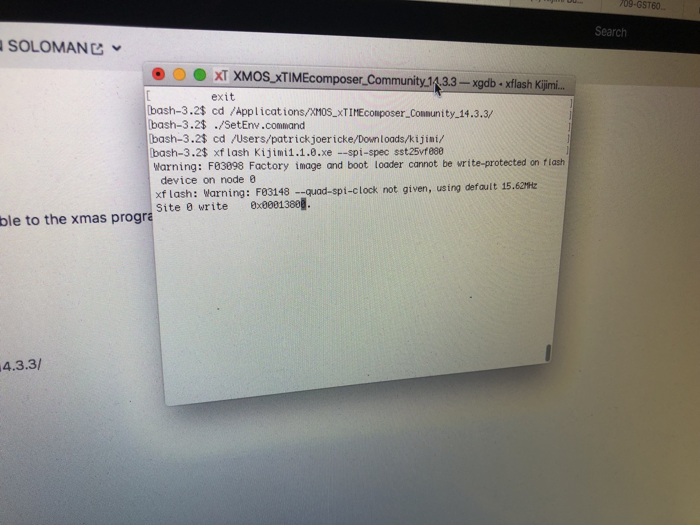

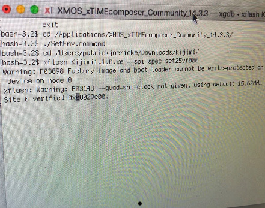

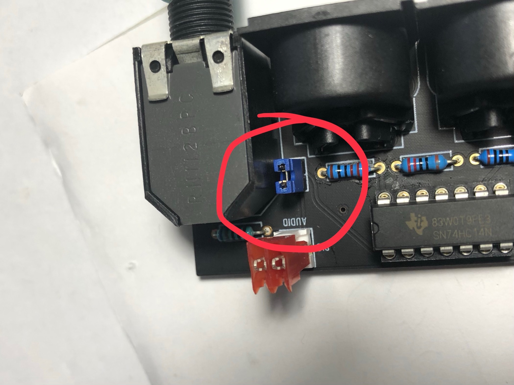

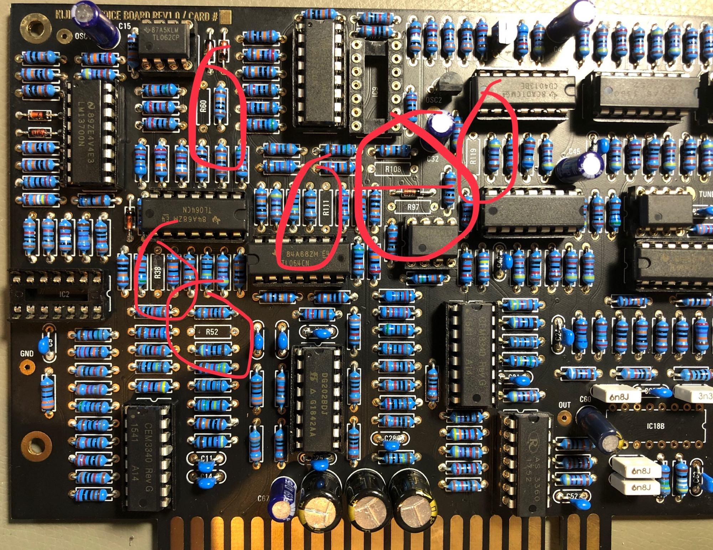

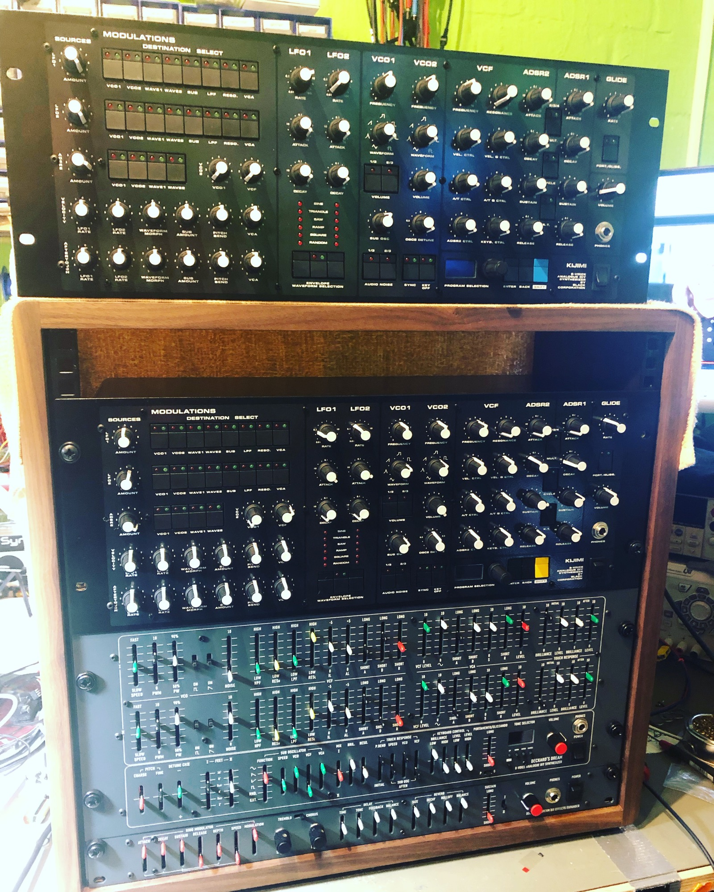

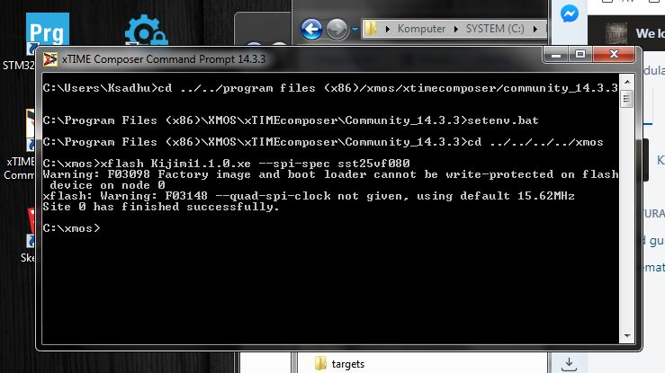

## Search this documentation

## Popular Topics

## Featured Pages

## Recently Updated Pages
