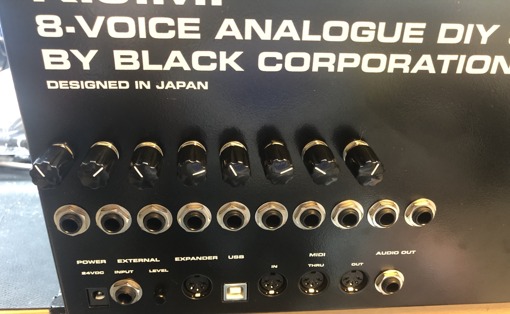
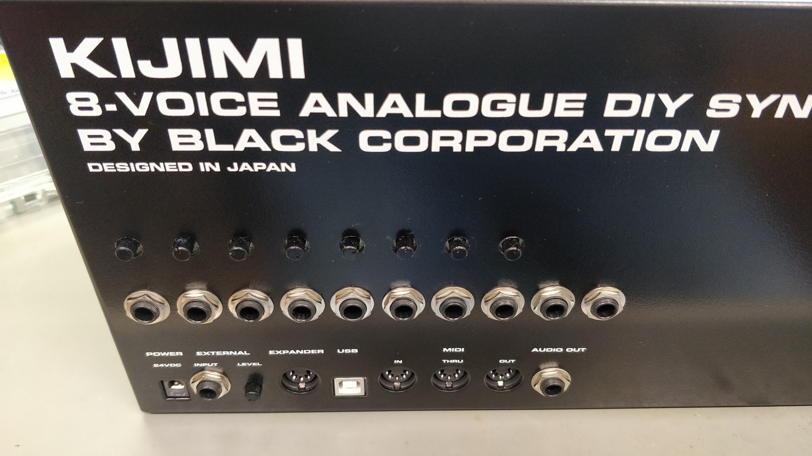
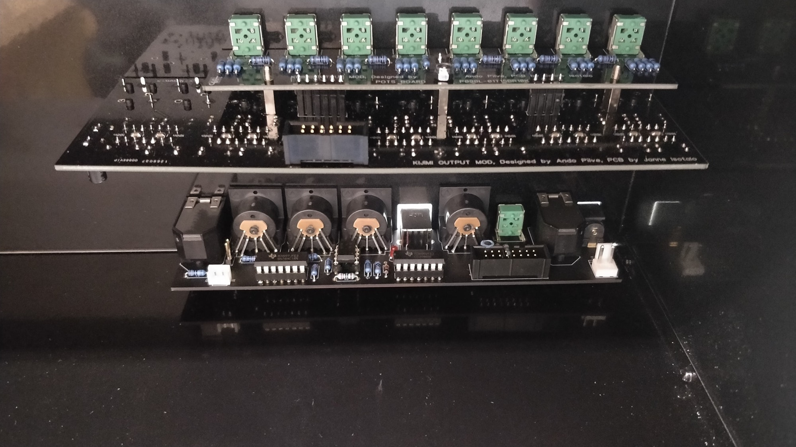
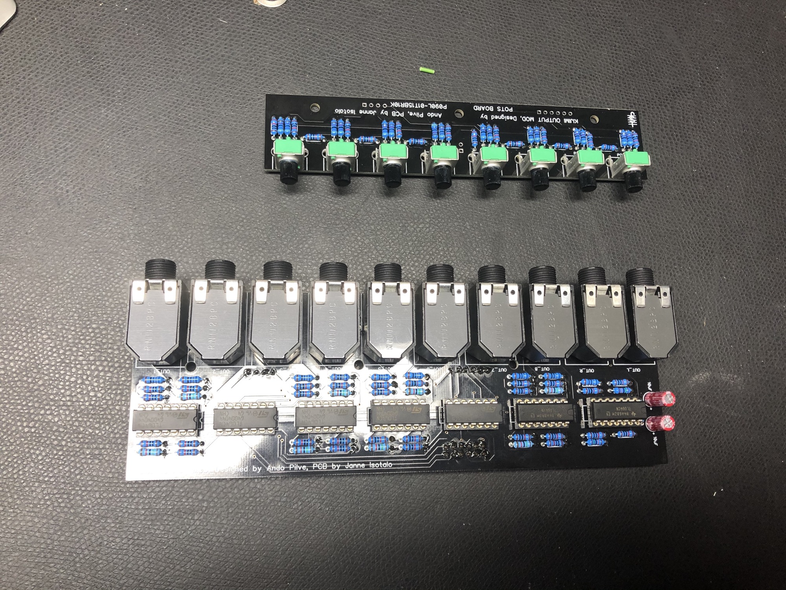
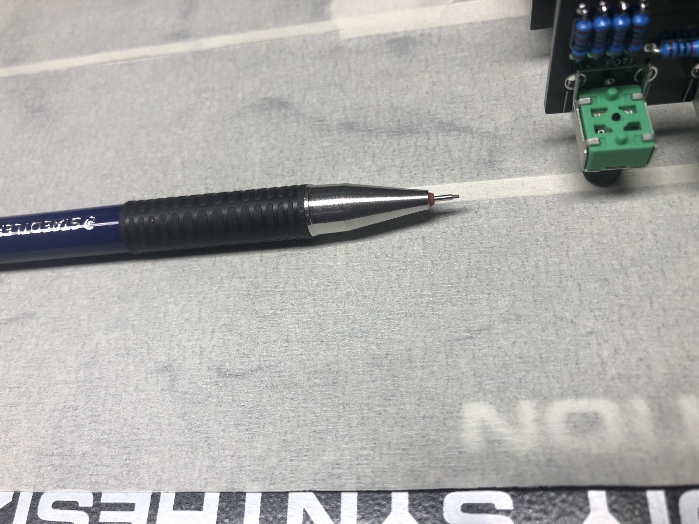
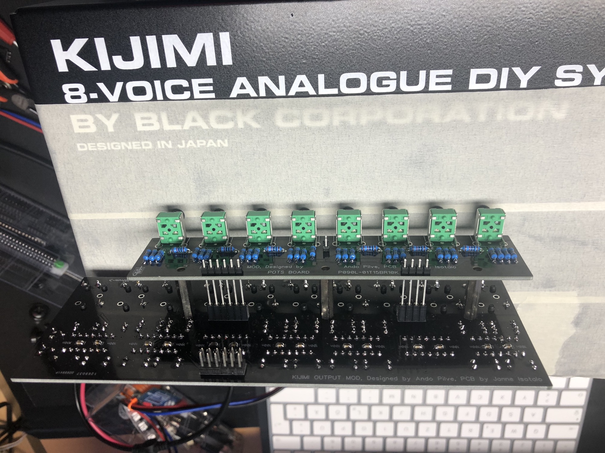

# Kijimi Modifications

this page contains only Modifications (addons) not bugfix changes !!

**Individual Voice Out (8x Version)**

**KIJIMI MOD (#1**) **by [Ando](https://www.facebook.com/ando.pilve?fref=gs&__tn__=%2CdK-R-R&eid=ARB3D2OtDv9XHWYkY_vYtgnUyc0-lZWXM7QAN5zvV12UItZpWck-cqgEg4oBf9UP5b8A1J1FShoYsrWe&dti=369660250197513&hc_location=group) (design) and Janne (PCB**). There is an extra 12-pin header on the motherboard, and these add-on boards will take full advantage of that:

-Individual voice card outputs

-Stereo output bus with manual pan control for all the voice cards.

from Steve aka sduck

[https://www.youtube.com/watch?v=AsKIGTtLK2c](https://www.youtube.com/watch?v=AsKIGTtLK2c)

**BOM and Guide:**

[KIJIMI-OUT-MOD-BUILD.pdf](assets/KIJIMI-OUT-MOD-BUILD.pdf)

you also can use alpha potis which looks better - no visible holes.

[https://www.musikding.de/Potentiometer-9mm-10k-lin](https://www.musikding.de/Potentiometer-9mm-10k-lin)

this looks better:

**Mouser Project: (from me)**

(in the mouser BOM is the last part a Molex housing - which also Need crimping terminals - which are not of the housing) - this is optional.

 [https://www.mouser.com/ProjectManager/ProjectDetail.aspx?AccessID=f7ed22bc40](https://www.mouser.com/ProjectManager/ProjectDetail.aspx?AccessID=f7ed22bc40)

  

