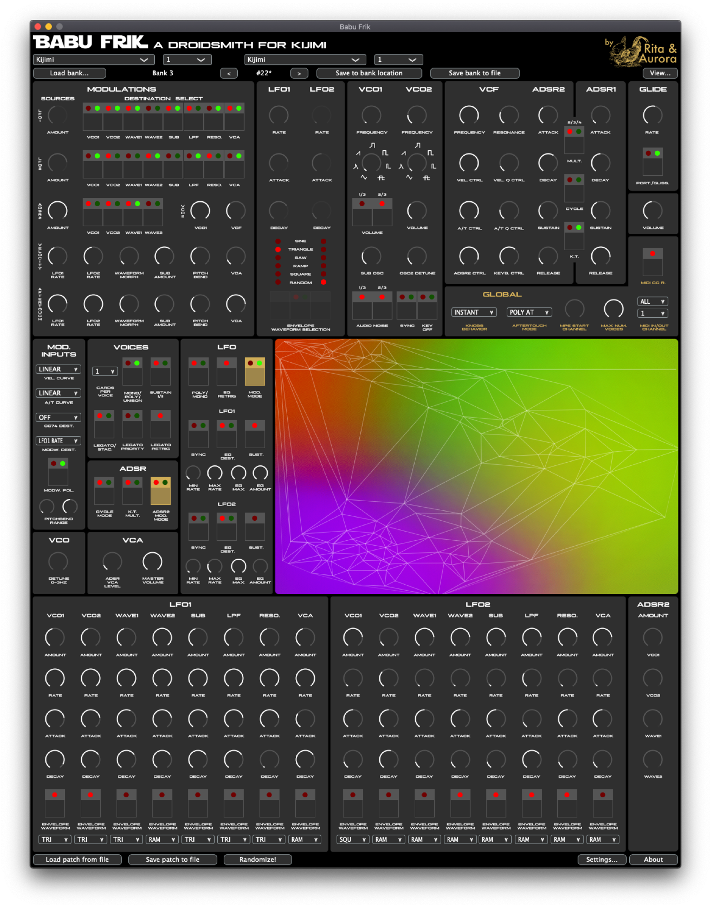

# Manuals and Firmware

visit: [https://black-corporation.com/shop/product/kijimi-mk2/#support](https://black-corporation.com/shop/product/kijimi-mk2/#support)

## **User Manual**

[Kijimi-manual-Draft-Version.pdf](../assets/Kijimi-manual-Draft-Version.pdf)  (early draft)

## **Firmware**

Latest Firmware (March 2022) adds oddsound support

[https://github.com/RitaAndAurora/kijimi-babu-frik/releases/tag/1.0.1](https://github.com/RitaAndAurora/kijimi-babu-frik/releases/tag/1.0.1)

[Kijimi.Update.Pack.1.3.6.zip](assets/Kijimi.Update.Pack.1.3.6.zip).   (firmware 1.3.6)

Release Notes (1.30 - 1.3.6)

Mehr anzeigen

Kijimi 1.3.6:
Separation of modes (PICKUP, MERGE, INSTANT) for CC and knobs.

Fixed a bug in which SYSEX messages were not transmitted or received over DIN5 connections.

Kijimi 1.3.5(If you are updating from 1.1.0 or earlier, also read
the Release Notes for 1.3.0):

Connectivity with Babu Frik, Droidsmith (Editor) for Kijimi (hey hey!). Babu Frik may be downloaded here: https:// [ritaandaurora.github.io/kijimi-babu-frik/](http://ritaandaurora.github.io/kijimi-babu-frik/)

Improved Preset Selection: Turn encoder to choose PRESET (same as
before) to switch BANK, hold shift while turning the encoder.

Improvements in Microtuning functionality.

Tuning programs are automatically saved to the first empty slot with names. Use a Sysex librarian to upload a Scala program (.scl) after converting it to MIDI Tuning Standard (.syx) here:[http://www.microtonalsoftware.com/scl-scala-to-mts-converter.html](http://www.microtonalsoftware.com/scl-scala-to-mts-converter.html)

Kijimi has 128 slots for Microtuning program presets.

More information about scala and Microtuning and a plethora of tunings programs can be found here:[http://www.huygens-fokker.org/scala/downloads.htmlGeneral](http://www.huygens-fokker.org/scala/downloads.htmlGeneral) bug fixes and workflow improvements.

Kijimi 1.3.0 Release Notes 

(If you are updating from 1.1.0 or
earlier, also read the Release Notes for 1.2.0)

Randomize all Parameters = SHIFT + SYNC or send ON message to CC31
Improved Arpeggiator Functionality. Hot Keys to activate Arp =
SHIFT + K.T.

Hold - Works as a LATCH when Arpeggiator is on, works as a HOLD/
DRONE when arpeggiator is off. LATCH/HOLD = SHIFT + KEY OFF

Separate settings for COMMON/INDIVIDUAL ADSR2 and LFOs LFO Poly re-trigger.

Added TIME settings for ADSR1 and ADSR 2 (confirm) Added Pitch- bend Range Setting for MPE mode.

Saving function reworked to allow for intuitive saving and
allowing for editing of Factory Presets.

In SAVE and LOAD modes, BANK is selected by holding SHIFT and
turning the encoder or pressing UP/DOWN.

Separate Reset Factory Settings and Reset Factory Presets.
Increased Dead Zone for Center Detent positions on the knobs.

**Bugfixes**

Fixed bugs in which Presets sounded different when restarting the
unit.

Fixed 2/4 cards per voice freezing in MPE mode.
Other minor bugs and fixes under the hood.

[Kijimi Factory Presets MJ (1.2).syx](../assets/Kijimi-Factory-Presets-MJ-1.2.syx) (presets - transfer it with sysexlib. per KIjimis USB-Midi-interface)

[~~Black Corporation Firmware Updater.app.zip~~](../assets/Black-Corporation-Firmware-Updater.app.zip)~~(only for updater not for first install) - do not work on Catalina~~

[~~Kijimi1.1.0.bin(only for updater not for first install)~~](../assets/Kijimi1.1.0.bin)

[~~Kijimi1.2.0.bin~~](../assets/kijimi1.2.0.bin)

[~~kijimi\_1.2\_package\_build\_by\_DSL-man.zip~~](../assets/kijimi_1.2_package_build_by_DSL-man.zip)~~(includes latest Firmware and presets, Updatetool) NEW~~

make sure you perform the calibration of the knobs again as described (Potentiometer Calibration :  **Important**: turn all pots to the right side (max) then only turn the center detent knobs to middle position for the center detent calibration. for the second step turn all knobs to right (max) position

**Firmware 1.2: release Notes**

click to expand:

Mehr anzeigen

Change log: 1.2

1. 16+ LFOs!
In the previous update, the ability to adjust individual amounts for each destination was added. This was not enough for some of the researchers on our team. As a result, all destinations now have their own LFO with individual control over all LFO parameters (AMOUNT, RATE, ATTACK, DECAY, SHAPE, etc) / In the previous update, the ability to adjust individual amounts for each destination was added. To provide even further control over sound design, all destinations now have their own LFO with individual control over all LFO parameters (AMOUNT, RATE, ATTACK, DECAY, SHAPE, etc)

To activate, (SETTINGS-&gt;LFO-&gt;MOD MODE-&gt;INDIVIDUAL)

To operate, select destination mode (Positive, Negative, Bipolar). Long press (Press and hold for approximately 1.5 seconds) the destination selector until flashing. The LFO parameters to the flashing destination may be adjusted with information presented in the display.

Multiple destinations in one row may be selected in order to affect all of those destinations with shared values.

If multiple destinations in different rows are selected, parameters for destinations in the first row may be adjusted with the LFO1 controls and parameters for destinations in the second row may be adjusted with the LFO2 controls. In this case, both LFO1 and LFO2 settings will appear on the display.

Once LFO adjust mode is activated (flashing), other LFOs may be selected by selecting them with a regular non-long press. Additional LFOs may be grouped with an existing group by long pressing the new destination while the first group is flashing.

A quick press of a flashing destination will deactivate LFO adjust mode and return to destination toggle mode.

2. Arpeggiator
Toggle on/off by pressing SHIFT+K.T.
Initiate Hold (Latch) by pressing SHIFT+Key OFF
Toggle and Hold may also be selected in SETTINGS

2.1 Styles:
-UP - lowest to highest
-DOWN - highest to lowest
-UP DOWN - lowest to highest (played once) and back
-UP AND DOWN - lowest to highest, then highest to lowest
-PINKY UP - similar to UP with highest note played between other notes
-PINKY UP DOWN - similar to UP DOWN with highest note played between other notes
-THUMB UP - similar to UP with lowest note played between other notes
-THUMB UP DOWN - similar to UP DOWN with lowest note played between other notes
-PLAY ORDER - notes play in the order they are engaged
-CHORD - repeats chords
-RANDOM - Notes play randomly
-RANDOM ONCE - Notes play randomly without repeating until all notes have been played.

2.2 Rate
If the arpeggiator is not synced to MIDI or an LFO, speed may be selected in the menu.
Divisions range from 32/1 to 1/1.5
Sync to MIDI or LFO (sync with LFO works only if the LFO is in MONO mode)

2.3 Randomizer
Scale 1-24 transposes the note based on the sign setting.
Chance 0-100% determines the possibility of a random note being played.
Sign bi (bipolar), add (adds notes above), sub (adds notes below)
Scale determines the range of random semitones 1-12

2.4 Velocity
-ON/OFF (if velocity is off, it defaults to a value of 64, if on it can range from 1-128 determined by Target.
-Target 1-64 selects the range of values the velocity will randomly play.

+ a new bank by Richard Devine!

**The Bootloader is in the DIY Build Guide Page:**

[Build guide](../build-guide/index.md)

## Kijimi Editor:

[https://github.com/RitaAndAurora/kijimi-babu-frik/releases/tag/1.0.1?fbclid=IwAR3h2K8Iy2dawI4RX0YectEjdyttprMnTat69EmYu07sgpmu6MKN3YkHiTQ](https://github.com/RitaAndAurora/kijimi-babu-frik/releases/tag/1.0.1?fbclid=IwAR3h2K8Iy2dawI4RX0YectEjdyttprMnTat69EmYu07sgpmu6MKN3YkHiTQ)

Thanks to all Kickstarter backers

